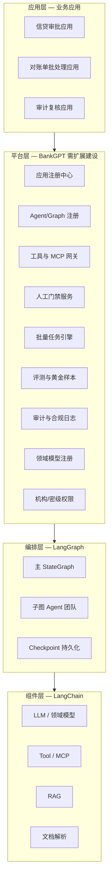
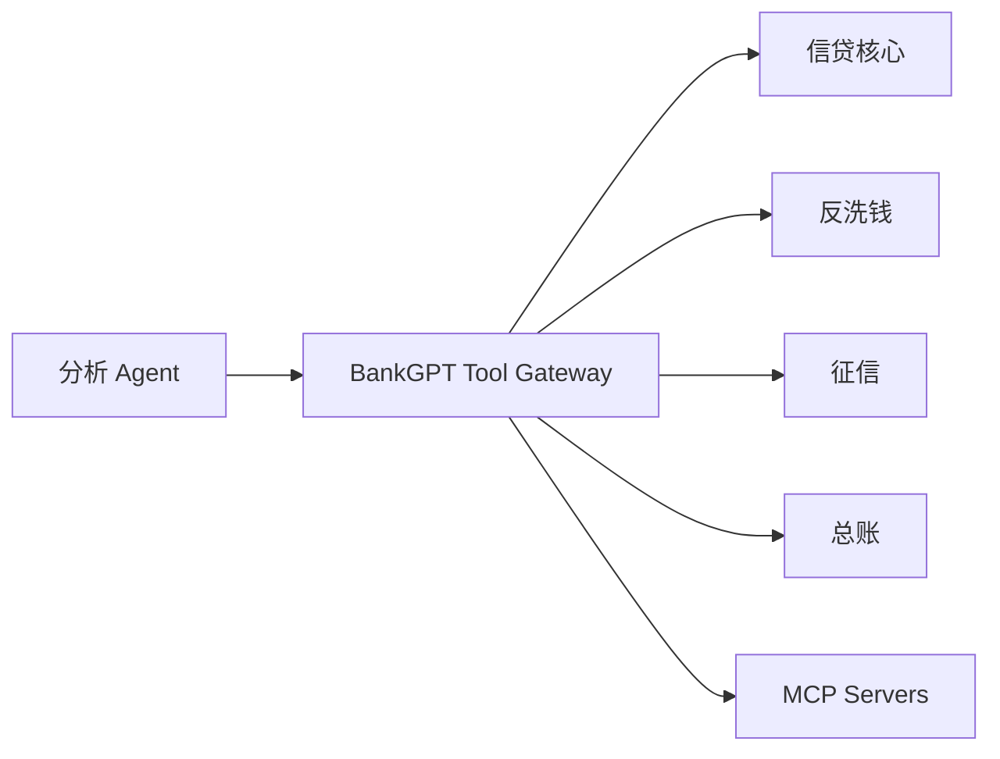
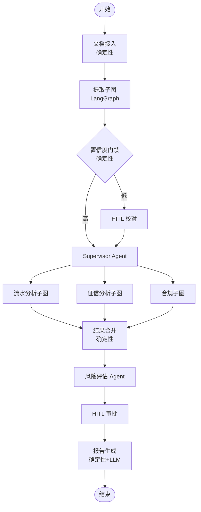
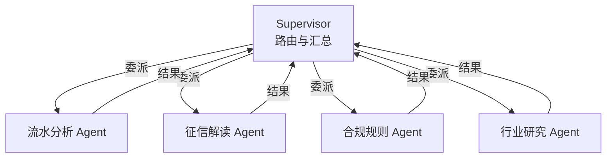

# BankGPT 功能扩展与多 Agent 应用开发指南

> 本文档承接 [从 Dify 到 BankGPT 的迁移 rationale](./dify-vs-bankgpt-migration.md)，说明 **BankGPT 平台需要建设哪些扩展能力**、**大型复杂 Agent 如何集成开发**，以及 **如何依托 BankGPT 创建多 Agent 协作应用**。  
> BankGPT 技术底座：**LangChain（组件/Tool/Retriever）+ LangGraph（StateGraph 编排）**，上层叠加金融垂直平台能力。

---

## 1. BankGPT 平台分层

BankGPT 不是「裸 LangGraph 项目」，而是 **垂直平台 + 编排框架** 的组合：



**关键区分**：

| 层级 | 谁开发 | 内容 |
|------|--------|------|
| **组件层** | AI 工程师 | LangChain Tool、Retriever、Parser |
| **编排层** | AI 工程师 | LangGraph 节点、边、State、子图 |
| **平台层** | 平台团队 | 应用生命周期、权限、审计、批量、评测 |
| **应用层** | 业务团队 | 具体信贷/对账/审计场景配置与上线 |

下文 **第 2 节** 讲平台层扩展，**第 3–4 节** 讲编排与应用开发。

---

## 2. BankGPT 需建设的功能扩展

相对「直接用 LangChain 写脚本」，BankGPT 作为 **金融 AI 平台** 建议补齐以下扩展模块。

### 2.1 扩展能力总览

| 模块 | 优先级 | 说明 | 典型消费者 |
|------|--------|------|------------|
| **文档解析管线** | P0 | OCR、版面分析、表格还原、字段级置信度 | 对账单/发票/收据提取 |
| **结构化输出契约** | P0 | 统一 JSON Schema、字段校验、版本演进 | 所有提取与分析 Agent |
| **工具 / MCP 网关** | P0 | 核心系统、反洗钱、征信、总账等适配 | 分析类 Agent |
| **Graph / Agent 注册中心** | P0 | 注册、版本、灰度、依赖声明 | 应用装配 |
| **Checkpoint + 审计** | P0 | 状态持久化、节点级审计、可回放 | 合规、信贷审批 |
| **HITL 人工门禁** | P0 | 暂停/恢复、审批表单、超时策略 | 风控、人工复核 |
| **批量任务引擎** | P1 | 分片、重试、进度、失败隔离 | 月末批处理、贷后批量 |
| **评测与黄金样本** | P1 | 字段准确率、回归测试、A/B | 模型迭代 |
| **领域模型注册** | P1 | 自训练 OCR/分类模型版本管理 | 提取子图 |
| **RAG 知识服务** | P1 | 制度库、产品手册、判例库 | 合规问答 Agent |
| **多租户 RBAC** | P1 | 机构、条线、文档密级 | 全平台 |
| **应用市场 / 模板** | P2 | 预置信贷、对账、审计应用模板 | 快速开应用 |
| **可观测性** | P2 | Trace、成本、Token、延迟 | 运维 |
| **外部系统连接器** | P2 | SAP、用友、影像平台、信贷核心 | 工具层 |

### 2.2 文档解析管线（金融垂直核心）

BankGPT 相对通用 LLM 平台的 **第一扩展**，需独立于 Agent 编排：

```
原始文件 → 格式探测 → OCR/文本层 → 版面分析 → 表格/字段定位 → 结构化 JSON + 置信度
```

**需扩展的子能力**：

| 子能力 | 说明 |
|--------|------|
| 多格式适配 | PDF、扫描图、Excel、银行专有版式 |
| 模板库 | 按银行/地区维护对账单模板 |
| 人工纠正闭环 | 用户改字段 → 反馈训练 / 规则更新 |
| 质量门禁 | 置信度低于阈值自动走 HITL |
| 批量分片 | 单任务万级文档，失败文档隔离 |

**集成方式**：封装为 LangGraph **确定性节点**（非 LLM 节点），Agent 只消费结构化输出。

### 2.3 工具与 MCP 网关

金融 Agent 需调用大量 **确定性系统**，不宜让每个 Agent 直连：



**网关职责**：

- 统一鉴权、审计、限流、脱敏
- Tool Schema 注册与版本管理
- 同步/异步调用（长查询走任务 ID）
- 与 LangChain `@tool` / MCP 协议双向适配

### 2.4 Graph / Agent 注册中心

大型 BankGPT 会有 **数十个子图、上百个 Tool**，需平台级注册：

```yaml
# 示例：app_manifest.yaml
app_id: credit-underwriting-v2
name: 小微贷信贷审批
version: 2.3.0
graphs:
  main: graphs.credit.main:build_credit_graph
  extract: graphs.credit.extract:build_extract_subgraph
agents:
  - id: supervisor
    graph: main
    role: router
  - id: cashflow_analyst
    graph: graphs.credit.analyst:cashflow_graph
    tools: [query_core_banking, calc_dscr]
policies:
  hitl: policies.credit:require_manager_approval
  rbac: roles.credit_officer
```

**注册中心能力**：版本对比、依赖检查、灰度发布、回滚。

### 2.5 HITL 与 Checkpoint 服务

| 能力 | LangGraph 侧 | BankGPT 平台侧 |
|------|-------------|----------------|
| 暂停执行 | `interrupt()` | 推送待办到审批工作台 |
| 恢复执行 | `Command(resume=...)` | 审批人提交表单后回调 |
| 状态存储 | Postgres Checkpointer | 加密、留存策略、审计索引 |
| 超时 | 图内 timer 边 | 平台级 SLA 与升级通知 |

### 2.6 批量任务引擎

| 能力 | 说明 |
|------|------|
| 任务分片 | 按文档/客户/机构分片 |
| 并发控制 | 按 GPU/LLM QPS 限流 |
| 失败重试 | 单文档失败不阻塞整批 |
| 进度查询 | `batch_id` + 完成率 |
| 结果汇总 | 批处理报告 Agent 汇总异常清单 |

### 2.7 评测与黄金样本

金融场景 **不能接受「感觉变好了」**，需字段级指标：

- 黄金样本集（文档 + 标注 JSON）
- 提取 F1、金额误差率、日期格式准确率
- CI 回归：Graph 版本升级前自动跑评测
- 与 LangSmith / 自研评测库集成

---

## 3. 大型复杂 Agent 的开发与集成

### 3.1 何时算「大型复杂 Agent」

在 BankGPT 语境下，满足 **任一** 即可视为复杂 Agent，**不宜** 用单节点 ReAct 硬扛：

| 特征 | 示例 |
|------|------|
| 状态字段 > 15 个 | 信贷案卷含客户、担保、流水、评级、审批记录 |
| 执行步骤 > 20 步 | 多轮工具调用 + 多文档交叉验证 |
| 子任务 ≥ 3 个领域 | 流水分析 + 征信解读 + 合规规则 |
| 运行时长 > 10 分钟 | 需 Checkpoint，不能内存单次跑完 |
| 强制人工门禁 ≥ 2 处 | 初审 + 终审 |
| 外部系统 ≥ 5 个 | 核心、征信、AML、影像、OA |

### 3.2 推荐架构：主图 + 子图 + 确定性节点



**设计原则**：

1. **确定性节点做确定性事**：解析、校验、合并、报表模板 — 不用 LLM 猜
2. **LLM Agent 只做推理与工具选择**：分析、解释、建议
3. **子图独立测试**：每个子图有独立 State 与黄金样本
4. **主图管路由与合规**：Supervisor、HITL、审计在主图

### 3.3 状态设计（TypedDict / Pydantic）

```python
from typing import Annotated, TypedDict
import operator


class FieldExtraction(TypedDict):
    account_no: str
    balance: float
    confidence: float


class CreditCaseState(TypedDict):
    # 案卷标识
    case_id: str
    tenant_id: str
    thread_id: str

    # 文档与提取结果
    document_ids: list[str]
    extractions: list[FieldExtraction]

    # 各子 Agent 输出（追加式）
    agent_outputs: Annotated[list[dict], operator.add]

    # 路由与审批
    next_agent: str
    hitl_pending: bool
    approval_records: Annotated[list[dict], operator.add]

    # 最终产物
    risk_score: float | None
    report_markdown: str | None
```

**要点**：

- 用 `Annotated[list, operator.add]` 做 **追加式** 消息/结果聚合
- 敏感字段在 State 中 **分级标注**，审计服务按密级落库
- `thread_id` 与 Checkpoint 一一对应，支持数日后再恢复

### 3.4 子图封装示例

```python
from langgraph.graph import StateGraph, START, END
from langgraph.checkpoint.postgres import PostgresSaver


def build_cashflow_subgraph() -> StateGraph:
  """流水分析子图：仅负责交易模式与异常检测。"""
  graph = StateGraph(CreditCaseState)

  graph.add_node("fetch_transactions", fetch_transactions_node)   # Tool 调用
  graph.add_node("pattern_analysis", pattern_analysis_agent)      # LLM Agent
  graph.add_node("flag_anomalies", flag_anomalies_node)          # 规则+LLM

  graph.add_edge(START, "fetch_transactions")
  graph.add_edge("fetch_transactions", "pattern_analysis")
  graph.add_edge("pattern_analysis", "flag_anomalies")
  graph.add_edge("flag_anomalies", END)

  return graph.compile()


def build_main_graph(checkpointer: PostgresSaver):
  graph = StateGraph(CreditCaseState)

  cashflow_sg = build_cashflow_subgraph()

  graph.add_node("ingest", ingest_node)
  graph.add_node("extract", build_extract_subgraph())       # 另一子图
  graph.add_node("supervisor", supervisor_agent)
  graph.add_node("cashflow", cashflow_sg)                   # 子图作为节点
  graph.add_node("hitl_approval", hitl_interrupt_node)

  graph.add_edge(START, "ingest")
  graph.add_edge("ingest", "extract")
  graph.add_conditional_edges("extract", route_by_confidence)
  graph.add_conditional_edges("supervisor", route_to_workers)
  graph.add_edge("cashflow", "supervisor")                  # 工人回报 Supervisor
  graph.add_edge("hitl_approval", "supervisor")

  return graph.compile(checkpointer=checkpointer)
```

### 3.5 复杂 Agent 集成到 BankGPT 平台的步骤

| 步骤 | 动作 | 产出 |
|------|------|------|
| 1 | 定义 `AppManifest`（应用 ID、图入口、权限策略） | YAML / DB 记录 |
| 2 | 实现 State + 子图 + Tool，本地 pytest + 黄金样本 | Python 包 |
| 3 | 在 **Graph 注册中心** 注册版本 | `credit-underwriting@2.3.0` |
| 4 | 配置 Tool Gateway 凭证与 MCP 端点 | 租户级配置 |
| 5 | 配置 HITL 表单与审批角色 | 工作台模板 |
| 6 | 接入审计：每节点 before/after 写审计表 | 合规验收 |
| 7 | 灰度发布：5% 流量 → 全量 | 监控指标达标 |

### 3.6 与 Dify Agent 概念的映射（便于迁移）

| Dify 概念 | BankGPT / LangGraph 对应 |
|-----------|-------------------------|
| Agent 节点 | 子图或 `create_react_agent` 节点 |
| Agent Soul / Layer | Compositor 或 Graph 内 Prompt+Tool 配置 |
| Tool 插件 | LangChain Tool + Tool Gateway |
| Human Input 节点 | `interrupt()` + HITL 服务 |
| 工作流变量 | `State` 字段 |
| 对话日志 | Checkpoint + AuditService |
| 单次 Agent Run | 子图一次 invoke；整案为 thread |

---

## 4. 多 Agent 协作：模式与 BankGPT 应用创建

### 4.1 四种协作模式

| 模式 | 结构 | 适用场景 | LangGraph 实现 |
|------|------|----------|----------------|
| **Supervisor-Worker** | 主管路由 → 专家执行 → 回报 | 信贷案卷分派 | 条件边 + Worker 子图 |
| **流水线（Pipeline）** | A → B → C 固定顺序 | 提取 → 分析 → 报告 | 线性边 |
| **并行扇出-扇入** | 多 Agent 同时分析后合并 | 多维度风控 | `Send` API / 并行边 |
| **辩论 / 合议** | 多 Agent 多轮后裁决 | 复杂合规争议 | 循环边 + 最大轮次 |

### 4.2 Supervisor-Worker 模式（推荐默认）

信贷审批典型拓扑：



**Supervisor 实现要点**：

```python
from langchain_core.messages import SystemMessage
from pydantic import BaseModel, Field


class RouteDecision(BaseModel):
    next_workers: list[str] = Field(description="要调用的 worker: cashflow|credit|compliance")
    reasoning: str
    is_complete: bool = Field(description="是否已可输出最终结论")


def supervisor_node(state: CreditCaseState) -> dict:
    llm = get_llm().with_structured_output(RouteDecision)
    decision = llm.invoke([
        SystemMessage(content=SUPERVISOR_PROMPT),
        *state["agent_outputs"],
    ])
    if decision.is_complete:
        return {"next_agent": "finalize"}
    return {"next_agent": decision.next_workers[0]}  # 或并行 Send


def route_to_workers(state: CreditCaseState) -> str | list:
    nxt = state["next_agent"]
    if nxt == "finalize":
        return "risk_scoring"
    return nxt  # "cashflow" | "credit" | "compliance"
```

### 4.3 并行扇出-扇入

对 **同一案卷** 并行跑多维度分析，再合并：

```python
from langgraph.types import Send


def fan_out_analysts(state: CreditCaseState) -> list[Send]:
    return [
        Send("cashflow", state),
        Send("credit", state),
        Send("compliance", state),
    ]


def merge_results(state: CreditCaseState) -> dict:
    # 确定性合并：去重、冲突检测、优先级规则
    merged = merge_agent_outputs(state["agent_outputs"])
    return {"merged_analysis": merged}
```

### 4.4 HITL 嵌入多 Agent 流

```python
from langgraph.types import interrupt


def hitl_approval_node(state: CreditCaseState) -> dict:
    # 暂停图执行，等待人工
    human_decision = interrupt({
        "case_id": state["case_id"],
        "risk_score": state["risk_score"],
        "summary": state["report_markdown"],
        "form_schema": MANAGER_APPROVAL_FORM,
    })
    return {
        "approval_records": [{
            "decision": human_decision["decision"],
            "comment": human_decision.get("comment"),
            "approver": human_decision["user_id"],
        }]
    }
```

BankGPT 平台侧：HITL 服务收到 `interrupt` 事件 → 推送到审批工作台 → 用户提交后调用 `graph.invoke(Command(resume=...), config={"configurable": {"thread_id": ...}})`。

### 4.5 依托 BankGPT 创建多 Agent 应用（端到端）

#### 步骤 1：选择应用模板

| 模板 | 包含 Agent | 适用 |
|------|-----------|------|
| `credit-underwriting` | Supervisor + 流水/征信/合规 | 信贷审批 |
| `statement-batch` | 提取 + 校验 + 异常汇总 | 对账单批量 |
| `invoice-ap` | 发票提取 + 三单匹配 + HITL | 应付账款 |
| `audit-sampling` | 抽样 + 证据链 + 报告 | 审计 |

#### 步骤 2：装配 Agent 团队

在 BankGPT 控制台或 `app_manifest.yaml` 中声明：

```yaml
multi_agent:
  pattern: supervisor-worker
  supervisor:
    model: bankgpt-reasoning-v1
    max_delegations: 8
  workers:
    - id: cashflow
      graph: graphs.workers.cashflow:graph
      tools: [core_banking_txn, calc_runway]
    - id: credit
      graph: graphs.workers.credit:graph
      tools: [credit_bureau, blacklist_check]
    - id: compliance
      graph: graphs.workers.compliance:graph
      retrievers: [regulation_kb]
  merge_policy: graphs.policies:conflict_aware_merge
  hitl:
    - after: risk_scoring
      role: credit_manager
      timeout_hours: 48
```

#### 步骤 3：配置工具与知识

- 在 **Tool Gateway** 绑定租户凭证（核心系统只读账号等）
- 挂载制度库 RAG Collection（合规 Agent 用）
- 设置 MCP Server（如需行情、宏观数据）

#### 步骤 4：定义评测与上线门禁

```yaml
evaluation:
  golden_set: credit_cases_2024_q4
  gates:
    field_accuracy: 0.95
    false_positive_rate: 0.02
    hitl_rate_max: 0.15
```

未过门禁 **禁止** 晋升生产版本。

#### 步骤 5：发布与 API 暴露

```bash
# 平台 CLI 示例
bankgpt app publish credit-underwriting-v2 --gray 5
bankgpt app api enable credit-underwriting-v2 --key tenant-xxx
```

外部系统调用：

```bash
curl -X POST https://bankgpt/api/v1/apps/credit-underwriting-v2/runs \
  -H "Authorization: Bearer ..." \
  -d '{
    "inputs": {"customer_id": "C001", "document_ids": ["doc-1", "doc-2"]},
    "thread_id": "case-2024-001"
  }'
```

返回 `thread_id` 用于查询 Checkpoint 状态、HITL 待办、最终报告。

### 4.6 多 Agent 应用目录结构（单仓推荐）

```
bankgpt-apps/
├── apps/
│   └── credit_underwriting/
│       ├── manifest.yaml          # 应用声明
│       ├── state.py               # 共享 State
│       ├── graphs/
│       │   ├── main.py            # 主图
│       │   ├── extract.py         # 提取子图
│       │   └── workers/
│       │       ├── cashflow.py
│       │       ├── credit.py
│       │       └── compliance.py
│       ├── tools/                 # 领域 Tool
│       ├── prompts/
│       └── tests/
│           ├── golden/            # 黄金样本
│           └── test_graphs.py
├── platform/                      # BankGPT 平台扩展
│   ├── registry/
│   ├── hitl/
│   ├── batch/
│   └── audit/
└── pyproject.toml
```

---

## 5. 复杂度治理与反模式

### 5.1 推荐做法

| 实践 | 说明 |
|------|------|
| 子图 ≤ 200 行 / 文件 | 过大则拆 Worker |
| 单 Worker 工具 ≤ 8 个 | 减少 Tool 选择混乱 |
| Supervisor 用 structured output | 路由可解析、可审计 |
| 每节点写审计事件 | `case_id, node, input_hash, output_hash` |
| 黄金样本跟 Git 走 | 与 Graph 版本同 tag |
| 确定性逻辑不用 LLM | 金额汇总、日期比较、规则引擎 |

### 5.2 反模式（避免）

| 反模式 | 问题 | 替代 |
|--------|------|------|
| 单 Agent 扛全流程 | 上下文爆炸、不可维护 | Supervisor + 子图 |
| 全 LLM 无结构化输出 | 字段漂移、难评测 | Pydantic / JSON Schema |
| 子图间隐式共享全局变量 | 难测试、难审计 | 显式 State 字段 |
| 跳过 Checkpoint | 长跑任务中断即丢失 | Postgres Checkpointer |
| 每个 Worker 直连核心系统 | 审计分散、凭证泄露 | Tool Gateway |
| 无评测门禁上线 | 生产准确率失控 | CI 黄金样本回归 |

---

## 6. 与 Dify 的协作边界（混合部署）

| 场景 | 建议平台 |
|------|----------|
| 多 Agent 信贷审批、批量对账 | BankGPT |
| 财务制度 FAQ、轻量 Copilot | 可保留 Dify |
| BankGPT 能力暴露给 Dify | Dify Custom API Tool 调 BankGPT API |
| 运营改 Prompt 的轻量场景 | Dify；核心链路仍在 BankGPT |

---

## 7. 总结

| 问题 | 要点 |
|------|------|
| **BankGPT 要做哪些扩展？** | 文档管线、Tool 网关、Graph 注册、HITL、Checkpoint 审计、批量引擎、评测、RBAC |
| **复杂 Agent 怎么开发？** | 主图 + 子图 + 确定性节点；Typed State；子图独立测试；注册中心版本化 |
| **多 Agent 怎么协作？** | 优先 Supervisor-Worker；并行用 Send；合规用 interrupt；应用 manifest 装配 |
| **怎么创建应用？** | 选模板 → 声明 Agent 团队 → 配工具/RAG → 评测门禁 → 灰度发布 |

**一句话**：BankGPT 的价值不在「能调 LangGraph」，而在 **金融扩展模块 + 多 Agent 应用工程化**；复杂 Agent 应拆为 **可注册、可评测、可审计的子图团队**，由平台层统一管理生命周期与合规。

---

## 8. 相关文档

| 文档 | 说明 |
|------|------|
| [bankgpt-multi-app-platform.md](./bankgpt-multi-app-platform.md) | 上千应用承载、隔离、部署与限流并发 |
| [bankgpt-personas-app-onboarding.md](./bankgpt-personas-app-onboarding.md) | Personas 客户画像等多 Agent 应用入驻 |
| [dify-vs-bankgpt-migration.md](./dify-vs-bankgpt-migration.md) | 为何从 Dify 迁移到 BankGPT |
| [dify-vs-langchain-disadvantages.md](./dify-vs-langchain-disadvantages.md) | Dify 相对 LangChain 的技术劣势 |
| [dify-secondary-development.md](./dify-secondary-development.md) | Dify 侧扩展能力（混合部署参考） |
| [LangGraph Multi-Agent](https://langchain-ai.github.io/langgraph/concepts/multi_agent/) | 官方多 Agent 概念 |
| [LangGraph Human-in-the-loop](https://langchain-ai.github.io/langgraph/concepts/human_in_the_loop/) | interrupt 与 Checkpoint |
