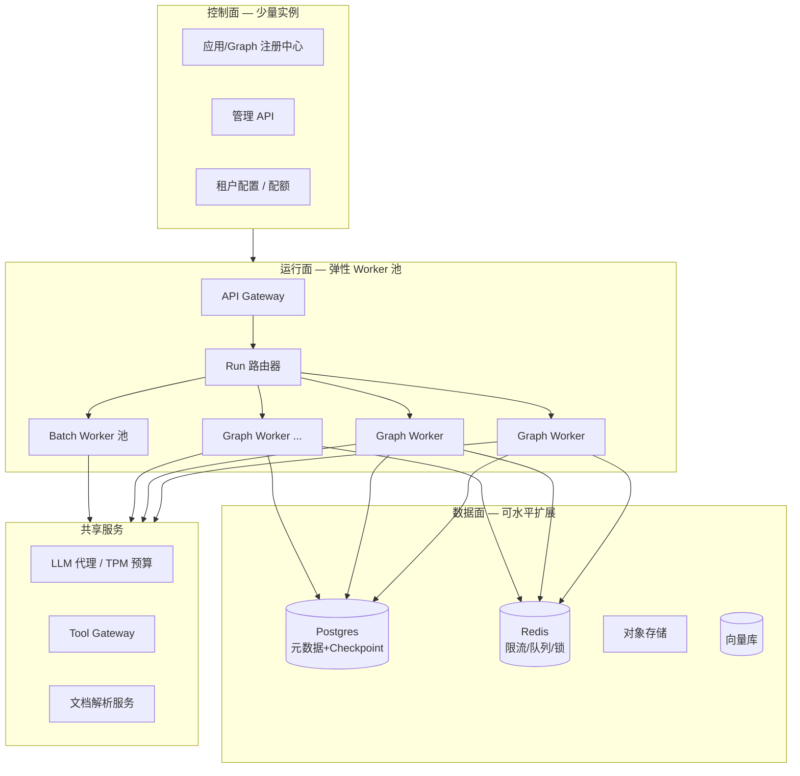
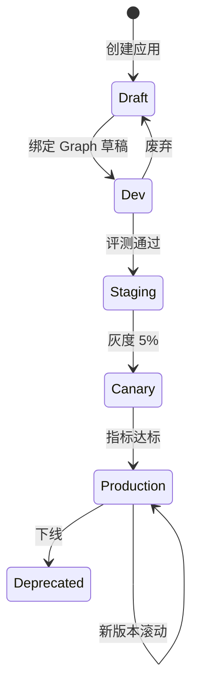
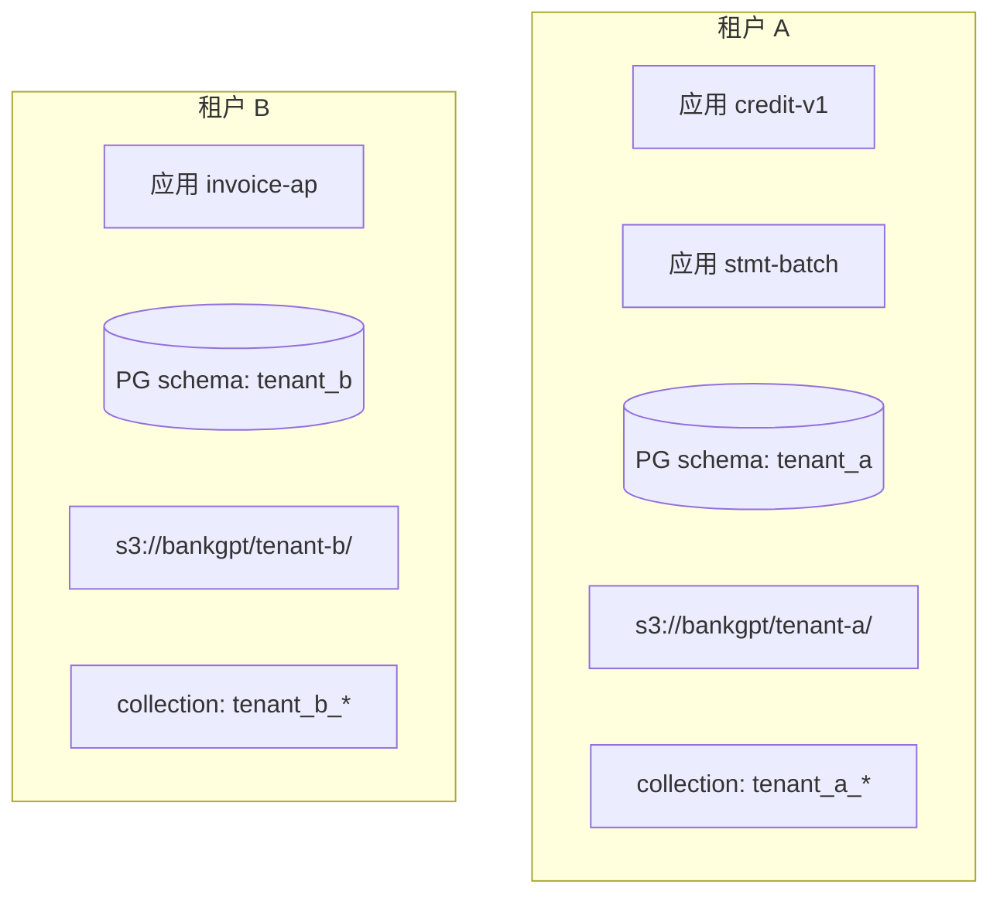
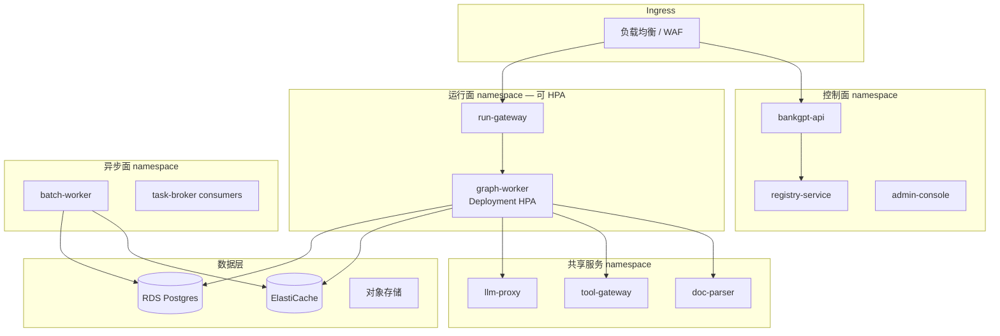
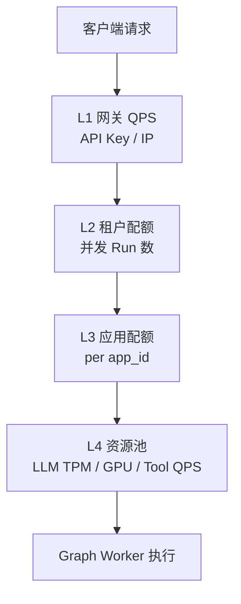

# BankGPT 大规模应用承载：隔离、部署与限流并发

> 本文档说明 BankGPT 如何 **承载上千个应用的开发与运行**，以及 **应用间隔离、部署拓扑、限流与并发** 的平台级设计。  
> 承接：[迁移 rationale](./dify-vs-bankgpt-migration.md)、[功能扩展与多 Agent](./bankgpt-extension-and-multi-agent.md)。

---

## 1. 核心设计原则

### 1.1 不是「一个应用一套部署」

上千个应用若各部署一套 LangGraph 服务，运维与资源成本不可接受。BankGPT 采用：

| 原则 | 说明 |
|------|------|
| **共享运行时，隔离元数据** | Graph Worker 进程池共享；每个 Run 携带 `tenant_id + app_id + version` |
| **应用即注册记录** | 应用在注册中心是一条 Manifest + 若干 Graph 版本，非独立微服务 |
| **无状态 Worker + 有状态存储** | 计算无状态；Checkpoint / 审计 / 文档走持久化层 |
| **分层队列** | 交互式运行与批量任务分队列，避免互相饿死 |
| **租户公平调度** | 单租户不能占满全局 Worker |



**结论**：上千应用 = **上千条注册记录 + 共享 Worker 池**，而非上千个 K8s Deployment。

---

## 2. 应用开发与运行模型

### 2.1 应用生命周期



| 阶段 | Graph 版本 | 流量 | 存储 |
|------|-----------|------|------|
| Draft | `app@dev` | 仅开发者 | 独立 schema 前缀 / 沙箱桶 |
| Staging | `app@staging` | 内测租户 | 与生产物理隔离 |
| Production | `app@1.2.3` | 全量或灰度 | 生产库 + 审计 |

### 2.2 开发与运行解耦

| 活动 | 载体 | 说明 |
|------|------|------|
| **开发** | Git 仓 `bankgpt-apps/*` | 每个应用一个目录，含 Graph、Tool、测试 |
| **构建** | CI 打包 Wheel / 镜像层 | Graph 代码打入 **共享 Runtime 镜像** 或 **动态加载包** |
| **注册** | App Registry API | 上传 Manifest、Graph 入口、依赖、配额模板 |
| **运行** | Run API | `POST /apps/{app_id}/runs`，Worker 按 Manifest 加载 Graph |

**上千应用的可行性**来自：

1. **代码复用**：共享 `platform/`、Tool Gateway、解析服务  
2. **模板化**：80% 应用由信贷/对账/审计模板派生  
3. **版本化注册**：仅变更应用注册元数据，不新建集群  
4. **懒加载 Graph**：Worker 首次执行某 `app_id@version` 时加载并缓存  

### 2.3 Graph 加载与缓存

```
Run 请求 (app_id=credit-v2, version=2.3.1)
    → Registry 查询 Manifest
    → Worker 本地 LRU 缓存 compiled graph
    → 若未缓存：import graphs.credit.main:build_graph
    → compile(checkpointer=tenant_scoped_checkpointer)
    → invoke(inputs, config={thread_id, tenant_id, app_id})
```

| 策略 | 说明 |
|------|------|
| **LRU 缓存** | 单 Worker 缓存最近 N 个 `(app_id, version)` 编译图 |
| **预热** | 发布时向 Worker 池发送 warmup 消息 |
| **淘汰** | 版本下线后广播 cache invalidate |
| **内存上限** | 超过阈值按 LRU 淘汰，防止上千 Graph 撑爆内存 |

---

## 3. 应用间隔离

隔离分 **六个维度**，金融场景需全部覆盖。

### 3.1 隔离维度总览

| 维度 | 隔离手段 | 隔离粒度 |
|------|----------|----------|
| **身份与权限** | RBAC、API Key、`tenant_id` | 租户 / 应用 / 用户 |
| **数据** | 行级租户字段、Collection 前缀、桶路径 | 租户 + 应用 |
| **运行态** | `thread_id`、Checkpoint 分区键 | 单次 Case / 会话 |
| **凭证** | 租户级 Secret Vault | 租户 + 应用 |
| **计算** | 队列、信号量、资源池 | 租户 / 应用 / 优先级 |
| **网络** | Tool Gateway 出站策略 | 租户 / 应用 |

### 3.2 逻辑隔离：租户 × 应用 × 线程

每次 Run 携带不可伪造的上下文（由 Gateway 注入，Worker 信任边界内校验）：

```python
class RunContext(TypedDict):
    tenant_id: str          # 机构 / 法人
    app_id: str             # 应用标识
    app_version: str        # Graph 版本
    thread_id: str          # Checkpoint 线程（案卷号/会话号）
    user_id: str            # 操作人
    data_classification: str  # 密级：public/internal/confidential
    trace_id: str           # 全链路追踪
```

**规则**：

- Tool Gateway 只接受带 `tenant_id` 的调用，凭证从 Vault 按租户取出  
- Checkpoint 查询必须带 `(tenant_id, thread_id)`，禁止跨租户 `thread_id` 猜测  
- 审计日志写入时冗余 `tenant_id + app_id`，便于合规检索  

### 3.3 数据隔离



| 数据类型 | 隔离方式 |
|----------|----------|
| 元数据（应用、配额、用户） | 共享库 + `tenant_id` 行级策略（RLS） |
| Checkpoint | 表分区键 `(tenant_id, thread_id)` 或 schema 隔离 |
| 文档影像 | 对象存储路径 `/{tenant_id}/{app_id}/{doc_id}` |
| 向量索引 | 每应用独立 Collection 或 `tenant_id` 过滤 |
| 审计日志 | 独立表分区 + 只追加（WORM 可选） |
| 黄金样本 / 评测集 | 租户私有桶，禁止跨租户读取 |

**大租户可选「硬隔离」**：独立 DB 实例、独立 VDB 集群、独立 Worker 池（见 4.3）。

### 3.4 凭证与密钥隔离

```
租户 A + 应用 credit-v2 → Vault path: /tenants/A/apps/credit-v2/core-banking
租户 A + 应用 stmt-batch → Vault path: /tenants/A/apps/stmt-batch/ocr-api
```

- Worker **永不**在环境变量放全局核心系统密码  
- Graph 内 Tool 只拿 **短期令牌**（STS），由 Tool Gateway 代签  
- 应用 A 无法引用应用 B 的凭证路径（RBAC 校验 Manifest 声明的 `tool_bindings`）

### 3.5 运行态隔离

| 机制 | 说明 |
|------|------|
| `thread_id` | 每个案卷/会话独立 Checkpoint 链，应用间不共享状态 |
| 子图沙箱 | 子图只能读写 State 声明字段，禁止全局单例 |
| 资源标签 | K8s Pod 可选 `tenant_tier=vip` 调度到专属节点 |
| 批量分片 | 批任务按 `tenant_id` 分队列，失败不扩散 |

### 3.6 应用间是否共享 Graph 代码？

| 类型 | 做法 |
|------|------|
| **同源模板** | 多个 `app_id` 指向同一 `graph_entry`，Manifest 参数不同 |
| **Fork 应用** | 独立 Git 目录，独立版本线，互不影响发布 |
| **共享 Tool** | Tool Gateway 统一注册，各应用 Manifest 声明可用子集 |

**隔离的是运行数据与凭证，不是强迫每个应用一套代码。**

---

## 4. 部署架构

### 4.1 推荐生产拓扑（Kubernetes）



### 4.2 组件职责

| 组件 | 副本策略 | 说明 |
|------|----------|------|
| **run-gateway** | 多副本 + HPA（CPU/QPS） | 鉴权、限流、路由、注入 RunContext |
| **graph-worker** | 多副本 + HPA（队列深度） | 执行 LangGraph，无状态 |
| **batch-worker** | 固定 + 按队列扩容 | 大批量文档，低优先级 |
| **registry-service** | 3+ 高可用 | Manifest、版本、灰度权重 |
| **llm-proxy** | 多副本 | 统一 TPM/RPM、模型路由、缓存 |
| **tool-gateway** | 多副本 | 核心系统出站、审计 |
| **doc-parser** | GPU 节点池 | OCR/版面，按 GPU 利用率扩容 |

### 4.3 部署模式

| 模式 | 适用 | 说明 |
|------|------|------|
| **共享池（默认）** | 绝大多数应用 | 所有租户共用 graph-worker Deployment |
| **租户专属池** | 监管要求硬隔离的大行 | `nodeSelector` + 独立 Deployment |
| **应用专属池** | 极高 SLA 单应用 | 仅该 `app_id` 路由到专属 Worker |
| **区域部署** | 跨境数据驻留 | 每区域一套 Runtime，Registry 全局或联邦 |

### 4.4 发布与灰度

```yaml
# Registry 中的 release 记录
app_id: credit-underwriting
version: 2.4.0
rollout:
  strategy: canary
  steps:
    - weight: 5
      bake_minutes: 60
      gates: [error_rate < 0.1%, p99 < 30s]
    - weight: 50
      bake_minutes: 120
    - weight: 100
  rollback_on: [error_rate > 1%, field_accuracy_drop > 0.5%]
```

- **上千应用**各自独立灰度，互不影响  
- Graph 代码随 **共享镜像** 或 **插件包** 发布；Registry 只切流量权重  

### 4.5 与 Dify 部署对比（参考）

| 维度 | Dify 自托管 | BankGPT |
|------|------------|---------|
| 应用单位 | App 记录 + DSL | App Manifest + Graph 代码 |
| 执行器 | API + Celery + GraphEngine | graph-worker + batch-worker |
| 扩容 | api/worker 整体扩容 | 按 Gateway / Worker / Parser 分层 HPA |
| 上千应用 | 可行，受 DB 与 Worker 队列约束 | 依赖 Registry + 懒加载 + 租户公平队列 |

---

## 5. 限流与并发

### 5.1 四层限流模型



| 层级 | 指标 | 存储 | 拒绝行为 |
|------|------|------|----------|
| **L1 网关** | QPS、突发 | Redis 令牌桶 | HTTP 429 |
| **L2 租户** | 最大并发 Run、日调用量 | Redis 计数 + PG 配额表 | 429 + 排队 |
| **L3 应用** | 每应用并发、优先级 | Redis | 排队或拒绝 |
| **L4 资源** | LLM TPM、OCR GPU、核心系统 QPS | 各代理侧限流 | 退避重试或降级 |

### 5.2 并发控制：Run 全生命周期

```
1. Gateway enter()  → 检查 L1–L3，分配 run_id，写入 active_runs ZSET
2. 入队           → 交互队列 / 批量队列（带 priority）
3. Worker 出队    → 获取 worker_slot 信号量
4. LLM 调用       → llm-proxy 扣 TPM 预算
5. Tool 调用      → tool-gateway 扣出站配额
6. 完成/失败      → exit() 释放 active_run + 信号量
7. 超时清理       → 僵尸 Run 超过 TTL 强制释放
```

**参考实现思路**（类似 Dify `RateLimit.enter/exit` + `TenantIsolatedTaskQueue`）：

- `active_runs:{tenant_id}` — Hash，记录 `run_id → start_time`  
- `active_runs:{tenant_id}:{app_id}` — 应用级并发  
- 超时扫描：超过 `RUN_MAX_ALIVE_TIME`（如 30 分钟）自动 `exit`  

### 5.3 队列与优先级

| 队列 | 消费者 | 优先级 | 典型应用 |
|------|--------|--------|----------|
| `interactive` | graph-worker | 高 | 信贷审批、单笔提取 |
| `standard` | graph-worker | 中 | 一般分析 |
| `batch` | batch-worker | 低 | 月末万级对账单 |
| `vip` | 专属 graph-worker | 最高 | 付费租户可选 |

**租户公平调度**（防止单租户占满）：

```
每个租户维护 isolated 子队列 + 全局并发上限 TENANT_MAX_CONCURRENT=3
Worker 从全局队列拉取时，按 deficit round-robin 跨租户选取
```

类似 Dify 的 `TenantIsolatedTaskQueue`：单租户同时仅 N 个重型任务在执行，其余排队。

### 5.4 LLM 与 GPU 预算

| 资源 | 控制点 | 说明 |
|------|--------|------|
| **LLM TPM/RPM** | llm-proxy | 按租户/App 分配日额度；超额排队或降级模型 |
| **OCR GPU** | doc-parser | 独立信号量；批量让路交互 |
| **Embedding** | 向量服务 | 索引与查询分开限流 |
| **核心系统 Tool** | tool-gateway | 保护银行主机，每租户 QPS 上限 |

```yaml
# 租户配额示例
tenant_id: bank-abc
quotas:
  interactive_concurrent_runs: 10
  batch_concurrent_jobs: 2
  daily_llm_tokens: 50_000_000
  llm_tpm: 500_000
  tool_qps_to_core: 50
  priority_tier: standard  # sandbox | standard | vip
```

### 5.5 LangGraph Worker 池内部并发

| 参数 | 建议默认 | 说明 |
|------|----------|------|
| `WORKER_PROCESS_COUNT` | CPU 核数 | 每 Pod 进程数 |
| `GRAPH_MAX_CONCURRENT_PER_POD` | 10–50 | 单 Pod 同时执行的 Run 数 |
| `GRAPH_INVOKE_TIMEOUT` | 1200s | 超长案卷超时 |
| `CHECKPOINT_WRITE_BATCH` | 异步批量 | 降低 PG 压力 |
| `HPA_TARGET_QUEUE_DEPTH` | 5 | 队列深度触发扩容 |

**上千应用并发**靠 **Worker 池水平扩展**，不靠单应用独占进程。

### 5.6 批量场景的并发

```
batch_job (10000 docs)
  → 切分为 shards (100 docs/shard)
  → 每 shard 独立 run_id，进入 batch 队列
  → TENANT_BATCH_MAX_PARALLEL=2 控制同时 shard 数
  → 单 shard 失败不影响其他 shard
  → 汇总 Agent 生成批处理报告
```

### 5.7 限流响应与用户体验

| HTTP 状态 | 含义 | 客户端建议 |
|-----------|------|------------|
| `429 Too Many Requests` | 硬限流 | 指数退避重试 |
| `202 Accepted` + `run_id` | 已排队 | 轮询 `/runs/{id}/status` |
| `503` + `Retry-After` | Worker 池饱和 | 按头重试 |

交互式 Run 尽量 **同步流式**；批量 Run 一律 **异步 + 状态查询**。

---

## 6. 上千应用场景下的容量规划（示例）

假设：**1000 个注册应用**，其中 **200 个活跃**，日 **50 万 Run**，峰值 **500 并发 Run**。

| 组件 | 粗算 | 配置示例 |
|------|------|----------|
| graph-worker | 500 并发 / 20 per Pod | 25 Pod（HPA max 40） |
| run-gateway | 峰值 2k QPS | 8 Pod |
| Postgres | Checkpoint 写入 + 读 | 16 vCPU，读写分离 |
| Redis | 限流 + 队列 | 集群 3 节点 |
| llm-proxy | 500k TPM 峰值 | 按模型拆实例 |
| doc-parser GPU | 批量高峰 | 4–8 GPU |

**注册中心**本身轻量：1000 条 Manifest 元数据，瓶颈在 **Run 执行与 LLM**，不在应用数量。

---

## 7. 可观测与 SLO

| 指标 | 维度 | 用途 |
|------|------|------|
| `run_duration_p99` | app_id, tenant_id | 灰度门禁 |
| `active_runs` | tenant_id | 公平调度 |
| `queue_depth` | queue_name | HPA |
| `llm_tokens` | tenant_id, app_id | 计费 |
| `tool_errors` | tool_name | 核心系统保护 |
| `checkpoint_latency` | — | PG 扩容依据 |

按 **app_id** 拆 Dashboard，上千应用可告警「Top N 异常应用」而非逐个配置。

---

## 8. 安全与合规要点

| 要求 | 实现 |
|------|------|
| 跨应用数据不可见 | RLS + 路径隔离 + Vault 路径隔离 |
| 跨租户不可见 | `tenant_id` 全链路校验 |
| 审计可追溯 | 每条 Run 绑定 `trace_id`，节点级审计 |
| 资源耗尽防护 | 四层限流 + 租户公平队列 |
| 下线应用不可调用 | Registry 标记 Deprecated + Gateway 拒绝 |

---

## 9. 总结

| 问题 | 答案 |
|------|------|
| **如何承载上千应用？** | 应用 = 注册记录 + Graph 版本；共享 Worker 池 + 懒加载编译缓存 |
| **如何开发与运行解耦？** | Git 开发 → CI 构建 → Registry 注册 → Run API 按需加载 |
| **应用间如何隔离？** | 六维隔离：身份、数据、运行态、凭证、计算、网络 |
| **如何部署？** | 控制面 / 运行面 / 异步面 / 共享服务分层；K8s HPA；可选租户专属池 |
| **限流与并发？** | 四层限流 + 分级队列 + 租户公平调度 + LLM/GPU/Tool 预算 |

**一句话**：BankGPT 的多应用能力来自 **「共享运行时 + 强隔离边界 + 分层队列与配额」**，而不是为每个应用复制一套基础设施。

---

## 10. 相关文档

| 文档 | 说明 |
|------|------|
| [bankgpt-personas-app-onboarding.md](./bankgpt-personas-app-onboarding.md) | Personas 等多 Agent 自定义应用入驻 |
| [dify-multi-app-platform.md](./dify-multi-app-platform.md) | Dify 如何承载上千应用（源码分析对照） |
| [bankgpt-extension-and-multi-agent.md](./bankgpt-extension-and-multi-agent.md) | 功能扩展与多 Agent 应用开发 |
| [dify-vs-bankgpt-migration.md](./dify-vs-bankgpt-migration.md) | 从 Dify 迁移的 rationale |
| [dify-secondary-development.md](./dify-secondary-development.md) | Dify 多租户与队列实现参考 |
