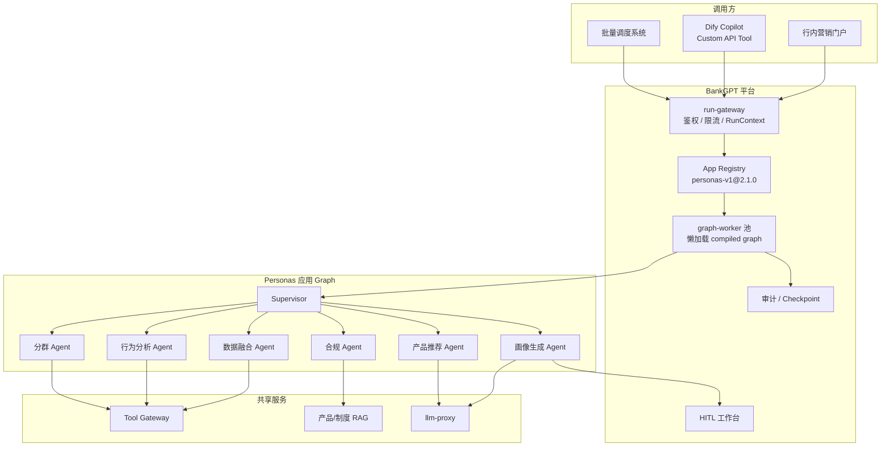
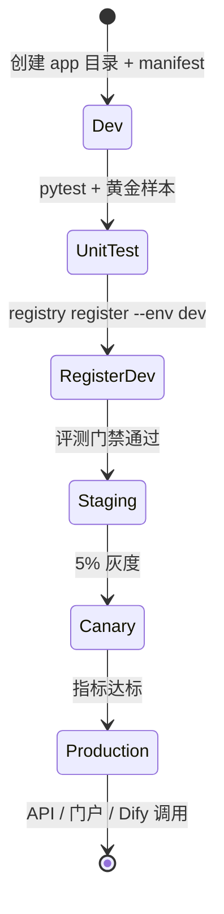
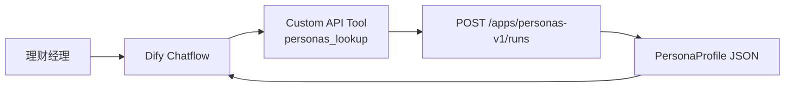

# Personas 客户画像等多 Agent 自定义应用入驻 BankGPT 指南

> 本文档以 **Personas 客户画像系统** 为示例，说明 **自研多 Agent 应用** 如何作为 **BankGPT 平台上的一个注册应用（`app_id`）** 完成开发、注册、发布与对外使用。  
> 承接：[BankGPT 多应用承载](./bankgpt-multi-app-platform.md)、[功能扩展与多 Agent](./bankgpt-extension-and-multi-agent.md)、[Dify→BankGPT 迁移](./dify-vs-bankgpt-migration.md)。

---

## 1. 为什么 Personas 适合入驻 BankGPT 而非留在 Dify？

**Personas** 是典型的 **多 Agent + 多系统 + 长链路** 自定义应用：

| 能力 | Personas 需求 | Dify 边界 | BankGPT 优势 |
|------|---------------|-----------|--------------|
| Agent 数量 | 6–8 个专家 Agent（行为、分群、合规、推荐…） | `MAX_TOOLS_NUM=10`、画布表达笨重 | Supervisor + 子图，无平台上限 |
| 数据源 | CDP、CRM、核心交易、标签库、产品库 | HTTP 节点 / 沙箱受限 | Tool Gateway 统一出站与审计 |
| 运行时长 | 单客户画像 2–15 分钟（多轮 Tool + RAG） | `WORKFLOW_MAX_EXECUTION_TIME` 硬顶 | Checkpoint 可中断恢复 |
| 合规 | 客户 PII、营销授权、审计留痕 | Trace 需外接 | 节点级审计 + `tenant_id` 隔离 |
| 批量 | 月末 50 万客户批量打标 | 需外层脚本绕路 | Batch Worker + 分片队列 |

**结论**：Personas 在 Dify 上 PoC 可行；**生产入驻 BankGPT** = 一条 `app_id` 注册记录 + 共享 Graph Worker 池，**不是**再部署一套独立集群。

---

## 2. 入驻后 BankGPT 中的位置



**关键概念**：

- **应用** = `manifest.yaml` + Python Graph 包 + 注册中心一条记录  
- **运行** = `POST /api/v1/apps/personas-v1/runs`，Worker 按 `app_id@version` 加载图  
- **隔离** = 每次 Run 携带 `tenant_id + app_id + thread_id`（见 [多应用承载 §3](./bankgpt-multi-app-platform.md#3-应用间隔离)）

---

## 3. Personas 多 Agent 拓扑设计

### 3.1 业务链路

```text
输入：customer_id / 手机号 / 案卷号
  → 数据融合（CDP + CRM + 交易摘要）
  → 并行：行为分析 | 生命周期分群 | 合规校验
  → 画像生成（标签 + 叙事摘要 + 置信度）
  → [可选 HITL] 营销人员确认敏感标签
  → 产品推荐（RAG + 规则）
  → 输出：PersonaProfile JSON + 报告 Markdown
```

### 3.2 Agent 团队划分

| Agent ID | 职责 | 类型 | 工具 / 知识 |
|----------|------|------|-------------|
| `supervisor` | 路由、汇总、决定下一步 | LLM + structured output | — |
| `data_fusion` | 拉取并合并客户主数据 | 确定性 + Tool | `cdp_profile`, `crm_contact`, `core_txn_summary` |
| `behavior` | 交易频次、渠道偏好、异常行为 | LLM Agent 子图 | `query_txn_pattern`, `calc_rfm` |
| `segment` | RFM / 生命周期阶段 | 确定性为主 | 规则引擎 + 可选 LLM 解释 |
| `compliance` | 授权校验、PII 脱敏、禁营销名单 | 确定性 + RAG | `marketing_consent`, `regulation_kb` |
| `persona_writer` | 生成标签与叙事画像 | LLM Agent | structured output |
| `recommend` | 产品匹配与话术 | LLM + RAG | `product_catalog_kb` |
| `report` | 输出 JSON / Markdown | 确定性 | 模板渲染 |

### 3.3 共享 State（TypedDict）

```python
from typing import Annotated, TypedDict
import operator


class PersonaTag(TypedDict):
    tag_id: str
    label: str
    score: float
    source: str  # rule | model | human


class PersonasState(TypedDict):
    # Run 上下文（Gateway 注入，不可伪造）
    tenant_id: str
    app_id: str
    thread_id: str
    customer_id: str
    data_classification: str  # internal | confidential

    # 原始与中间结果
    raw_profile: dict | None
    behavior_summary: dict | None
    segment_label: str | None
    compliance_passed: bool
    compliance_notes: list[str]

    # Agent 输出（追加式，供 Supervisor 汇总）
    agent_outputs: Annotated[list[dict], operator.add]

    # 产物
    tags: list[PersonaTag]
    persona_narrative: str | None
    recommendations: list[dict]
    report_markdown: str | None

    # 路由
    next_worker: str
    hitl_pending: bool
```

---

## 4. 工程目录与 Manifest

### 4.1 单仓目录（推荐）

```text
bankgpt-apps/
└── apps/
    └── personas/
        ├── manifest.yaml           # 应用入驻声明（核心）
        ├── pyproject.toml
        ├── state.py                # PersonasState
        ├── graphs/
        │   ├── main.py             # 主图 build_personas_graph()
        │   └── workers/
        │       ├── data_fusion.py
        │       ├── behavior.py
        │       ├── segment.py
        │       ├── compliance.py
        │       ├── persona_writer.py
        │       ├── recommend.py
        │       └── report.py
        ├── tools/
        │   ├── cdp.py              # @tool 封装，内部走 Tool Gateway
        │   └── crm.py
        ├── prompts/
        │   └── supervisor.md
        └── tests/
            ├── golden/
            │   └── customer_001.json
            └── test_personas_graph.py
```

### 4.2 `manifest.yaml`（入驻核心）

```yaml
app_id: personas-v1
name: Personas 客户画像
description: 多 Agent 客户画像与精准营销推荐
version: 2.1.0
owner_team: retail-ai
data_classification: confidential

# Graph 入口（Worker 懒加载）
graphs:
  main: apps.personas.graphs.main:build_personas_graph

# 多 Agent 声明
multi_agent:
  pattern: supervisor-worker
  supervisor:
    node: supervisor
    model: bankgpt-reasoning-v1
    max_delegations: 10
  workers:
    - id: data_fusion
      graph: apps.personas.graphs.workers.data_fusion:graph
      tools: [cdp_profile, crm_contact, core_txn_summary]
    - id: behavior
      graph: apps.personas.graphs.workers.behavior:graph
      tools: [query_txn_pattern, calc_rfm]
    - id: segment
      graph: apps.personas.graphs.workers.segment:graph
    - id: compliance
      graph: apps.personas.graphs.workers.compliance:graph
      tools: [marketing_consent]
      retrievers: [regulation_kb]
    - id: persona_writer
      graph: apps.personas.graphs.workers.persona_writer:graph
    - id: recommend
      graph: apps.personas.graphs.workers.recommend:graph
      retrievers: [product_catalog_kb]

# Tool 绑定（凭证路径在 Vault，不在代码里）
tool_bindings:
  - tool: cdp_profile
    vault: /tenants/{tenant_id}/apps/personas-v1/cdp
  - tool: crm_contact
    vault: /tenants/{tenant_id}/apps/personas-v1/crm
  - tool: core_txn_summary
    vault: /tenants/{tenant_id}/apps/personas-v1/core-banking-ro

# RAG Collection（按租户隔离命名）
retrievers:
  - id: product_catalog_kb
    collection: "{tenant_id}_product_catalog"
  - id: regulation_kb
    collection: "{tenant_id}_marketing_compliance"

# 权限与 HITL
policies:
  rbac:
    invoke: [role:marketing_analyst, role:crm_manager]
    hitl_approve: [role:marketing_manager]
  hitl:
    - after: persona_writer
      when: "any tag.score > 0.85 and tag.source == model"
      form: forms/persona_sensitive_review.json
      timeout_hours: 24

# 配额模板（Registry 合并租户级 override）
quotas:
  interactive_concurrent_runs: 5
  batch_concurrent_jobs: 1
  daily_llm_tokens: 5_000_000
  priority_tier: standard

# 评测门禁（未通过禁止晋升生产）
evaluation:
  golden_set: personas_golden_2025q1
  gates:
    tag_precision: 0.88
    compliance_violation_rate: 0.0
    p99_latency_seconds: 45

# 对外 API 契约
api:
  input_schema:
    type: object
    required: [customer_id]
    properties:
      customer_id: { type: string }
      channel: { type: string, enum: [retail, private, sme] }
      refresh_cache: { type: boolean, default: false }
  output_schema:
    type: object
    properties:
      tags: { type: array }
      persona_narrative: { type: string }
      recommendations: { type: array }
      report_markdown: { type: string }
```

---

## 5. 入驻流程（端到端）

### 5.1 流程总览



### 5.2 Step 1：本地开发与图编译

```python
# apps/personas/graphs/main.py
from langgraph.graph import StateGraph, START, END
from langgraph.types import Send

from apps.personas.state import PersonasState
from apps.personas.graphs.workers import (
    data_fusion, behavior, segment, compliance,
    persona_writer, recommend, report,
)


def build_personas_graph(checkpointer):
    g = StateGraph(PersonasState)

    g.add_node("supervisor", supervisor_node)
    g.add_node("data_fusion", data_fusion.graph)
    g.add_node("behavior", behavior.graph)
    g.add_node("segment", segment.graph)
    g.add_node("compliance", compliance.graph)
    g.add_node("persona_writer", persona_writer.graph)
    g.add_node("recommend", recommend.graph)
    g.add_node("report", report.node)
    g.add_node("hitl_review", hitl_interrupt_node)

    g.add_edge(START, "data_fusion")
    g.add_edge("data_fusion", "supervisor")
    g.add_conditional_edges("supervisor", route_supervisor)
    g.add_edge("behavior", "supervisor")
    g.add_edge("segment", "supervisor")
    g.add_edge("compliance", "supervisor")
    g.add_edge("persona_writer", "hitl_review")
    g.add_edge("hitl_review", "recommend")
    g.add_edge("recommend", "report")
    g.add_edge("report", END)

    return g.compile(checkpointer=checkpointer)


def route_supervisor(state: PersonasState):
    nxt = state["next_worker"]
    if nxt == "parallel_analysis":
        return [
            Send("behavior", state),
            Send("segment", state),
            Send("compliance", state),
        ]
    if nxt == "done_analysis":
        return "persona_writer"
    return nxt
```

本地验证：

```bash
cd bankgpt-apps
pytest apps/personas/tests/ -v
python -m apps.personas.graphs.main --dry-run --customer-id CUST001
```

### 5.3 Step 2：CI 构建与打包

```yaml
# .github/workflows/personas-ci.yml（示例）
jobs:
  test:
    runs-on: ubuntu-latest
    steps:
      - uses: actions/checkout@v4
      - run: pip install -e ".[dev]"
      - run: pytest apps/personas/tests/
      - run: bankgpt eval run --app personas-v1 --golden personas_golden_2025q1 --gates

  build:
    needs: test
    steps:
      - run: bankgpt package build --app personas-v1 --version ${{ github.sha }}
      - run: bankgpt package push --repo bankgpt-apps-artifacts
```

Graph 代码打入 **共享 Runtime 镜像** 或 **动态加载 Wheel**；**不**为 Personas 单独建 K8s Deployment。

### 5.4 Step 3：注册到 App Registry

```bash
# 开发环境注册
bankgpt registry register \
  --manifest apps/personas/manifest.yaml \
  --env dev \
  --artifact s3://bankgpt-artifacts/personas-v1/2.1.0+sha.wheel

# 绑定租户凭证（CDP/CRM 只读账号）
bankgpt vault bind \
  --tenant bank-east \
  --app personas-v1 \
  --tools cdp_profile,crm_contact,core_txn_summary

# 预热 Worker 缓存（可选）
bankgpt registry warmup --app personas-v1 --version 2.1.0 --env dev
```

Registry 写入内容：`app_id`、`version`、`graph_entry`、`tool_bindings`、`quotas`、`rollout` 策略。

### 5.5 Step 4：Staging 评测门禁

```bash
bankgpt eval run \
  --app personas-v1 \
  --version 2.1.0 \
  --golden personas_golden_2025q1 \
  --report out/personas_eval.html

# 门禁示例输出
# tag_precision: 0.91 ✓ (gate 0.88)
# compliance_violation_rate: 0.0 ✓
# p99_latency_seconds: 38 ✓ (gate 45)
```

未过门禁 → **禁止** `promote staging → production`。

### 5.6 Step 5：灰度发布

```bash
bankgpt app publish personas-v1 --version 2.1.0 --strategy canary --weight 5

# 观察 60 分钟
bankgpt app rollout status personas-v1
# error_rate, p99, tag_precision 达标后
bankgpt app publish personas-v1 --version 2.1.0 --weight 100
```

### 5.7 Step 6：启用 API 与权限

```bash
bankgpt app api enable personas-v1 \
  --tenant bank-east \
  --roles marketing_analyst,crm_manager

bankgpt quota set \
  --tenant bank-east \
  --app personas-v1 \
  --interactive-concurrent 5
```

---

## 6. 作为「应用」被调用

### 6.1 同步 Run（单客户画像）

```bash
curl -X POST https://bankgpt.internal/api/v1/apps/personas-v1/runs \
  -H "Authorization: Bearer ${TENANT_API_KEY}" \
  -H "Content-Type: application/json" \
  -d '{
    "inputs": {
      "customer_id": "CUST20250001",
      "channel": "retail",
      "refresh_cache": false
    },
    "thread_id": "persona-CUST20250001-20250630"
  }'
```

**响应**：

```json
{
  "run_id": "run-uuid",
  "thread_id": "persona-CUST20250001-20250630",
  "status": "running",
  "stream_url": "/api/v1/runs/run-uuid/stream"
}
```

完成后查询：

```bash
GET /api/v1/runs/{run_id}
GET /api/v1/threads/{thread_id}/state   # Checkpoint 快照
```

### 6.2 流式输出（画像叙事生成阶段）

```bash
GET /api/v1/runs/{run_id}/stream
# SSE: node_started, node_finished, token_delta, run_completed
```

### 6.3 批量 Run（月末打标）

```bash
POST /api/v1/apps/personas-v1/batch-jobs
{
  "customer_ids_file": "s3://bank-east/batch/202506/customers.csv",
  "shard_size": 500,
  "priority": "batch"
}

# 返回 batch_id，轮询进度
GET /api/v1/batch-jobs/{batch_id}
```

批量走 **batch 队列**，与交互式 Run **隔离**（见 [多应用承载 §5.3](./bankgpt-multi-app-platform.md#53-队列与优先级)）。

### 6.4 HITL 待办（敏感标签复核）

当 `persona_writer` 产出高置信敏感标签时，图在 `hitl_review` 节点 `interrupt()`：

```text
1. BankGPT HITL 服务收到 interrupt 事件
2. 推送到「营销管理工作台」待办
3. 经理提交：approve / reject / edit_tags
4. POST /api/v1/runs/{run_id}/resume  { "decision": "approve", "edited_tags": [...] }
5. 图从 Checkpoint 继续 → recommend → report
```

---

## 7. 与 Dify 共存：Personas 作为后端引擎

混合架构下，**Dify 做运营门户，Personas 在 BankGPT 跑核心多 Agent**：



**Dify Custom API Tool 配置要点**：

| 项 | 值 |
|----|-----|
| OpenAPI URL | `https://bankgpt.internal/openapi/personas-v1.yaml` |
| 认证 | `Authorization: Bearer {tenant_service_key}` |
| 输入 | `customer_id`（从对话变量传入） |
| 输出 | 将 `persona_narrative` + `recommendations` 注入 LLM 上下文 |

Dify 侧 **不再** 用多个 Agent 节点复刻 Personas；只保留 **轻量对话 + 调 BankGPT**。

---

## 8. 租户隔离与合规（Personas 必做）

| 维度 | Personas 实现 |
|------|---------------|
| **身份** | Gateway 注入 `tenant_id`；仅 `marketing_analyst` 可 invoke |
| **数据** | CDP/CRM Tool 凭证按 `vault:/tenants/{tenant_id}/apps/personas-v1/` |
| **Checkpoint** | 键 `(tenant_id, thread_id)`；禁止跨租户 thread 猜测 |
| **PII** | `compliance` 节点强制脱敏；日志不落明文手机号 |
| **审计** | 每节点写 `audit_events(case_id, node, input_hash, output_hash)` |
| **营销授权** | `marketing_consent` Tool 不通过则 `recommend` 跳过 |

---

## 9. 运维与可观测

| 指标 | 维度 | 告警 |
|------|------|------|
| `run_duration_p99` | `app_id=personas-v1` | > 45s |
| `active_runs` | `tenant_id` | 接近配额 90% |
| `hitl_pending_count` | `app_id` | > 100 单积压 |
| `tool_errors` | `cdp_profile` | 核心系统保护 |
| `tag_precision` | 版本 | 灰度期较上版下降 > 2% |

Dashboard 按 **app_id** 拆分；Personas 只是上千应用中的一条注册记录。

---

## 10. 入驻检查清单

| # | 项 | 完成 |
|---|-----|------|
| 1 | `manifest.yaml` 含 `app_id`、graph 入口、Agent 列表 | ☐ |
| 2 | `PersonasState` 与 Checkpoint 字段完整 | ☐ |
| 3 | 所有 Tool 经 **Tool Gateway**，无硬编码凭证 | ☐ |
| 4 | `compliance` 节点与禁营销规则 | ☐ |
| 5 | 黄金样本 ≥ 50 客户，含边界 case | ☐ |
| 6 | 评测门禁 CI 集成 | ☐ |
| 7 | Registry dev/staging/prod 三环境注册 | ☐ |
| 8 | 租户 Vault 绑定与 RBAC | ☐ |
| 9 | 灰度 + 回滚预案 | ☐ |
| 10 | （可选）Dify Custom API Tool 联调 | ☐ |

---

## 11. 与其他自定义多 Agent 应用的差异

Personas 入驻流程 **可复用到任意自定义应用**；仅替换 Manifest 中的 Agent 团队与 Tool：

| 应用 | app_id | 模式 | 差异点 |
|------|--------|------|--------|
| **Personas 客户画像** | `personas-v1` | Supervisor + 并行分析 | CDP/CRM、营销合规 |
| 信贷审批 | `credit-underwriting-v2` | Supervisor + HITL ×2 | 流水/征信/核心 |
| 对账单批处理 | `stmt-batch-v1` | Pipeline + Batch | doc-parser GPU |
| 投研 Copilot | `research-copilot-v1` | RAG-heavy Worker | 百万向量检索 |

**不变的部分**：注册 → 懒加载 → 共享 Worker → 四层限流 → 租户隔离。

---

## 12. 总结

| 问题 | 答案 |
|------|------|
| **Personas 如何成为 BankGPT 上的一个应用？** | Git 开发 Graph → `manifest.yaml` → Registry 注册 → Run API 按 `app_id` 加载 |
| **需要单独部署吗？** | **不需要**；共享 graph-worker 池 + 懒加载编译缓存 |
| **多 Agent 如何组织？** | Supervisor-Worker；`data_fusion` 后并行 `behavior/segment/compliance` |
| **如何对外使用？** | REST Run API、批量 Job、HITL 工作台；Dify 通过 Custom API Tool 回调 |
| **与 Dify 关系？** | Dify 可保留轻量对话；Personas 核心编排 **应在 BankGPT** |

**一句话**：像 Personas 这样的多 Agent 自定义应用，入驻 BankGPT = **提交 Manifest + Graph 代码包**，在注册中心占一条 `app_id`，由平台 **统一运行、隔离、限流与审计**——而不是复制一套 Dify 或独立微服务集群。

---

## 13. 相关文档

| 文档 | 说明 |
|------|------|
| [bankgpt-multi-app-platform.md](./bankgpt-multi-app-platform.md) | 应用注册、Worker 池、隔离与限流 |
| [bankgpt-extension-and-multi-agent.md](./bankgpt-extension-and-multi-agent.md) | 多 Agent 模式与 Manifest 模板 |
| [dify-vs-bankgpt-migration.md](./dify-vs-bankgpt-migration.md) | 何时从 Dify 迁出 |
| [dify-secondary-development.md](./dify-secondary-development.md) | Dify Custom API Tool 配置 |
| [dify-banking-interview-cases.md](./dify-banking-interview-cases.md) | 信贷/沙箱等生产案例 |
