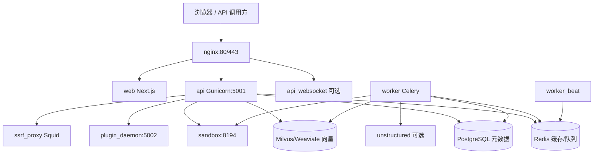
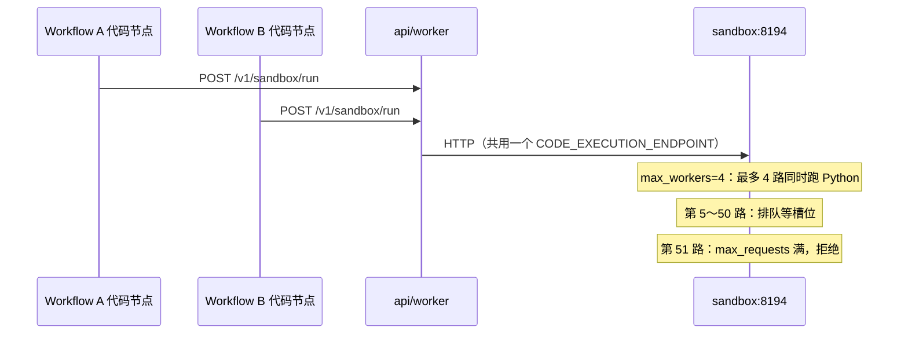
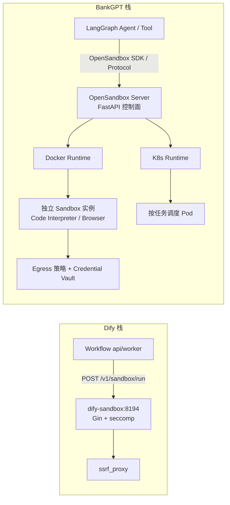
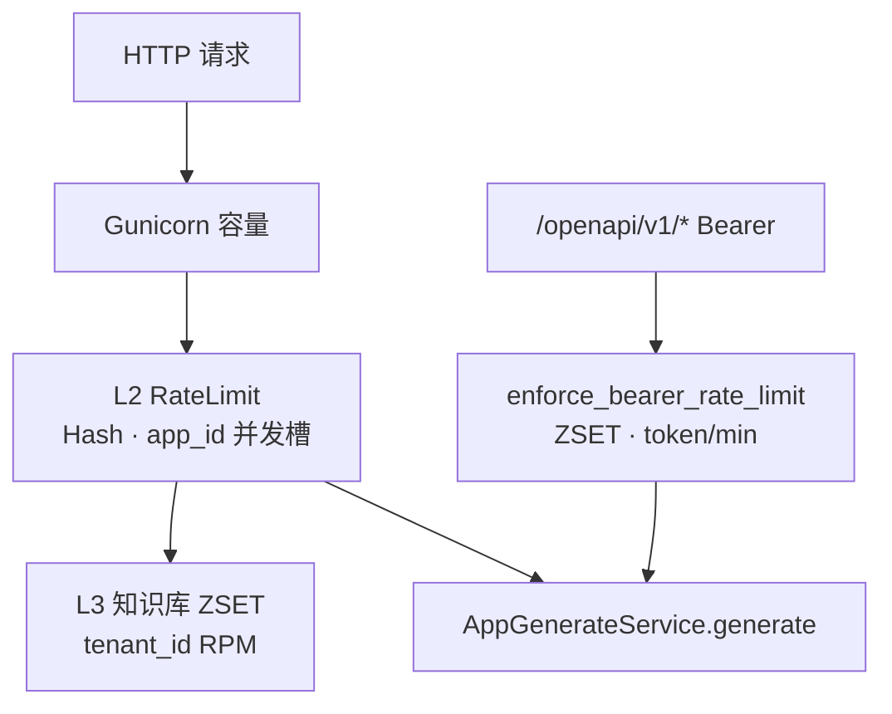
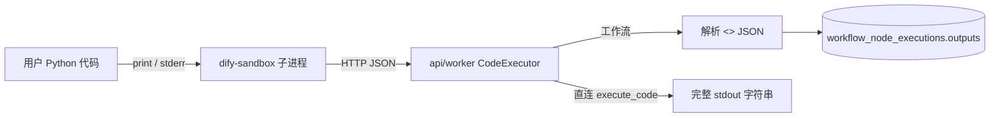
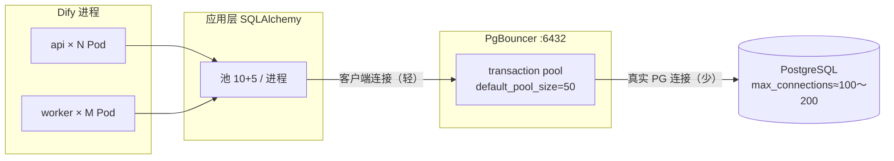
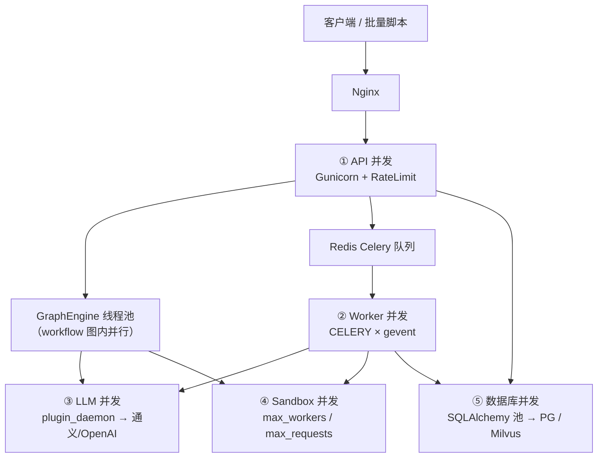
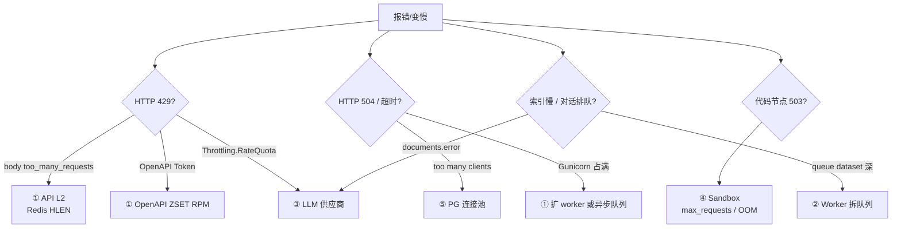

# Dify 项目架构与 Docker 运维指南（面试版）

> 面向私有化 Docker 部署（本仓库当前镜像版本 **Dify 1.15.0**）。每条末尾附 **面试要点 / 面试速记**。  
> **并发一次性回答**：见 **§11 五层对照**（API / Worker / LLM / Sandbox / DB）。  
> 相关文档：[案例 1.1 投研知识库](./dify-banking-case-1.md)、[Docker 数据库运维](./dify-docker-database-operations.md)、[二次开发概览](./dify-secondary-development.md)。

---

## 1. 项目架构总览

Dify 采用 **前后端分离 + 异步任务 + 插件/沙箱隔离** 架构：



| 层级 | 组件 | 职责 |
|---|---|---|
| 接入 | `nginx` | 反向代理 Console / Service API / WebSocket |
| 同步请求 | `api` | HTTP API、工作流调试运行、文件上传入口 |
| 异步任务 | `worker` | 知识库索引、邮件、工作流异步执行、插件任务等 |
| 定时 | `worker_beat` | Celery Beat 周期任务（队列监控、清理等） |
| 前端 | `web` | Next.js 控制台与 Chat UI |
| 元数据 | `db_postgres` / `db_mysql` | 账号、应用、工作流、文档、segment 元数据 |
| 队列/缓存 | `redis` | Celery Broker、限流桶、会话等 |
| 向量 | `milvus` 等 profile | Embedding 存储与 hybrid 检索 |
| 代码执行 | `sandbox` | 工作流 **代码节点 / 模板转换** 隔离执行 |
| 模型插件 | `plugin_daemon` | LLM/Embedding/Rerank 等插件进程 |
| 出网安全 | `ssrf_proxy` | Sandbox / HTTP 请求节点 SSRF 防护 |

**面试要点**

- Dify **不是**单体：同步走 `api`，耗时走 **Celery Worker**；向量与关系库 **分离**。
- 用户说的「Fast API」在 Dify 语境下通常指 **`api` 服务**（Flask + Gunicorn + gevent），**不是** Python FastAPI 框架。
- **Dataset（知识库）不是独立容器**，是 PG + 向量库 + Worker 索引任务组成的 **逻辑子系统**。

**面试速记**

> 请求进 Nginx → api 处理同步逻辑 → 索引/长任务进 Redis 队列 → worker 消费；RAG 向量在 Milvus，元数据在 PostgreSQL。

---

## 2. Docker 镜像清单与功能

### 2.1 默认栈（`docker compose up -d` 必起）

| 容器名（示例） | 镜像 | 功能 |
|---|---|---|
| `docker-api-1` | `langgenius/dify-api:1.15.0` | 后端 API（`MODE=api`，Gunicorn） |
| `docker-worker-1` | `langgenius/dify-api:1.15.0` | Celery Worker（`MODE=worker`，与 api **同镜像不同 MODE**） |
| `docker-worker_beat-1` | `langgenius/dify-api:1.15.0` | Celery Beat 调度 |
| `docker-web-1` | `langgenius/dify-web:1.15.0` | 前端 Console |
| `docker-nginx-1` | `nginx:latest` | 反向代理，对外 `:80`/`:443` |
| `docker-db_postgres-1` | `postgres:15-alpine` | 主库（profile `postgresql`，默认启用） |
| `docker-redis-1` | `redis:6-alpine` | Broker + 缓存 |
| `docker-sandbox-1` | `langgenius/dify-sandbox:0.2.15` | 代码沙箱 |
| `docker-plugin_daemon-1` | `langgenius/dify-plugin-daemon:0.6.3-local` | 插件运行时 |
| `docker-ssrf_proxy-1` | `ubuntu/squid:latest` | SSRF 代理 |
| `docker-init_permissions-1` | `busybox:latest` | 启动前修正 storage 目录权限（一次性） |

### 2.2 Compose Profile 可选组件

通过 `docker/.env` 中 `COMPOSE_PROFILES` 启用（如 `milvus,unstructured`）：

| Profile | 镜像 | 功能 |
|---|---|---|
| `milvus` | `quay.io/coreos/etcd:v3.5.5` | Milvus 元数据 |
| `milvus` | `minio/minio:RELEASE.2023-03-20...` | Milvus 对象存储 |
| `milvus` | `milvusdb/milvus:v2.6.3` | 向量库 Standalone `:19530` |
| `weaviate` | `semitechnologies/weaviate:1.27.0` | PoC 默认向量库 |
| `unstructured` | `unstructured-io/unstructured-api:latest` | 文档 ETL 解析 |
| `qdrant` / `pgvector` / `opensearch` / `elasticsearch` 等 | 各对应镜像 | 替代向量或全文方案 |
| `collaboration` | `langgenius/dify-api:1.15.0` | `api_websocket` 工作流协同 |
| `certbot` | `certbot/certbot` | HTTPS 证书自动续期 |

**面试要点**

- **`api` 与 `worker` 共用 `dify-api` 镜像**，靠环境变量 `MODE=api|worker|beat` 分支。
- 向量库、Unstructured **按需 profile 拉起**，未启用时不占资源。
- 插件与核心 API **进程隔离**：模型调用走 `plugin_daemon`，降低 API 崩溃面。

**面试速记**

> 数清楚默认 10+ 容器：api/worker/beat/web/nginx/pg/redis/sandbox/plugin/ssrf；Milvus 三件套走 profile。

---

## 3. 重点模块：Worker / Sandbox / API / Dataset / 日志

### 3.1 Worker（Celery 异步引擎）

| 项 | 说明 |
|---|---|
| **是什么** | `MODE=worker` 的 `dify-api` 容器，消费 Redis 队列中的 Celery 任务 |
| **做什么** | 知识库 **文档索引**（解析→分块→Embedding→写向量库）、**工作流异步执行**（`workflow_based_app_execution` 队列）、邮件、插件、定时清理等 |
| **默认队列**（社区版） | `dataset`, `priority_dataset`, `pipeline`, `workflow`, `workflow_based_app_execution`, `plugin`, `mail` 等（见 `api/docker/entrypoint.sh`） |
| **并发** | `CELERY_WORKER_AMOUNT`（默认 1）；`CELERY_AUTO_SCALE=true` 时按 CPU `--autoscale=MAX,MIN` |
| **进程池** | `CELERY_WORKER_POOL` / `CELERY_WORKER_CLASS`，默认 **gevent** |

**面试要点**

- 索引失败 **先看 worker 日志**，不是 api；api 只负责 **提交** 任务。
- 大批量 Embedding 时 worker 并发过高易触发 **模型 429**，应降 `CELERY_WORKER_AMOUNT` 或拆队列。

**面试速记**

> Worker = 同镜像 Celery 消费者；索引和异步 workflow 都在这；和 api 必须 **同配 Milvus/ETL 环境变量**。

---

### 3.2 Sandbox（代码执行沙箱）

| 项 | 说明 |
|---|---|
| **是什么** | 独立容器 `langgenius/dify-sandbox`，监听 **8194** |
| **做什么** | 执行工作流 **代码节点**、Jinja2 模板转换等；API 通过 `CODE_EXECUTION_ENDPOINT=http://sandbox:8194` 调用 |
| **网络** | 默认在 `ssrf_proxy_network`，出网经 **Squid**；`enable_network: true` 时仍受代理策略约束 |
| **配置** | `docker/volumes/sandbox/conf/config.yaml`：`max_workers: 4`, `max_requests: 50`；服务日志 **`/logs/app.log`** → 宿主机 `volumes/sandbox/logs/`（**§7.2.1**） |
| **API 侧连接池** | `CODE_EXECUTION_POOL_MAX_CONNECTIONS=100`（api/worker 到 sandbox 的 HTTP 连接） |

**面试要点**

- Sandbox **不是**按 workflow 各起一个容器；**整个 Dify 实例共用一个 sandbox 服务**。
- 瓶颈在 sandbox 的 **`max_workers`（执行槽）** 与 **`max_requests`（在途上限）**；超 requests 拒载见 **§5.6**，OOM 见 **§5.4**。
- BankGPT 生产栈常用 **阿里 OpenSandbox** 替代 dify-sandbox，对比见 **§5.7**。

**面试速记**

> Dify 用 dify-sandbox:8194 跑代码节点；BankGPT 用 OpenSandbox 做 Agent 级沙箱；PoC 前者够用，生产多 Agent 选后者。

---

### 3.3 API 服务（同步 HTTP，常被称为「后端 Fast API」）

| 项 | 说明 |
|---|---|
| **技术栈** | Flask + **Gunicorn** + gevent（`SERVER_WORKER_CLASS=gevent`） |
| **端口** | 容器内 `5001`；对外经 nginx `:80` |
| **Worker 数** | `SERVER_WORKER_AMOUNT`（默认 **1**） |
| **连接** | `SERVER_WORKER_CONNECTIONS`（默认 **10**，gevent 协程） |
| **超时** | `GUNICORN_TIMEOUT=360`（秒） |
| **职责** | Console/Service API、上传、同步 workflow 调试、派发 Celery 任务 |

**面试要点**

- 默认 **1 个 Gunicorn worker**，高并发需调 `SERVER_WORKER_AMOUNT` 与 `SERVER_WORKER_CONNECTIONS`。
- 长 workflow 同步调试会 **占满 worker 连接**，生产应用 API 应走 **异步队列** 或 streaming。

**面试速记**

> api = Gunicorn 不是 FastAPI；默认 1 worker × 10 连接；P99 靠扩 worker 数 + 异步化 workflow。

---

### 3.4 Dataset（知识库，逻辑模块）

| 项 | 说明 |
|---|---|
| **存储** | **PostgreSQL**：`datasets` / `documents` / `document_segments`；**向量库**：Milvus Collection `Vector_index_{dataset_id}_Node` |
| **索引流程** | api 接收上传 → Celery `dataset` 队列 → worker 解析/分块/Embedding → 写 PG + Milvus |
| **检索** | api/worker 读 PG 元数据 + 向量库 ANN/hybrid；与工作流 **知识检索节点** 联动 |
| **配置** | `VECTOR_STORE`, `MILVUS_*`, `ETL_TYPE`, Embedding 模型（经 plugin_daemon） |

**面试要点**

- Dataset **无独立 Docker 服务**；面试时说清 **PG 管元数据、Milvus 管向量、Worker 管索引** 三层即可。
- api/worker **必须** 使用相同 `VECTOR_STORE` 与 Milvus 认证，否则「上传成功、索引全失败」。

**面试速记**

> 知识库 = PG + Milvus + Worker 索引任务；Hit Test 慢查 Milvus，索引失败查 worker。

---

### 3.5 日志模块

| 项 | 说明 |
|---|---|
| **应用日志** | `LOG_LEVEL`, `LOG_FILE=/app/logs/server.log`, `LOG_FILE_MAX_SIZE=20`（MB）, `LOG_FILE_BACKUP_COUNT=5` |
| **格式** | `LOG_OUTPUT_FORMAT=text`；时区 `LOG_TZ=UTC` |
| **请求日志** | `ENABLE_REQUEST_LOGGING=False`（默认关） |
| **工作流日志** | 执行记录存 **PostgreSQL**（`workflow_runs`, `workflow_node_executions`）；Console **TRACING** Tab 读同库；可选 `WORKFLOW_LOG_CLEANUP_*` 清理 |
| **可观测** | OpenTelemetry（`ENABLE_OTEL` 等）；Sentry（`API_SENTRY_DSN`） |

**面试要点**

- 生产排障 **优先 `docker logs`**；`/app/logs/server.log` 在 **容器内**，默认不在 Mac 项目目录（详见 **§7.0～§7.2**）。
- Workflow trace：**Console TRACING** 与 **PG 表** 是同一份数据，不是两套日志（详见 **§7.3～§7.4**）。

**面试速记**

> 容器日志 `docker logs`；业务 trace 在 PG；开 OTEL 接 APM 才是生产级。

---

## 4. Worker：功能、性能、限制与扩容

### 4.1 功能与性能

| 任务类型 | 队列（示例） | 资源特征 |
|---|---|---|
| 文档索引 | `dataset`, `priority_dataset` | CPU + 磁盘 I/O + **Embedding API**（易 429） |
| RAG Pipeline | `pipeline`, `priority_pipeline` | 同上 |
| 工作流异步 | `workflow`, `workflow_based_app_execution` | LLM 调用 + GraphEngine 线程池 |
| 插件 | `plugin` | 与 plugin_daemon 通信 |
| 定时 | `schedule_*`, `retention` | 低峰批量 |

**性能相关环境变量**

```env
CELERY_WORKER_AMOUNT=1          # 并发进程数
CELERY_AUTO_SCALE=false         # true 时按 CPU autoscale
CELERY_MAX_WORKERS=             # autoscale 上限
CELERY_MIN_WORKERS=1
CELERY_PREFETCH_MULTIPLIER=1    # 预取任务数，索引场景建议保持 1
CELERY_WORKER_QUEUES=           # 覆盖监听队列，用于专用 Worker 池
TENANT_ISOLATED_TASK_CONCURRENCY=1  # 租户隔离队列并发
```

### 4.2 限制与瓶颈

- **单容器默认 1 并发**：大批量索引慢。
- **与对话/workflow 共队列**（默认全队列监听）：索引高峰会拖慢 **应用执行**。
- **Embedding/LLM 外部限流**：Worker 再扩也会 429。
- **Milvus/ETL 配置不一致**：Worker 与 api 环境不同导致索引 error。

### 4.3 扩容方法与步骤

**方案 A：提高单 Worker 并发（小规模）**

```bash
# docker/.env 或 shared.env
CELERY_WORKER_AMOUNT=2
# 或
CELERY_AUTO_SCALE=true
CELERY_MAX_WORKERS=4
CELERY_MIN_WORKERS=1

cd docker && docker compose up -d worker --force-recreate
```

**方案 B：队列隔离（生产推荐，投研案例 §2.7）**

```bash
# Worker 1：只跑索引
CELERY_WORKER_QUEUES=dataset,priority_dataset,pipeline,priority_pipeline

# Worker 2：只跑应用/workflow
CELERY_WORKER_QUEUES=workflow,workflow_based_app_execution,conversation

# 需启动多个 worker 服务（K8s 多 Deployment 或 compose scale + 不同 env）
docker compose up -d --scale worker=2   # 注意：需配合不同 CELERY_WORKER_QUEUES 需拆 service 定义
```

> Compose 单 `worker` 服务 scale 时 **env 相同**，真正隔离需在 `docker-compose.override.yaml` 复制 `worker_dataset` / `worker_app` 两个 service。

**方案 C：K8s 水平扩展**

- 多个 `dify-api` Deployment，`MODE=worker`，按队列分片。
- Redis 使用 Sentinel/Cluster 保证 Broker 高可用。

**面试要点**

- 扩容 Worker **先拆队列** 再堆进程数；否则索引拖死 workflow P99。
- 429 限流 **扩 Worker 无效**，要降并发或换本地 Embedding。

**面试速记**

> 索引与对话分队列 → 多 worker 池；`CELERY_WORKER_AMOUNT` 控并发；429 降并发不重试风暴。

---

## 5. Sandbox：功能、性能、限制、并发与扩容

### 5.1 功能

- 隔离执行用户 **Python / Node.js** 代码（工作流代码节点）。
- 通过 **seccomp + 独立进程** 限制系统调用；网络经 SSRF 代理。
- 依赖预装于 `docker/volumes/sandbox/dependencies/`（可自定义 `python-requirements.txt`）。
- 与 BankGPT **OpenSandbox** 的定位对比见 **§5.7**（Dify 默认 **不** 使用 OpenSandbox）。

### 5.2 核心参数：`max_workers` 与 `max_requests`（必读）

配置文件：`docker/volumes/sandbox/conf/config.yaml`（挂载到容器 `/conf/config.yaml`）。

源码（`langgenius/dify-sandbox`）在 `/v1/sandbox/run` 路由上套了两层 Gin 中间件：

```go
runRouter.POST("run",
    middleware.MaxRequest(config.MaxRequests),   // 第一层：在途请求总量
    middleware.MaxWorker(config.MaxWorkers),     // 第二层：同时执行数
    RunSandboxController,
)
```

| 参数 | 默认值 | 准确含义 | 类比 |
|---|---|---|---|
| **`max_workers`** | `4` | 同一 sandbox 容器内，**同时正在执行** Python/Node 代码的最大数量（执行槽位） | 银行窗口 **4 个柜员** |
| **`max_requests`** | `50` | 同一 sandbox 容器内，**已接受、尚未结束** 的 HTTP 请求总数上限（**含正在执行 + 排队等待**） | 营业厅 **最多 50 人**（含 4 人在办 + 46 人排队） |
| **`worker_timeout`** | `5`（config）/ `15`（`SANDBOX_WORKER_TIMEOUT`） | **单次代码执行**最长秒数，超时 Kill 子进程并释放槽位 | 单笔业务最长办理时间 |

**关键关系**

```text
max_requests  ≥  max_workers   （必须成立才有「排队」空间）

在途请求数 ≤ max_requests  →  请求被接受
正在执行数 ≤ max_workers   →  立即分配 UID 子进程执行
正在执行数 = max_workers   →  新请求进入等待（占用 max_requests 名额）
在途请求数 > max_requests  →  直接拒绝（503 / 429，不排队）→ 见 **§5.6**
```

**多 Workflow 并发时会发生什么？**



| 场景 | `max_workers=4`, `max_requests=50` | 现象 |
|---|---|---|
| 4 个 workflow 各 1 个代码节点 | 4 在执行 | 正常 |
| 8 个 workflow **同时**跑代码 | 4 执行 + **4 排队** | 后 4 个 **等待** 空槽（受 `worker_timeout` 与 api `CODE_EXECUTION_READ_TIMEOUT` 约束） |
| 60 个并发代码请求 | 4 执行 + 46 排队 + **10 被拒绝** | 超出 `max_requests=50` 的请求 **立即失败**（**§5.6**） |
| `max_requests=4`（与 workers 相同） | 8 并发 → 4 执行 + **4 直接拒绝** | **几乎无排队**，社区 Issue #17981 实测 |

**与 API 侧的关系**

| 层级 | 配置 | 作用 |
|---|---|---|
| sandbox 执行槽 | `max_workers` | 真正跑代码的并发 |
| sandbox 在途上限 | `max_requests` | 排队 + 执行总量 |
| sandbox 单次超时 | `worker_timeout` | 杀慢/死循环 |
| api 等 HTTP 返回 | `CODE_EXECUTION_READ_TIMEOUT`（默认 60s） | api **整段等待** sandbox 的上限（须 ≥ 合法任务耗时） |
| api HTTP 连接池 | `CODE_EXECUTION_POOL_MAX_CONNECTIONS`（100） | api→sandbox 并发连接数 |

**面试要点**

- **`max_workers` = 同时执行数**；**`max_requests` = 在途总数（含排队）**，不是「单 worker 处理 50 次后重启」。
- 排队 **只在** `max_requests > max_workers` 时存在；默认 50 vs 4 可排 **最多 46 个**等待。
- 所有 workflow **共享一个** sandbox 实例 → 互相抢 4 个执行槽。

**面试速记**

> max_workers=柜员数；max_requests=营业厅人数上限；超 requests 拒、超 workers 等；多 workflow 共用一个 sandbox。

---

### 5.3 多个 Workflow 是否共用一个 Sandbox？

**是（默认 Compose 单副本）。** 同一 Dify 部署内，所有租户 / 应用 / workflow 的代码节点与 Jinja2 模板转换，均通过 api/worker 调用 **同一个** `CODE_EXECUTION_ENDPOINT`（默认 `http://sandbox:8194`）。

**总并发能力（经验公式）**

```text
全局同时执行代码数 ≈ sandbox 副本数 × max_workers

例：1 副本 × max_workers=4  →  全平台最多 4 路 Python 同时跑
    3 副本 × max_workers=2  →  最多 6 路（Compose scale 或 K8s replicas）
```

**排队发生在 sandbox 内部**，不在 Dify workflow 引擎内；workflow 的 GraphEngine 线程池（`GRAPH_ENGINE_MAX_WORKERS=10`）与 sandbox 的 4 槽 **是两层不同的并发**。

---

### 5.4 Sandbox OOM：什么情况会触发？如何解决？

#### 5.4.1 OOM 是什么

**OOM（Out Of Memory）**：Linux cgroup 判定 sandbox **容器内存**超限，内核 **OOM Killer** 杀掉进程（常见为 Python 子进程或 sandbox 主进程），容器可能 **Restarting**。

**典型现象**

- 工作流代码节点间歇 **`Code execution service is unavailable`（503）**
- `docker compose ps` 显示 sandbox **Restarting** 或 **Exit 137**
- `docker inspect sandbox --format '{{.State.OOMKilled}}'` → `true`
- 宿主机 `dmesg | grep -i oom` 有 `Killed process ... out of memory`

#### 5.4.2 什么情况下容易 OOM

| 触发条件 | 说明 |
|---|---|
| **`max_workers` 过大 + `mem_limit` 过小** | 4 路同时 `import pandas` + DataFrame，每路 200MB～1GB，默认容器 **无 mem_limit** 或仅 512MB～1GB 极易爆 |
| **pandas / numpy 重计算** | 单次峰值内存高；多路叠加 |
| **死循环 / 内存泄漏** | 占满槽位且不释放，直到 OOM 或 `worker_timeout` |
| **依赖安装失败反复重试** | 启动阶段 pip 占内存（查 `docker logs sandbox`） |
| **503 后用户/workflow 重试** | 重试风暴 → 更多并发 → 更易 OOM（负反馈） |

**根因链（面试可画）**

```text
多 Agent 同时跑代码节点
  → max_workers=4，四路 Python 同时 import pandas
  → 容器 mem_limit 未设或 < 1Gi
  → cgroup OOM Kill → sandbox 503/重启
  → 上游重试 → 更卡
```

**经验公式**

```text
mem_limit ≥ max_workers × 单任务峰值内存 × 1.3（余量）

例：pandas 单任务 ~400MB，max_workers=2  →  建议 mem_limit ≥ 2Gi
    max_workers=4 且 mem_limit=1Gi        →  极易 OOM
```

#### 5.4.3 解决方案与步骤（按优先级）

**方案 1：先止血（OOM 已发生）**

```bash
cd docker

# 1. 确认 OOM
docker inspect docker-sandbox-1 --format 'OOMKilled={{.State.OOMKilled}} ExitCode={{.State.ExitCode}}'
dmesg | tail -30 | grep -i oom

# 2. 降低并发 + 设内存上限（编辑 config 见方案 2）
docker compose restart sandbox

# 3. 观察恢复
docker compose ps sandbox
docker exec docker-sandbox-1 curl -sf http://localhost:8194/health && echo OK
```

**方案 2：调 `config.yaml` + 内存 limit（单实例，推荐第一步）**

编辑 `docker/volumes/sandbox/conf/config.yaml`：

```yaml
app:
  port: 8194
  key: dify-sandbox
max_workers: 2               # OOM 时先 4→2；稳定后再试 3～4
max_requests: 50             # 保持 > max_workers 以允许排队
worker_timeout: 15           # 防死循环占坑；与 SANDBOX_WORKER_TIMEOUT 一致
enable_network: true         # 生产建议 false + HTTP 节点出网
```

编辑 `docker/.env`（与 config 对齐）：

```env
SANDBOX_WORKER_TIMEOUT=15
CODE_EXECUTION_READ_TIMEOUT=60
CODE_EXECUTION_CONNECT_TIMEOUT=10
```

新建或编辑 `docker/docker-compose.override.yaml`：

```yaml
services:
  sandbox:
    mem_limit: 2g
    memswap_limit: 2g    # 与 mem_limit 相同可禁用 swap 膨胀
    cpus: "2.0"
```

```bash
cd docker
docker compose -f docker-compose.yaml -f docker-compose.override.yaml up -d sandbox
docker compose restart api worker   # 若改了 CODE_EXECUTION_*_TIMEOUT
docker stats docker-sandbox-1 --no-stream
```

**方案 3：架构侧减负（根本）**

| 做法 | 说明 |
|---|---|
| 代码节点只做 **轻量 JSON 清洗** | 重 pandas/大数组迁 **外置微服务** 或 **Tool 插件** |
| HTTP Request 节点调外部 API | 走 `ssrf_proxy`，不占 sandbox 槽 |
| 限制 DataFrame 行数 | 避免一次加载全量 CSV |
| 控制 workflow 并行分支 | 减少同时命中代码节点的数量 |

**方案 4：水平扩 sandbox 副本（扛 QPS，不能替代 mem_limit）**

```bash
# Compose：服务名 sandbox 做 DNS 负载均衡（勿映射固定 8194 到宿主机再 scale）
docker compose up -d --scale sandbox=3

# api .env 保持
CODE_EXECUTION_ENDPOINT=http://sandbox:8194

# 验证
docker compose ps sandbox
docker compose exec api curl -sf http://sandbox:8194/health
```

- **总执行槽** ≈ `3 × max_workers`（例：3×2=6）。
- 扩副本 **不需 restart api/worker**；改 `config.yaml` **需 restart 全部 sandbox 副本**。
- **扩副本不能防止单 Pod OOM**——每个副本仍要设 `mem_limit`。

**方案 5：K8s 生产示例（节选）**

```yaml
resources:
  requests:
    memory: "1Gi"
    cpu: "500m"
  limits:
    memory: "2Gi"
    cpu: "2"
env:
  - name: WORKER_TIMEOUT
    value: "15"
  - name: MAX_WORKERS
    value: "2"
```

#### 5.4.4 OOM 调参决策树

```text
现象：503 + sandbox Restarting
  ├─ OOMKilled=true 或 dmesg 有 oom？
  │    ├─ 是 → ① mem_limit 提到 2Gi
  │    │       ② max_workers 4→2
  │    │       ③ 重计算迁 HTTP/Tool；限 DataFrame
  │    └─ 否 → 查 worker_timeout 是否过短误杀
  │
  ├─ 503 但容器未重启、CPU 高？
  │    → max_workers 满 + 排队（max_requests 内）→ 扩副本或升 workers
  │    → 日志含 immediate reject / 429 → **max_requests 满** → **§5.6**
  │
  └─ 超时无 OOM？
       → 提高 worker_timeout（≤ CODE_EXECUTION_READ_TIMEOUT）
       → 同步提高 api 侧 READ_TIMEOUT
```

#### 5.4.5 监控与验收

```bash
docker stats docker-sandbox-1 --no-stream
docker compose logs --tail=100 sandbox | grep -iE 'oom|kill|timeout|429|error'
docker exec docker-db_postgres-1 psql -U postgres -d dify -c \
  "SELECT status, count(*) FROM workflow_node_executions
   WHERE node_type='code' AND created_at > now() - interval '1 hour'
   GROUP BY 1;"
```

| 告警 | 阈值 | 动作 |
|---|---|---|
| 内存 / limit | > 85% 持续 5min | 降 `max_workers` 或升 `mem_limit` |
| OOMKilled | > 0 | **优先**降 `max_workers`，再升内存 |
| 代码节点 503 率 | > 1% | 区分 OOM（§5.4）与 max_requests（**§5.6**）；扩 sandbox 或限 App 并发 |
| p99 执行时间 | > `worker_timeout` | 查死循环或适当调超时 |

**案例 4.1 生产推荐值（可直接背）**

| 项 | PoC 默认 | OOM 后生产 |
|---|---|---|
| sandbox 副本 | 1 | 2～3 |
| `mem_limit` | 无 | **2g** |
| `max_workers` | 4 | **2** |
| `max_requests` | 50 | 50 |
| `worker_timeout` | 5 | **15** |
| `CODE_EXECUTION_READ_TIMEOUT` | 60 | 60（重任务可 120） |

**面试要点**

- OOM **优先降 max_workers，再升 mem_limit**；只扩副本不设 limit 仍会单 Pod OOM。
- 503 不一定是 OOM：可能是 **max_requests 满被拒绝**（**§5.6**）、**排队+读超时** 或 **重试风暴**。
- 改 `config.yaml` **必须 restart sandbox**；改 `CODE_EXECUTION_*` **restart api+worker**。

**面试速记**

> OOM=四路 pandas 叠内存+cgroup 杀；先 mem_limit 2g、max_workers 2、重活外置；扩副本扛 QPS不防单Pod OOM。

---

### 5.5 其他性能瓶颈与扩容（非 OOM）

| 瓶颈 | 现象 | 解决 |
|---|---|---|
| `max_workers` 过小 | 多分支并行代码节点慢 | 在 **内存允许** 前提下提高 `max_workers` |
| `max_requests` 过小 | 大量 **立即 503/429**，几乎不排队 | 见 **§5.6**（扩队列 / 扩副本 / 降上游并发） |
| 排队超时 | 等待槽位超过 api 读超时 | 升 `CODE_EXECUTION_READ_TIMEOUT` 或扩副本 / 降并发 |
| API 连接池 | api 等 sandbox HTTP 连接耗尽 | `CODE_EXECUTION_POOL_MAX_CONNECTIONS` |
| seccomp / numpy | `operation not permitted` | 扩展 `allowed_syscalls` 或换 Tool 节点 |

**单实例调参步骤**

```bash
vim docker/volumes/sandbox/conf/config.yaml
cd docker && docker compose restart sandbox
docker exec docker-sandbox-1 curl -sf http://localhost:8194/health
```

**面试速记**

> 503 分四类：OOM 重启、**max_requests 立即拒绝**、排队+读超时、api 层 429；先诊断再下刀（**§5.6**）。

---

### 5.6 `max_requests` 饱和：503 / 429 频繁出现 — 诊断与解决

> 本节针对 **在途请求数 > max_requests → sandbox 直接拒绝（503/429，不排队）** 及由此引发的 **重试风暴**。与 **§5.4 OOM** 不同：容器通常 **健康、未 Restarting**，但 workflow 代码节点大量失败。

#### 5.6.1 现象与错误原文

| 来源 | HTTP | 用户可见错误 | 含义 |
|---|---|---|---|
| sandbox `MaxRequest` 中间件 | **503** 或 **429** | `Code execution service is unavailable` | 在途请求 **> max_requests**，**立即拒绝**，不进入排队 |
| api `code_executor.py` | 收到 503 | 同上（固定文案） | api 只特判 503；其他非 200 为通用 network 错误 |
| 排队后 api 读超时 | 无 HTTP 503 | `Failed to execute code... network issue` / ReadTimeout | 已入队但 **等槽位 + 执行** 超过 `CODE_EXECUTION_READ_TIMEOUT` |
| **非 sandbox** | 429 | `too_many_requests` / OpenAPI 限流 | **App 并发槽** 或 **Token 60/min**，与 sandbox 无关 |

**典型触发场景**

```text
≥51 个代码请求同时打到 1 个 sandbox（max_requests=50）
  → 第 51 个起立即 503/429

或：8 个 workflow × 并行 8 路代码分支 = 64 路同时 POST /v1/sandbox/run
  → 4 执行 + 46 排队 + 14 立即拒绝

或：503 后客户端/workflow 自动重试
  → 在途数更高 → 更多 503（负反馈）
```

**容量速算**

```text
单 sandbox 实例：
  最大在途（含排队）= max_requests          （默认 50）
  最大同时执行       = max_workers           （默认 4）
  最大排队深度       = max_requests - max_workers  （默认 46）

N 个 sandbox 副本（Compose scale / K8s replicas）：
  总在途 ≈ N × max_requests
  总执行 ≈ N × max_workers
```

#### 5.6.2 诊断步骤（5 分钟定位）

**Step 1 — sandbox 是否健康（排除 OOM）**

```bash
cd /Users/lizzy/Documents/03_code/LLM/dify/docker

docker compose ps sandbox
docker inspect docker-sandbox-1 --format 'Status={{.State.Status}} OOMKilled={{.State.OOMKilled}}'
docker exec docker-sandbox-1 curl -sf http://localhost:8194/health && echo OK
```

| 结果 | 结论 |
|---|---|
| `Restarting` / `OOMKilled=true` | 走 **§5.4 OOM**，不是单纯 max_requests |
| `Up (healthy)` + 仍 503 | 继续 Step 2～4 |

**Step 2 — 看 sandbox 日志是否有拒绝/排队**

```bash
docker logs --tail 200 -t docker-sandbox-1 2>&1 | grep -iE '503|429|too many|reject|queue|max'
docker logs -f docker-sandbox-1   # 压测时实时观察
```

**Step 3 — 看 workflow trace 失败节点**

Console → 应用 **日志** 或画布 **TRACING** → 失败代码节点 → 错误是否为 `Code execution service is unavailable`。

PG 批量统计（近 1 小时代码节点失败）：

```bash
docker exec docker-db_postgres-1 psql -U postgres -d dify -c "
SELECT status, count(*), left(max(error), 80) AS sample_err
FROM workflow_node_executions
WHERE node_type = 'code'
  AND created_at > now() - interval '1 hour'
GROUP BY status
ORDER BY count DESC;
"
```

**Step 4 — 区分 sandbox 503 与其他 429**

```bash
# workflow 代码节点 503
docker logs docker-api-1 --tail 100 2>&1 | grep -i 'Code execution service is unavailable'

# App 层并发 429（非 sandbox）
docker logs docker-api-1 --tail 100 2>&1 | grep -iE 'too_many_requests|rate_limit|active_requests'

# OpenAPI Token 限流 429
# 响应体含 rate_limit_error 或 61 次/分钟内第 61 次失败 → 调 OPENAPI_RATE_LIMIT_PER_TOKEN
```

**Step 5 — 对照当前配置**

```bash
cat docker/volumes/sandbox/conf/config.yaml | grep -E 'max_workers|max_requests|worker_timeout'
docker exec docker-api-1 env | grep -E '^CODE_EXECUTION_|^APP_MAX_ACTIVE'
```

#### 5.6.3 解决方案（按优先级）

**方案 1：止血 — 扩大排队窗口（分钟级，单实例）**

适用：**瞬时 burst** 略超 50，sandbox 内存仍有余量，容器未 OOM。

编辑 `docker/volumes/sandbox/conf/config.yaml`：

```yaml
max_workers: 4              # 暂不动执行槽
max_requests: 100           # 50 → 100（建议为 max_workers 的 10～25 倍）
worker_timeout: 15          # 与 SANDBOX_WORKER_TIMEOUT 对齐，避免占坑过久
```

```bash
cd docker
docker compose restart sandbox
docker exec docker-sandbox-1 curl -sf http://localhost:8194/health && echo OK
```

> **注意**：`max_requests` 只增加 **排队容量**，不增加 **执行吞吐**；若长期 >4 路同时跑，仍会慢或排队超时。且排队过多会占用 api 连接与内存，**不能无限调大**。

**方案 2：扩 sandbox 副本（推荐 —  sustained 高并发）**

适用：多 App / 多 workflow **持续** 超 50 在途，或需要更高 **同时执行** 槽位。

```bash
cd docker

# 勿把 sandbox:8194 固定映射到宿主机后再 scale（Compose 会端口冲突）
docker compose up -d --scale sandbox=3

# api 仍指向服务名（Docker DNS 轮询）
# CODE_EXECUTION_ENDPOINT=http://sandbox:8194   # 无需改

docker compose ps sandbox
docker compose exec api curl -sf http://sandbox:8194/health && echo OK
```

```text
3 副本 × max_workers=4  →  最多 12 路同时执行
3 副本 × max_requests=50 →  最多 150 在途（含排队）
```

改 `config.yaml` 后 **须 restart 全部 sandbox 副本**：

```bash
docker compose restart sandbox
```

**方案 3：在内存允许下提高 `max_workers`**

适用：排队很长、代码任务 **轻量**，`docker stats` 显示 sandbox 内存 < 70% limit。

```yaml
# config.yaml — 与 mem_limit 联动
max_workers: 6
max_requests: 120          # 保持 >> max_workers
```

```yaml
# docker-compose.override.yaml
services:
  sandbox:
    mem_limit: 2g
    memswap_limit: 2g
```

**禁止**：OOM 场景下只加 `max_workers` 不加 `mem_limit` → 见 **§5.4**。

**方案 4：降上游并发（根本 — 防打满 50 槽）**

| 手段 | 配置 / 操作 | 说明 |
|---|---|---|
| 限制单 App 并发 Run | `APP_MAX_ACTIVE_REQUESTS=10`（`shared.env`） | 超过后 **api 层 429**，保护 sandbox |
| 批量任务外部队列 | 脚本 / Kafka / 定时分批 | 避免 100 线程同时调 workflow API |
| 减少 workflow **并行分支** 中的代码节点 | 画布改串行或合并节点 | GraphEngine 可同时提交多路代码 |
| 关闭 503 **自动重试** | 客户端指数退避 | 防止重试风暴把在途数翻倍 |
| 索引与对话分 Worker 池 | `CELERY_WORKER_QUEUES` | 避免索引高峰间接拖慢（间接） |

```env
# docker/envs/core-services/shared.env
APP_MAX_ACTIVE_REQUESTS=20
APP_DEFAULT_ACTIVE_REQUESTS=10
```

```bash
cd docker && docker compose up -d api worker --force-recreate
```

**方案 5：排队等待超时（非立即拒绝，但表现类似失败）**

适用：trace 报 **network issue / ReadTimeout**，而非 `Code execution service is unavailable`。

```env
# shared.env — api/worker 等 sandbox HTTP 的总等待上限
CODE_EXECUTION_READ_TIMEOUT=120    # 默认 60；须 ≥ 最坏排队时间 + 代码执行时间
CODE_EXECUTION_CONNECT_TIMEOUT=10
SANDBOX_WORKER_TIMEOUT=15          # sandbox 侧单次执行上限
```

```yaml
# config.yaml
worker_timeout: 15
```

```bash
cd docker
docker compose restart sandbox
docker compose up -d api worker --force-recreate
```

**方案 6：架构减负（长期）**

| 做法 | 效果 |
|---|---|
| 重 pandas / 大数组 → **HTTP 节点 / Tool 插件** | 不占 sandbox 槽 |
| 代码节点只做 JSON 清洗 | 缩短占槽时间 → 提高周转 |
| Jinja2 模板转换也走 sandbox | 高并发时同样计入 `max_requests` |

#### 5.6.4 完整落地步骤（推荐顺序）

```text
频繁 503/429（Code execution service is unavailable）
  │
  ├─ sandbox Restarting / OOMKilled？
  │    └─ 是 → §5.4（降 max_workers + mem_limit 2g）
  │
  ├─ 否 → 瞬时 burst 还是持续高负载？
  │    ├─ 瞬时 → 方案 1：max_requests 50→100，观察 1h
  │    └─ 持续 → 方案 2：scale sandbox=3
  │
  ├─ 仍失败 → 方案 4：APP_MAX_ACTIVE_REQUESTS + 批任务限流
  │
  ├─ 错误是 ReadTimeout 而非 unavailable？
  │    └─ 方案 5：CODE_EXECUTION_READ_TIMEOUT 120
  │
  └─ 长期 → 方案 6：重计算迁 HTTP/Tool
```

**一键验收脚本**

```bash
cd docker

# 1. 健康
docker compose ps sandbox
docker exec docker-sandbox-1 curl -sf http://localhost:8194/health

# 2. 配置生效
cat volumes/sandbox/conf/config.yaml | grep -E 'max_workers|max_requests'

# 3. 近 1h 代码节点失败率
docker exec docker-db_postgres-1 psql -U postgres -d dify -c "
SELECT status, count(*)
FROM workflow_node_executions
WHERE node_type='code' AND created_at > now() - interval '1 hour'
GROUP BY status;
"

# 4. 资源（扩 workers 后必看）
docker stats docker-sandbox-1 --no-stream
```

#### 5.6.5 推荐配置对照

| 场景 | `max_workers` | `max_requests` | sandbox 副本 | 其他 |
|---|---|---|---|---|
| PoC 默认 | 4 | 50 | 1 | — |
| 偶发 burst 503 | 4 | **100** | 1 | 客户端勿重试风暴 |
| 多 App 持续跑代码 | 2～4 | 50～100 | **2～3** | `mem_limit: 2g` |
| OOM + 503 并存 | **2** | 50 | 1～2 | 先 **§5.4** 再扩 requests |
| 批量 API 调 workflow | 4 | 100 | 2 | `APP_MAX_ACTIVE_REQUESTS=20` |

#### 5.6.6 监控告警

| 指标 | 阈值 | 动作 |
|---|---|---|
| 代码节点 `failed` + `unavailable` | > 1% / 5min | 扩 `max_requests` 或 scale sandbox |
| sandbox 在途持续打满 | 日志/压测可见 | scale 副本 > 单实例加 requests |
| `docker stats` 内存 | > 85% limit | **降** `max_workers`，勿再加 requests |
| 503 后失败率二次爬升 | 5min 内翻倍 | 查 **重试风暴**，限 APP 并发 |

**面试要点**

- **`max_requests` 满 = 立即拒绝**，不是排队慢；与 **`max_workers` 满 = 排队** 不同。
- 只加 `max_requests` **不加副本/workers** → 排队变长，可能触发 **ReadTimeout**。
- api 对 sandbox 503 的文案固定；**429 可能来自 sandbox 或 App/OpenAPI**，要 grep 日志区分。
- 503 后盲目重试是 **经典负反馈**；应 **退避 + 限并发**。

**面试速记**

> 超 requests 立刻拒；先健康检查排除 OOM → burst 加 requests → 持续 scale sandbox → 上游 APP_MAX_ACTIVE 限流 → 别重试风暴。

---

### 5.7 Dify `dify-sandbox` vs BankGPT **OpenSandbox**（阿里开源）

> **OpenSandbox**（[alibaba/OpenSandbox](https://github.com/alibaba/OpenSandbox)，Apache 2.0）是阿里巴巴开源的 **面向 AI Agent 的通用沙箱平台**；**BankGPT**（LangChain / LangGraph 栈）在生产环境用它承载 **Coding Agent、代码解释器、浏览器自动化、批处理子图** 等，而 **Dify 私有化默认** 使用 **`langgenius/dify-sandbox`** 仅服务 **工作流代码节点 / Jinja2 模板**。

#### 5.7.1 二者在架构中的位置



| 项 | Dify `dify-sandbox` | BankGPT **OpenSandbox** |
|---|---|---|
| **绑定产品** | Dify 工作流 **代码节点** 专用 | **任意 AI Agent**（LangGraph、MCP Client、批处理） |
| **调用方式** | api `CodeExecutor` → HTTP `POST /v1/sandbox/run` | Python/Java/TS **SDK** + OpenAPI **Sandbox Protocol** |
| **生命周期** | 无独立沙箱 ID；每次请求起 **子进程** | **Create → Run → Kill** 完整生命周期；可 **预 warm 池** |
| **运行时** | 单容器内 **worker 池**（`max_workers`） | **Docker 本地** + **K8s 大规模调度**（agent-sandbox 集成） |
| **隔离强度** | 容器 + **Seccomp  syscall 白名单** | 容器 + 可选 **gVisor / Kata / Firecracker microVM** |
| **网络** | 统一走 **ssrf_proxy** Squid | **Ingress Gateway** + **按沙箱 Egress 策略**（域名/IP 白名单） |
| **凭证** | 代码内不可安全持密；靠 HTTP 节点 / Tool | **Credential Vault**：出站注入凭证，**工作负载不见明文** |
| **依赖环境** | 全租户 **共享** `python-requirements.txt` | **按镜像/沙箱模板** 隔离（如 `opensandbox/code-interpreter`） |
| **能力边界** | Python3 / Node / Jinja2 短脚本 | Command、Filesystem、**Code Interpreter**、Chrome/Playwright、VNC 桌面、RL 训练 |
| **与编排集成** | 画布 **Code 节点** | **LangGraph 示例**、Google ADK、MCP Server（Claude Code / Cursor） |
| **扩容模型** | Compose `--scale sandbox=N` + `max_workers` | K8s **HPA**、沙箱 **连接池/预创建**、毫秒级取实例 |
| **许可** | Dify 生态镜像 | **Apache 2.0** 开源 |

#### 5.7.2 BankGPT 选用 OpenSandbox 的原因

BankGPT 从 Dify 演进到 LangGraph 生产栈后，沙箱诉求从「画布里跑几行 Python」变为「**多 Agent、多租户、可审计的生产执行面**」，dify-sandbox 的模型不再匹配：

| # | 痛点（dify-sandbox / Dify 代码节点） | OpenSandbox 如何对齐 BankGPT |
|---|---|---|
| 1 | **全平台共享** 4 worker + 50 在途，多 App **互相抢槽**（§5.2、§5.6） | K8s **按任务独立沙箱实例**，调度与配额 **租户/应用级** 可拆分 |
| 2 | **Seccomp + 共享依赖**，pandas/numpy 易 `operation not permitted` / OOM | **自定义沙箱镜像** + 可选 **强隔离运行时**，重计算与轻逻辑 **分镜像** |
| 3 | 仅 **无状态 HTTP Run**，无文件系统会话、无浏览器 | **Filesystem + Command + Code Interpreter**；信贷/财务 **文档批处理、GUI Agent** 可同平台 |
| 4 | 凭证不能进沙箱代码，复杂集成只能绕 **HTTP 节点** | **Credential Vault** + **Tool Gateway** 组合：Agent 调 Tool，Tool 代持核心系统凭证 |
| 5 | 扩容靠 **调 max_workers / scale 无状态副本**，缺 **策略与监控面** | **OpenAPI 协议**、Egress 策略、CNCF 生态；符合 **等保 / 出站审计** 叙事 |
| 6 | 与 **LangGraph StateGraph** 无原生 SDK | **LangGraph 官方示例**、多语言 SDK；子图内 **创建/销毁沙箱** 是一等公民 |
| 7 | 不适合 **长时间 Agent 会话**（单次 timeout 5～15s 级） | 沙箱级 **`timeout=30m`** 等，支持 **长任务 + 持久卷**（PVC/OSSFS） |
| 8 | MCP / Coding CLI 生态空白 | 内置 **MCP Server**、Claude Code / Qwen Code 等 **Coding Agent 示例** |

**BankGPT 典型落地模式**（与 [bankgpt-extension-and-multi-agent.md](./bankgpt-extension-and-multi-agent.md) 一致）：

```text
LangGraph 节点
  ├─ 轻逻辑 / 状态转换     → 纯 Python（无沙箱）
  ├─ 不可信 LLM 生成代码   → OpenSandbox Code Interpreter
  ├─ 调核心 / 行情 / 信贷   → Tool Gateway（不经沙箱持密）
  └─ 浏览器抓数 / 桌面自动化 → OpenSandbox Chrome / Playwright 沙箱
```

Dify 仍可通过 **`CODE_EXECUTION_ENDPOINT`** 继续用 dify-sandbox；BankGPT **不替换 Dify 整站**，而是 **核心 Agent 链路** 换 OpenSandbox（参见 [dify-vs-bankgpt-migration.md](./dify-vs-bankgpt-migration.md) 混合部署）。

#### 5.7.3 能力对比（面试表格）

| 维度 | dify-sandbox | OpenSandbox | 面试怎么说 |
|---|---|---|---|
| **定位** | Dify 工作流附件 | AI Agent **基础设施** | 「Dify 内置沙箱 vs Agent 专用沙箱平台」 |
| **API** | 单一 `run` 端点 | **Lifecycle + Execution** 双协议 | OpenSandbox 可扩展自定义 Runtime |
| **并发** | 进程池 `max_workers` | **多实例 + K8s 调度 + 连接池** | BankGPT 上千 App 不会共抢 4 槽 |
| **安全** | seccomp + SSRF 代理 | seccomp + **microVM** + **Egress/Credential Vault** | 银行问隔离层级时答 OpenSandbox |
| **依赖** | 全局 `requirements.txt` | **按镜像隔离** | 避免租户 A 的 pandas 影响租户 B |
| **场景** | 工作流代码节点 | Coding Agent、评测、RL、浏览器 | Dify PoC；BankGPT 生产 Agent |
| **集成成本** | Docker Compose 自带 | 需部署 **opensandbox-server** + K8s（生产） | Dify 开箱；BankGPT 工程化更高 |

#### 5.7.4 何时仍用 Dify sandbox？何时切 OpenSandbox？

| 场景 | 推荐 |
|---|---|
| Dify 画布 PoC、投研 RAG + 少量 JSON 清洗 | **dify-sandbox**（本仓库 Docker 默认） |
| 单租户、代码节点 QPS 低、无浏览器/长会话 | **dify-sandbox** + §5.4～§5.6 调参 |
| 多法人 Tenant、信贷批处理 Agent、GUI 自动化 | **OpenSandbox** + Tool Gateway |
| LangGraph 子图内动态执行 LLM 生成代码 | **OpenSandbox Code Interpreter SDK** |
| 混合架构：Dify 做知识/渠道，BankGPT 做核心编排 | Dify **保留** dify-sandbox；BankGPT **独立** OpenSandbox 集群 |

**OpenSandbox 最小体验（与 Dify 无关，验证 BankGPT 选型）**

```bash
# 本地 Docker 启动控制面（需 Python 3.10+、Docker）
uvx opensandbox-server init-config ~/.sandbox.toml --example docker
uvx opensandbox-server

pip install opensandbox opensandbox-code-interpreter
# 参见 https://github.com/alibaba/OpenSandbox README「Create a Code Interpreter」
```

#### 5.7.5 面试要点

- **不是二选一替换 Dify**：OpenSandbox 解决的是 **BankGPT / LangGraph Agent 生产沙箱**；Dify 代码节点仍走 **dify-sandbox + CODE_EXECUTION_ENDPOINT**。
- **核心差异一句话**：dify-sandbox = **轻量、与 Dify 绑死的 Run API + worker 池**；OpenSandbox = **协议化、多 Runtime、强隔离、Agent 生命周期**。
- **BankGPT 选 OpenSandbox 的 business reason**：多租户隔离、凭证不出沙箱、K8s 弹性、LangGraph 原生、浏览器/批处理 **同一套沙箱平台**。
- **dify-sandbox 的三把刀**（仍要会答）：`max_workers` / `max_requests` / OOM（§5.2～§5.6）。
- **别混淆**：Plugin Daemon = **模型插件 Python 环境**；dify-sandbox = **用户工作流代码**；OpenSandbox = **Agent 通用执行面** — 三套运行时。

#### 5.7.6 面试速记

> **Dify** = dify-sandbox，8194，4 worker 共抢，PoC 够用。  
> **BankGPT** = OpenSandbox，SDK+K8s，Credential Vault，LangGraph 长会话。  
> 银行生产：**强隔离 + 租户级沙箱 + Tool Gateway 持密** → OpenSandbox；  
> 画布代码节点：**改 config.yaml / scale 副本** → 仍 dify-sandbox。

---

## 6. API 并发与限流

### 6.1 Gunicorn 并发（同步 API）

| 变量 | 默认 | 说明 |
|---|---|---|
| `SERVER_WORKER_AMOUNT` | 1 | Gunicorn 进程数 |
| `SERVER_WORKER_CONNECTIONS` | 10 | 每进程 gevent 连接数 |
| `GUNICORN_TIMEOUT` | 360 | 请求超时（秒） |
| `APP_MAX_ACTIVE_REQUESTS` | 0 | 每应用最大并发（0=不限制） |
| `APP_MAX_EXECUTION_TIME` | 1200 | 单请求最大执行时间 |

理论并发约：`SERVER_WORKER_AMOUNT × SERVER_WORKER_CONNECTIONS`（还受 LLM 延迟影响）。

### 6.2 Dify 限流体系：是不是 Redis 令牌桶？

**不完全是。** Dify 在 Redis 上用了 **两种不同算法**，面试不要混为一谈：

| 层级 | 类 / 装饰器 | Redis 结构 | 算法本质 | 限什么 |
|---|---|---|---|---|
| **L2 应用并发** | `RateLimit` | **Hash** | **在途 Run 计数**（非令牌桶） | 同一 `app_id` **同时进行** 的流式/长 Run 数 |
| **OpenAPI / 控制台 RPM** | `libs.helper.RateLimiter` | **ZSET** | **滑动窗口**（60s 内计数） | 每 Token / IP / 账号 **每分钟请求次数** |
| **L3 知识库** | `_check_knowledge_rate_limit` | **ZSET** | 60s 滑动窗口 | 租户知识库 Hit Test / 检索 RPM |
| **L4 索引公平** | `TenantIsolatedTaskQueue` | List | 租户串行队列 | 单租户批量索引不占满全局 Worker |
| **注解导入** | `annotation_import_rate_limit` | String 计数 | 分 / 小时窗口 | Console 批量导入标注 |



> 文档口语里的「Redis 限流桶」多指 **ZSET 滑动窗口**（OpenAPI 60/min）；**应用 429 主因** 通常是 **L2 Hash 并发槽满**，不是 RPM 桶满。

---

### 6.3 L2 应用并发限流 `RateLimit`（源码路径）

**入口**：`AppGenerateService._run_with_guardrails()` → `RateLimit(app_model.id, max_active)` → `enter()` / `exit()`。

```171:178:api/services/app_generate_service.py
        max_active_request = cls._get_max_active_requests(app_model)
        rate_limit = RateLimit(app_model.id, max_active_request)
        request_id = RateLimit.gen_request_key()
        try:
            request_id = rate_limit.enter(request_id)
            quota_charge.commit()
            return action(rate_limit, request_id)
```

**Redis Key**（可加 `REDIS_KEY_PREFIX` 前缀）：

```text
dify:rate_limit:{app_id}:active_requests      # Hash：request_id → timestamp
dify:rate_limit:{app_id}:max_active_requests  # String：并发上限缓存（TTL 1 天）
```

**核心逻辑**（`api/core/app/features/rate_limiting/rate_limit.py`）：

```python
active_requests_count = redis_client.hlen(self.active_requests_key)
if active_requests_count >= self.max_active_requests:
    raise AppInvokeQuotaExceededError(...)   # → HTTP 429 too_many_requests
redis_client.hset(self.active_requests_key, request_id, str(time.time()))
# 流式结束：RateLimitGenerator.close() → HDEL request_id
# 僵死保护：>10min 未 exit 的 request_id 每 5min flush 清理
```

**并发上限怎么算**（取 **更小** 的非零值；`0` = 不限）：

```366:384:api/services/app_generate_service.py
        app_limit = app.max_active_requests or dify_config.APP_DEFAULT_ACTIVE_REQUESTS
        config_limit = dify_config.APP_MAX_ACTIVE_REQUESTS
        limits = [limit for limit in [app_limit, config_limit] if limit > 0]
        return min(limits) if limits else 0
```

| 配置 / 字段 | 环境变量 / 表 | 默认 | 含义 |
|---|---|---|---|
| 全局硬顶 | `APP_MAX_ACTIVE_REQUESTS` | **0**（不限） | 私有化生产 **应显式设** |
| 应用默认 | `APP_DEFAULT_ACTIVE_REQUESTS` | **0** | 应用 DB 字段为空时用 |
| 单应用 | `apps.max_active_requests` | NULL | Console 或 SQL 按 App 设 |

**适用 API**：Service API `/v1/chat-messages`、`/v1/workflows/run`、Web 端对话/workflow 等凡走 `AppGenerateService.generate()` 的 **流式/阻塞 Run**。

---

### 6.4 OpenAPI Token RPM：ZSET 滑动窗口（`RateLimiter`）

**入口**：Bearer 鉴权中间件 `libs/oauth_bearer.py` → `enforce_bearer_rate_limit(token_hash)`。

```148:163:api/libs/rate_limit.py
def enforce_bearer_rate_limit(token_hash: str) -> None:
    if LIMIT_BEARER_PER_TOKEN.limit <= 0:
        return
    limiter = _build_limiter(LIMIT_BEARER_PER_TOKEN)
    key = f"token:{token_hash}"
    if limiter.is_rate_limited(key):
        retry_after = limiter.seconds_until_available(key)
        raise _BearerRateLimited(retry_after)
    limiter.increment_rate_limit(key)
```

**算法**（`libs/helper.py` `RateLimiter`）：

```python
# 1. ZREMRANGEBYSCORE 删掉窗口外成员
# 2. ZCARD 计数；若 >= max_attempts → 429 + Retry-After
# 3. ZADD 当前请求；EXPIRE key
```

| 变量 | 默认 | 含义 |
|---|---|---|
| `OPENAPI_RATE_LIMIT_PER_TOKEN` | **60** | 每个 API Token **每分钟** 请求数；**0 = 关闭** |
| Key 前缀 | `rl:token_id:token:{sha256}` | 同一 Token 跨 api 副本共享 |

**与 L2 区别**：

| | L2 `RateLimit` | OpenAPI `RateLimiter` |
|---|---|---|
| 限制 | **同时进行中** 的 Run（长连接占槽） | **60 秒内** 调用 **次数** |
| 典型 429 场景 | 20 路流式对话未结束又发第 21 路 | 1 分钟内第 61 次 HTTP 调用 |
| Redis | Hash | ZSET |

集成测试：`api/tests/integration_tests/controllers/openapi/test_auth.py` — 第 61 次 GET → **429 + Retry-After**。

---

### 6.5 本仓库 / 银行案例中的限流场景

| 场景 | 现象 | 触发的限流层 | 案例来源 |
|---|---|---|---|
| **A. 投研 workflow 多路调试** | 同时开多个 Run / Hit Test | L2：同一 `app_id` 槽满 → 429 | 本地 Docker + [banking-case-1](./dify-banking-case-1.md) |
| **B. 批量 ingest + 对话叠加** | worker 索引 + 多 workflow | L2 + PG 连接（§8.3）；非 RPM | 32 PDF 顺序入库 |
| **C. 09:15 对话 429，HLEN=20/20** | 对账单批调占满同一 App 槽 | **L2 Hash 满** | [banking-interview-cases §2.0.8](./dify-banking-interview-cases.md) |
| **D. 月末 12 万次 API Run** | 循环 `POST /v1/workflows/run` | L2 429；需 **外部门控 + 分 App** | 案例 2.2 |
| **E. OpenAPI 压测 Token** | 第 61 次/分钟失败 | **ZSET RPM** | `OPENAPI_RATE_LIMIT_PER_TOKEN=60` |
| **F. 合规部 Hit Testing 压测** | 知识库 403/429 | **L3** `rate_limit_{tenant_id}` ZSET | 央企案例 |
| **G. 2000 PDF 批量索引** | 对话变慢（非 429） | **L4** 租户隔离队列 + Worker 抢 PG | 案例 2.1 时间线 |

**案例 C 根因链（面试可讲）**

```text
月末对账单脚本 for 循环 POST /v1/workflows/run（同一 app_id）
  → 每路流式 Run enter() 占 Hash 槽位
  → HLEN active_requests = 20/20
  → 业务对话再进 → AppInvokeQuotaExceededError → 429 too_many_requests
解法：拆 App（批处理 vs 对话）+ 外部门控 INCR + 单 doc 单 Run
```

---

### 6.6 配置优化与修改步骤

#### Step 1 — 编辑环境变量（api / worker / beat 一致）

```bash
vim docker/envs/core-services/shared.env
# 或 docker/.env（若已 include）
```

```env
# L2：全平台单应用并发硬顶（0=不限，生产勿用 0）
APP_MAX_ACTIVE_REQUESTS=30
APP_DEFAULT_ACTIVE_REQUESTS=10

# OpenAPI：每 Token 每分钟请求数（0=关闭）
OPENAPI_RATE_LIMIT_PER_TOKEN=60

# 可选：Redis 多环境前缀
REDIS_KEY_PREFIX=dify-local

# 注解导入（Console）
# ANNOTATION_IMPORT_RATE_LIMIT_PER_MINUTE=5  # 见 shared.env.example
```

```bash
cd /Users/lizzy/Documents/03_code/LLM/dify/docker
docker compose up -d api worker worker_beat --force-recreate
```

#### Step 2 — 按应用设 `max_active_requests`（DB / Console）

投研 Agent（`b7ba6809-de49-42cb-84d5-79149e415f55`）示例：

```sql
docker exec docker-db_postgres-1 psql -U postgres -d dify -c "
UPDATE apps SET max_active_requests = 20
WHERE id = 'b7ba6809-de49-42cb-84d5-79149e415f55';
"
```

| 应用类型 | 建议 `max_active_requests` | 说明 |
|---|---|---|
| 投研 Copilot（流式 workflow） | **20** | 多路调试不占满全局 30 |
| 月末批处理 API | **20** + **独立 app_id** | 与对话 App 分离 |
| 制度 FAQ | **10** | 低并发 |
| Studio 调试 | **5** | 防误压 |

#### Step 3 — 批量任务外部门控（案例 2.2，可选）

```text
行内网关 / 调度器
  Key: ext:batch:tenant:{tenant_id}:app:{app_id}:inflight  (INCR/DECR)
  上限: 80（≤ Σ max_active_requests）
  → 通过后再 POST /v1/workflows/run
```

避免 12 万次循环 **直接打满 L2 Hash 槽**。

#### Step 4 — 验证与监控

```bash
# Redis：某 App 当前在途 Run 数（替换 APP_UUID）
docker exec docker-redis-1 redis-cli -a difyai123456 \
  HLEN "dify-local:dify:rate_limit:APP_UUID:active_requests"

# 查看槽位明细（排查客户端断流未 exit）
docker exec docker-redis-1 redis-cli -a difyai123456 \
  HGETALL "dify-local:dify:rate_limit:APP_UUID:active_requests"

# OpenAPI Token 桶（ZSET，前缀 rl:token_id:）
docker exec docker-redis-1 redis-cli -a difyai123456 \
  ZCARD "dify-local:rl:token_id:token:YOUR_SHA256_PREFIX"

# api 日志中的 429
grep -iE 'too_many_requests|rate_limit|429' volumes/app/logs/api/server.log | tail -20
```

**压测 OpenAPI RPM**（容器内）：

```bash
# 连续 61 次带同一 Bearer Token 调 /openapi/v1/... → 第 61 次应 429 + Retry-After
```

#### Step 5 — 与 Gunicorn / PG 联动（避免只调限流仍 504）

| 现象 | 可能不是 L2 | 同时检查 |
|---|---|---|
| 429 `too_many_requests` | ✅ L2 槽满 | 降并发或升 `max_active_requests` |
| 504 等 30s | SQLAlchemy 池 / PG 连接 | **§8.3** PgBouncer |
| 429 `rate_limit_error` | 上游 LLM 供应商 | 降 Embedding 并发 |
| OpenAPI 429 + `Retry-After` | Token RPM | 调 `OPENAPI_RATE_LIMIT_PER_TOKEN` 或降 QPS |

**Redis 生产建议**（央企案例，见 [banking-interview-cases §2.0.8](./dify-banking-interview-cases.md)）：

```env
CELERY_BROKER_URL=redis://:pass@redis:6379/1   # Broker 与限流 Key 分 DB
REDIS_DB=0
REDIS_KEY_PREFIX=bank-hd-prod
# redis.conf: maxmemory-policy allkeys-lru
```

---

### 6.7 调优示例速查

```env
SERVER_WORKER_AMOUNT=4
SERVER_WORKER_CONNECTIONS=100
OPENAPI_RATE_LIMIT_PER_TOKEN=120
APP_MAX_ACTIVE_REQUESTS=30
APP_DEFAULT_ACTIVE_REQUESTS=10
```

```bash
cd docker && docker compose up -d api worker --force-recreate
```

**面试要点**

- **L2 ≠ 令牌桶**：Hash 计 **在途 Run**；OpenAPI 才是 **ZSET 滑动窗口 RPM**。
- `APP_MAX_ACTIVE_REQUESTS=0` = **不限**，生产必须设硬顶；与 `apps.max_active_requests` **取 min**。
- 429 主因排查：`HLEN dify:rate_limit:{app_id}:active_requests` vs `max_active_requests`。
- **批量 API** 与 **对话** 应 **分 App** 或外部门控，勿共抢 20 槽（案例 2.2）。
- OpenAPI：`OPENAPI_RATE_LIMIT_PER_TOKEN=0` 关闭；默认 60/min/**Token**。
- 限流 **不替代** PG 连接治理（§8.3）与 **Embedding 429**（降 worker 并发）。

**面试速记**

> L2=Hash 并发槽（流式 Run）；OpenAPI=ZSET 60/min/Token；取 min(app, APP_MAX)。  
> 429 too_many_requests → HLEN active_requests；Retry-After → Token RPM。  
> 月末批处理：拆 app_id + 外部门控，别打满 20 槽。  
> Redis：Broker db/1，限流 db/0，加 REDIS_KEY_PREFIX。

---

## 7. 日志调试与终端查看

> 本机 Compose 目录：`/Users/lizzy/Documents/03_code/LLM/dify/docker`（下文 `cd docker` 均指此路径）。

### 7.0 日志类型总览（先分清）

| 类型 | 在你 Mac 上的位置 | 终端快速查看 |
|---|---|---|
| **`docker logs`** | Docker Desktop VM 内（json-file） | `docker logs -f docker-sandbox-1` |
| **api/worker 应用日志** | `docker/volumes/app/logs/{api,worker,...}/server.log` | `tail -f volumes/app/logs/worker/server.log` |
| **sandbox 服务日志** | `docker/volumes/sandbox/logs/app.log` | `tail -f volumes/sandbox/logs/app.log` |
| **代码节点 `print()`** | **不写入文件**；sandbox 捕获 stdout → api 解析后 **仅 `return` 字典进 trace** | Console **TRACING** 看 outputs；调试见 **§7.2.2** |
| **Workflow trace** | PostgreSQL `workflow_runs` / `workflow_node_executions` | Console UI 或 `psql`（**§7.4**） |

**结论**：

- **排障 sandbox 服务**（OOM、503、pip 依赖）→ `volumes/sandbox/logs/app.log` 或 `docker logs sandbox`
- **排障索引/workflow 引擎** → `volumes/app/logs/worker/server.log`
- **看代码节点业务结果** → Console TRACING / PG `outputs`；**`print()` 调试输出默认不进 trace**

### 7.1 Docker 容器日志（`docker logs`）

**Step 0 — 确认容器名（项目名 + 服务名 + 序号）**

```bash
cd /Users/lizzy/Documents/03_code/LLM/dify/docker
docker ps --format 'table {{.Names}}\t{{.Status}}'
# 常见：docker-api-1、docker-worker-1、docker-sandbox-1、docker-db_postgres-1
```

**Step 1 — 实时跟踪（stdout/stderr，Gunicorn/Celery 主输出在这里）**

```bash
cd docker

docker logs -f docker-api-1          # HTTP API、工作流同步执行
docker logs -f docker-worker-1       # 索引、异步 workflow、Celery 任务
docker logs -f docker-sandbox-1      # 代码节点
docker logs -f docker-plugin_daemon-1
docker logs -f docker-nginx-1
```

**Step 2 — 翻历史 / 过滤**

```bash
docker logs --tail 200 -t docker-worker-1
docker logs --since 30m docker-worker-1
docker logs docker-worker-1 2>&1 | grep -iE 'error|429|MILVUS|index|workflow'
```

**Step 3 — 导出到宿主机文件（便于分享或 grep）**

```bash
docker logs docker-worker-1 > /tmp/dify-worker.log 2>&1
open /tmp/dify-worker.log   # macOS 用默认编辑器打开
```

**macOS 上原始 json 日志文件（一般不需要手动找）**

```bash
# 仅当 docker logs 不够、需查原始 json-file 时：
docker inspect docker-api-1 --format '{{.LogPath}}'
# 输出类似：/var/lib/docker/containers/<container-id>/<container-id>-json.log
# 该路径在 Docker Desktop 的 Linux VM 内，Mac Finder 里看不到；仍建议用 docker logs
```

### 7.2 api/worker 应用日志（`/app/logs/server.log`）

Dify api/worker 镜像内由 `LOG_FILE=/app/logs/server.log` 写入 Rotating 文件（默认 20MB × 5 份）。**本仓库已通过 override 挂载到宿主机**（见 Step 4）。

**Step 1 — 确认配置与文件存在**

```bash
docker exec docker-api-1 env | grep -E '^LOG_'
# LOG_FILE=/app/logs/server.log
# LOG_LEVEL=INFO

docker exec docker-api-1 ls -lh /app/logs/
docker exec docker-worker-1 ls -lh /app/logs/
# api 与 worker 各有一份 server.log，内容不同
```

**Step 2 — 实时查看**

```bash
docker exec -it docker-api-1 tail -f /app/logs/server.log
docker exec -it docker-worker-1 tail -f /app/logs/server.log
```

**Step 3 — 拷贝到 Mac 本地再分析**

```bash
mkdir -p /tmp/dify-logs
docker cp docker-api-1:/app/logs/server.log /tmp/dify-logs/api-server.log
docker cp docker-worker-1:/app/logs/server.log /tmp/dify-logs/worker-server.log
open /tmp/dify-logs/
```

**Step 4 — 挂载到宿主机（本仓库已配置）**

`docker/docker-compose.override.yaml` 已将应用日志持久化到宿主机（改配置后需 **recreate** 容器）：

| 服务 | 宿主机路径 | 容器内路径 |
|---|---|---|
| api | `docker/volumes/app/logs/api/server.log` | `/app/logs/server.log` |
| worker | `docker/volumes/app/logs/worker/server.log` | `/app/logs/server.log` |
| worker_beat | `docker/volumes/app/logs/worker_beat/server.log` | `/app/logs/server.log` |
| api_websocket | `docker/volumes/app/logs/api_websocket/server.log` | `/app/logs/server.log` |

```bash
cd /Users/lizzy/Documents/03_code/LLM/dify/docker

# 生效挂载（首次或改 override 后）
docker compose up -d init_permissions
docker compose up -d api worker worker_beat api_websocket --force-recreate

# 宿主机实时查看
tail -f volumes/app/logs/api/server.log
tail -f volumes/app/logs/worker/server.log

# Finder 打开日志目录
open volumes/app/logs/
```

Rotating 备份文件（默认 20MB × 5 份）同样落在上述目录：`server.log.1` … `server.log.5`。

### 7.2.1 Sandbox 服务日志（`/logs/app.log`）

`dify-sandbox` **不是** `/app/logs/`，而是容器根目录 **`/logs/app.log`**（Go 服务 JSON 日志：启动、pip 装依赖、`max_workers` 设置、执行异常等）。**Gin 访问日志**（`POST /v1/sandbox/run`、health）同时在 **`docker logs`** 的 stdout 里。

**本仓库已挂载**（`docker-compose.override.yaml`）：

| 宿主机 | 容器内 |
|---|---|
| `docker/volumes/sandbox/logs/app.log` | `/logs/app.log` |

```bash
cd /Users/lizzy/Documents/03_code/LLM/dify/docker

# 生效挂载（首次或改 override 后）
docker compose up -d sandbox --force-recreate

# 宿主机实时查看（推荐）
tail -f volumes/sandbox/logs/app.log

# 过滤 OOM / 依赖 / 限流
grep -iE 'error|oom|kill|timeout|503|429|pip|dependencies' volumes/sandbox/logs/app.log | tail -30

# 与 docker logs 对照（Gin HTTP 行）
docker logs -f docker-sandbox-1

open volumes/sandbox/logs/
```

`app.log` 为 **追加写** JSON 行，无 Rotating；长期运行需自行 **logrotate** 或定期归档 `app.log`。

### 7.2.2 代码沙箱里 `print()` / stdout 如何工作？存在哪？

工作流 **代码节点** 与 **内置代码工具** 走同一 sandbox HTTP 接口，但 Dify 对 stdout 的处理 **不同**：



#### A. 工作流代码节点（最常见）

用户代码必须定义 **`def main(...) -> dict`**。Dify 会包装一层 runner，在末尾执行：

```python
output_obj = main(**inputs_obj)
print(f"<<RESULT>>{json.dumps(output_obj)}<<RESULT>>")
```

| 写法 | sandbox 行为 | Dify / Console 能否看到 |
|---|---|---|
| `return {"result": 42}` | runner 打印 `<<RESULT>>...<<RESULT>>` | ✅ **TRACING → outputs** |
| `print("debug")` | 进入 **stdout**，与 RESULT 混在一起 | ❌ **默认不展示**（解析后丢弃） |
| `print("<<RESULT>>")` 等干扰标签 | 可能破坏 JSON 提取 | ⚠️ 节点 **失败** |
| 异常 / `stderr` | `data.error` | ✅ **TRACING → error** |
| C 语言 `printf` | **不支持**；仅 Python3 / Node / Jinja2 | — |

**推荐调试方式**（任选）：

```python
def main(query: str) -> dict:
    debug = f"query len={len(query)}"
    # 方式 1：放进返回值（Console 可见）
    return {"result": query, "_debug": debug}
```

```bash
# 方式 2：直连 sandbox 测 print（不经过 workflow 包装）
docker exec docker-api-1 curl -s -X POST http://sandbox:8194/v1/sandbox/run \
  -H 'X-Api-Key: dify-sandbox' -H 'Content-Type: application/json' \
  -d '{"language":"python3","code":"print(\"hello\")","preload":"","enable_network":false}' \
  | python3 -m json.tool
# data.stdout: "hello\n"
```

```bash
# 方式 3：跑完 workflow 后查 PG 里代码节点 outputs / error
docker exec docker-db_postgres-1 psql -U postgres -d dify -c "
SELECT title, outputs, error
FROM workflow_node_executions
WHERE node_type = 'code'
ORDER BY created_at DESC LIMIT 3;
"
```

**保存位置小结**

| 内容 | 保存位置 |
|---|---|
| 节点 **return 的字典** | PG `workflow_node_executions.outputs` + Console TRACING |
| 用户 **`print()` 调试行** | **不落库**；仅当次在 sandbox stdout 中，默认 **无文件** |
| 节点 **报错** | PG `error` + TRACING |
| sandbox **服务级** 日志 | `volumes/sandbox/logs/app.log` + `docker logs sandbox` |
| api 调 sandbox **失败** | `volumes/app/logs/api/server.log` 或 worker 对应文件 |

#### B. 内置「简单代码」工具（`execute_code` 直跑）

不包 `main()` 包装时，`print()` 的 **完整 stdout** 会作为工具结果返回（见 `test_code_python3.py`：`print("Hello World")` → `"Hello World\n"`）。

**面试要点**

- 工作流代码节点：**业务输出靠 `return dict`，不是 `print`**。
- `print` 调试 **不会** 出现在 Console trace；生产应把诊断字段放进 return 或写 api/worker 日志。
- sandbox 文件日志路径是 **`/logs/app.log`**，不是 `/app/logs/server.log`。
- **`printf` 不适用**；沙箱语言是 Python3 / JavaScript。

**面试速记**

> 代码节点 return 进 trace；print 不进 trace；sandbox 服务日志 tail `volumes/sandbox/logs/app.log`；测 print 用 curl sandbox/run 看 data.stdout。

---

Workflow trace **不是**写在 `server.log` 里，而是 **每次运行**写入 PG，Console 通过 API 读取同一份数据展示。

**路径 A — 画布调试（开发中最快）**

1. 打开应用工作流：`http://localhost/app/<app_id>/workflow`  
   （投研案例：`http://localhost/app/b7ba6809-de49-42cb-84d5-79149e415f55/workflow`）
2. 点击右上角 **运行 / Test Run**，输入参数后执行。
3. 右侧运行面板切 Tab：
   - **结果（RESULT）**：最终 outputs
   - **详情（DETAIL）**：总耗时、tokens、steps
   - **追踪（TRACING）**：**每个节点的 inputs/outputs/elapsed**（即 trace）
4. 点击某一节点可展开该节点输入输出；失败节点会标红并显示 `error`。

**路径 B — 已发布应用的运行日志（历史 run）**

1. 打开：`http://localhost/app/<app_id>/logs`  
   （投研案例：`http://localhost/app/b7ba6809-de49-42cb-84d5-79149e415f55/logs`）
2. 列表按时间倒序；点击某一行 **Run**。
3. 右侧 Drawer 打开后，同样有三个 Tab：**结果 / 详情 / 追踪（TRACING）**。
4. UI 底层 API（可用 curl 对照）：
   - `GET /console/api/apps/{app_id}/workflow-runs/{run_id}` — 运行摘要
   - `GET /console/api/apps/{app_id}/workflow-runs/{run_id}/node-executions` — 节点 trace 列表

**路径 C — 用 run_id 直接查（已知 UUID 时）**

从 PG 或运行响应拿到 `workflow_run_id` 后，在 **路径 B** 的日志页找对应记录，或浏览器 Network 里搜该 UUID。

### 7.4 Workflow trace：PostgreSQL 快速查看

PG 容器：`docker-db_postgres-1`；库名 `dify`；默认账号 `postgres` / `difyai123456`（见 `docker/.env`）。

**Step 1 — 最近 5 次运行（run 级）**

```bash
docker exec docker-db_postgres-1 psql -U postgres -d dify -c "
SELECT id, status, total_steps, elapsed_time, left(error,80) AS err, created_at
FROM workflow_runs
WHERE app_id = 'b7ba6809-de49-42cb-84d5-79149e415f55'
ORDER BY created_at DESC
LIMIT 5;
"
```

**Step 2 — 某次 run 的全部节点 trace（复制上一步的 id）**

```bash
RUN_ID='74a05645-fc9d-413f-85c9-07757776d329'   # 换成你的 run id

docker exec docker-db_postgres-1 psql -U postgres -d dify -c "
SELECT index, node_id, title, node_type, status,
       round(elapsed_time::numeric, 3) AS sec,
       left(error, 100) AS err
FROM workflow_node_executions
WHERE workflow_run_id = '${RUN_ID}'
ORDER BY index;
"
```

**Step 3 — 看某节点完整 inputs/outputs（JSON 文本）**

```bash
docker exec docker-db_postgres-1 psql -U postgres -d dify -c "
SELECT title, inputs, outputs, error
FROM workflow_node_executions
WHERE workflow_run_id = '${RUN_ID}' AND title = '投研回答生成';
"
```

**Step 4 — Navicat / DBeaver（图形化）**

| 项 | 值 |
|---|---|
| 主机 | `127.0.0.1`（需 `docker-compose.override.yaml` 暴露 `5432:5432`，见 [Docker 数据库运维](./dify-docker-database-operations.md)） |
| 端口 | `5432` |
| 库 | `dify` |
| 表 | `workflow_runs`（运行摘要）、`workflow_node_executions`（节点 trace） |

**UI 与 PG 的关系**

```text
Workflow 执行
    ├─► 写 PG：workflow_runs（1 行）+ workflow_node_executions（每节点 1 行）
    └─► Console TRACING Tab 读 API ──► 同一张表（不是两份独立数据）
```

批量统计失败节点：

```bash
docker exec docker-db_postgres-1 psql -U postgres -d dify -c "
SELECT title, status, count(*)
FROM workflow_node_executions
WHERE app_id = 'b7ba6809-de49-42cb-84d5-79149e415f55'
  AND created_at > now() - interval '7 days'
GROUP BY title, status
ORDER BY count DESC;
"
```

### 7.5 知识库索引等业务日志（PostgreSQL）

```bash
docker exec docker-db_postgres-1 psql -U postgres -d dify -c "
SELECT name, indexing_status, left(error,80)
FROM documents WHERE indexing_status='error' LIMIT 10;
"
```

### 7.6 启用更详细日志

```env
LOG_LEVEL=DEBUG
ENABLE_REQUEST_LOGGING=True
```

修改 `docker/envs/core-services/shared.env` 后 `docker compose up -d api worker --force-recreate`。

**面试要点**

- 索引问题 **worker 日志 + documents.error**；API 502 常是 **nginx 缓存旧 api IP**（restart nginx）。
- Workflow 节点级详情在表 `workflow_node_executions`，而不只在容器 stdout。

**面试速记**

> `docker logs worker` 查索引；`documents.error` 查原因；workflow 查 PG `workflow_node_executions`；DEBUG 开 LOG_LEVEL。

---

## 8. 数据库：功能、配置、瓶颈与优化

### 8.1 组件分工

| 组件 | 镜像 | 存什么 |
|---|---|---|
| PostgreSQL | `postgres:15-alpine` | 用户、应用、workflow、文档元数据、运行记录 |
| Redis | `redis:6-alpine` | Celery Broker、缓存、限流桶 |
| Milvus 栈 | etcd + MinIO + milvus | 向量 + sparse BM25 |
| 插件库 | PG 库 `dify_plugin` | 插件 daemon 元数据 |

### 8.2 PostgreSQL 关键配置（Compose 内置）

```text
max_connections=100（默认）
shared_buffers=128MB
work_mem=4MB
effective_cache_size=4096MB
```

连接串由 `docker/envs/databases/db-postgres.env` + `.env` 注入 api/worker。连接风暴与 PgBouncer 详见 **§8.3**。

### 8.3 瓶颈与优化

#### 8.3.1 高并发 api + worker **PostgreSQL 连接耗尽**（Connection Storm）

**现象（面试要能背原文）**

| 用户侧 | 日志 / 数据库侧 |
|---|---|
| Console / API **504 Gateway Timeout** | `FATAL: sorry, too many clients already` |
| 对话/workflow **卡住 30s 后失败** | api/worker：`QueuePool limit ... timeout` / `SQLALCHEMY_POOL_TIMEOUT` |
| 索引与对话 **同时变慢** | `pg_stat_activity` 连接数 ≈ `max_connections` |
| PG 容器 CPU **90%+**（连带） | 数千连接各自跑短 SQL → 上下文切换 + 锁竞争 |

**根因链（不是「PG 慢」这么简单）**

```text
每个 api / worker 进程各自维护 SQLAlchemy 连接池
  → 单进程最多 pool_size + max_overflow（默认 30+10=40）
  → N 个 Pod/容器 × 40 = 客户端连接数线性膨胀
  → 超过 PostgreSQL max_connections（Compose 默认 100）
  → 新请求在应用池内等 30s（SQLALCHEMY_POOL_TIMEOUT）→ 504
  → 已连上的会话仍抢 CPU → 「连接风暴 + CPU 打满」叠加
```

**Dify 侧默认池参数**（`docker/envs/databases/db-postgres.env.example` / `api/configs/middleware/__init__.py`）：

| 变量 | 默认值 | 含义 |
|---|---|---|
| `SQLALCHEMY_POOL_SIZE` | **30** | 进程内常驻连接 |
| `SQLALCHEMY_MAX_OVERFLOW` | **10** | 峰值可额外借的连接 |
| **单进程上限** | **40** | 30+10 |
| `SQLALCHEMY_POOL_TIMEOUT` | **30s** | 池内等不到连接则抛错 → 常表现为 504 |
| `SQLALCHEMY_POOL_RECYCLE` | 3600 | 连接回收（秒） |
| `POSTGRES_MAX_CONNECTIONS` | **100** | PG 真实连接上限（Compose `db_postgres` command） |

**连接数估算公式**

```text
客户端连接上限 ≈ Σ(每个 api/worker/beat 进程数 × (POOL_SIZE + MAX_OVERFLOW))

本地 Docker（默认 1 api + 1 worker + beat，各 1 进程）：
  api(40) + worker(40) + beat(少量) + plugin_daemon + psql 运维
  ≈ 80～100  →  已贴近 max_connections=100

生产（央企 AI 中台案例，见 banking-interview-cases §2.0.1）：
  8 api Pod × 4 Gunicorn × 40  ≈ 1280
  12 worker Pod × 8 并发 × 40   ≈ 3840
  运维/Beat/迁移               ≈ 200
  合计客户端                  ≈ 5320  >>  max_connections=200
```

> **PgBouncer 不减少 SQL 次数**；它减少的是 **「每条客户端连接占一条 PG 后端连接」** 这一乘法。

---

#### 8.3.2 本仓库已遇案例场景对照

| 场景 | 你在做什么 | 谁打 PG | 典型风险 |
|---|---|---|---|
| **A. 本地 Docker 默认栈** | `docker compose up`：1 api + 1 worker + 投研 workflow 调试 | api 同步 workflow 写 `workflow_node_executions`；worker 若跑索引则写 `documents`/`document_segments` | **80～100 连接** 贴 `max_connections=100`；偶发 504 |
| **B. 投研批量入库**（[dify-banking-case-1.md §7.3](./dify-banking-case-1.md)） | `ingest_batch.py` 顺序 32 PDF；Embedding + segment 写入 | **worker** 持续 `dataset` 队列任务 | 索引高峰 + Console Hit Test / workflow 同时跑 → worker+api **抢连接** |
| **C. 12 节点 Agent workflow**（投研案例 8 步/节点 trace） | 单次 Run 多 LLM + 检索 + 写 trace | 每节点 1 次 PG INSERT（`workflow_node_executions`） | trace **写放大**；并发多 Run 时 INSERT QPS 高（见下表 #3） |
| **D. 央企早高峰时间线**（[dify-banking-interview-cases.md §2.0.4](./dify-banking-interview-cases.md)） | 09:00 2000 PDF 入队 + 09:10 对话高峰 | 12 worker 全队列 + 8 api | 连接 **180/200** → CPU 92% → **504 率 18%** |
| **E. 月末/API 批量**（案例 2.2） | 外循环调 workflow API | App 层 **L2 RateLimit 429**（§6.5）+ PG trace 写满 | 需 **App 限流 + 外部门控 + 队列** |

**PG CPU 90%+ 的 Dify 典型诱因**（PgBouncer **治连接，不治慢 SQL**）

| # | 触发 | 本仓库/案例实例 |
|---|---|---|
| 1 | 连接风暴 + 短查询洪峰 | 场景 D：索引 + 对话同时 |
| 2 | 大表缺索引 Seq Scan | `messages` 820 万行查历史（央企） |
| 3 | **`workflow_node_executions` 热写** | 投研 12 节点 × 多 Run；Studio TRACING 拉取 |
| 4 | Embedding 缓存查 `embeddings` | 夜间 3 万份 PDF 索引（央企） |
| 5 | RAG 回表 `document_segments` | 投研多库检索 top_k × 并发对话 |
| 7 | Celery gevent × 多 worker | 默认 **全队列同一 worker**（§4.3 队列隔离） |

**本地快速缓解（PoC，不必上 PgBouncer）**

```env
# docker/envs/databases/db-postgres.env 或 docker/.env
POSTGRES_MAX_CONNECTIONS=200
SQLALCHEMY_POOL_SIZE=10
SQLALCHEMY_MAX_OVERFLOW=5
CELERY_WORKER_AMOUNT=1          # 索引高峰勿盲目加大
```

```bash
cd docker
docker compose up -d db_postgres api worker worker_beat --force-recreate
# 批量入库时顺序 ingest_batch.py（案例 1 已强调非并行）
```

---

#### 8.3.3 PgBouncer 是什么？经它调用 PG 的原理

Dify **不内置** PgBouncer；属于 **部署层** 组件，与 Milvus、RLS 同类——只改 **`DB_HOST` / `DB_PORT`**，**不改 Dify 源码**。



**三种池模式**

| 模式 | 归还时机 | Dify 推荐 |
|---|---|---|
| **session** | 客户端断开 | ❌ 省连接少 |
| **transaction** | **每条事务 COMMIT/ROLLBACK 后** | ✅ Flask 请求 ≈ 短事务 |
| **statement** | 每条 SQL 后 | ❌ 与 prepared statement 冲突 |

**transaction 模式一次 HTTP 请求的路径**

```text
1. api 从 SQLAlchemy 池取连接 → 连 PgBouncer:6432（客户端连接，几乎无 PG 成本）
2. PgBouncer 从 server 池借 1 条真实 PG 连接
3. BEGIN → ORM 若干 SELECT/INSERT → COMMIT
4. 真实 PG 连接立即还回 PgBouncer server 池（可被 worker 复用）
5. SQLAlchemy 连接可保持，下次请求再向 PgBouncer 借 server 连接
```

**两层池（面试必画）**

```text
[SQLAlchemy 10+5 / 进程]  →  [PgBouncer default_pool_size≈50]  →  [PG max_connections]
     进程内复用                    跨 Pod 复用真实连接                  后端硬上限
```

**会不会变慢？** 仅在 **`default_pool_size` 被慢 SQL 占满** 时，新事务在 PgBouncer **排队**（`cl_waiting>0`）；仍优于直连的 **拒连 + 30s pool 超时 + 504**。监控：`SHOW POOLS;`（详见 [banking-interview-cases §2.0.2.1](./dify-banking-interview-cases.md)）。

---

#### 8.3.4 PgBouncer 配置项与 Dify 接入步骤

**Step 1 — 部署 PgBouncer**（Compose 片段，与 `db_postgres` 同网）

```yaml
# docker-compose.override.yaml 示例（生产/PoC 验证用）
services:
  pgbouncer:
    image: edoburu/pgbouncer:1.22.1-p0
    restart: always
    environment:
      DATABASE_URL: postgres://${DB_USERNAME:-postgres}:${DB_PASSWORD:-difyai123456}@db_postgres:5432/${DB_DATABASE:-dify}
      POOL_MODE: transaction
      MAX_CLIENT_CONN: 1000
      DEFAULT_POOL_SIZE: 50
      RESERVE_POOL_SIZE: 10
      SERVER_RESET_QUERY: "DISCARD ALL"
    ports:
      - "6432:6432"
    depends_on:
      db_postgres:
        condition: service_healthy
```

或使用 `pgbouncer.ini`（K8s / 裸机）：

```ini
[databases]
dify = host=db_postgres port=5432 dbname=dify

[pgbouncer]
listen_addr = 0.0.0.0
listen_port = 6432
pool_mode = transaction
max_client_conn = 1000
default_pool_size = 50
reserve_pool_size = 10
server_reset_query = DISCARD ALL
auth_type = md5
auth_file = /etc/pgbouncer/userlist.txt
```

**Step 2 — Dify 改指向 PgBouncer**（`api` / `worker` / `worker_beat` / `plugin_daemon` **必须一致**）

```env
# docker/envs/databases/db-postgres.env 或 docker/.env
DB_HOST=pgbouncer          # 原为 db_postgres
DB_PORT=6432               # 原为 5432

# 缩小应用侧池，把跨 Pod 复用交给 PgBouncer
SQLALCHEMY_POOL_SIZE=10
SQLALCHEMY_MAX_OVERFLOW=5
SQLALCHEMY_POOL_PRE_PING=true
SQLALCHEMY_POOL_RECYCLE=3600
SQLALCHEMY_POOL_TIMEOUT=30
```

**Step 3 — PostgreSQL 侧**

```env
# 真实连接只需服务 PgBouncer 池 + 少量 superuser 余量
POSTGRES_MAX_CONNECTIONS=120
POSTGRES_SHARED_BUFFERS=256MB
```

```bash
cd docker
docker compose up -d db_postgres pgbouncer
docker compose up -d api worker worker_beat plugin_daemon --force-recreate
```

**Step 4 — 验证**

```bash
# PG 侧：连接数应 ≈ default_pool_size，而非 5000+
docker exec docker-db_postgres-1 psql -U postgres -d dify -c \
  "SELECT count(*) AS backends FROM pg_stat_activity WHERE datname='dify';"

# PgBouncer 管理库（镜像若暴露 pgbouncer 库）
psql -h 127.0.0.1 -p 6432 -U postgres pgbouncer -c "SHOW POOLS;"
# 关注 cl_active / cl_waiting / sv_active / sv_idle

# 压测后 api 无 504、无 too many clients
docker logs docker-api-1 --tail 50 | grep -iE 'pool timeout|too many clients'
```

**关键参数对照**

| 参数 | 推荐起点 | 作用 |
|---|---|---|
| `pool_mode` | **transaction** | 事务结束即还 PG 连接 |
| `default_pool_size` | 50（按 QPS 调） | 同时在 PG 上执行的事务上限 |
| `reserve_pool_size` | 10 | burst 额外借连接 |
| `max_client_conn` | 1000 | 接受多少 **客户端** 连接（≠ PG 连接数） |
| `SQLALCHEMY_POOL_SIZE` | 10（生产缩小） | 避免「每 Pod 40 × N」双重放大 |
| `POSTGRES_MAX_CONNECTIONS` | 120 | 略大于 `default_pool_size` + 管理连接 |

**K8s 拓扑（央企案例）**

```text
Ingress → dify-api (8 replicas) ──┐
                                  ├──→ pgbouncer (2 replicas) → postgres primary
dify-worker-chat (4) ─────────────┤
dify-worker-dataset (6) ──────────┘
```

央企案例效果（见 [banking-interview-cases §2.0.2.1](./dify-banking-interview-cases.md)）：`too many clients` **消失**；504 **显著下降**；API P99 由 8s+ → **<1.5s**（对话池 + 慢 SQL 治理后）。

---

#### 8.3.5 其他 PG / 栈内瓶颈（简表）

| 瓶颈 | 现象 | 解决 |
|---|---|---|
| `workflow_node_executions` 膨胀 | PG 磁盘慢、Studio trace 卡 | `ENABLE_WORKFLOW_RUN_CLEANUP_TASK`；`WORKFLOW_LOG_RETENTION_DAYS` |
| Milvus 单 Collection 过大 | ANN P99 高 | **拆 Dataset**（投研 6 库，见 [banking-case-1 §4](./dify-banking-case-1.md)） |
| Redis 单点 | Broker 故障全停 | Redis Sentinel / Cluster |
| 向量库认证不一致 | 索引 error | api/worker **同配** `MILVUS_USER/PASSWORD` |
| 索引与对话共 Worker | 对话 P99 被拖死 | **拆 Celery 队列** + 独立 worker 池（§4.3） |

**PostgreSQL 仅调大 `max_connections`（无 PgBouncer）**

```yaml
# docker-compose.override.yaml — PoC 临时方案
services:
  db_postgres:
    command: >
      postgres -c max_connections=300
               -c shared_buffers=256MB
```

> 只加 `max_connections` **不解决**「每进程 40 连接 × N 容器」的内存与 CPU 开销；生产仍推荐 **PgBouncer + 缩小 SQLAlchemy 池**。

**面试要点**

- **504 + PG** 先查：连接数是否顶满 → `pg_stat_activity` / `too many clients` → 再查慢 SQL。
- Dify 默认 **单进程 40 连接**；本地 1 api + 1 worker 就能 **吃满 100**。
- **PgBouncer = transaction 模式 + 改 DB_HOST**；与 SQLAlchemy 是 **两层池**，生产应 **缩小应用池、放大 PgBouncer 池**。
- PgBouncer **不治 CPU**：`workflow_node_executions` 写风暴、缺索引 Scan 仍要 **索引/归档/队列隔离**。
- 投研案例：**批量 ingest 顺序提交** + 勿与高峰 workflow 叠满同一 worker 池。

**面试速记**

> 连接风暴 = N 进程 × (30+10) > max_connections → 等池 30s → 504。  
> 两层池：SQLAlchemy → PgBouncer(transaction) → PG。  
> 本地 PoC：POSTGRES 200 + 缩小 POOL；生产：PgBouncer + 拆 worker 队列。  
> PgBouncer 消除 **too many clients**；慢 SQL 靠索引与 trace 清理。  
> 案例：批量 PDF 索引 + 对话高峰 = 连接 180/200；投研 12 节点 trace 写 PG。

---

## 9. 常规应用开发如何查看日志

| 场景 | 推荐方式 |
|---|---|
| 本地 Docker 二次开发 | `docker logs -f docker-api-1` / `docker-worker-1`（**§7.1**） |
| 工作流调试（画布） | `http://localhost/app/<app_id>/workflow` → 运行 → **TRACING** Tab（**§7.3 路径 A**） |
| 工作流历史 run | `http://localhost/app/<app_id>/logs` → 点某次 Run → **TRACING**（**§7.3 路径 B**） |
| 工作流 SQL 批量查 | `workflow_runs` + `workflow_node_executions`（**§7.4**） |
| Python 文件日志 | `docker exec docker-api-1 tail -f /app/logs/server.log`（**§7.2**） |
| 知识库索引 | Console 文档列表 + `docker logs worker` + `documents.error`（**§7.5**） |
| 插件/模型 | `docker logs docker-plugin_daemon-1` |
| 代码节点 | `tail -f volumes/sandbox/logs/app.log` + TRACING outputs；`print` 调试见 **§7.2.2**；OOM **§5.4**；503 **§5.6** |
| 后端断点调试 | `DEBUG=true MODE=api` 单进程 Flask（非生产） |
| 生产 | OTEL → Jaeger/Tempo；Sentry；日志 sidecar 收集 stdout |

**开发习惯建议**

1. 改 API 代码后 **重建 api/worker 镜像或挂载源码卷**（官方镜像默认不含本地改动）。
2. 改 env 后 **必须 recreate api 和 worker**（两者 env 需一致）。
3. Workflow 问题 **先 UI trace，再 PG `workflow_node_executions`**，最后容器日志。

**面试要点**

- 开发效率最高：**Console workflow trace**；批量问题：**SQL + worker 日志**。
- 改 `shared.env` 只 restart api 不 restart worker 是 **经典踩坑**。

**面试速记**

> 开发：trace 优先；索引：worker+log；改 env：api worker 一起 recreate。

---

## 10. Workflow 性能瓶颈、大小限制与突破

### 10.1 执行限制（`shared.env` / 代码默认值）

| 限制项 | 环境变量 | 默认值 |
|---|---|---|
| 最大步数 | `WORKFLOW_MAX_EXECUTION_STEPS` | **500** |
| 最大执行时间 | `WORKFLOW_MAX_EXECUTION_TIME` | **1200s（20min）** |
| 嵌套调用深度 | `WORKFLOW_CALL_MAX_DEPTH` | **5** |
| 单变量大小 | `MAX_VARIABLE_SIZE` | **200 KB** |
| 模板转换输出 | `TEMPLATE_TRANSFORM_MAX_LENGTH` | **400000 字符** |
| 工作流上传文件数 | `WORKFLOW_FILE_UPLOAD_LIMIT` | **10** |
| 单文件上传 | `UPLOAD_FILE_SIZE_LIMIT` | **15 MB** |
| Webhook Body | `WEBHOOK_REQUEST_BODY_MAX_SIZE` | **10 MB** |
| GraphEngine 线程池 | `GRAPH_ENGINE_MAX_WORKERS` | **10** |
| 并行分支提交 | `MAX_SUBMIT_COUNT` | **100** |

前端还有：`LOOP_NODE_MAX_COUNT=100`, `MAX_PARALLEL_LIMIT=10`, `MAX_ITERATIONS_NUM=99` 等（`web` 容器 env）。

### 10.2 性能瓶颈

| 瓶颈 | 原因 | 方向 | 五层 |
|---|---|---|---|
| LLM 延迟 | 串行多 LLM 节点 | 并行分支、缓存、换更快模型 | **③** |
| 知识检索 | 多库全扫 + 大 top_k | 意图路由、拆库、降 top_k | **③⑤** |
| 代码节点 | sandbox 4 workers | 调 sandbox 或减并行代码 | **④** |
| GraphEngine | 线程池 10 | 调 `GRAPH_ENGINE_MAX_WORKERS` | **①**（图内，非 Sandbox） |
| PG 写 trace | 每节点写 `workflow_node_executions` | hybrid 存储、清理任务 | **⑤** |
| 同步 API 执行 | 占 Gunicorn 连接 | 异步队列 `workflow_based_app_execution` | **①②** |
| 大变量 | 200KB 限制 | 写文件/知识库，不要传巨型 JSON | — |

> 五层并发总表见 **§11.2**。

### 10.3 突破限制的方法

```env
# 私有化可在 shared.env 调整（需评估内存与安全）
WORKFLOW_MAX_EXECUTION_STEPS=800
WORKFLOW_MAX_EXECUTION_TIME=1800
MAX_VARIABLE_SIZE=524288
GRAPH_ENGINE_MAX_WORKERS=20
WORKFLOW_FILE_UPLOAD_LIMIT=20
UPLOAD_FILE_SIZE_LIMIT=30
NGINX_CLIENT_MAX_BODY_SIZE=200M
```

```bash
cd docker && docker compose up -d api worker web nginx --force-recreate
```

**架构级突破（不靠调大参数）**

- 长链路 **拆多个 workflow** + 外部编排（Temporal/Camunda/自研调度）。
- 大文档 **先 ETL 入库** 再 RAG，不要塞进变量。
- 高并发 **异步 execution + 队列隔离**。
- 复杂代码 **移出 sandbox** 为 Tool/API 微服务。

**面试要点**

- 默认 **500 步 / 20 分钟 / 变量 200KB** 是常见考点；突破靠 env，但生产先 **改架构**。
- GraphEngine 并行 ≠ sandbox 并行；代码节点仍受 **sandbox 4 workers** 约束。

**面试速记**

> 500 步、1200s、200KB 三件套；慢查 LLM 链与检索；代码卡 sandbox；大流量拆 workflow + 异步队列。

---

## 11. 并发全景：五层对照与案例解法（面试一次性回答）

> 面试常问「高并发怎么扛？」——Dify **没有单一并发开关**，而是 **API / Worker / LLM / Sandbox / 数据库** 五层 **各自独立计数**。本节结合本仓库已跑过的案例，便于 **一张表讲完**。

### 11.1 五层并发栈（先建立地图）



**一句话**：请求先进 **① API 槽**；长任务进 **② Worker 队列**；图内并行受 **GraphEngine**；模型调用受 **③ 供应商 QPS**；代码节点受 **④ Sandbox**；所有读写最终撞 **⑤ 连接池 + PG/Milvus**。

---

### 11.2 五层对照总表（背这张即可）

| 层 | 限什么 | 默认/典型上限 | 打满时现象 | 本仓库案例 | 解法（优先级） | 关键配置 |
|---|---|---|---|---|---|---|
| **① API** | 同步 HTTP 连接 + 单 App **在途 Run** | Gunicorn **1×10**；`APP_MAX_ACTIVE=0`（不限） | 504、连接挂起；429 `too_many_requests` | **C** 对账单批调占满 20 槽；**D** 月末 12 万 API | 设 `APP_MAX_ACTIVE`；拆 App；异步 workflow 队列；扩 Gunicorn | `SERVER_WORKER_*`、`APP_MAX_ACTIVE_REQUESTS`、`OPENAPI_RATE_LIMIT` → **§6** |
| **② Worker** | Celery **消费并发** + 队列隔离 | `CELERY_WORKER_AMOUNT=1`；默认 **全队列** | 索引慢、对话 Run 排队；与 api **抢 PG** | **B** 32 PDF ingest；**D** 09:00 2000 PDF 入队 | **拆队列**（dataset vs workflow）；`CELERY_WORKER_AMOUNT`；独立 worker 池 | `CELERY_WORKER_QUEUES`、autoscale → **§4** |
| **③ LLM** | **模型供应商** QPS/TPM（Dify 不控内核） | 通义 Embedding **易 429** | `Throttling.RateQuota`；`rate_limit_error`；索引 `error` | **B** 批量 32 PDF Embedding 429；投研 Hit Test 高峰 | **vLLM 私有化**（Chat）；本地 Embedding（BGE/TEI）；降 Worker 并发 | vLLM `--max-num-seqs`；Dify **OpenAI-API-compatible** → **§11.3 ③-B** |
| **④ Sandbox** | 代码执行 **进程槽** + 在途 HTTP | `max_workers=4`，`max_requests=50` | 503 `Code execution unavailable`；OOM Restart | 多 workflow 同时跑代码节点 | `scale sandbox`；调 workers/requests；`mem_limit`；重活迁 HTTP/Tool | `config.yaml` → **§5.2～§5.6** |
| **⑤ 数据库** | PG **后端连接** + 慢 SQL | PG **100** 连接；池 **30+10/进程** | `too many clients`；504 等池 30s；CPU 90% | **A** 本地 api+worker 贴满 100；**D** 央企 5320 客户端连接 | **PgBouncer**；缩 SQLAlchemy 池；trace 清理；索引 | `POSTGRES_MAX_*`、`SQLALCHEMY_*` → **§8.3** |

**案例编号**：**A** 本地 Docker · **B** [投研批量入库](./dify-banking-case-1.md) · **C/D** [央企/月末对账单](./dify-banking-interview-cases.md) · 代码节点见 **§5.6**

---

### 11.3 分层详解与解法

#### ① API 并发

| 子层 | 机制 | 默认 | 解法 |
|---|---|---|---|
| **Gunicorn** | `SERVER_WORKER_AMOUNT × SERVER_WORKER_CONNECTIONS` | 1×10≈**10** 同步连接 | 升至 4×100；长 workflow 改 **异步** `workflow_based_app_execution` |
| **L2 RateLimit** | Redis Hash，`app_id` **在途 Run** | `APP_MAX_ACTIVE=0` 不限 | 设 **30** 全局 + 单 App **20**（投研 `b7ba6809…`） |
| **OpenAPI RPM** | ZSET，Token **60/min** | 第 61 次 429 | `OPENAPI_RATE_LIMIT_PER_TOKEN=120` 或网关 QPS |
| **GraphEngine** | workflow **图内**线程池 | `MAX_WORKERS=10` | 与 Sandbox **无关**；并行 LLM 分支占线程 → 调 `GRAPH_ENGINE_MAX_WORKERS` |

**案例 C/D**：月末脚本 + 对话共 **同一 app_id** → `HLEN active_requests=20/20` → **拆 App** + 外部门控 INCR（§6.6 Step 3）。

#### ② Worker 并发

| 子层 | 机制 | 默认 | 解法 |
|---|---|---|---|
| **Celery 进程** | `CELERY_WORKER_AMOUNT` / autoscale | **1** 进程 | 索引专用池 `CELERY_WORKER_AMOUNT=2`；**勿**与对话共池 |
| **gevent 并发** | 单进程内多 greenlet | 默认 gevent pool | 索引任务 `CELERY_PREFETCH_MULTIPLIER=1` |
| **队列** | `dataset` vs `workflow_based_app_execution` | 默认 **同一 worker 听全队列** | `-Q dataset` 与 `-Q workflow…` **分 Deployment** |
| **租户公平** | `TenantIsolatedTaskQueue` | 单租户批量占满 | 案例 **D** 2000 PDF：L4 串行 + 专用 dataset worker |

**案例 B**：32 PDF 并行会 Embedding 429 → `ingest_batch.py` **顺序** + `CELERY_WORKER_AMOUNT=1`（case-1 §7.3.1）。

#### ③ LLM 并发

| 子层 | 机制 | 说明 | 解法 |
|---|---|---|---|
| **调用链** | api/worker → **plugin_daemon** → 通义/OpenAI | Dify **不**内置模型 QPS 池 | 控制台看供应商配额 |
| **Embedding** | 索引时每 segment 一次 | **最易 429** | 降 worker；夜间分批；单文件重试 |
| **Chat/Workflow LLM** | 每节点一次 completion | 串行 12 节点 = 12 次 RTT | 并行分支、缓存、换更快模型 |
| **Rerank** | 投研 workflow rerank 节点 | 与 Embedding **共享**供应商限额 | 控制检索 top_k、减少并行 Run |

**案例 B 现象**：`documents.error` 含 `Throttling.RateQuota` → **不是** PG/Sandbox，是 **③ 供应商** → 降 Celery 并发 + Console 重试 error 文档。

##### ③-B 推荐解法：vLLM 私有化推理（Chat / Workflow LLM）

> **定位**：③ 层的 **Chat / Workflow LLM** 推荐用 **vLLM** 自建并发能力；**Embedding / Rerank** 仍建议 **独立本地服务**（BGE + Xinference / TEI），与 vLLM 分工——案例 **B** 的 429 主要来自 **Embedding**，单靠 vLLM 不能一并解决。

**为何选 vLLM（结合本仓库案例）**

| 痛点（案例） | 公有云 API | vLLM 私有化 |
|---|---|---|
| **B** 投研 12 节点 workflow 多路 Hit Test | 通义 QPS/TPM 硬顶，`RateQuota` | **`--max-num-seqs` 自控并发**，无外部 429 |
| **D** 央企 09:00 对话高峰 | 按 Token 计费 + 供应商排队 | GPU 池化 **Continuous Batching**，吞吐随负载伸缩 |
| 等保 / 数据不出域 |  prompt 出 VPC | 模型与数据 **同机房** |
| Dify 接入成本 | 每家 SDK 不同 | **OpenAI 兼容 API**，控制台填 Base URL 即可 |
| 成本 | 高峰 Token 账单不可控 | **固定 GPU 成本**，适合 **72B + 7B 双模型** 路由 |

**vLLM 核心优势（面试可展开）**

| 能力 | 说明 | 对 Dify ③ 层的价值 |
|---|---|---|
| **PagedAttention** | KV Cache 分页管理，显存碎片少 | 同卡 **更高 batch**，多 workflow Run 并行 |
| **Continuous Batching** | 请求动态拼 batch，不等最长序列结束 | 投研 **多用户同时 Hit Test** 吞吐↑ |
| **Prefix Caching** | 相同 system prompt / RAG 前缀复用 | 投研固定 system + `{{#context#}}` **降首 token 延迟** |
| **OpenAI 兼容服务** | `/v1/chat/completions`、`/v1/models`、流式 SSE | Dify 选 **OpenAI-API-compatible**，**零改代码** |
| **并行策略** | Tensor Parallel / Pipeline Parallel | 单节点 **72B** 或多卡 **Qwen2.5-72B-Instruct** |
| **并发旋钮** | `--max-num-seqs`、`--max-num-batched-tokens` | 对应 Dify **GraphEngine 10 线程** 的上限调优 |
| **生态** | Llama、Qwen、Mistral、DeepSeek 等 | 与 [banking-cases §2.0](./dify-banking-interview-cases.md) `qwen2.5-72b-instruct` 一致 |

**与同类方案对比（简述）**

| 方案 | 并发 | Dify 接入 | 适用 |
|---|---|---|---|
| **vLLM** | Continuous Batching，生产首选 | OpenAI-API-compatible | Chat / Agent / Workflow LLM |
| TGI (HF) | 较好 | OpenAI 兼容（部分） | 轻量 PoC |
| Ollama | 单请求延迟低，**高并发弱** | OpenAI 兼容 | 本地调试，非生产高峰 |
| 通义 / OpenAI SaaS | 供应商限额 | 内置插件 | PoC、低并发、Embedding |

---

**Step 1：启动 vLLM（OpenAI API Server）**

```bash
# 方式 A — Docker（推荐 PoC / 生产）
docker run -d --name vllm-qwen7b --gpus all \
  -v ~/.cache/huggingface:/root/.cache/huggingface \
  -p 8000:8000 \
  --shm-size=16g \
  vllm/vllm-openai:latest \
  --model Qwen/Qwen2.5-7B-Instruct \
  --served-model-name qwen2.5-7b-instruct \
  --host 0.0.0.0 --port 8000 \
  --max-num-seqs 128 \
  --max-num-batched-tokens 8192 \
  --gpu-memory-utilization 0.90 \
  --enable-prefix-caching

# 方式 B — pip（开发机）
pip install "vllm>=0.6.0"
vllm serve Qwen/Qwen2.5-7B-Instruct \
  --served-model-name qwen2.5-7b-instruct \
  --host 0.0.0.0 --port 8000 \
  --max-num-seqs 128 \
  --enable-prefix-caching

# 方式 C — 72B 多卡（投研复杂推理，与案例 graph 中 72B 一致）
vllm serve Qwen/Qwen2.5-72B-Instruct \
  --served-model-name qwen2.5-72b-instruct \
  --tensor-parallel-size 4 \
  --max-num-seqs 64 \
  --gpu-memory-utilization 0.92 \
  --port 8001
```

**关键参数（③ 并发调优）**

| 参数 | 含义 | 建议起点 |
|---|---|---|
| `--max-num-seqs` | 同时在途 **序列数**（≈并发请求上限） | 7B：**128**；72B：**32～64** |
| `--max-num-batched-tokens` | 单 batch Token 上限 | **8192～16384** |
| `--gpu-memory-utilization` | 显存占用比例 | **0.85～0.92**（OOM 则降） |
| `--enable-prefix-caching` | RAG 固定前缀缓存 | 投研 workflow **建议开** |
| `--tensor-parallel-size` | 多卡切分 | 72B 通常 **4×A100 80G** |

**健康检查**

```bash
curl -sf http://localhost:8000/health
curl -s http://localhost:8000/v1/models | jq .
```

---

**Step 2：vLLM API 接口（Dify / 脚本直连）**

**列出模型**

```bash
curl -s http://127.0.0.1:8000/v1/models \
  -H "Authorization: Bearer sk-local"
```

**Chat Completions（非流式）**

```bash
curl -s http://127.0.0.1:8000/v1/chat/completions \
  -H "Content-Type: application/json" \
  -H "Authorization: Bearer sk-local" \
  -d '{
    "model": "qwen2.5-7b-instruct",
    "messages": [
      {"role": "system", "content": "你是投研助手，仅根据给定资料回答。"},
      {"role": "user", "content": "2024年某银行净息差趋势？"}
    ],
    "temperature": 0.2,
    "max_tokens": 1024
  }'
```

**Chat Completions（流式 SSE，Dify 对话默认）**

```bash
curl -N http://127.0.0.1:8000/v1/chat/completions \
  -H "Content-Type: application/json" \
  -H "Authorization: Bearer sk-local" \
  -d '{
    "model": "qwen2.5-7b-instruct",
    "messages": [{"role": "user", "content": "你好"}],
    "stream": true
  }'
```

**Completions（旧接口，部分节点可用）**

```bash
curl -s http://127.0.0.1:8000/v1/completions \
  -H "Content-Type: application/json" \
  -H "Authorization: Bearer sk-local" \
  -d '{
    "model": "qwen2.5-7b-instruct",
    "prompt": "请将以下问题改写为检索查询：净息差",
    "max_tokens": 256
  }'
```

**Embedding（可选，索引专用；与 Chat 建议分实例）**

```bash
# 需使用 Embedding 模型，例如 BGE — 与 Chat 分端口部署
vllm serve BAAI/bge-large-zh-v1.5 --task embed --port 8002

curl -s http://127.0.0.1:8002/v1/embeddings \
  -H "Content-Type: application/json" \
  -H "Authorization: Bearer sk-local" \
  -d '{
    "model": "BAAI/bge-large-zh-v1.5",
    "input": ["净息差", "NIM"]
  }'
```

> **分工建议**：Chat → vLLM `:8000`；Embedding / Rerank → 独立 **TEI / Xinference**（案例 **B** 索引 429 用此路，而非堆高 vLLM Chat 并发）。

---

**Step 3：Dify 控制台接入 vLLM**

| 步骤 | 操作 |
|---|---|
| 1 | **设置 → 模型供应商 → OpenAI-API-compatible**（插件 id：`langgenius/openai_api_compatible`） |
| 2 | **API Base URL**：`http://<vllm-host>:8000/v1`（Docker 同网段用服务名，如 `http://vllm:8000/v1`） |
| 3 | **API Key**：任意非空（vLLM 默认不校验，生产可在 Nginx 层鉴权） |
| 4 | **添加模型**：名称与 `--served-model-name` **完全一致**，如 `qwen2.5-7b-instruct` |
| 5 | Workflow **LLM 节点** 选该 provider；投研 App `b7ba6809…` 可将 rewrite/answer 节点切到 vLLM |

**Docker 网络示例**（vLLM 与 Dify api/worker 同 compose 网络）：

```yaml
# docker-compose.override.yaml 片段（示例）
services:
  vllm:
    image: vllm/vllm-openai:latest
    command: >
      --model Qwen/Qwen2.5-7B-Instruct
      --served-model-name qwen2.5-7b-instruct
      --max-num-seqs 128
      --enable-prefix-caching
    ports:
      - "8000:8000"
    deploy:
      resources:
        reservations:
          devices:
            - capabilities: [gpu]
```

Dify 侧 Base URL 填：`http://vllm:8000/v1`（**plugin_daemon / worker 必须能访问**，不仅是浏览器）。

**调用链（接入后）**

```text
Dify api/worker → plugin_daemon → OpenAI-API-compatible
  → POST http://vllm:8000/v1/chat/completions
  → vLLM Continuous Batching（③ 并发在此消化）
```

**③ 层 vLLM 调优与案例对照**

| 场景 | 现象 | 动作 |
|---|---|---|
| 多路 workflow 变慢、**无 429** | vLLM queue 深 | 升 `--max-num-seqs` 或 **水平扩 vLLM + Nginx 轮询** |
| vLLM OOM / CUDA OOM | 显存打满 | 降 `--gpu-memory-utilization` 或 `--max-num-seqs` |
| 仍有 **Embedding RateQuota** | 索引走通义 | Embedding **改本地 TEI/Xinference**，与 vLLM 无关 |
| 72B + 7B 混部 | 成本与延迟 | 7B `:8000` 意图/改写；72B `:8001` 复杂 answer（见 banking-cases graph） |

**面试要点**：vLLM 解决 **③ Chat 并发与出域**；**PagedAttention + Continuous Batching** 是核心；Dify 用 **OpenAI-API-compatible + Base URL** 接入；Embedding 429 要 **另起本地向量服务**，不能指望 vLLM Chat 一并解决。

**面试速记**：③ Chat 上 **vLLM**，`max-num-seqs` 控并发，OpenAI 兼容 `/v1/chat/completions`；Dify 填 **OpenAI-API-compatible**；Embedding 429 用 **BGE/TEI 本地**，与 vLLM 分工。

**参考**：[二次开发 §4 示例 vLLM 插件](./dify-secondary-development.md)、[banking-cases qwen2.5-72b graph](./dify-banking-interview-cases.md)

---

#### ④ Sandbox 并发

| 子层 | 机制 | 默认 | 解法 |
|---|---|---|---|
| **执行槽** | `max_workers` | **4** 路 Python 同时跑 | 内存够则升；OOM 则 **降** + `mem_limit 2g` |
| **在途上限** | `max_requests` | **50**（含排队） | burst 503 → 100；持续 → `scale sandbox=3` |
| **共享** | 全平台 **一个** sandbox 服务 | 多 App 互抢 | 水平扩副本；BankGPT 生产用 OpenSandbox（§5.7） |
| **api 等待** | `CODE_EXECUTION_READ_TIMEOUT=60` | 排队+执行超时 | 与 §5.6 联调 |

**与 GraphEngine 区别**：workflow 可 **10 线程并行**提交代码节点，Sandbox 仍只有 **4 槽** → 第 5 路起 **排队/503**。

#### ⑤ 数据库并发

| 子层 | 机制 | 默认 | 解法 |
|---|---|---|---|
| **SQLAlchemy** | 每 api/worker 进程 **30+10** | 本地 2 进程≈**80** | 缩池 10+5；生产 **PgBouncer** |
| **PostgreSQL** | `max_connections` | **100** | 升至 200（PoC）或 PgBouncer **50 真实连接** |
| **写放大** | 每 workflow 节点写 trace | 12 节点 Agent × 多 Run | 开 cleanup；降并发 Run |
| **Milvus** | gRPC 向量检索 | 与 PG **分开** | 拆 Collection（投研 6 库）；Attu 看负载 |

**案例 A/D**：连接风暴 → **504**（不是 429）→ §8.3 PgBouncer；**勿**与 L2 429 混淆。

---

### 11.4 案例串联：一次故障五层排查顺序

**症状 → 层级（决策树）**



**场景：09:00 批量 PDF + 09:10 对话高峰**（央企时间线，§8.3.2 **D**）

```text
1. 用户报 429？        → 查 Redis HLEN rate_limit:{app_id}     → ① L2 槽满 → 拆 App
2. 用户报 504？        → pg_stat_activity / too many clients   → ⑤ PG → PgBouncer
3. 用户报 503 代码节点？ → docker logs sandbox / app.log         → ④ max_requests/OOM
4. 索引 documents.error？→ worker log Throttling.RateQuota       → ③ LLM → 降 worker
5. 对话慢但无错误？     → Celery queue 深度 / worker 全跑 dataset → ② 拆队列
```

**场景：投研本地 PoC**（**A + B + C**）

```text
ingest_batch 32 PDF（Worker 索引）
  + Console 多路 workflow 调试（API L2 + PG trace 写）
  + 偶发 Embedding 429（③）
  + 代码节点 503（④，若多路并行代码）
→ 顺序 ingest + APP_MAX=20 + POSTGRES 200 + sandbox mem_limit
```

---

### 11.5 推荐生产配置快照（私有化起点）

```env
# ① API
SERVER_WORKER_AMOUNT=4
SERVER_WORKER_CONNECTIONS=100
APP_MAX_ACTIVE_REQUESTS=30
APP_DEFAULT_ACTIVE_REQUESTS=10
OPENAPI_RATE_LIMIT_PER_TOKEN=60

# ② Worker（示例：对话池）
CELERY_WORKER_AMOUNT=2
CELERY_WORKER_QUEUES=workflow,workflow_based_app_execution,mail
# 索引池另起 worker：CELERY_WORKER_QUEUES=dataset,priority_dataset

# ③ LLM — vLLM Chat（见 §11.3 ③-B）；Embedding 仍用本地 TEI/Xinference
# vLLM 示例：--max-num-seqs 128 --enable-prefix-caching
# Dify：OpenAI-API-compatible → http://vllm:8000/v1

# ④ Sandbox — config.yaml: max_workers=2, max_requests=100 + compose mem_limit:2g

# ⑤ DB
SQLALCHEMY_POOL_SIZE=10
SQLALCHEMY_MAX_OVERFLOW=5
POSTGRES_MAX_CONNECTIONS=120
# DB_HOST=pgbouncer DB_PORT=6432
```

```bash
cd docker && docker compose up -d api worker sandbox db_postgres --force-recreate
```

---

### 11.6 面试要点

- **五层独立**：API 槽、Worker 队列、LLM 供应商、Sandbox 槽、PG 连接——**打满现象不同**（429 vs 504 vs 503 vs RateQuota vs too many clients）。
- **GraphEngine 并行 ≠ Sandbox 并行 ≠ LLM 并行**：图里 8 路并行 LLM 仍受 **vLLM `--max-num-seqs` 或供应商 QPS**；4 路并行代码仍受 **sandbox 4 workers**。
- **③ Chat 推荐 vLLM**：OpenAI-API-compatible 接入，Continuous Batching 扛 workflow 多路 LLM；**Embedding 429 另起 BGE/TEI**，不能单靠 vLLM Chat。
- **扩 Worker 不能治 Embedding 429**；**扩 PG max_connections 不能治连接风暴**——应对 **PgBouncer + 缩应用池**。
- **批量任务与对话必须分 App 或外部门控**（案例 C/D），否则 L2 Hash 20 槽被批处理占满。
- 投研案例：**顺序 ingest** 治 ③；**trace 写 PG** 撞 ⑤；**12 节点 workflow** 放大 ①⑤。

### 11.7 面试速记（30 秒版）

> **五层并发**：API 槽（Gunicorn+RateLimit）→ Worker 队列（Celery 拆池）→ LLM（**vLLM 私有化 Chat** + 本地 Embedding）→ Sandbox（4 worker/50 在途/scale）→ DB（PgBouncer+小池）。  
> **429** 看 Redis HLEN（①）或 Token RPM；**504** 看 PG 连接（⑤）；**503** 看 sandbox（④）；**RateQuota** 看 LLM 供应商或 Embedding（③）→ Chat 换 **vLLM**，索引换 **TEI/BGE**；**索引慢** 拆 Worker 队列（②）。  
> **案例**：月末批处理拆 app_id；32 PDF 顺序 ingest；央企连接风暴 PgBouncer。  
> **别混**：GraphEngine 10 线程 ≠ sandbox 4 槽 ≠ PG 100 连接。

**60 秒展开版（按层背）**

| 层 | 一句 |
|---|---|
| API | Gunicorn 撑连接，RateLimit 限在途 Run，429 查 HLEN |
| Worker | 拆 dataset/workflow 队列，429 不治 Embedding |
| LLM | **vLLM** Chat（`max-num-seqs`）；Embedding 本地 BGE/TEI；ingest 顺序 |
| Sandbox | max_workers 执行，max_requests 在途，503 scale/OOM |
| DB | 池 30+10×进程，PgBouncer transaction 模式 |

---

## 12. 速查命令清单

```bash
# 容器状态
cd docker && docker compose ps

# 核心日志
docker logs -f docker-api-1
docker logs -f docker-worker-1
docker logs -f docker-sandbox-1

# 宿主机持久化文件日志
tail -f volumes/app/logs/api/server.log
tail -f volumes/app/logs/worker/server.log
tail -f volumes/sandbox/logs/app.log

# 索引状态
docker exec docker-db_postgres-1 psql -U postgres -d dify -c \
  "SELECT indexing_status, count(*) FROM documents GROUP BY 1;"

# Worker 健康
docker exec docker-worker-1 celery -A celery_healthcheck.celery inspect ping

# Sandbox 健康
docker exec docker-sandbox-1 curl -sf http://localhost:8194/health

# vLLM 健康（③ LLM Chat）
curl -sf http://localhost:8000/health
curl -s http://localhost:8000/v1/models | head

# Milvus 健康
curl -sf http://localhost:9091/healthz
```

---

## 13. 相关文档

- [dify-banking-case-1.md §7.9 批量入库故障](./dify-banking-case-1.md) — Worker / Milvus / 429
- [dify-banking-case-1.md §7.3 批量入库](./dify-banking-case-1.md) — ingest 与连接/Worker 并发
- [dify-banking-interview-cases.md §2.0](./dify-banking-interview-cases.md) — PgBouncer 深潜、央企连接风暴时间线
- [dify-banking-case-1.md §8 面试速记](./dify-banking-case-1.md) — 元数据 + ETL
- [dify-docker-database-operations.md](./dify-docker-database-operations.md) — PG / Milvus / Navicat
- [dify-secondary-development.md](./dify-secondary-development.md) — Trace / 合规 / 队列隔离
- [dify-vs-bankgpt-migration.md](./dify-vs-bankgpt-migration.md) — Dify → BankGPT 演进与混合部署
- [bankgpt-extension-and-multi-agent.md](./bankgpt-extension-and-multi-agent.md) — BankGPT Tool Gateway / 多 Agent
- [OpenSandbox 官方仓库](https://github.com/alibaba/OpenSandbox) — BankGPT 生产沙箱（Apache 2.0）
- 配置源头：`docker/envs/core-services/shared.env.example`、`docker/docker-compose.yaml`
- **并发五层总表**：本文 **§11.2**；vLLM 接入 **§11.3 ③-B**；排查顺序 **§11.4**
- [dify-secondary-development.md §4 示例 vLLM](./dify-secondary-development.md) — Model 插件 / OpenAI 兼容

---

**面试总括一句话**：五层并发 **API 槽 / Worker 队列 / LLM（vLLM Chat + 本地 Embedding）/ Sandbox 槽 / PG 连接**（**§11 一张表**）；429→Redis HLEN；504→PgBouncer；503→sandbox；RateQuota→vLLM/TEI 分工（§11.3 ③-B）。

---
