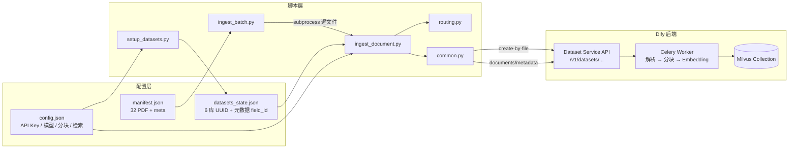
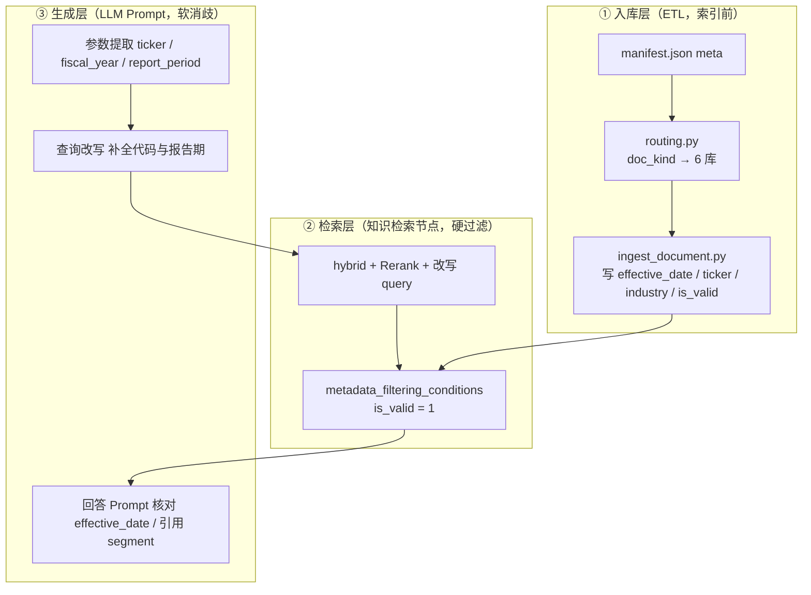

# 案例 1.1 百万级投研知识库：Weaviate → Milvus 迁移指南

> 本文档从 [dify-banking-interview-cases.md](./dify-banking-interview-cases.md) **案例 1.1** 提炼，给出可执行的 **修改点清单** 与 **分阶段步骤**，面向私有化 Dify（v1.10+）将 PoC 默认 Weaviate 切换为 **Milvus 生产底座**。  
> 相关背景：[RAG 向量存储架构](./dify-rag-vector-storage-architecture.md)、[多应用承载](./dify-multi-app-platform.md)。

---

## 1. 场景与目标

### 1.1 现状（PoC）

| 项 | 现状 |
|---|---|
| 向量库 | Docker 默认 `VECTOR_STORE=weaviate` |
| 规模 | 单 Dataset「投研大一统库」约 **120 万 segment** |
| 检索 | `semantic_search` 纯向量，无 Rerank |
| 症状 | P99 1.2–1.5s；Recall@5 ≈ 37%；废止政策引用投诉 ≈ 22% |

### 1.2 目标（生产）

| 指标 | 目标 |
|---|---|
| P99 检索延迟 | **≤ 400ms**（拆库后单库检索） |
| Recall@5 | **≥ 90%**（hybrid + Rerank + 元数据） |
| 幻觉相关投诉 | **< 3%** |
| 增量索引 | 子域更新 **≤ 90s 级**（非全库 4h） |

### 1.3 关键结论（避免过度归因）

- **Milvus 是底座**：解决规模、存算分离、中文 BM25、集群扩展。
- **Recall 主要靠**：`hybrid_search` + Rerank + 元数据过滤 + 查询改写。
- **P99 主要靠**：**按业务线拆 6 个 Dataset**（单 Collection ≤ 50 万 segment）。
- **文档解析靠 Unstructured（入库上游）**：投研素材以 **财报 PDF、研报、监管 Word/PPT** 为主；内置 `pypdfium2` 按页抽纯文本，面对 **跨页表格、双栏排版、扫描公告** 时易出现列错位、数字与标题分离、正文混页眉页脚——segment 质量差会表现为「明明库里有却召不回」「引用的数字/表格不对」。Unstructured 通过 **版面分析 + OCR + 元素级分块** 提升入库文本质量，**间接** 改善 Recall 与幻觉；**不能**替代 hybrid/Rerank/元数据过滤，也 **不直接降低** 检索 P99（P99 仍看拆库与 ANN）。主线 v1.10+ 下 `.pdf` 仍走内置解析，PDF 收益须 **二次开发** 接入 Unstructured API（见 §2.4）。
- **无法原地迁移**：Weaviate Collection **不能**直接迁到 Milvus hybrid；须 **先改 env → 新建 Dataset → 按子域重建索引**。

---

## 2. 修改点总览

### 2.1 基础设施层（Docker / Milvus）

| # | 修改点 | 原值（PoC） | 新值（生产） | 说明 |
|---|---|---|---|---|
| 1 | 向量库类型 | `VECTOR_STORE=weaviate` | `VECTOR_STORE=milvus` | 触发 `MilvusVectorFactory` |
| 2 | Compose Profile | `weaviate` | `milvus` | `COMPOSE_PROFILES` 含 `${VECTOR_STORE}` 时自动切换 |
| 3 | Milvus 连接 | `WEAVIATE_ENDPOINT=...` | `MILVUS_URI=...` | 见 §3.1 URI 说明 |
| 4 | 混合全文 | 无 / Weaviate 原生 BM25 | `MILVUS_ENABLE_HYBRID_SEARCH=true` | **须 Milvus ≥ 2.5**；建库前生效 |
| 5 | 中文分词 | `WEAVIATE_TOKENIZATION=word` | `MILVUS_ANALYZER_PARAMS={"type":"chinese"}` | 投研中文 query 关键词命中 |
| 6 | Milvus 组件 | 单容器 Weaviate | `milvus-standalone` + **etcd** + **MinIO** | 镜像 `milvusdb/milvus:v2.6.3` |
| 7 | 数据卷 | `volumes/weaviate` | `volumes/milvus/{etcd,minio,milvus}` | 存算分离 |

**源码锚点**：`api/configs/middleware/vdb/milvus_config.py`、`api/providers/vdb/vdb-milvus/src/dify_vdb_milvus/milvus_vector.py`

### 2.2 知识库架构层（Dataset 拆分）

| # | 修改点 | 原值 | 新值 | 说明 |
|---|---|---|---|---|
| 8 | Dataset 数量 | 1 个「大一统库」 | **6 个子域库** | 1 Dataset = 1 Milvus Collection |
| 9 | 单库规模 | ~120 万 segment | 最大 ~38 万，建议 **20–50 万** | 控制 ANN P99 |
| 10 | Embedding | 已有 bge-m3 | **6 库统一 bge-m3** | 跨库 Rerank 前提 |
| 11 | 权限 | 全团队可见 | `internal` 库 → `partial_members` | 敏感内评隔离 |
| 12 | 入库路由 | 手工上传到单库 | ETL `doc_kind` → `dataset_id` 规则 | 确定性、可审计 |

**6 库示例**（合计 ~120 万 segment）：

| Dataset | 名称 | 规模 | 更新频率 |
|---|---|---|---|
| `ds-*-macro` | 宏观策略库 | ~15 万 | 周更 |
| `ds-*-industry` | 行业研究库 | ~22 万 | 周更 |
| `ds-*-equity` | 个股研报库 | ~38 万 | 日更 |
| `ds-*-filings` | 财报公告库 | ~28 万 | 日更 |
| `ds-*-regulation` | 监管政策库 | ~12 万 | 事件驱动 |
| `ds-*-internal` | 内部研究库 | ~5 万 | 月更 |

### 2.3 检索配置层（Dataset retrieval_model）

| # | 修改点 | 原值 | 新值 | 解决症状 |
|---|---|---|---|---|
| 13 | 检索模式 | `semantic_search` | `hybrid_search` | 数字/年份/文号漏召回 |
| 14 | Rerank | 未启用 | `bge-reranker-v2-m3` | 语义相近错误年份被压下去 |
| 15 | Top K | 默认 4 | `top_k=15` | 候选池扩大供 Rerank |
| 16 | 分数阈值 | 无 | `score_threshold=0.52`（Rerank 后） | 低质量 chunk 过滤 |

### 2.4 文档解析 / ETL 层（Unstructured）

| # | 修改点 | 原值（PoC） | 新值（生产） | 说明 |
|---|---|---|---|---|
| 17 | ETL 引擎 | `ETL_TYPE=dify`（内置解析） | `ETL_TYPE=Unstructured` | 启用 Unstructured API 解析管道 |
| 18 | Unstructured 服务 | 未部署 | Compose profile **`unstructured`** | 镜像 `unstructured-io/unstructured-api:latest` |
| 19 | Unstructured 地址 | 无 | `UNSTRUCTURED_API_URL=http://unstructured:8000` | api/worker 容器内访问 |
| 20 | **PDF 解析（投研重点）** | `pypdfium2` 按页抽纯文本 | **Unstructured `partition_via_api`**（建议二次开发接入） | 财报/公告 PDF 的表格与版式 |

**为何投研场景要把 PDF 纳入 Unstructured？**

| 痛点（内置 `PdfExtractor`） | Unstructured 收益 |
|---|---|
| 年报/10-K **跨页表格、双栏排版** 按页抽文本 → 列错位、数字与标题分离 | 版面分析（layout）按 **Table / Title / NarrativeText** 元素输出，表格结构可保留 |
| 扫描版公告、传真 PDF **无文本层** → 抽取为空或乱码 | `hi_res` 策略内置 OCR，可处理扫描件 |
| 页眉页脚、免责声明与正文混在同一 chunk | 元素级过滤 + `chunk_by_title`，与 §2.5 **650 token** 分段更契合 |
| `.doc/.ppt/.msg` 走 Unstructured、**.pdf 仍走另一套逻辑** → ETL 分支多、质量不一致 | 统一走 Unstructured API，运维与质量验收口径一致 |

> **源码现状（v1.10+）**：`ETL_TYPE=Unstructured` 时，`.doc/.ppt/.msg/.eml` 等已走 Unstructured；**`.pdf` 仍调用内置 `PdfExtractor`（pypdfium2）**（`api/core/rag/extractor/extract_processor.py`）。  
> 投研 PoC 若样本以 PDF 为主（见 [docs/data/README.md](../../data/README.md)），建议 **二次开发** 将 PDF 分支改为 `partition_via_api(filename=..., api_url=UNSTRUCTURED_API_URL)`，或跟进 Dify 主线后续版本。  
> Docker 配置步骤见 [dify-docker-database-operations.md §5.5](./dify-docker-database-operations.md#55-unstructured-文档解析etl)。

**源码锚点**：`api/core/rag/extractor/extract_processor.py`、`api/core/rag/extractor/pdf_extractor.py`

### 2.5 分块与元数据层

| # | 修改点 | 原值 | 新值 | 解决症状 |
|---|---|---|---|---|
| 21 | 分块 | 固定 1000 token | `max_tokens=650`, `overlap=120` | 研报段落边界更准 |
| 22 | 元数据 Schema | 无 | `doc_kind`, `effective_date`, `ticker`, `industry`, `is_valid` | 废止政策过滤、按标的检索 |
| 23 | 检索过滤 | 无 | 工作流 `is_valid=1` manual 过滤 | 幻觉 22% → <3% |

### 2.6 应用与工作流层

| # | 修改点 | 原值 | 新值 |
|---|---|---|---|
| 24 | 知识检索节点 | 单库 | **1 节点绑定 6 库**，`retrieval_mode: multiple` |
| 25 | 查询改写 | 无 | 前置 LLM 改写（机构名 + 报告期 + 指标） |
| 26 | 生成 Prompt | 自由发挥 | 强制引用 segment_id，资料不足时明确说明 |

### 2.7 Celery 队列层（索引与对话隔离）

| # | 修改点 | 原值 | 新值 |
|---|---|---|---|
| 27 | Worker 队列 | 索引与对话共队列 | `CELERY_WORKER_QUEUES=dataset,priority_dataset` 专用索引 Worker |
| 28 | 对话队列 | 混用 | `workflow_based_app_execution` 独立 Worker |
| 29 | 租户隔离 | 无 | `TenantIsolatedTaskQueue` + `TENANT_ISOLATED_TASK_CONCURRENCY=1` |

---

## 3. 分阶段实施步骤

### Phase 0：规划与前置检查（1–2 天）

**Step 0.1 盘点 PoC 资产**

- [ ] 统计当前 Dataset 数量、segment 总数、文档类型分布
- [ ] 导出现有 `doc_kind` / `secret_level` / CMS 字段，用于 ETL 路由表
- [ ] 确认 Embedding 模型（6 库须一致，推荐 `bge-m3`）
- [ ] 确认 Rerank 模型已部署（如 Xinference 上的 `bge-reranker-v2-m3`）

**Step 0.2 子域拆分 Workshop**

- [ ] 投研 + 合规 + 架构共同确认 6 库边界（无交叉、无遗漏）
- [ ] 输出路由表 Excel/YAML，经签字归档
- [ ] 命名规范：`{法人缩写}-research-{子域}`

**Step 0.3 确认 Milvus 版本**

- [ ] Milvus **≥ 2.5.0**（hybrid BM25 稀疏向量）
- [ ] Docker 镜像：`milvusdb/milvus:v2.6.3`（Compose profile `milvus`）

---

### Phase 1：基础设施切换 Milvus

**Step 1.1 修改 `docker/.env`**

```env
# 向量库切换
VECTOR_STORE=milvus

# Milvus 连接（二选一，见下方说明）
MILVUS_URI=http://host.docker.internal:19530
# 若 api/worker 已加入 milvus 网络，可用：
# MILVUS_URI=http://milvus-standalone:19530

# 混合全文（建库前必须生效）
MILVUS_ENABLE_HYBRID_SEARCH=true
MILVUS_ANALYZER_PARAMS={"type":"chinese"}

# 可选：认证（生产建议开启）
# MILVUS_USER=...
# MILVUS_PASSWORD=...
```

> **URI 说明**：当前 Compose 中 `api`/`worker` 在 `default` 网络，Milvus 在 `milvus` 网络；官方 `shared.env.example` 默认 `http://host.docker.internal:19530`（经宿主机映射端口 19530）。私有化 K8s 部署则填集群 Service 地址。

**Step 1.2 启动 Milvus 栈**

```bash
cd docker

# VECTOR_STORE=milvus 时 COMPOSE_PROFILES 会自动包含 milvus profile
docker compose up -d

# 或显式指定 profile
docker compose --profile milvus up -d
```

启动组件：

| 容器 | 作用 |
|---|---|
| `milvus-etcd` | 元数据 |
| `milvus-minio` | 对象存储（向量段） |
| `milvus-standalone` | 查询 + 索引（端口 19530） |

**Step 1.3 启用 Unstructured（ETL + PDF 优化底座）**

在 `docker/.env` 与 `docker/envs/core-services/shared.env` 中增加（完整说明见 [dify-docker-database-operations.md §5.5](./dify-docker-database-operations.md#55-unstructured-文档解析etl)）：

```env
ETL_TYPE=Unstructured
UNSTRUCTURED_API_URL=http://unstructured:8000
# UNSTRUCTURED_API_KEY=          # 自建 Unstructured 需 API Key 时填写

# COMPOSE_PROFILES 需包含 unstructured（可与 milvus 并存）
# 例：COMPOSE_PROFILES=...,milvus,unstructured
```

```bash
cd docker
docker compose --profile unstructured up -d unstructured
docker compose up -d api worker worker_beat   # 须重建/重启使 ETL env 注入 worker

# 从 worker 容器验证 Unstructured 可达
docker exec docker-worker-1 python -c \
  "import urllib.request; print(urllib.request.urlopen('http://unstructured:8000/healthcheck').read())"
```

> PDF 在主线代码中仍走 `PdfExtractor`；Unstructured 容器就绪后，按 §2.4 说明通过二次开发将 PDF 路由至 Unstructured API，方可发挥表格/OCR 优势。

**Step 1.4 健康检查**

```bash
# Milvus 健康
curl -f http://localhost:9091/healthz

# 重启 Dify 核心服务使 env 生效（若 Step 1.3 已 up -d 可跳过）
docker compose restart api worker worker_beat
```

**Step 1.5 验证 Dify 加载 Milvus 工厂**

- 查看 api 启动日志无 `MilvusVector` 连接错误
- 新建测试 Dataset 上传 1 份文档，确认 Milvus 中出现 Collection `Vector_index_{dataset_id}_Node`

> **⚠️ 重要**：`MILVUS_ENABLE_HYBRID_SEARCH` 必须在 **创建 Collection 之前** 生效。旧 PoC Weaviate 上的库 **不会** 自动变成 Milvus hybrid 库。

---

### Phase 2：创建 6 个子域 Dataset

**Step 2.1 Console 或 API 批量创建**

控制台：**知识库 → 创建知识库**（重复 6 次），统一配置：

- 索引方式：**高质量**
- Embedding：**bge-m3**（6 库一致）
- 检索：**混合检索 + Rerank**

Service API 示例：

```bash
curl -X POST "https://dify.example.com/v1/datasets" \
  -H "Authorization: Bearer ${DATASET_API_KEY}" \
  -H "Content-Type: application/json" \
  -d '{
    "name": "宏观策略库",
    "description": "华东投研-宏观与策略研报",
    "indexing_technique": "high_quality",
    "embedding_model": "bge-m3",
    "embedding_model_provider": "langgenius/xinference",
    "permission": "all_team_members",
    "retrieval_model": {
      "search_method": "hybrid_search",
      "reranking_enable": true,
      "reranking_mode": "reranking_model",
      "reranking_model": {
        "reranking_provider_name": "langgenius/xinference",
        "reranking_model_name": "bge-reranker-v2-m3"
      },
      "top_k": 15,
      "score_threshold_enabled": true,
      "score_threshold": 0.52
    }
  }'
```

对 `industry / equity / filings / regulation / internal` 重复调用，记录返回 UUID。

**Step 2.2 写入 ETL 路由表**

```python
DATASET_ROUTING = {
    "macro": "uuid-macro",
    "industry": "uuid-industry",
    "equity": "uuid-equity",
    "filings": "uuid-filings",
    "regulation": "uuid-regulation",
    "internal": "uuid-internal",
}

def pick_dataset(doc: dict) -> str:
    if doc.get("secret_level") == "internal":
        return DATASET_ROUTING["internal"]
    kind = doc.get("doc_kind", "")
    return DATASET_ROUTING[{
        "macro_report": "macro",
        "industry_report": "industry",
        "equity_report": "equity",
        "filing": "filings",
        "regulation": "regulation",
    }.get(kind, "equity")]
```

**Step 2.3 声明元数据 Schema（每个库）**

```bash
# 对每个 dataset_id 执行
curl -X POST ".../v1/datasets/{dataset_id}/metadata" \
  -d '{"type": "string", "name": "doc_kind"}'
curl -X POST ".../v1/datasets/{dataset_id}/metadata" \
  -d '{"type": "time", "name": "effective_date"}'
curl -X POST ".../v1/datasets/{dataset_id}/metadata" \
  -d '{"type": "string", "name": "ticker"}'
curl -X POST ".../v1/datasets/{dataset_id}/metadata" \
  -d '{"type": "string", "name": "industry"}'
curl -X POST ".../v1/datasets/{dataset_id}/metadata" \
  -d '{"type": "number", "name": "is_valid"}'
```

---

### Phase 3：数据迁移与重建索引

**Step 3.1 停用 PoC 大一统库**

- [ ] 应用/workflow 解绑旧 Dataset `投研大一统库`
- [ ] 保留 PoC 库只读一段时间（回滚窗口），**不要**在同一库上改 VECTOR_STORE

**Step 3.2 ETL 全量/增量入库**

分块规则（上传时 `process_rule`）：

```json
{
  "mode": "custom",
  "rules": {
    "pre_processing_rules": [
      { "id": "remove_extra_spaces", "enabled": true }
    ],
    "segmentation": {
      "separator": "\n\n",
      "max_tokens": 650,
      "chunk_overlap": 120
    }
  }
}
```

入库脚本核心逻辑：

```python
def ingest(pdf_path: str, doc_meta: dict) -> str:
    dataset_id = pick_dataset(doc_meta)
    # POST /v1/datasets/{dataset_id}/document/create_by_file
    # POST /v1/datasets/{dataset_id}/documents/metadata
    ...
```

**Step 3.3 索引顺序建议**

| 优先级 | 库 | 原因 |
|---|---|---|
| P0 | `regulation` | 废止政策幻觉投诉最高 |
| P1 | `equity` + `filings` | 日更、查询量最大 |
| P2 | `macro` + `industry` | 周更 |
| P3 | `internal` | 量小、权限敏感 |

**Step 3.4 验证 Milvus Collection 结构**

新建库开启 hybrid 后，Collection 应包含：

| 字段 | 索引 | 用途 |
|---|---|---|
| `vector` | HNSW（IP, M=8, efConstruction=64） | 语义 ANN |
| `sparse_vector` | AUTOINDEX + BM25 | 全文混合检索 |
| `content` | analyzer=chinese | BM25 源文本 |

若 Collection 在 **未开 hybrid 时创建**，须 **删库重建**（Dify Console 删除知识库或 Milvus 侧 drop collection）。

---

### Phase 4：检索与应用配置

**Step 4.1 各库 Hit Testing**

```bash
curl -X POST ".../v1/datasets/{dataset_id}/hit-testing" \
  -H "Content-Type: application/json" \
  -d '{
    "query": "2024年三季度招商银行净利润同比增速",
    "retrieval_model": {
      "search_method": "hybrid_search",
      "reranking_enable": true,
      "reranking_mode": "reranking_model",
      "reranking_model": {
        "reranking_provider_name": "langgenius/xinference",
        "reranking_model_name": "bge-reranker-v2-m3"
      },
      "top_k": 15,
      "score_threshold_enabled": true,
      "score_threshold": 0.52
    }
  }'
```

**Step 4.2 工作流：多库绑定 + 元数据过滤**

```json
{
  "type": "knowledge-retrieval",
  "data": {
    "query_variable_selector": ["rewrite_llm", "text"],
    "dataset_ids": [
      "uuid-macro", "uuid-industry", "uuid-equity",
      "uuid-filings", "uuid-regulation"
    ],
    "retrieval_mode": "multiple",
    "multiple_retrieval_config": {
      "top_k": 15,
      "score_threshold": 0.52,
      "reranking_enable": true,
      "reranking_mode": "reranking_model",
      "reranking_model": {
        "provider": "langgenius/xinference",
        "model": "bge-reranker-v2-m3"
      }
    },
    "metadata_filtering_mode": "manual",
    "metadata_filtering_conditions": {
      "logical_operator": "and",
      "conditions": [{ "name": "is_valid", "comparison_operator": "=", "value": 1 }]
    }
  }
}
```

**Step 4.3 工作流：查询改写 → 检索 → 生成**

```
用户 query → LLM 改写（补机构名/报告期/指标）→ 知识检索（hybrid+rerank+filter）→ LLM 生成（强制引用 segment_id）
```

**Step 4.4 低延迟场景（可选）**

Question Classifier 按意图路由单库/双库，综合问答仍用方式 A 多库 `multiple`。

---

### Phase 5：Celery 队列隔离

**Step 5.1 索引专用 Worker**

```env
# worker 容器 env
CELERY_WORKER_QUEUES=dataset,priority_dataset
TENANT_ISOLATED_TASK_CONCURRENCY=1
```

**Step 5.2 对话专用 Worker**

```env
CELERY_WORKER_QUEUES=workflow_based_app_execution,mail,ops_trace
```

**Step 5.3 验收**

- [ ] 大批量入库时对话 P99 无明显上升
- [ ] 监管库增量更新仅触发 `regulation` 库索引（~90s），不阻塞其他库

---

### Phase 6：验收与上线

**Step 6.1 量化验收**

| 指标 | 验收方法 | 目标 |
|---|---|---|
| Recall@5 | 100 条标注 query Hit Testing | ≥ 90% |
| P99 延迟 | 压测 / APM | ≤ 400ms |
| 废止引用 | 抽检 + 业务投诉 | < 3% |
| 增量索引 | 监管文件单库更新 | ≤ 90s |

**Step 6.2 指标归因（汇报用）**

| 指标 | 主要贡献 | 次要贡献 |
|---|---|---|
| P99 1320→380ms | **拆 Dataset** + Milvus 独立部署 | HNSW 默认参数 |
| Recall@5 37→91% | **hybrid_search + Rerank** | Milvus BM25 + 中文 analyzer |
| 幻觉 22→<3% | **元数据 `is_valid` 过滤** | Rerank 压错误年份 |
| 索引 4h→90s | **拆库 + dataset Worker 隔离** | Milvus 1000 条/批 insert |
| 财报 PDF 抽取质量 | **Unstructured 版面/OCR**（PDF 二次开发接入） | 650 token 分块 + 元数据 |

**Step 6.3 下线 PoC**

- [ ] 确认新 6 库稳定运行 ≥ 2 周
- [ ] 备份后删除 Weaviate 旧 Collection / 停止 weaviate profile
- [ ] 更新运维文档与监控（Milvus 9091 健康、MinIO 磁盘）

---

## 4. 配置对照速查

### 4.1 环境变量：Weaviate → Milvus

| 变量 | Weaviate（PoC） | Milvus（生产） |
|---|---|---|
| `VECTOR_STORE` | `weaviate` | `milvus` |
| 连接 | `WEAVIATE_ENDPOINT=http://weaviate:8080` | `MILVUS_URI=http://host.docker.internal:19530` |
| 混合检索 | 开箱 BM25（text 字段） | `MILVUS_ENABLE_HYBRID_SEARCH=true` |
| 中文分词 | `WEAVIATE_TOKENIZATION=word` | `MILVUS_ANALYZER_PARAMS={"type":"chinese"}` |
| 批量写入 | 100 条/批 | 1000 条/批（Dify 固定） |
| Dense 索引 | 自提供向量 | HNSW IP, M=8, efConstruction=64 |

### 4.2 Dify 最小 Milvus env（复制即用）

```env
VECTOR_STORE=milvus
MILVUS_URI=http://host.docker.internal:19530
MILVUS_ENABLE_HYBRID_SEARCH=true
MILVUS_ANALYZER_PARAMS={"type":"chinese"}
```

### 4.3 Milvus Collection 自动索引（源码默认）

```python
# Dense
index_params = {"metric_type": "IP", "index_type": "HNSW", "params": {"M": 8, "efConstruction": 64}}
# Hybrid 额外：sparse_vector + AUTOINDEX + BM25 Function
```

源码：`api/providers/vdb/vdb-milvus/src/dify_vdb_milvus/milvus_vector.py`

---

## 5. 风险与回滚

| 风险 | 缓解 |
|---|---|
| hybrid env 晚于建库 | 删 Dataset 重建，或 Milvus drop collection 后重索引 |
| 6 库 Embedding 不一致 | 创建前统一配置；不一致时改用 Rerank 模型模式 |
| ETL 误路由到错误库 | 规则优先 + 低置信 LLM 兜底 + 人工复核队列 |
| api 连不上 Milvus | 检查 `MILVUS_URI`、19530 端口映射、防火墙 |
| 全量重建耗时长 | 按 Phase 3 优先级分批；索引 Worker 与对话隔离 |

**回滚**：保留 PoC Weaviate 卷与 Dataset 只读；应用切回旧 `dataset_id` + `VECTOR_STORE=weaviate`（须重启 api/worker）。

---

## 6. 检查清单（Go-Live）

### 基础设施

- [ ] `VECTOR_STORE=milvus`，Milvus 三组件 healthy
- [ ] `MILVUS_ENABLE_HYBRID_SEARCH=true` 在 **任何 Dataset 创建前** 已生效
- [ ] `MILVUS_ANALYZER_PARAMS={"type":"chinese"}` 已配置
- [ ] `MILVUS_USER` / `MILVUS_PASSWORD` 与 Milvus 认证一致（Attu 用 `root`/`Milvus`）
- [ ] `ETL_TYPE=Unstructured`，`unstructured` 容器 healthy，worker 内 `UNSTRUCTURED_API_URL` 可达
- [ ] （可选）PDF 已二次开发接入 Unstructured API（§2.4 #20）

### 知识库

- [ ] 6 个子域 Dataset 已创建，UUID 写入 ETL 路由表
- [ ] 6 库 Embedding 均为 bge-m3，retrieval_model 均为 hybrid + Rerank
- [ ] 元数据 Schema（`is_valid`, `effective_date`）已声明
- [ ] 120 万文档已按规则入库完毕，Milvus 6 个 Collection 规模符合预期

### 应用

- [ ] Workflow 知识检索节点绑定多库 + `retrieval_mode: multiple`（或已部署 §7.4 智能体）
- [ ] 元数据过滤 `is_valid=1` 已启用
- [ ] 查询改写 / 参数提取 / 意图路由 / 合规质检节点已接入
- [ ] Hit Testing 100 条 query Recall@5 ≥ 90%

### 运维

- [ ] 索引 Worker 与对话 Worker 队列已隔离
- [ ] Milvus / MinIO 磁盘监控已接入
- [ ] PoC Weaviate 已计划下线时间

---

## 7. 二次开发：Hybrid + Rerank + 元数据（可执行脚本）

> 基础设施（Milvus hybrid）已在 `docker/.env` 配置好后，用 `scripts/banking-research/` 一键完成 **Dataset 创建 → 元数据 Schema → 入库 → Hit Test → 工作流 DSL**。  
> **PoC 样本 PDF 与逐步导入说明**：见 [docs/data/README.md](../../data/README.md)（含 `manifest.json` 批量入库）。  
> **批量脚本框架**：§7.3.1 · **元数据字段与工作流用法**：§7.5 · **入库故障排查（面试）**：§7.9 · **面试速记**：§8

### 7.1 前置条件

| 项 | 要求 |
|---|---|
| Milvus | `VECTOR_STORE=milvus`，`MILVUS_ENABLE_HYBRID_SEARCH=true` **且已在建库前生效** |
| 模型 | Dify 控制台已配置 Embedding + Rerank + **LLM**（如通义 `multimodal-embedding-v1` + `qwen3-rerank` + `qwen-plus`） |
| API Key | 知识库 Service API Key（Settings → API Keys → Dataset API） |
| Console 登录 | 部署智能体应用需 `console_email` / `console_password`（见 §7.2） |

### 7.2 配置

```bash
cd scripts/banking-research
cp config.example.json config.json
# 编辑 config.json：填入 dataset_api_key、console 登录、模型 provider 等
```

`config.json` 关键字段：

| 字段 | 用途 |
|---|---|
| `dataset_api_key` | 知识库 Service API |
| `llm_model` / `llm_provider` | 工作流 LLM 节点（查询改写 / 回答） |
| `embedding_model` / `reranking_*` | 6 库索引与检索 |
| `console_email` / `console_password` | `deploy_agent_app.py` 导入发布 |
| `console_api_url` | 默认 `http://localhost/console/api` |

`retrieval` 段即 **hybrid + Rerank + 阈值** 的默认配置：

```json
{
  "retrieval": {
    "search_method": "hybrid_search",
    "top_k": 15,
    "score_threshold_enabled": true,
    "score_threshold": 0.52,
    "reranking_enable": true,
    "reranking_mode": "reranking_model"
  }
}
```

### 7.3 执行步骤

```bash
# Step 1: 创建 6 子域库 + 声明元数据 Schema（doc_kind / effective_date / ticker / industry / is_valid）
uv run --project api python scripts/banking-research/setup_datasets.py

# Step 2: ETL 入库（自动路由 doc_kind → dataset_id，650 token 分块）
# 方式 A：批量导入 docs/data 下 32 个 PDF（推荐）
uv run --project api python scripts/banking-research/ingest_batch.py

# 方式 B：单文件
uv run --project api python scripts/banking-research/ingest_document.py report.pdf \
  --meta '{"doc_kind":"regulation","effective_date":"2026-04-02","industry":"AI监管","is_valid":1}'

# Step 3: Hit Testing 验收 hybrid + Rerank
uv run --project api python scripts/banking-research/hit_test.py
uv run --project api python scripts/banking-research/hit_test.py --dataset regulation --top 5

# Step 4: 生成并部署「投研知识库智能体」生产应用（推荐）
uv run --project api python scripts/banking-research/generate_agent_app.py
uv run --project api python scripts/banking-research/deploy_agent_app.py
# 打开 config/app_state.json 中的 console_url，在 Studio 运行 / 发布 API

# Step 4（备选）: 简易工作流 DSL（单路检索，无意图路由）
uv run --project api python scripts/banking-research/generate_workflow.py
# Console -> Import DSL -> dsl/banking-research-rag.generated.yml
```

### 7.3.1 批量入库脚本框架（ETL 流水线）

> **面试一句话**：`manifest.json` 描述「文件 + 元数据」→ `ingest_batch.py` 逐条调度 → `ingest_document.py` 经 Dataset API 上传并写元数据 → **Celery Worker 异步**完成解析/分块/Embedding/写 Milvus；脚本只负责 **提交任务**，索引完成度看 `indexing_status`。

#### 整体架构



#### 分层职责

| 层级 | 文件 | 职责 |
|---|---|---|
| **清单** | `docs/data/manifest.json` | 32 个 PoC PDF 的相对路径 + 元数据（`doc_kind` / `effective_date` / `ticker` / `industry` / `is_valid`） |
| **静态配置** | `scripts/banking-research/config.json` | `dataset_api_key`、Embedding/Rerank 模型名、hybrid 检索参数、650/120 分块规则、6 库定义 |
| **运行态** | `config/datasets_state.json` | `setup_datasets.py` 生成：`routing`（子域 key → UUID）、`metadata_field_ids`（字段名 → Schema UUID） |
| **建库** | `setup_datasets.py` | 一次性创建 6 个子域 Dataset + 声明元数据 Schema + 写入 `datasets_state.json` |
| **路由** | `routing.py` | `doc_kind` / `secret_level` → 子域 key（如 `filing` → `filings`，`internal` → `internal`） |
| **公共客户端** | `common.py` | `DifyDatasetClient` 封装 HTTP；`build_process_rule` / `build_retrieval_model` |
| **单文件入库** | `ingest_document.py` | 路由 → 上传 PDF → 写文档级元数据；打印 `batch` 供追踪索引 |
| **批量调度** | `ingest_batch.py` | 读 manifest，**顺序** subprocess 调用 `ingest_document.py`（非并行，避免 Embedding 限流） |
| **验收** | `hit_test.py` / `audit_kb.py` | Hit Test 验证 hybrid + Rerank；`audit_kb.py` 用 `verify_demo_queries.json` 批量打分 |

#### 单文件入库时序（`ingest_document.py`）

```
1. load_config()          → 读 config.json，校验 dataset_api_key 非占位符
2. load_state()           → 读 datasets_state.json（须先 setup_datasets）
3. pick_dataset_id(meta)  → routing.py 按 doc_kind 选目标库 UUID
4. create_document_by_file
     POST /v1/datasets/{id}/document/create-by-file
     body: indexing_technique=high_quality + process_rule(650/120)
     → 返回 document_id + batch（索引异步进行）
5. update_documents_metadata
     POST /v1/datasets/{id}/documents/metadata
     → 写入 effective_date / ticker / is_valid 等（doc_kind 仅用于路由，不入库）
6. 控制台或 API 查 indexing-status / documents.indexing_status
```

#### manifest 条目格式

```json
{
  "file": "filings/600519_贵州茅台_2025年年度报告摘要.pdf",
  "meta": {
    "doc_kind": "filing",
    "effective_date": "2026-04-17",
    "ticker": "600519",
    "industry": "白酒",
    "is_valid": 1
  }
}
```

| 字段 | 入库行为 |
|---|---|
| `doc_kind` | **仅路由**（`routing.py`），不写入 Milvus 元数据 |
| `effective_date` | 写入 Dataset Schema（政策生效日 / 财报披露日） |
| `ticker` / `industry` / `is_valid` | 写入 Schema；工作流检索层强制 `is_valid=1` |

#### 批量命令与 dry-run

```bash
# 预览 32 条命令，不实际上传
uv run --project api python scripts/banking-research/ingest_batch.py --dry-run

# 正式批量入库（顺序执行，单文件失败不中断后续，最后汇总 exit code）
uv run --project api python scripts/banking-research/ingest_batch.py

# 单文件补传（跳过 manifest，适合重试 error 文档）
uv run --project api python scripts/banking-research/ingest_document.py \
  docs/data/filings/600519_贵州茅台_2025年年度报告.pdf \
  --meta '{"doc_kind":"filing","effective_date":"2026-04-17","ticker":"600519","industry":"白酒","is_valid":1}'
```

#### 索引状态核对

```bash
# Hit Test 批量验收
uv run --project api python scripts/banking-research/audit_kb.py

# PostgreSQL 查各库 indexing_status（Docker 环境）
docker exec docker-db_postgres-1 psql -U postgres -d dify -c "
SELECT indexing_status, count(*) FROM documents GROUP BY indexing_status;
"
```

**面试要点**：脚本 **不负责 Embedding**，只触发 Dify 异步任务；批量失败要分 **「API 提交失败」**（脚本 exit ≠ 0）与 **「Worker 索引失败」**（Console 显示 error，脚本仍可能打印 OK）。

### 7.4 投研知识库智能体（生产应用）

对应 **§1.2 生产目标** 的可运行实现：`scripts/banking-research/dsl/banking-research-agent.generated.yml`。

**工作流（12 节点）**

```
用户输入
  → 参数提取（ticker / fiscal_year / report_period / industry_hint）
  → 查询改写 LLM（写入报告期与公司，适配 hybrid BM25）
  → 意图路由（5 类：监管 / 财报 / 个股 / 宏观行业 / 综合）
  → 分库知识检索（各库 hybrid + Rerank + is_valid=1 元数据过滤）
  → 检索结果汇聚
  → 投研回答 LLM（{{#context#}} 注入检索片段 + 引用 segment_id）
  → 输出（answer + rewrite_query + extracted_ticker）
```

**与 §1.2 指标对应**

| 生产目标 | 应用层实现 |
|---|---|
| Recall@5 ≥ 90% | 分库检索 + hybrid + Rerank + 查询改写；意图路由减少跨库噪声 |
| 幻觉 < 3% | 全库 `is_valid=1` 过滤 + 引用式回答（prompt 强制依据检索片段） |
| P99 ≤ 400ms | 意图路由后 **单/双库** 检索（非 6 库全扫）；宏观行业类绑定 2 库，其余 1 库 |
| 增量索引 ≤ 90s | 由拆库 + Worker 隔离保障（§2.7），应用层无额外开销 |

**提示词规范**：见 `scripts/banking-research/prompts.py`。**用户可见回答仅三章**：`结论摘要` / `依据与数据` / `元数据说明`；资料不足时在结论摘要中直接说明无依据。

**知识库实测清单（2026-07-04，`indexing_status`）**

| 库 | 可检索（completed） | 不可用（error/waiting） |
|---|---|---|
| 宏观 `macro` | 2026Q1货币政策执行报告、宏观中期展望、全球宏观展望 | — |
| 行业 `industry` | CPO深度/趋势、国产算力、英伟达GTC点评 | 白酒中期报告（error） |
| 个股 `equity` | 茅台/新易盛/寒武纪/NVDA 券商点评（含2026Q1） | — |
| 财报 `filings` | 三家 **2026Q1季报**、**2025年报摘要**、业绩说明会 | 三家 **2025年报全文**（waiting/error）、NVDA 10-K（error） |
| 监管 `regulation` | 工信部75号文、AI监管全景解析 | — |

Hit Test 自检：`uv run --project api python scripts/banking-research/audit_kb.py`（当前 **12/12** 通过）。

**「全部无答案」排查（2026-07 已修复）**

| 现象 | 根因 | 修复 |
|---|---|---|
| 检索 trace 有片段，回答仍写「无依据」 | 回答节点 prompt 缺少 `{{#context#}}` | 已写入 `prompts.py` 并重新 deploy |
| 回答节点 trace 正确，最终输出被改写成「无依据」 | **合规质检 LLM 节点**看不到检索片段，用模型常识覆盖初稿 | 已移除合规节点，输出直连「投研回答生成」 |

重新部署：`uv run --project api python scripts/banking-research/generate_agent_app.py && uv run --project api python scripts/banking-research/deploy_agent_app.py --via-docker`

#### 7.4.1 演示输入案例（10 条）

在 Console 打开 `app_state.json` 中的工作流应用，进入 **预览 / 运行** 后逐条输入。案例按 **当前知识库可检索文档** 编写（以 `manifest.json` 为准；索引状态可通过 Dataset 文档列表或 PostgreSQL `documents.indexing_status` 核对）。

> **索引提示（2026-07 实测）**：`600519_贵州茅台_2025年年度报告.pdf` 全文仍为 `waiting/error`，问「2025 年报全文营收/净利润」会正确返回 **「当前知识库未找到足够依据」**；同类未完成的还有 `300502/688256` 2025 年报全文、`NVDA FY2026 10-K` 等。演示 **优先用下表 10 条**；边界行为见表后「案例 A」。

| # | 用户输入（复制即用） | 预期回答要点 | 预期意图 | 主要命中文档（`indexing_status=completed`） |
|---|---|---|---|---|
| 1 | 工信部 75 号文《人工智能科技伦理审查与服务办法》对 AI 服务提供者有哪些科技伦理审查义务？ | 列出办法中的审查环节/义务；每条带 `[segment_id:…]` | ① 监管 | `regulation/工信部75号_人工智能科技伦理审查与服务办法.pdf` |
| 2 | 贵州茅台 600519 **2026 年第一季度报告**里，营收和归母净利润分别是多少？ | 返回 Q1 具体数字；说明 `effective_date=2026-04-24` | ② 财报 | `filings/600519_贵州茅台_2026年第一季度报告.pdf` |
| 3 | 贵州茅台 600519 **2025 年年度报告摘要**里，全年营收和归母净利润分别是多少？ | 从摘要提取 2025 会计年度营收/净利；披露日 2026-04-17 | ② 财报 | `filings/600519_贵州茅台_2025年年度报告摘要.pdf` |
| 4 | 券商对新易盛 300502 **2026Q1** 业绩怎么点评？有无目标价或评级？ | 引用券商点评观点；勿与 2025 年报点评混淆 | ③ 个股 | `equity/300502_新易盛_2026Q1快报点评_山西证券.pdf` |
| 5 | 寒武纪 688256 **2026Q1 季报**的营收和毛利率是多少？ | Q1 单期数据；可与 2025 年报区分 | ② 财报 | `filings/688256_寒武纪_2026年第一季度报告.pdf` |
| 6 | **2026Q1 中国货币政策执行报告**对流动性、信贷投放有哪些主要表述？ | 宏观政策表述分点引用 | ④ 宏观行业 | `macro/2026Q1_中国货币政策执行报告.pdf` |
| 7 | 2026 年 **光模块 CPO** 行业有哪些技术趋势与竞争格局变化？ | 行业深度要点；可命中多份 CPO 报告 | ④ 宏观行业 | `industry/2026_光互联CPO行业深度_通信.pdf`、`industry/2026_光模块行业CPO趋势_IDC.pdf` |
| 8 | 东方证券《**国产算力趋势不可逆**》的核心投资逻辑和产业链机会是什么？ | 行业逻辑 + 标的链条 | ④ 宏观行业 | `industry/2026_国产算力趋势不可逆_东方证券.pdf` |
| 9 | 《中国人工智能监管法规全景解析》中，**训练数据合规**与算法备案有哪些要求？ | 标注为「解读」；区分原文与解读 | ① 监管 | `regulation/2026_中国人工智能监管法规全景解析_汉坤.pdf` |
| 10 | 对比 **600519、300502、688256** 三家公司 **2026Q1** 业绩，哪家营收增速更快？ | 跨三标的表格/分点对比；多 `[segment_id:…]` | ⑤ 综合 | 三家 `filings/*2026年第一季度报告.pdf` + 可选 `equity/*2026Q1*` 点评 |

**演示技巧**

1. **先看 trace，再看回答**：确认 `ticker` / `report_period` 写入改写 query，意图路由命中预期分支。
2. **优先案例 2、3、10**：覆盖单期财报、摘要财报、跨标的综合三类典型场景。
3. **验收引用**：事实性数字应带 `[segment_id:…]`；「资料不足」类结论需说明缺失维度（见案例 A）。
4. **索引未完成时**：若某 PDF 为 `error/waiting`，Hit Test 无结果属正常；可在 Console 对该文档 **重试索引** 后再测。

**边界案例 A：问 2025 年报「全文」而库中仅有摘要或尚未索引**

| 输入 | 预期行为 |
|---|---|
| 贵州茅台 600519，2025 年全年营收和归母净利润分别是多少？ | **不臆造数字**；结论摘要直接说明无依据；元数据说明补充缺失维度 |

典型输出结构（节选，仅三章）：

```text
### 结论摘要
当前知识库未找到足够依据，无法回答该问题。

### 依据与数据
无匹配检索片段。

### 元数据说明
未检索到 ticker=600519、report_period=2025年年度报告 的有效片段；全文 PDF 可能尚未索引完成。
```

改写 query 示例：`贵州茅台 600519 2025年报 营收 归母净利润`；提取参数：`ticker=600519`。

**边界案例 B（可选）**：「宁德时代 2025 年报」——库中无该 `ticker`，应直接声明资料不足。

**快速入口**（部署成功后）：

```text
http://localhost/app/<app_id>/workflow
# app_id 见 scripts/banking-research/config/app_state.json
```

**常见报错：`ParameterExtractorNodeData query.0`**

旧版 DSL 把参数提取节点的 `query` 写成了嵌套数组 `[['node_id','query']]`，当前 Dify 需要扁平格式 `['node_id','query']`。修复：

```bash
uv run --project api python scripts/banking-research/patch_workflow_query.py
# 或重新部署（会自动 patch 旧应用）
uv run --project api python scripts/banking-research/deploy_agent_app.py --via-docker
```

请使用 `app_state.json` 中的 **最新 app_id** 打开应用；早期导入的 `6d977ab0-...` 需 patch 后才能运行。

### 7.5 元数据字段详解与工作流用法

> Dify 中元数据是 **文档级（document-level）** 属性：入库时由 ETL 写入，该文档切出的 **所有 segment 自动继承**。工作流不能给单个 segment 单独打标，只能 **检索前过滤** 或 **检索后在 Prompt 中核对**。

#### 7.5.1 五个字段分别是什么意思

| 字段 | 类型 | 中文含义 | 填什么 | 典型示例 |
|---|---|---|---|---|
| `doc_kind` | string | **文档类型** | 宏观/行业/个股/财报/监管/内评 | `filing`、`regulation`、`equity_report` |
| `effective_date` | time | **生效日 / 披露日** | 政策开始执行的日期；或财报/公告在交易所**披露**的日期（ISO `YYYY-MM-DD`） | 75号文 `2026-04-02`；茅台2025年报摘要 `2026-04-17` |
| `ticker` | string | **证券代码** | A 股 6 位代码或美股代码；宏观/行业/监管类通常留空 | `600519`、`300502`、`688256`、`NVDA` |
| `industry` | string | **行业/主题标签** | 便于行业库检索与回答时说明语境 | `白酒`、`光模块/CPO`、`AI监管`、`宏观` |
| `is_valid` | number | **是否现行有效** | `1`=现行有效；`0`=已废止/失效 | 废止政策设 `0`；正常公告设 `1` |

**逐字段说明**

**`doc_kind`（文档类型）**

- **是什么**：描述「这份 PDF 属于哪一类投研素材」，是 ETL **路由到 6 个子域库** 的主键。
- **取值**（与 `routing.py` 对应）：

| 值 | 含义 | 路由目标库 |
|---|---|---|
| `macro_report` | 宏观策略、货币政策、全球展望 | 宏观策略库 |
| `industry_report` | 行业深度、产业趋势 | 行业研究库 |
| `equity_report` | 券商个股点评、目标价 | 个股研报库 |
| `filing` | 年报、季报、公告、10-K | 财报公告库 |
| `regulation` | 法规、办法、监管通知 | 监管政策库 |
| `internal_report` | 内部评级（配合 `secret_level=internal`） | 内部研究库 |

- **注意**：PoC 脚本中 `doc_kind` **只用于入库路由**（`ingest_document.py` 写入 Dify 时会跳过该字段），因为文档进入对应子库后，类型已由 **Dataset 边界** 隐含确定。工作流通过 **意图路由** 选库，而非再过滤 `doc_kind`。

**`effective_date`（生效日 / 披露日）**

- **是什么**：文档「对外生效或公开」的时间点，**不是**用户口中的「会计年度」或「报告期」。
- **政策场景**：办法/通知的 **正式施行日**；用于区分同一主题的不同版本（新旧法规并存时配合 `is_valid`）。
- **财报场景**：年报/季报在交易所 **披露日**（公告日）。例如「2025 会计年度年报」常在 **2026 年** 才披露，故 `effective_date=2026-04-17`，与用户说的「2025 年报」并不矛盾。
- **工作流用法**：当前 PoC **不做检索硬过滤**，而是在 **回答 Prompt** 中要求 LLM 核对披露日，并在「元数据说明」章节向用户解释「会计年度 vs 披露日」。

**`ticker`（证券代码）**

- **是什么**：标的公司唯一标识，用于 **同一公司多份报告** 的消歧（2025 年报 vs 2026Q1 vs 券商点评）。
- **填法**：A 股 6 位（`600519`）；港股/美股按实际代码（`NVDA`）。宏观、行业、监管类 PDF **可不填**。
- **工作流用法**：
  1. **参数提取节点**从用户问题抽出 `ticker`；
  2. **查询改写 LLM** 把 ticker 写入改写 query（增强 hybrid BM25 对代码的命中）；
  3. **Rerank** 在候选片段中优先与用户指定 ticker 一致的内容；
  4. 库中无该 ticker 时，回答 Prompt 要求直接声明「资料不足」（见 §7.4.1 案例 B）。

**`industry`（行业/主题标签）**

- **是什么**：文档所属 **行业赛道或监管主题** 的自由文本标签，辅助行业库检索与回答语境说明。
- **填法**：与投研口径一致即可，如 `白酒`、`光模块/CPO`、`国产AI算力`、`AI监管`、`宏观`。
- **工作流用法**：
  1. 参数提取节点可产出 `industry_hint`（用户问题中的行业关键词）；
  2. 改写 query 中保留行业词，帮助行业库 hybrid 检索；
  3. 回答时在「元数据说明」中引用，便于合规留痕；
  4. 当前 PoC **未** 对 `industry` 做检索硬过滤（行业库已通过意图路由限定范围）。

**`is_valid`（是否现行有效）**

- **是什么**：标识文档所承载的规则/政策是否 **仍具效力**；是投研 RAG 中 **唯一在工作流检索层硬过滤** 的元数据字段。
- **填法**：`1` = 现行；`0` = 已废止、被新规替代、或明确标注失效的内部文档。
- **价值**：PoC 废止政策引用投诉约 22%；生产目标 <3%。在检索前排除 `is_valid=0`，可从源头避免 LLM 引用旧规。

#### 7.5.2 元数据在工作流中的三层用法



| 层次 | 参与字段 | 作用 | 实现位置 |
|---|---|---|---|
| **入库路由** | `doc_kind`（+ `secret_level`） | 决定 PDF 进入哪个 Dataset / Milvus Collection | `routing.py` → `ingest_document.py` |
| **检索硬过滤** | `is_valid` | 检索前排除废止/失效文档 | 工作流 **知识检索节点** `metadata_filtering_mode: manual` |
| **检索软消歧** | `ticker`、`industry`、报告期 | 改写 query + hybrid BM25 + Rerank 压错年份/错标的 | 参数提取 → 查询改写 → Rerank |
| **回答核对** | `effective_date`、`ticker` | 向用户解释披露日/会计年度；说明引用来源 | `prompts.py` 回答 / 元数据说明章节 |

> **设计原则**：Dify 文档级元数据 **不支持** 在检索节点按 `ticker` 做动态变量绑定（不能像 `{{#extract.ticker#}}` 那样直接写进 `metadata_filtering_conditions`）。因此 PoC 对 `ticker` / 报告期采用 **「改写 + Rerank + Prompt 约束」**；仅对 `is_valid` 做硬过滤。生产环境若需按 ticker 硬过滤，可二次开发 **Code 节点** 组装检索 API 请求，或按 ticker 拆 Collection。

#### 7.5.3 各工作流节点如何使用元数据

| 节点 | 使用的元数据 / 参数 | 做什么 |
|---|---|---|
| **参数提取** | 从用户问题抽 `ticker`、`fiscal_year`、`report_period`、`industry_hint` | 结构化线索，本身不读 Milvus 元数据 |
| **查询改写 LLM** | 将上述参数 + 公司全称写入改写 query | 让 hybrid BM25 命中文件名/正文中的代码、年份、报告期 |
| **意图路由** | 间接对应 `doc_kind`（5 类意图 → 5 条检索分支） | 替代「按 doc_kind 过滤」，减少检索范围 |
| **知识检索 ×5** | **`is_valid = 1` 硬过滤** | 五路检索节点均配置 `metadata_filtering_conditions` |
| **投研回答 LLM** | 检索片段中的文档元数据 + 提取参数 | 核对 `effective_date` 与会计年度；输出「元数据说明」 |
| **End 输出** | `extracted_ticker` | 便于 API 消费方或 trace 调试 |

**知识检索节点配置（PoC 已实现，所有分库检索共用）**：

```yaml
metadata_filtering_mode: manual
metadata_filtering_conditions:
  logical_operator: and
  conditions:
    - name: is_valid
      comparison_operator: "="
      value: 1
```

源码：`scripts/banking-research/agent_dsl_builder.py` → `_metadata_conditions()`。

**回答 Prompt 中的元数据约束（节选，`prompts.py`）**：

- 《YYYY 年年度报告摘要》= YYYY **会计年度**；`effective_date` = **披露日**（可在 YYYY+1 年）。
- 数字须与检索片段一致；引用 `[segment_id:…]` 或 `[文档:文件名]`。
- 资料不足时，「元数据说明」须写清缺失的 ticker / report_period 等维度。

#### 7.5.4 典型场景：字段如何协同

**场景 A：问「茅台 600519 2025 年报摘要营收」**

| 步骤 | 字段/机制 | 说明 |
|---|---|---|
| 参数提取 | `ticker=600519`，`fiscal_year=2025`，`report_period=2025年报` | 从自然语言结构化 |
| 查询改写 | query 含 `600519`、`2025年度报告摘要`、`营收` | hybrid 命中摘要 PDF 文件名与表格 |
| 意图路由 | → 财报库检索 | 等价于 `doc_kind=filing` 的路由 |
| 检索过滤 | `is_valid=1` | 排除废止材料 |
| 回答核对 | `effective_date=2026-04-17` | 向用户说明：2025 会计年度，2026 年披露 |

**场景 B：问「已废止的旧版资本管理办法」**

| 步骤 | 字段/机制 | 说明 |
|---|---|---|
| 入库 | 旧规 `is_valid=0` | ETL 标记废止 |
| 检索 | `is_valid=1` 硬过滤 | **旧规 segment 不会进入候选** |
| 回答 | 无检索片段 | Prompt 要求声明「当前知识库未找到足够依据」 |

**场景 C：问「光模块 CPO 行业趋势」**

| 步骤 | 字段/机制 | 说明 |
|---|---|---|
| 参数提取 | `industry_hint=光模块/CPO` | 可选 |
| 意图路由 | → 宏观行业库（macro + industry 双库） | 命中 `industry/2026_光互联CPO*.pdf` |
| 文档元数据 | `industry=光模块/CPO` | 回答「元数据说明」中标注行业语境 |
| `ticker` | 空 | 行业报告通常无标的代码 |

**场景 D：对比「600519 / 300502 / 688256 2026Q1 业绩」**

| 步骤 | 字段/机制 | 说明 |
|---|---|---|
| 意图路由 | → 综合五库 或 财报库 | 跨 ticker 需多文档 |
| 软消歧 | 改写 query 含三个 ticker + `2026Q1` | Rerank 分别拉高三家 Q1 季报片段 |
| 硬过滤 | 仅 `is_valid=1` | 不用 ticker 硬过滤，避免漏掉某一标的 |

#### 7.5.5 年份与版本：不靠单独字段，靠组合

Dify Schema **未设 `fiscal_year` 字段**（避免与 `effective_date` 混淆）。区分年份靠：

1. **政策版本**：`effective_date` + `is_valid` — 同日多版本靠文号/标题；废止设 `is_valid=0`。
2. **财报会计年度**：用户问「2025 年报」→ 参数提取 `fiscal_year=2025` + 改写含「2025年度报告」→ hybrid 命中；回答核对 `effective_date`。
3. **同一 ticker 多期**：`ticker` + 改写中的 `report_period`（2025 年报 vs 2026Q1）+ Rerank。

#### 7.5.6 manifest 填写示例

```json
{
  "file": "filings/600519_贵州茅台_2025年年度报告摘要.pdf",
  "meta": {
    "doc_kind": "filing",
    "effective_date": "2026-04-17",
    "ticker": "600519",
    "industry": "白酒",
    "is_valid": 1
  }
}
```

```json
{
  "file": "regulation/工信部75号_人工智能科技伦理审查与服务办法.pdf",
  "meta": {
    "doc_kind": "regulation",
    "effective_date": "2026-04-02",
    "industry": "AI监管",
    "is_valid": 1
  }
}
```

#### 7.5.7 常见误区（面试可答）

| 误区 | 正确理解 |
|---|---|
| `effective_date` = 会计年度 | **否**。财报场景是 **披露日**；「2025 年报」的 `effective_date` 可以是 2026 年 |
| 元数据能精确过滤到「2025 年报」 | PoC 仅 **`is_valid` 硬过滤**；报告期靠 **改写 + Rerank + Prompt**，不是 metadata API 精确匹配 |
| `doc_kind` 在工作流检索节点过滤 | PoC 用 **意图路由 + 拆库** 代替；`doc_kind` 主要在 **入库 ETL** 使用 |
| segment 可单独改元数据 | **否**。元数据在 **文档级** 设置，所有 chunk 继承 |
| 五个字段都要在检索节点过滤 | **否**。过度硬过滤易漏召回；仅对合规敏感的 `is_valid` 强制过滤 |

**面试一句话**：`doc_kind` 负责 **入库分到 6 库**；`is_valid` 负责 **检索前砍掉废止内容**；`ticker` / 报告期 / `industry` 靠 **参数提取 + 改写 + Rerank** 软消歧；`effective_date` 负责 **回答时解释披露日与会计年度的差异**。

### 7.6 脚本与职责

| 脚本 | 对应文档修改点 | 作用 |
|---|---|---|
| `setup_datasets.py` | §2.2 #8–12、§2.3 #13–16、§2.5 #22 | 6 库 + hybrid/Rerank retrieval_model + 元数据 Schema |
| `routing.py` | §2.2 #12 | `doc_kind` / `secret_level` → `dataset_id` |
| `ingest_document.py` | §2.5 #21–23、§3 Step 3.2 | 650/120 分块 + 文档元数据写入 |
| `ingest_batch.py` | §3 Step 3.2 | 读 `manifest.json`，顺序调度 `ingest_document.py` |
| `hit_test.py` | §4 Phase 4.1、§6 验收 | 批量 Hit Testing |
| `audit_kb.py` | §7.3.1、§7.4.1 | 演示 query 批量 Hit Test + 分数阈值验收 |
| `generate_agent_app.py` | §1.2、§2.6 #24–26 | **生成生产智能体 DSL**（12 节点） |
| `deploy_agent_app.py` | §6 应用 | Console 导入 + 发布工作流 |
| `generate_workflow.py` | §2.6（简易版） | 单路 5 库检索 DSL |
| `agent_dsl_builder.py` | — | DSL 构图逻辑 |
| `prompts.py` | §2.5–2.6 | 规范提示词模板 |

### 7.7 状态文件

执行 `setup_datasets.py` 后生成 `scripts/banking-research/config/datasets_state.json`：

```json
{
  "routing": { "macro": "uuid-...", "regulation": "uuid-...", ... },
  "metadata_field_ids": { "regulation": { "is_valid": "meta-uuid-..." } },
  "public_dataset_ids": ["uuid-macro", "uuid-industry", ...]
}
```

ETL 流水线读取 `routing` 表；`generate_agent_app.py` / `generate_workflow.py` 注入真实 `dataset_id`。

`deploy_agent_app.py` 成功后生成 `scripts/banking-research/config/app_state.json`：

```json
{
  "app_id": "uuid-...",
  "console_url": "http://localhost/app/uuid-.../workflow"
}
```

### 7.8 工作流链路（简易版）

```
用户 query
  → LLM 查询改写（机构名 + 报告期 + 指标）
  → 知识检索（5 库 multiple + hybrid/Rerank + is_valid=1 manual 过滤）
  → LLM 生成（强制 [segment_id:xxx] 引用）
```

工作流模板见 `scripts/banking-research/dsl/banking-research-rag.template.yml`；**生产推荐**使用 `banking-research-agent.generated.yml`（§7.4）。

### 7.9 批量入库常见问题与排查（面试可答）

> 本节汇总 PoC 实测中 **脚本/API 层** 与 **Worker 索引层** 两类故障。面试时可按「现象 → 根因 → 处理 → 预防」四步回答。

#### 7.9.1 API / 脚本提交阶段

| 现象 | 根因 | 处理 | 预防 |
|---|---|---|---|
| `401 UNAUTHORIZED` | `config.json` 仍为占位符 `dataset-xxx...`，或未创建 Dataset API Key | 控制台 **Settings → API Keys → Create → Dataset API**，粘贴 `dataset-...` 到 `config.json` | `common.load_config()` 已检测占位 Key 并提前报错 |
| `400 Provider ... does not exist` | `embedding_model*` / `reranking_*` 与控制台已安装模型不一致（如配置写 Xinference `bge-m3`，实际只有通义） | 打开 **Settings → Model Provider**，将 `config.json` 改为实际 provider/model（本环境：`multimodal-embedding-v1` + `qwen3-rerank`） | `config.example.json` 注释说明须与 Console 对齐 |
| `No datasets_state.json` | 未执行 `setup_datasets.py` 就跑 `ingest_batch.py` | 先 `setup_datasets.py` 生成 6 库 UUID | 文档 Step 1 → Step 2 顺序固定 |
| `SKIP: file not found` | `manifest.json` 中路径与 `docs/data/` 实际文件不一致 | 核对 `file` 字段；或重新下载样本 PDF | 入库前 `--dry-run` |
| 脚本打印 OK 但 Console 无文档 | `api_base_url` 指向错误环境（非当前 Dify 实例） | 确认 `http://localhost/v1` 与 Docker 端口一致 | — |

#### 7.9.2 Worker 异步索引阶段（上传成功 ≠ 索引完成）

| 现象 | 根因 | 处理 | 预防 |
|---|---|---|---|
| 全部文档 `error`，日志 `MILVUS_USER` / 认证失败 | **表象像 Unstructured 问题**，实为 Worker 未加载 Milvus 认证（`MILVUS_USER` 为空） | `docker/envs/core-services/shared.env` 设置 `MILVUS_USER=root`、`MILVUS_PASSWORD=Milvus`；`docker compose up -d api worker --force-recreate` | Milvus 开启认证后，api/worker **必须同配** |
| 开启 Unstructured 后仍失败 | `ETL_TYPE=Unstructured` 但 **PDF 仍走内置 pypdfium2**；或 `unstructured` profile 未启动 | 非 PDF 可受益；PDF 需二次开发或暂用 `ETL_TYPE=dify`；`docker compose --profile unstructured up -d` | 见 §2.4；PoC 样本以 PDF 为主时优先排查 Milvus/Embedding |
| 部分大 PDF `error`，错误含 **429 / rate limit** | 通义 Embedding 并发过高，批量 32 文件同时分段嵌入触发限流 | 降低 `CELERY_WORKER_AMOUNT=1`；Console 对 error 文档 **重试索引**；或夜间分批 `ingest_document.py` 单文件补传 | `ingest_batch.py` **顺序**提交；生产按库分批 |
| 文档长期 `waiting` / `indexing` | 年报全文页数多，Embedding 慢；或 Worker 队列积压 | 等待或查 `docker logs docker-worker-1`；必要时扩容 Worker | 演示优先用 **摘要/Q1**；全文单独低峰重试 |
| Hit Test 无结果但 `completed` | Dataset 在未开 hybrid 时创建，Collection 无 sparse 字段 | **删库重建**（须先 `MILVUS_ENABLE_HYBRID_SEARCH=true` 再 `setup_datasets.py`） | Phase 1 完成后再 Phase 2 建库 |
| 5 份 PDF 持续 `error`（2026-07 实测） | 大体积年报全文 + 429 叠加；个别行业报告解析异常 | 用已完成的 **摘要/Q1** 做演示；失败文件 Console 重试或单文件补传 | 见 §7.4.1 知识库实测清单 |

**2026-07 PoC 索引结果（27/32 completed）**

| 状态 | 文档 |
|---|---|
| completed | 宏观 3、行业 4、个股 7、财报 7、监管 2 |
| error | `300502/688256` 2025年报全文、`NVDA FY2026 10-K`、白酒中期报告 |
| waiting | `600519` 2025年报全文 |

#### 7.9.3 入库成功但智能体「无答案」（与工作流相关）

| 现象 | 根因 | 处理 |
|---|---|---|
| trace 检索有片段，回答写「无依据」 | 回答 LLM prompt 缺少 `{{#context#}}`，上下文未注入 | 更新 `prompts.py` → `generate_agent_app.py` → `deploy_agent_app.py --via-docker` |
| 回答节点 trace 正确，最终输出被改写 | 合规质检 LLM **看不到检索片段**，用模型常识覆盖初稿 | 已移除合规节点，输出直连「投研回答生成」 |
| 问「2025 年报全文」无答案 | 全文 PDF 未索引完成，库中只有 **摘要** | 改问「2025 年年度报告**摘要**」或重试全文索引 |

#### 7.9.4 标准排查命令（面试可背）

```bash
# 1. 配置与建库
cp scripts/banking-research/config.example.json scripts/banking-research/config.json
uv run --project api python scripts/banking-research/setup_datasets.py

# 2. 批量入库（可先 dry-run）
uv run --project api python scripts/banking-research/ingest_batch.py --dry-run
uv run --project api python scripts/banking-research/ingest_batch.py

# 3. 索引状态 + Worker 日志
docker exec docker-db_postgres-1 psql -U postgres -d dify -c \
  "SELECT indexing_status, count(*) FROM documents GROUP BY 1;"
docker logs docker-worker-1 --tail 50 | grep -iE 'error|MILVUS|429'

# 4. 召回验收
uv run --project api python scripts/banking-research/audit_kb.py
```

#### 7.9.5 面试 STAR 示例（批量入库失败）

**S**：PoC 用脚本批量导入 32 份投研 PDF，Console 显示财报库索引全失败。  
**T**：恢复索引链路，保证 6 库可 Hit Test。  
**A**：先查 `documents.error` 与 Worker 日志——排除 Unstructured 误判，定位 **Milvus 认证未注入 Worker**；修正 `shared.env` 后重建 api/worker；对 429 限流将 `CELERY_WORKER_AMOUNT` 降为 1 并重试 error 文档；用 `audit_kb.py` 验收 12 条演示 query。  
**R**：27/32 文档 `completed`，Hit Test 12/12 通过；未完成的 5 份大 PDF 用摘要/Q1 替代演示，全文低峰补索引。

---

## 8. 面试速记

> 本节汇总 §7 元数据与工作流、§7.3 / §7.9 批量入库的 **高频面试答法**，可直接背诵。

### 8.1 元数据与工作流

**面试要点**

- **`is_valid` 是唯一检索硬过滤字段**，用来把废止政策挡在候选池外。
- **`ticker`、报告期不能写进 metadata 动态过滤**（Dify 限制），PoC 用 **改写 + Rerank** 解决。
- **`effective_date=2026-04-17` 可以对应「2025 会计年度年报」**，不矛盾（披露日 ≠ 会计年度）。
- **`doc_kind` 主要在 ETL 用**；工作流用 **意图路由 + 拆库** 代替。

### 8.2 批量入库

**面试速记（批量入库）**

- `setup_datasets` 建 6 库 → `ingest_batch` 读 manifest 顺序调 `ingest_document` → Dataset API 上传 + 写元数据 → Worker 异步索引。
- **常见坑**：401 Key、400 模型名不对、Milvus 认证未进 Worker（看起来像 Unstructured 问题）、Embedding 429 限流（降 Worker 并发 + 重试）。
- **脚本 OK 但 Console error**：查 `documents.error` 和 `docker logs worker`，不要只看上传返回值。

### 8.3 Milvus 迁移（总括）

**面试一句话**：PoC 默认 **Weaviate + 单库 120 万向量 + 纯语义检索**；生产切 **Milvus** 是为 **拆 Collection、开 2.5 BM25 混合索引、集群运维**。Recall 靠 **hybrid + Rerank + 元数据**，P99 靠 **拆 Dataset**——Milvus 是底座，别把所有指标都归功于换库。

---

## 9. 参考链接

- 案例完整 STAR 叙述：[dify-banking-interview-cases.md § 案例 1.1](./dify-banking-interview-cases.md)
- 向量存储架构：[dify-rag-vector-storage-architecture.md](./dify-rag-vector-storage-architecture.md)
- Docker Milvus / Unstructured profile：`docker/docker-compose.yaml`（`milvus-standalone` v2.6.3、`unstructured-api`）
- Unstructured 与 Milvus 运维：[dify-docker-database-operations.md](./dify-docker-database-operations.md)
- Milvus 配置类：`api/configs/middleware/vdb/milvus_config.py`
- 二次开发脚本：`scripts/banking-research/`（§7）
- **Docker 架构与运维（面试）**：[dify-architecture-docker-interview.md](./dify-architecture-docker-interview.md)
- **面试速记**：§8

---
