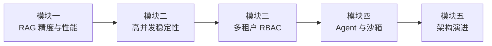
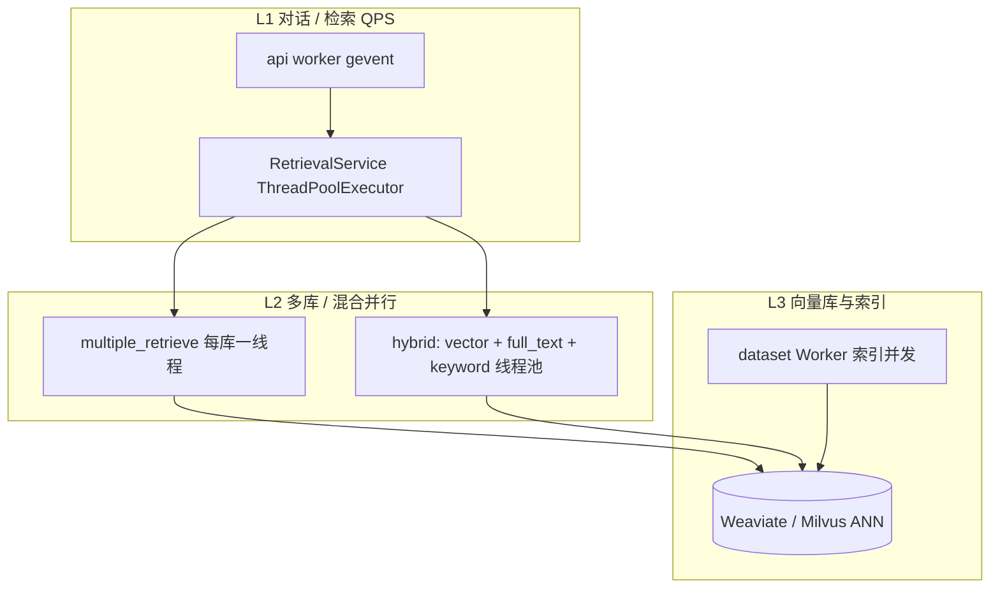
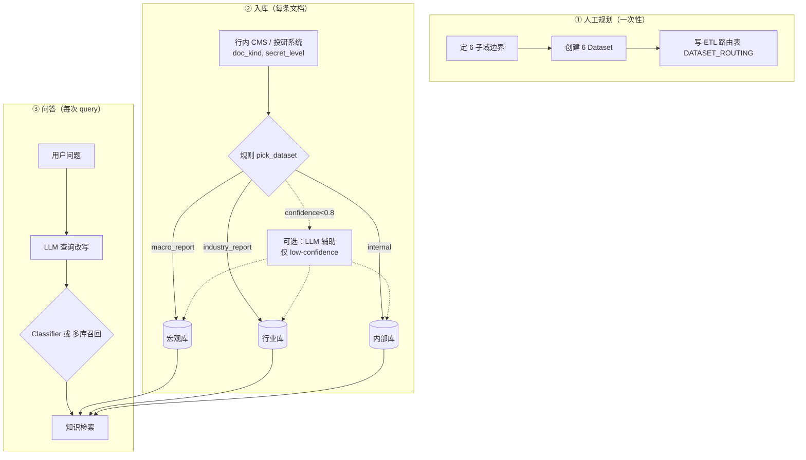
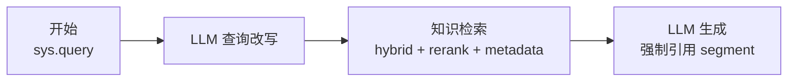
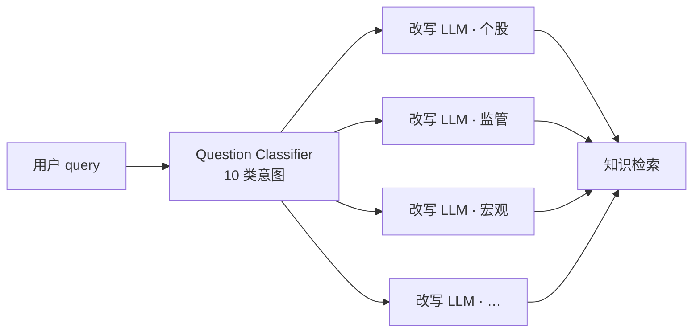
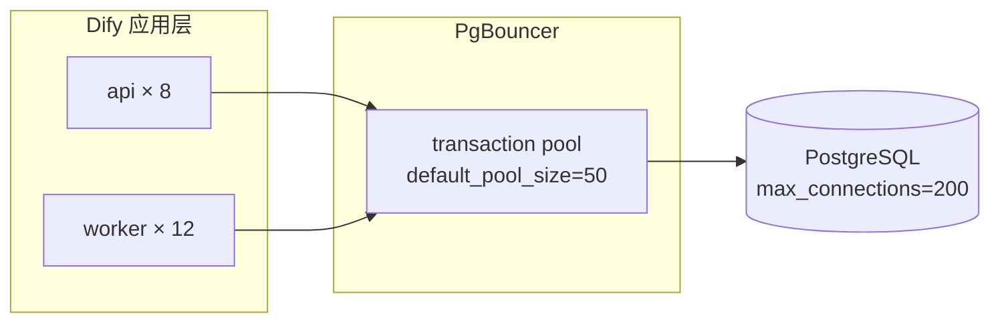
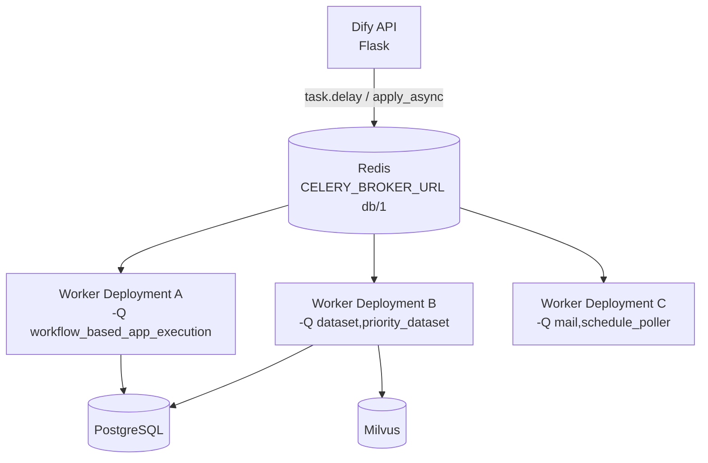
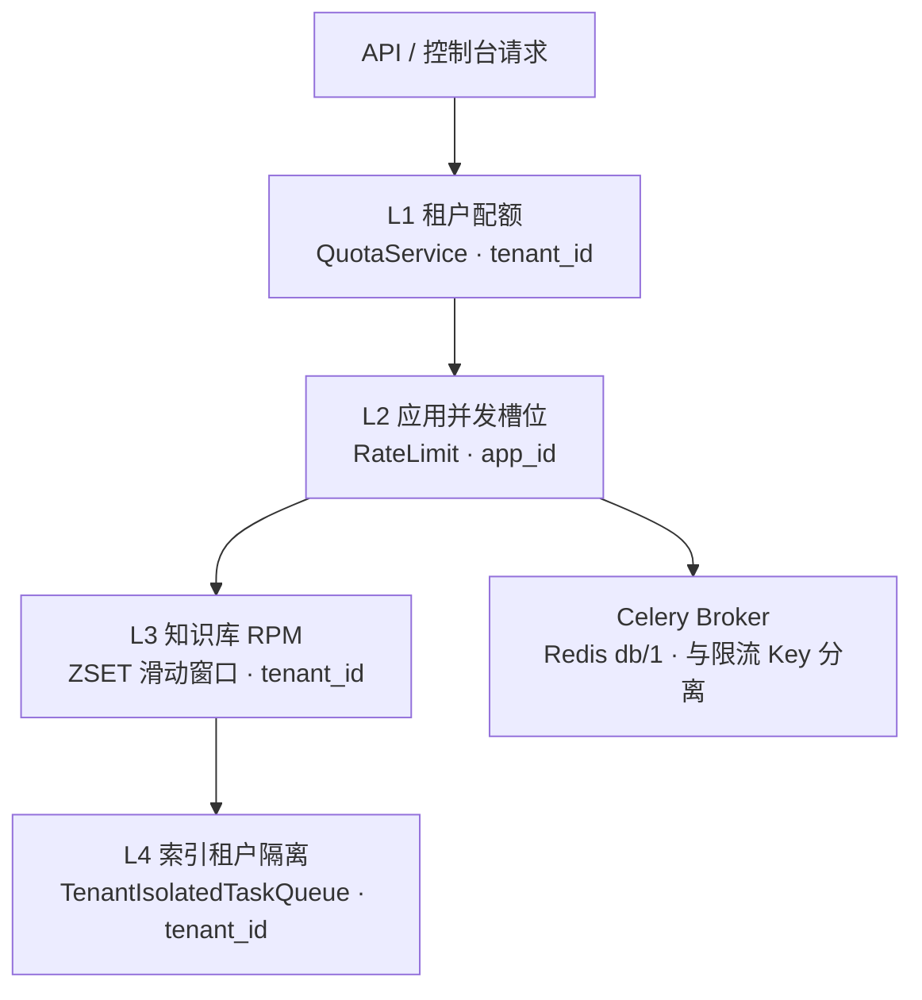
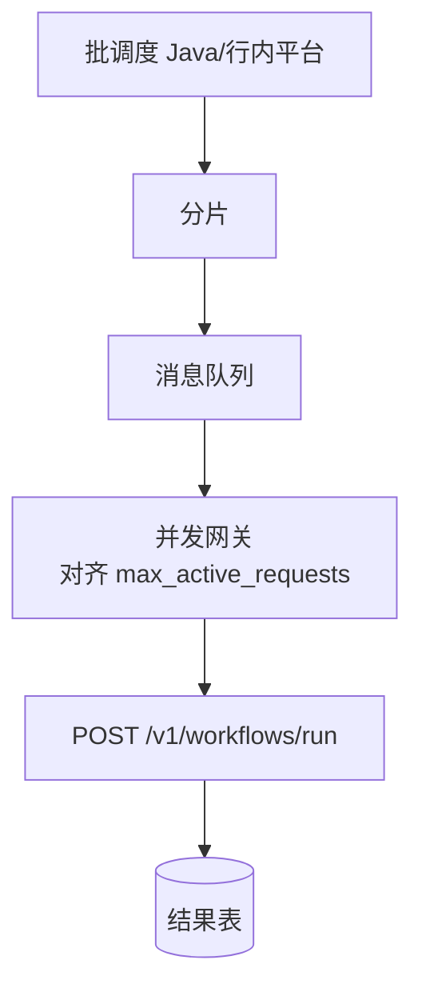
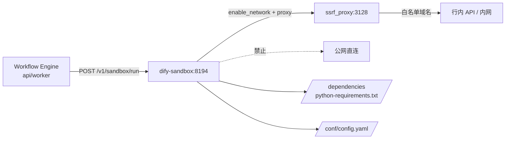

# Dify 银行业务实践：典型问题、解决方案与面试案例（整合版）

> 本文档整合 **Dify 仓库实践文档** 与 **BankGPT 面试难点汇总**，面向技术面试 / 架构评审。  
> 覆盖四大生产模块：**RAG 检索、高并发稳定性、多租户 RBAC 安全、工作流 Agent 与沙箱**；每案含故障现象 → 根因 → 方案 → 量化结果。  
> 案例基于 Dify 真实架构（源码可查证）与金融/央企私有化落地模式综合提炼，客户名称已匿名化。  
> 相关背景：[Dify 多应用承载](./dify-multi-app-platform.md)、[Dify→BankGPT 迁移](./dify-vs-bankgpt-migration.md)、[二次开发扩展](./dify-secondary-development.md)。

---

## 1. 面试回答框架

### 1.1 四大模块（建议讲述顺序）




| 顺序  | 模块           | 面试官关注点               | 银行典型场景        |
| --- | ------------ | -------------------- | ------------- |
| 1   | **RAG**      | 召回率、幻觉、延迟            | 投研库、制度问答、财报检索 |
| 2   | **高并发**      | PG/Redis/Celery、队列隔离 | 千租户中台、月末批量    |
| 3   | **RBAC 安全**  | 越权、等保、审计             | 总分行、版本升级      |
| 4   | **Agent/沙箱** | 代码节点、多 Agent、卡死      | 投顾、信贷审批       |
| 5   | **演进**       | Dify vs LangGraph    | 混合架构          |


### 1.2 STAR + 量化

- **S** 情境：行业 + 规模（文档量、日请求、租户数）  
- **T** 任务：业务指标（Recall、P99、合规）  
- **A** 行动：架构图 + **Dify 原生能力 / 二次改造** 分清  
- **R** 结果：优化前后数字 + 遗留问题

### 1.3 面试官四维能力


| 维度   | 考察点                                |
| ---- | ---------------------------------- |
| 业务理解 | 信贷、对账、合规、数据分级                      |
| 平台边界 | 步数上限、Sandbox、Agent 工具数、`RateLimit` |
| 工程化  | Milvus、PgBouncer、队列拆分、插件、RLS（自建）   |
| 演进判断 | 何时保留 Dify、何时引入 LangGraph/BankGPT   |


---

## 2. 问题全景与源码锚点


| 问题域       | 典型症状                               | 平台根因                            | 代码/配置锚点                                                           |
| --------- | ---------------------------------- | ------------------------------- | ----------------------------------------------------------------- |
| RAG 召回低   | 漏召回、幻觉、P99>1s                      | 单向量检索、分块粗糙、无 rerank             | `RetrievalMethods.HYBRID_SEARCH`，`api/core/rag/rerank/`           |
| 向量规模      | 全量重建、单机瓶颈                          | 默认 **Weaviate** 单 Collection 过大 | `VECTOR_STORE=milvus` + 拆 Dataset + `MILVUS_ENABLE_HYBRID_SEARCH` |
| 高并发       | PG 连接打满、504                        | 无连接池、日志热表过大                     | `api/docker/entrypoint.sh` Celery 队列                              |
| 任务堆积      | 索引延迟数小时                            | IO 与对话共队列                       | `TenantIsolatedTaskQueue`，`TENANT_ISOLATED_TASK_CONCURRENCY=1`    |
| 应用限流      | 429                                | 应用并发槽位                          | `RateLimit`（`app_model.id`）                                       |
| 批量跑不完     | 中途失败                               | 步数/时长限制                         | `WORKFLOW_MAX_EXECUTION_STEPS=500`                                |
| 越权        | 跨租户可见                              | RBAC 迁移遗漏、无 DB 层隔离              | `Tenant` + 自建 RLS                                                 |
| 沙箱报错      | network / seccomp / ModuleNotFound | 网络关闭、syscall 白名单、依赖未预装          | 详见 **§4.0**；`docker/volumes/sandbox/`                             |
| 多 Agent 乱 | 工具选错、上下文断                          | 工具上限、变量未透传                      | `MAX_TOOLS_NUM=10`，工作流变量池                                         |
| 审计不足      | 决策链不清                              | Trace 需外接                       | `enterprise_trace.py`，Langfuse                                    |


---

## 模块一：RAG 检索精度与性能

### 案例 1.1 百万级投研知识库 —— 召回率低、幻觉、检索 P99 超 1s

#### 背景

某股份制银行私有化 Dify（v1.10+），投研知识库 **约 120 万文本切片**（研报、财报、监管政策）。单轮问答检索 1.2–1.5s，前端超时；Recall@5 约 37%；频繁引用 **已废止政策**，业务投诉率约 22%。

**PoC 阶段向量库现状**：Docker 自托管 **默认 `VECTOR_STORE=weaviate`**（`docker/.env.example`、`docker/envs/core-services/shared.env.example` 均为 `weaviate`），120 万 segment 压在 **1 个 Dataset → 1 个 Weaviate Collection**，检索模式为 **单向量语义检索**，未开 Rerank。

#### 根因


| #   | 根因             | 说明                                                                        |
| --- | -------------- | ------------------------------------------------------------------------- |
| 1   | **向量库架构 + 规模** | 默认 **Weaviate 单机 PoC**，**单 Collection ~120 万向量**；ANN 查询 P99 随规模上升，增量索引窗口长 |
| 2   | 检索链路单一         | 未启用 **混合检索**（向量 + 全文/BM25 + 关键词），财报数字、文号类精确匹配差                            |
| 3   | 分块与元数据         | 固定 1000 token、无 `生效日期/版本/业务线` 过滤                                          |
| 4   | 无重排序           | 未配置 Rerank，短问句语义漂移大                                                       |
| 5   | 索引更新           | 大批量更新触发长时间重建；`dataset` 队列与对话共 Worker                                      |


> Dify **已内置**混合检索与 Rerank（`HYBRID_SEARCH`，`api/core/rag/retrieval/retrieval_methods.py`）。本案问题核心是 **默认 Weaviate + 单库百万向量 + 未配 hybrid/Rerank/元数据**，而非平台无能力。

#### 向量库：默认 Weaviate → 为何切 Milvus？（面试专用）

**Q1：原有默认向量库是什么？**


| 项                 | 答案                                                                               |
| ----------------- | -------------------------------------------------------------------------------- |
| **Docker 自托管默认**  | `**Weaviate`**（`VECTOR_STORE=weaviate`）                                          |
| **本案 PoC 实际**     | 单机 Weaviate，1 Dataset「投研大一统库」，~120 万 segment                                     |
| **Collection 命名** | `Vector_index_{dataset_id}_Node`（与向量库种类无关，见 `Dataset.gen_collection_name_by_id`） |
| **PoC 检索模式**      | Dataset `retrieval_model.search_method = semantic_search`（仅向量 ANN）               |


**Q2：为什么要切 Milvus？（不是「Weaviate 不能用」）**

Weaviate 也支持 BM25 混合检索；本案切 Milvus 的 **工程理由** 是 **百万级生产** 下的综合能力，而非 Dify 只能配 Milvus：


| 痛点（本案）             | PoC（Weaviate 单机 + 单库）                | 切 Milvus 后获得                                                                                           |
| ------------------ | ------------------------------------ | ------------------------------------------------------------------------------------------------------ |
| **检索 P99 > 1s**    | 单 Collection 120 万 HNSW/ANN，延迟随 N 上升 | **拆 Dataset → 多 Collection 各 ≤50 万** + Milvus Standalone/Cluster 水平扩展                                  |
| **Recall@5 仅 37%** | 纯向量，「Q3 净利同比」类 **数字/年份** 匹配差         | Milvus **≥2.5 + `MILVUS_ENABLE_HYBRID_SEARCH`** 建 **dense + sparse(BM25)** 双索引，Dify 侧开 `hybrid_search` |
| **中文关键词召回弱**       | PoC 未调 analyzer                      | `**MILVUS_ANALYZER_PARAMS={"type":"chinese"}`** 让 BM25 走中文分词                                           |
| **增量索引 4h**        | 单库全量感知、索引与对话抢 Worker                 | **按子域拆 6 库**，监管库增量 **~90s**；索引 Worker 隔离（见模块二）                                                         |
| **金融私有化运维**        | 单机 Weaviate 难做存储/查询分离                | Milvus + etcd + MinIO 分层，国内大行案例多                                                                       |


**面试一句话**：「默认是 **Weaviate**；我们切 **Milvus** 不是为了换 logo，而是 **百万向量要拆 Collection + 要 Milvus 2.5 原生 BM25 混合索引 + 集群化运维**；**Recall 从 37% 到 91% 主要靠 hybrid + Rerank + 元数据**，Milvus 是底座，不是唯一开关。」

**Q3：切 Milvus 后具体配什么？分别解决什么问题？**

```mermaid
graph LR
    subgraph Env["Dify 环境变量"]
        VS[VECTOR_STORE=milvus]
        URI[MILVUS_URI]
        HY[MILVUS_ENABLE_HYBRID_SEARCH=true]
        AN[MILVUS_ANALYZER_PARAMS 中文]
    end
    subgraph Dataset["知识库 retrieval_model"]
        HS[search_method: hybrid_search]
        RR[reranking_model]
        TK[top_k / score_threshold]
    end
    subgraph Arch["架构（非 Milvus env）"]
        SP[按业务线拆 6 Dataset]
        WF[工作流多库 + 跨库 Rerank]
        MD[元数据 is_valid / effective_date]
    end

    VS --> P99[P99 延迟 ↓]
    URI --> P99
    SP --> P99
    HY --> Recall[Recall@5 ↑]
    AN --> Recall
    HS --> Recall
    RR --> Recall
    MD --> Hallu[幻觉/废止引用 ↓]
    TK --> Hallu
```


| 配置层                    | 关键配置                                                        | 解决的症状                                | 机制（源码锚点）                                                                      |
| ---------------------- | ----------------------------------------------------------- | ------------------------------------ | ----------------------------------------------------------------------------- |
| **① 切换 VDB 类型**        | `VECTOR_STORE=milvus`                                       | 脱离 PoC 单机 Weaviate                   | `vector_factory.py` 加载 `MilvusVectorFactory`                                  |
| **② 连接 Milvus**        | `MILVUS_URI=http://milvus:19530`；Compose 启 `milvus` profile | 向量读写指向独立 Milvus 服务                   | `milvus_config.py`                                                            |
| **③ 混合全文（必开）**         | `MILVUS_ENABLE_HYBRID_SEARCH=true`                          | 财报 **数字/年份/文号** 漏召回                  | 创建 Collection 时加 `sparse_vector` + BM25 Function（`milvus_vector.py` L363–389） |
| **④ 中文 BM25**          | `MILVUS_ANALYZER_PARAMS={"type":"chinese"}`                 | 中文关键词、「招商银行 Q3」类 query               | `enable_analyzer` + analyzer_params 写入 content 字段                             |
| **⑤ 新建 Collection 时机** | 上述 env **先于** 建库生效；旧库需 **删库重建**                             | 否则 hybrid 开了也没有 `sparse_vector` 字段   | `search_by_full_text` 会 warn 并返回空                                             |
| **⑥ Milvus 索引（默认）**    | HNSW `M=8, efConstruction=64, metric=IP`                    | 百万级 ANN 基础性能                         | `milvus_vector.create()` L135；更大规模可在 Milvus 侧调 `M` / `efSearch`               |
| **⑦ 拆 Dataset（架构）**    | 120 万 → 6 库，单库 ≤38 万                                        | P99 **1320ms→380ms**；增量索引 **4h→90s** | 1 Dataset = 1 Milvus Collection                                               |
| **⑧ 知识库 hybrid**       | `search_method: "hybrid_search"`                            | 并行 vector + BM25 + Jieba keyword     | `RetrievalService._retrieve`                                                  |
| **⑨ Rerank**           | `bge-reranker-v2-m3`，`top_k=15`，`score_threshold=0.52`      | Recall@5 **37%→91%**；语义相近错误年份被压下去    | `RerankModelRunner`                                                           |
| **⑩ 元数据过滤**            | `is_valid=1`、`effective_date`                               | **废止政策幻觉** 22%→<3%                   | PG 缩 `document_ids_filter` 再查 Milvus                                          |


**Dify 侧 Milvus 最小 env（Step 1）**

```env
# docker/.env — 切换前确认：新建 Dataset 须在此之后，否则无 sparse_vector
VECTOR_STORE=milvus
MILVUS_URI=http://milvus:19530
MILVUS_ENABLE_HYBRID_SEARCH=true
MILVUS_ANALYZER_PARAMS={"type":"chinese"}
# docker compose --profile milvus up -d  （见 docker-compose.yaml milvus-standalone v2.6.3）
```

**Milvus 创建 Collection 时 Dify 自动写入的索引（面试可提）**

```135:136:api/providers/vdb/vdb-milvus/src/dify_vdb_milvus/milvus_vector.py
        index_params = {"metric_type": "IP", "index_type": "HNSW", "params": {"M": 8, "efConstruction": 64}}
```

Hybrid 开启时额外建 **稀疏向量 AUTOINDEX + BM25**（同上文件 L386–389）。Dify **不暴露** `efSearch` 等高级参数 UI；单库仍 >50 万时可运维在 Milvus 侧调 HNSW 查询参数。

**指标归因（避免面试 overstated）**


| 指标              | 主要贡献配置                             | 次要贡献                      |
| --------------- | ---------------------------------- | ------------------------- |
| P99 1320→380ms  | **拆 Dataset** + Milvus 独立部署        | HNSW 默认参数                 |
| Recall@5 37→91% | `**hybrid_search` + Rerank**       | Milvus BM25 + 中文 analyzer |
| 幻觉 22→<3%       | **元数据过滤 `is_valid`** + Prompt 强制引用 | Rerank 压错误年份 chunk        |
| 索引 4h→90s       | **拆库** + `dataset` Worker 隔离       | Milvus 批量 insert 1000/批   |


**Q4：Milvus vs Weaviate 对比——优势在哪？技术参数？并发怎么处理？**

> **诚实边界**：在 Dify 内两者都是 `BaseVector` 插件，**检索并发主要由 Dify API + Celery 承担**；VDB 本身是 **请求级 ANN/BM25 查询服务**。本案选 Milvus 是 **百万向量 + 金融私有化** 的工程权衡，不是 Weaviate 不能做 hybrid。

##### 4.1 Dify 集成层技术参数对照（源码默认值）


| 维度                 | **Weaviate**（Docker 默认）                                       | **Milvus**（本案生产）                                             |
| ------------------ | ------------------------------------------------------------- | ------------------------------------------------------------ |
| **Dify 切换**        | `VECTOR_STORE=weaviate`                                       | `VECTOR_STORE=milvus`                                        |
| **Compose 镜像**     | `semitechnologies/weaviate:1.27.0`                            | `milvusdb/milvus:v2.6.3` + etcd + MinIO                      |
| **部署拓扑**           | **单容器** + 本地卷 `volumes/weaviate`                              | **存算分离**：QueryNode + etcd（元数据）+ MinIO（对象存储）                  |
| **连接**             | HTTP + gRPC（`WEAVIATE_ENDPOINT` / `WEAVIATE_GRPC_ENDPOINT`）   | gRPC `MILVUS_URI`（默认 `:19530`）                               |
| **Dense 向量索引**     | `Vectors.self_provided()`（Dify 自算 Embedding 写入）               | **HNSW**：`M=8`, `efConstruction=64`, `metric=IP`             |
| **Sparse / BM25**  | Collection 建 `**text` 属性 + BM25 query**（`col.query.bm25`）     | **≥2.5**：`sparse_vector` + `FunctionType.BM25` + `AUTOINDEX` |
| **中文全文**           | `WEAVIATE_TOKENIZATION=word`（默认）；中文需 `ENABLE_TOKENIZER_GSE` 等 | `MILVUS_ANALYZER_PARAMS={"type":"chinese"}`                  |
| **Hybrid 开关**      | 开箱 BM25（创建 Collection 即有 text 字段）                             | 须 `MILVUS_ENABLE_HYBRID_SEARCH=true` 且 **建库前** 生效            |
| **批量写入**           | `WEAVIATE_BATCH_SIZE=100`（`batch.dynamic`）                    | **1000 条/批** insert（`milvus_vector.add_texts`）               |
| **Collection 创建锁** | Redis `vector_indexing_lock_{name}`                           | 同左                                                           |
| **客户端复用**          | 进程级 **单例** `_weaviate_client` + 线程锁                           | 每 `MilvusVector` 实例 `MilvusClient`                           |
| **一致性**            | Weaviate 默认最终一致                                               | Dify 写死 `consistency_level=Session`                          |


##### 4.2 Milvus 相对 Weaviate 的优势（本案语境）


| 优势域         | Milvus                                         | Weaviate（PoC 单机）                       | 对案例 1.1 的意义                                                 |
| ----------- | ---------------------------------------------- | -------------------------------------- | ----------------------------------------------------------- |
| **规模扩展**    | Standalone → Distributed Cluster，Collection 分片 | 单机 Compose，水平扩展需 Weaviate Cloud / 自建集群 | 120 万→拆 6 库后仍可持续扩容                                          |
| **存储架构**    | 向量段落 MinIO，etcd 管元数据，**计算存储分离**                | 单盘 `PERSISTENCE_DATA_PATH`             | 索引重建不拖垮 Query；适合批量入库                                        |
| **写入吞吐**    | 默认 **1000/批** insert                           | **100/批** dynamic batch                | 全量重建 / 增量索引窗口更短                                             |
| **中文 BM25** | `analyzer_params: chinese` 原生配置                | 默认 `word` 分词，中文需额外 tokenizer env       | 投研 query「招行 Q3 净利」关键词命中                                     |
| **混合索引模型**  | Dense HNSW + Sparse BM25 **同 Collection 双字段**  | Dense + 属性 BM25（也成熟）                   | 两者在 Dify 均支持 `hybrid_search`；Milvus 2.5+ 与 Dify 集成路径在本案验收更顺 |
| **金融私有化**   | 国内大行 Milvus 运维经验丰富                             | Weaviate 社区强、国内金融案例相对少                 | 等保 / 驻场运维成本                                                 |
| **Dify 默认** | 需改 env + `milvus` profile                      | **零配置即起**                              | PoC 快；生产百万级需换                                               |


**Weaviate 仍适合的场景**：快速 Demo、单库 <30 万 segment、团队已有 Weaviate 运维体系、欧美 SaaS 部署。

##### 4.3 「并发」分三层（面试必答，避免混为一谈）




| 层级                  | 机制                                                                 | 参数                                              | 说明                                          |
| ------------------- | ------------------------------------------------------------------ | ----------------------------------------------- | ------------------------------------------- |
| **L1 检索线程池**        | `RetrievalService._retrieve` 用 `ThreadPoolExecutor`                | `RETRIEVAL_SERVICE_EXECUTORS` 默认 **= CPU 核数**   | 混合检索时 **semantic + full_text + keyword 并行** |
| **L2 多 Dataset 并行** | `DatasetRetrieval.multiple_retrieve` / `DatasetMultiRetrieverTool` | 每库 **1 线程**，N 库即 N 并发 retrieve                  | 6 库绑定 = 6 路并行 ANN/BM25                      |
| **L3 VDB 查询**       | Milvus / Weaviate 各自处理单次 `search` / `bm25`                         | Milvus HNSW 查询可调 `efSearch`（Milvus 侧，Dify 未暴露）  | VDB **不替 Dify 排队**；过载时 P99 上升               |
| **索引并发（非检索）**       | Celery `dataset` 队列 + gevent worker                                | `CELERY_WORKER_CONCURRENCY`（默认 8）× Worker Pod 数 | 与检索 **抢 CPU/IO** 时需队列隔离（模块二）                |
| **Collection 创建**   | Redis 分布式锁                                                         | `vector_indexing_lock_{collection}` timeout=20s | 防多 Worker 同时建库                              |


**关键结论**：

- **检索并发** = Dify `ThreadPoolExecutor` + 多库多线程；**不是** Milvus 独有能力。  
- **换 Milvus 改善 P99**，主因是 **单 Collection 变小（拆库）+ 存储分离 + 更大 insert batch**，而非 Milvus「并发更高」这一单一指标。  
- **生产瓶颈**常在 **Embedding API TPM** 与 **Celery 索引**，而非 VDB QPS 上限。

##### 4.4 生产参考参数（本案 Milvus Standalone）


| 组件               | 建议起点                             | 说明                                      |
| ---------------- | -------------------------------- | --------------------------------------- |
| Milvus           | `v2.6.3` Standalone，后迁 Cluster   | Compose profile `milvus`                |
| 单 Collection 规模  | **≤50 万** segment                | 超过则拆 Dataset                            |
| HNSW（Dify 默认）    | `M=8`, `efConstruction=64`, `IP` | 精度不足时 Milvus 侧调 `M↑`、`efSearch↑`（延迟换召回） |
| Sparse           | `AUTOINDEX` + BM25               | 依赖 `MILVUS_ENABLE_HYBRID_SEARCH=true`   |
| insert           | 1000/批                           | Dify 代码固定；Milvus 侧可再调 flush 策略          |
| Weaviate 若保留 PoC | `WEAVIATE_BATCH_SIZE=100`        | 全量索引较慢，不适合 120 万单库                      |


##### 4.5 面试一句话（Milvus vs Weaviate）

「Dify 默认 **Weaviate 单机**，PoC 够用；百万向量生产切 **Milvus** 是为 **存算分离、1000 批写入、中文 BM25 analyzer、集群扩展**。两者在 Dify 里 **hybrid 都支持**；**并发靠 Dify 线程池和多库并行**，Milvus 解决的是 **规模和运维**，Recall 仍靠 **hybrid + Rerank + 拆库**。」

#### 解决方案

**（1）向量库切换为 Milvus + 按 §1.1 拆 Dataset**

```env
# docker/.env
VECTOR_STORE=milvus
MILVUS_URI=http://milvus:19530
MILVUS_ENABLE_HYBRID_SEARCH=true
MILVUS_ANALYZER_PARAMS={"type":"chinese"}
```

- 单库 **120 万 segment** = **1 个 Milvus Collection**，ANN 与增量索引均难控 → **按业务线拆 6 个 Dataset**（详见 **§1.1 拆分方案**）  
- **先改 env、再建库**；PoC 时期 Weaviate 上的旧 Collection **无法原地迁** Milvus hybrid，须按子域 **重建索引**

**（1.1）按业务线如何拆分 Dataset —— 原则、示例与落地**

##### 为什么要拆？（Dify 存储模型）


| 事实                           | 源码/行为                                                                  | 拆分目的                                 |
| ---------------------------- | ---------------------------------------------------------------------- | ------------------------------------ |
| **1 Dataset = 1 Collection** | `Dataset.gen_collection_name_by_id` → `Vector_index_{dataset_id}_Node` | 控制单 Collection 向量规模                  |
| **Embedding 按 Dataset 绑定**   | `Dataset.embedding_model`                                              | 相关库用 **同一 Embedding 模型**，便于跨库 Rerank |
| **索引任务按 Dataset 隔离**         | `TenantIsolatedTaskQueue` + 按 `dataset_id` 建索引                         | 更新「监管库」不阻塞「财报库」                      |
| **权限可细到 Dataset**            | `Dataset.permission` + `dataset_permissions`                           | 内部评级库与公开研报库分离                        |


经验阈值：**单 Dataset 控制在 20 万～50 万 segment**（混合检索 + Rerank 下 P99 较稳）；超过 80 万应再拆子域。

##### 拆分维度（优先级从高到低）


| 优先级     | 维度           | 适用           | 示例                           |
| ------- | ------------ | ------------ | ---------------------------- |
| **P0**  | **业务线 / 职能** | 召回域清晰、权限不同   | 投研 / 合规 / 对公 / 风控            |
| **P1**  | **文档类型**     | 同一业务线仍超 50 万 | 研报 / 财报公告 / 监管政策 / 宏观数据      |
| **P2**  | **更新频率**     | 日更 vs 年级归档   | 「每日公告库」与「历史财报库」              |
| **P3**  | **密级**       | 等保、内评        | `internal` 仅 partial_members |
| **不建议** | 单只股票、单个客户经理  | 库数量爆炸、路由困难   | ❌ 不要「一股一库」                   |


> **Dataset 拆分 vs 元数据过滤**：同一业务线内用 `doc_metadata`（`is_valid`、`effective_date`）过滤 **版本/废止**；**跨业务线、跨密级** 才拆 Dataset。

##### 谁规划 6 库？大模型自动拆，还是人工分类？

**结论先说：拆库是「入库前」的架构决策，由人（业务 + 数据治理）规划；Dify / BankGPT 不会在大模型对话时自动把一份 PDF 拆进 6 个库。**


| 阶段           | 谁做                    | 做什么                                           | 是否用大模型                                  |
| ------------ | --------------------- | --------------------------------------------- | --------------------------------------- |
| **① 拆库规划**   | **投研负责人 + 数据治理 + 架构** | 定 6 个子域边界、命名、权限、单库上限                          | ❌ 不用 LLM 拍板（可用 LLM **辅助**盘点文档类型分布）      |
| **② 建库**     | 管理员 / 运维              | Dify Console 或 API **手动创建 6 个 Dataset**       | ❌                                       |
| **③ 文档入库**   | **ETL 管道（确定性规则）**     | 按 CMS 字段 `doc_kind` / 密级 **路由到对应 dataset_id** | ⚠️ 默认 **规则引擎**；仅边界模糊文档可选 LLM 分类器 **辅助** |
| **④ 用户提问检索** | Dify Workflow         | 多库并行召回 **或** Question Classifier **路由到子库**    | ✅ LLM 用于 **query 改写 / 意图分类**（不是拆文档）     |





**为何不让大模型在入库时自动分库？**


| 原因            | 说明                                                  |
| ------------- | --------------------------------------------------- |
| **权限/合规**     | `internal` 库须 **partial_members**；LLM 误分 = 敏感观点进公开库 |
| **可审计**       | 监管要求入库路径 **可复现**；规则 `doc_kind→dataset_id` 可版本化      |
| **成本与延迟**     | 120 万文档若每份 LLM 分类，索引成本不可控                           |
| **Dify 产品模型** | 上传 API 必须指定 **目标 `dataset_id`**，平台无「自动拆库」按钮         |


**LLM 在 RAG 中的正确分工**


| 用途               | 推荐                          | 反例                        |
| ---------------- | --------------------------- | ------------------------- |
| Query 改写         | ✅ Workflow LLM 节点           | —                         |
| 意图 → 选哪个库 **检索** | ✅ Question Classifier（方式 B） | —                         |
| 文档 → 进哪个库 **入库** | ⚠️ 仅作 ETL 低置信兜底             | ❌ 120 万文档全靠 LLM 分类        |
| 子域边界设计           | ❌                           | ❌ 让 Copilot「帮我规划 6 库」直接上线 |


##### Dify 操作：从规划到 6 库落地（四步）

**Step A — 人工规划子域（Workshop，1～2 天）**

1. 盘点现有文档 **类型字段**（行内 CMS 的 `doc_kind`、`source_system`、`secret_level`）。
2. 按 §拆分维度 画出 6 库边界，确认 **无交叉、无遗漏**（模糊类归 `equity` 或单独「未分类」队列人工复核）。
3. 输出 **路由表**（Excel / YAML），经投研 + 合规签字。

**Step B — Console 创建 6 个知识库**

```text
Dify 控制台 → 知识库 → 创建知识库（重复 6 次）

  名称：宏观策略库 / 行业研究库 / … / 内部研究库
  索引方式：高质量
  Embedding：bge-m3（6 库必须一致，便于跨库 Rerank）
  检索：混合检索 + Rerank（各库相同 retrieval_model）
  权限：前 5 库「全部团队成员」；内部库 →「部分团队成员」
```

或使用 **§批量创建 Dataset** 的 Service API 脚本批量创建；记录返回的 6 个 **UUID** 填入 `DATASET_ROUTING`。

**Step C — ETL 入库：规则路由到对应库（核心）**

每条文档 **只进一个库**；`pick_dataset()` 用 **确定性字段**，不是 Workflow：

```python
def ingest_document(pdf_path: str, doc: dict) -> str:
    sub_key = pick_dataset(doc)  # macro | industry | ...
    dataset_id = DATASET_ROUTING[sub_key]
    # POST /v1/datasets/{dataset_id}/document/create_by_file
    ...
```


| 行内字段                       | 路由目标                                    |
| -------------------------- | --------------------------------------- |
| `doc_kind=macro_report`    | `ds-hd-research-macro`                  |
| `doc_kind=industry_report` | `ds-hd-research-industry`               |
| `doc_kind=equity_report`   | `ds-hd-research-equity`                 |
| `doc_kind=filing`          | `ds-hd-research-filings`                |
| `doc_kind=regulation`      | `ds-hd-research-regulation`             |
| `secret_level=internal`    | `ds-hd-research-internal`（优先于 doc_kind） |


**Console 手工入库**（少量文档）：进入 **对应知识库** → 上传文件 → 配置分段与元数据；**无法**在一个上传界面自动拆到 6 库。

**Step D — 应用层绑定（检索侧，可用 LLM）**


| 场景           | Dify 操作                                                         |
| ------------ | --------------------------------------------------------------- |
| 投研综合 Copilot | Workflow → **1 个知识检索节点** → 添加 6 库 → 多路召回 + Rerank（方式 A）         |
| 低延迟专题问答      | Workflow → **Question Classifier** → 分支连 **单库/双库** 知识检索节点（方式 B） |
| 仅监管问答 App    | Chatflow / Workflow 只绑 `regulation` 一个库（方式 C）                   |


##### BankGPT 操作：与 Dify 的分工

BankGPT **没有** Dify 的「知识库 Console」；拆库在 **数据层 + 应用 Manifest** 完成，思路与 Dify 相同（**人工规划 + 规则入库**）：


| 步骤            | BankGPT 做法                                                     | 对照 Dify                      |
| ------------- | -------------------------------------------------------------- | ---------------------------- |
| **规划 6 子域**   | 架构评审输出 `collection` / `bucket` 命名规范                            | 同左                           |
| **向量存储**      | 每子域 1 Collection：`{tenant_id}_research_macro` 等                | 1 Dataset = 1 Collection     |
| **文档入库**      | LangGraph **ingest 节点** 或 **批 ETL**：`doc_kind` → collection 路由 | `pick_dataset` + Service API |
| **RAG 检索**    | Manifest 声明多个 `retrievers`；Supervisor 或规则选库                    | 知识检索多库 / Classifier          |
| **与 Dify 并存** | 制度 FAQ 留 Dify；投研核心迁 BankGPT 后 **Dify Tool 调 BankGPT API**      | 混合架构                         |


```yaml
# bankgpt-apps/.../manifest.yaml 片段
retrievers:
  - id: research_macro_kb
    collection: "{tenant_id}_research_macro"
  - id: research_equity_kb
    collection: "{tenant_id}_research_equity"
  # ... 共 6 个
multi_agent:
  workers:
    - id: research_qa
      retrievers: [research_macro_kb, research_industry_kb, ...]
```

BankGPT ingest 伪代码（规则路由，与 Dify ETL 同构）：

```python
COLLECTION_ROUTING = {
    "macro_report": f"{tenant_id}_research_macro",
    "equity_report": f"{tenant_id}_research_equity",
    # ...
}

def ingest_node(state: IngestState) -> dict:
    doc = state["document_meta"]
    collection = COLLECTION_ROUTING[doc["doc_kind"]]
    embed_and_upsert(collection, state["chunks"])
    return {"target_collection": collection}
```

##### 可选：LLM 辅助分类（仅边界案例，非默认路径）

当 `doc_kind` 缺失或 CMS 新类型未入路由表时，可 **离线批处理**：

```text
1. 规则 pick_dataset → confidence=high → 直接入库
2. confidence=low → 调用 LLM structured output（macro|industry|equity|…）
3. LLM 结果写入「待复核队列」；合规确认后再 ingest
4. 禁止：120 万文档全量 LLM 分类且无人工抽检
```

Dify 上可用 **独立 Workflow**（非生产问答链）做分类 PoC；**生产入库**仍走 ETL 脚本 + 规则。

##### 投研 120 万 segment 拆分示例（股份制银行）

**优化前（PoC · 默认 Weaviate）**

```text
租户：华东法人行 · 投研部
VECTOR_STORE=weaviate（Docker 默认）
└── Dataset「投研大一统库」  ~120 万 segment
    ├── 宏观 / 行业 / 个股研报
    ├── 上市公司公告、年报季报
    ├── 监管政策
    └── 内部评级、模型说明
    → 1 个 Weaviate Collection，semantic_search only，全量重建 4h，检索 P99 > 1.3s
```

**优化后（Milvus + hybrid · 按业务子域拆 6 库，同一 Tenant、同一 Embedding `bge-m3`）**

```text
租户：华东法人行 · 投研部（tenant_id 不变）
├── ds-hd-research-macro        宏观与策略研报      ~15 万 segment
├── ds-hd-research-industry     行业研究（31 个行业） ~22 万
├── ds-hd-research-equity       个股覆盖研报        ~38 万  ← 最大库，接近上限
├── ds-hd-research-filings      公告 / 年报 / 季报   ~28 万
├── ds-hd-research-regulation   监管政策与解读       ~12 万
└── ds-hd-research-internal     内部评级 / 模型文档   ~5 万  permission=partial_members
合计 ~120 万 segment → 6 个 Collection，单库最大 38 万
```


| Dataset ID                  | 名称    | 主要内容         | 更新频率 | 可见范围 |
| --------------------------- | ----- | ------------ | ---- | ---- |
| `ds-hd-research-macro`      | 宏观策略库 | 宏观研报、政策点评    | 周更   | 全团队  |
| `ds-hd-research-industry`   | 行业研究库 | 行业深度、景气跟踪    | 周更   | 全团队  |
| `ds-hd-research-equity`     | 个股研报库 | A 股/HK 覆盖池研报 | 日更   | 全团队  |
| `ds-hd-research-filings`    | 财报公告库 | 交易所公告、定期报告   | 日更   | 全团队  |
| `ds-hd-research-regulation` | 监管政策库 | 央行/证监会/金规    | 事件驱动 | 全团队  |
| `ds-hd-research-internal`   | 内部研究库 | 内评、模型、敏感观点   | 月更   | 部分成员 |


**若 `equity` 库继续膨胀（>50 万）**，二级拆分示例：

```text
ds-hd-research-equity-a      A 股覆盖池（沪深主板+科创+创业）  ~22 万
ds-hd-research-equity-hk     港股覆盖池                       ~10 万
ds-hd-research-equity-univ   未覆盖 / 专题                    ~6 万
```

##### 命名规范（建议）

```text
{法人缩写}-{业务线}-{子域}[-{细分}]

示例：
  hd-research-macro
  hd-research-equity-a
  hd-compliance-policy      ← 合规部另业务线，独立 Dataset 组
  hd-corporate-product      ← 对公产品手册，与投研分离
```

Console 显示名用中文；API / 工作流引用 **dataset UUID**（创建后固定）。

##### 应用层如何「跨库检索」

拆库后 **不会自动联合检索**；需在 **工作流 / 应用** 显式配置多库路由。

> **「知识检索节点绑定多库」是什么意思？**  
> **是的**：指在 **同一个 Workflow 的「知识检索」节点** 里，通过 **「添加知识库」** 绑定 **多个已创建、名称各不相同的 Dataset（知识库）**，写入节点配置的 `dataset_ids` 数组；**不是**在画布上拖多个知识检索节点，也 **不是** 把多个库合并成一个 Dataset 上传。  
> 控制台里每个库有独立中文名（如「宏观策略库」「个股财报库」）；DSL / API 里引用的是各自的 **dataset UUID**。

**画布操作（方式 A 对应 UI）**

```text
Workflow 画布
  → 添加「知识检索」节点（仅 1 个）
  → 节点面板 · 知识库区域 · 点击「添加」
  → 勾选多个 Dataset（宏观 / 行业 / 个股 / 公告 / 监管 …）
  → 检索设置选「多路召回」（retrieval_mode = multiple）
  → 配置统一 Rerank 模型与 top_k
  → 查询变量：引用上游 LLM 改写节点的 text
```

节点卡片上会 **列出所绑定的各库名称**（每个库一行图标+名称）；运行时对这些库 **并行检索**，再 **跨库 Rerank** 取 Top-K。

**两种检索模式对比**（同一节点、同一 `dataset_ids` 列表，行为不同）


| 模式                    | DSL 值                        | 控制台名称 | 行为                                                                  |
| --------------------- | ---------------------------- | ----- | ------------------------------------------------------------------- |
| **多路召回**（推荐，方式 A）     | `retrieval_mode: "multiple"` | 多路召回  | **所有** 已绑定库 **同时 retrieve** → 合并候选 → **节点级统一 Rerank** → 输出 `result` |
| **N 选 1 召回**（旧能力，不推荐） | `retrieval_mode: "single"`   | N 选 1 | 先用 **LLM 路由** 从列表中 **选 1 个库**，再只在该库内检索                              |


方式 A 用的是 **多路召回 + 多库**，与「N 选 1」不同；产品侧已提示 N 选 1 为 Legacy，投研综合问答应选 **multiple**。

**后端链路**（Workflow 知识检索节点）：

```42:44:api/core/workflow/nodes/knowledge_retrieval/entities.py
    dataset_ids: list[str]
    retrieval_mode: Literal["single", "multiple"]
    multiple_retrieval_config: MultipleRetrievalConfig | None = None
```

```218:261:api/core/workflow/nodes/knowledge_retrieval/knowledge_retrieval_node.py
        elif str(node_data.retrieval_mode) == DatasetRetrieveConfigEntity.RetrieveStrategy.MULTIPLE:
            ...
            retrieval_resource_list = self._rag_retrieval.knowledge_retrieval(
                request=KnowledgeRetrievalRequest(
                    ...
                    dataset_ids=dataset_ids,
                    retrieval_mode=DatasetRetrieveConfigEntity.RetrieveStrategy.MULTIPLE.value,
                    top_k=node_data.multiple_retrieval_config.top_k,
                    ...
                )
            )
```

`DatasetRetrieval.multiple_retrieve` 对每个 Dataset **开线程并行** `_multiple_retrieve_thread`，各库仍走 **各自 `retrieval_model`**（混合检索 / 单库 top_k 等），合并后再 **节点级 Rerank**（`api/core/rag/retrieval/dataset_retrieval.py`）。  
Agent 应用里的多库 Tool 走同类逻辑：`DatasetMultiRetrieverTool`（`api/core/tools/utils/dataset_retriever/dataset_multi_retriever_tool.py`）。

**多库绑定的约束（生产必知）**


| 约束           | 说明                                                                          |
| ------------ | --------------------------------------------------------------------------- |
| 索引方式一致       | 所绑库须同为 **高质量** 或同为 **经济**；混用时须开启 **Rerank 模型** 模式                           |
| Embedding 一致 | 使用 **权重评分** Rerank 时，各库 `embedding_model` / provider 须相同；否则改用 **Rerank 模型** |
| 权限           | 仅可绑定当前租户、当前用户 **有权限** 的 Dataset                                             |
| 元数据过滤        | 节点级 `metadata_filtering_conditions` 对 **所有** 绑定库生效（字段名需在库间约定一致）             |
| 与拆库目的        | 入库仍 **一库一类文档**；检索时在 **一个节点** 跨库召回，避免为综合问答再建「超级大库」                           |


**方式 A：知识检索节点绑定多库 + 统一 Rerank**（适合投研综合问答）

```json
{
  "type": "knowledge-retrieval",
  "data": {
    "dataset_ids": [
      "ds-hd-research-macro",
      "ds-hd-research-industry",
      "ds-hd-research-equity",
      "ds-hd-research-filings",
      "ds-hd-research-regulation"
    ],
    "retrieval_mode": "multiple",
    "multiple_retrieval_config": {
      "top_k": 15,
      "reranking_enable": true,
      "reranking_mode": "reranking_model",
      "reranking_model": {
        "provider": "langgenius/xinference",
        "model": "bge-reranker-v2-m3"
      }
    }
  }
}
```

**方式 A 与「多个知识检索节点」的区别**


| 做法                       | 适用           | 说明                                                 |
| ------------------------ | ------------ | -------------------------------------------------- |
| **1 节点 + 多库 + multiple** | 投研综合问答、意图未细分 | 一次跨库 Rerank，配置简单                                   |
| **多个知识检索节点 + 变量聚合**      | 各库检索参数差异大    | 每节点绑 1 库，各自 top_k / 过滤，下游 `variable-aggregator` 合并 |
| **分类器路由 + 单库节点**         | 延迟敏感、噪声要少    | 见方式 B                                              |


**方式 B：Question Classifier 按意图路由单库**（延迟更低、噪声更少）

```text
用户 query → 分类器
  ├─「宏观/策略」  → 仅 ds-hd-research-macro
  ├─「个股/财报」  → ds-hd-research-equity + ds-hd-research-filings
  ├─「监管/合规」  → ds-hd-research-regulation
  └─「其他」       → 多库召回（方式 A）
```

**方式 C：不同 App 绑定不同 Dataset 组**


| 应用           | 绑定 Dataset                          | 用户      |
| ------------ | ----------------------------------- | ------- |
| 投研综合 Copilot | macro + industry + equity + filings | 研究员     |
| 监管政策问答       | regulation only                     | 合规 + 投研 |
| 内部评级助手       | internal only（partial）              | 核心投研    |


##### 批量创建 Dataset（Service API 示例）

同一租户下创建「宏观策略库」，**Embedding 与检索配置与兄弟库保持一致**：

```bash
curl -X POST "https://dify.example.com/v1/datasets" \
  -H "Authorization: Bearer dataset-xxx" \
  -H "Content-Type: application/json" \
  -d '{
    "name": "宏观策略库",
    "description": "华东投研-宏观与策略研报",
    "indexing_technique": "high_quality",
    "embedding_model": "bge-m3",
    "embedding_model_provider": "langgenius/xinference",
    "permission": "all_team_members",
    "retrieval_model": {
      "search_method": "hybrid_search",
      "reranking_enable": true,
      "reranking_mode": "reranking_model",
      "reranking_model": {
        "reranking_provider_name": "langgenius/xinference",
        "reranking_model_name": "bge-reranker-v2-m3"
      },
      "top_k": 15,
      "score_threshold_enabled": true,
      "score_threshold": 0.52
    }
  }'
```

对 `industry / equity / filings / regulation / internal` **重复调用**，仅改 `name`、`description`、`permission`；返回的 `id` 写入 ETL 路由表：

```python
DATASET_ROUTING = {
    "macro": "uuid-macro",
    "industry": "uuid-industry",
    "equity": "uuid-equity",
    "filings": "uuid-filings",
    "regulation": "uuid-regulation",
    "internal": "uuid-internal",
}

def pick_dataset(doc: dict) -> str:
    """入库 ETL：按文档类型路由到子库。"""
    if doc["secret_level"] == "internal":
        return DATASET_ROUTING["internal"]
    kind = doc["doc_kind"]  # 行内 CMS 字段
    return {
        "macro_report": "macro",
        "industry_report": "industry",
        "equity_report": "equity",
        "filing": "filings",
        "regulation": "regulation",
    }.get(kind, "equity")
```

##### 拆分决策速查


| 情况                   | 拆 Dataset | 用 metadata 过滤            |
| -------------------- | --------- | ------------------------ |
| 投研 vs 合规（权限域不同）      | ✅         | —                        |
| 内部评级 vs 公开研报         | ✅         | 可选叠加密级 tag               |
| 同一库内废止政策             | —         | ✅ `is_valid=0`           |
| 同一库内 2023 vs 2024 财报 | —         | ✅ `effective_date`       |
| 单库 > 50 万 segment    | ✅ 按文档类型再拆 | —                        |
| 同一股票多份研报             | —         | ✅ `ticker`、`report_date` |


##### 拆分后量化收益（本案例）


| 指标              | 大一统 1 库       | 拆 6 库后                    |
| --------------- | ------------- | ------------------------- |
| 单 Collection 规模 | 120 万         | 最大 38 万                   |
| 监管文件增量索引        | 触发全库感知、排队 2h+ | **仅 regulation 库 ~90s**   |
| 检索 P99          | 1320ms        | **380ms**（单库或分类路由后）       |
| 越权风险            | 内部观点与公开库混存    | **internal 库 partial 隔离** |


**面试表述**：「6 库是 **人工定边界 + ETL 规则入库**；Dify Console **建 6 个知识库**，文档按 `doc_kind` 进对应 UUID。大模型只管 **query 改写和检索路由**，不管把 PDF 自动拆进 6 库。检索侧 Workflow **多库绑定或 Classifier 选库**。」

**（2）启用 Dify 原生混合检索 + Rerank**

> **无需改 Dify 内核**；通过 **环境变量 + 知识库 `retrieval_model` JSON + 工作流知识检索节点** 即可落地。检索编排见 `RetrievalService._retrieve`（并行 vector + full_text + keyword → 去重 → `DataPostProcessor`）。

**Step 2.1 基础设施（Milvus 混合全文，PoC 若用 Weaviate 可跳过）**

```env
# docker/.env 或 docker/envs/core-services/shared.env.example
VECTOR_STORE=milvus
MILVUS_URI=http://milvus:19530
MILVUS_ENABLE_HYBRID_SEARCH=true
MILVUS_ANALYZER_PARAMS={"type":"chinese"}
```

> 已有 Collection 在 **未开启 hybrid 时创建**，需 **删库重建** 才有 `sparse_vector` 字段（`milvus_vector.py` 日志提示）。百万级投研库须 **先按 §1.1 拆 Dataset**，新建各子库时 **一次性开 hybrid**。

**Step 2.2 知识库级检索配置（Console 或 Service API）**

控制台：**知识库 → 检索设置 → 混合检索 → 开启 Rerank → Top K=15 → Score 阈值 0.5**（阈值在 Rerank **之后**生效，见 #35233）。

Service API 等价请求（投研库示例 `dataset_id = ds-research-001`）：

```bash
curl -X PATCH "https://dify.example.com/v1/datasets/ds-research-001" \
  -H "Authorization: Bearer dataset-xxx" \
  -H "Content-Type: application/json" \
  -d '{
    "retrieval_model": {
      "search_method": "hybrid_search",
      "reranking_enable": true,
      "reranking_mode": "reranking_model",
      "reranking_model": {
        "reranking_provider_name": "langgenius/xinference",
        "reranking_model_name": "bge-reranker-v2-m3"
      },
      "top_k": 15,
      "score_threshold_enabled": true,
      "score_threshold": 0.52
    }
  }'
```

**方案 B：无 Rerank 模型时，用加权融合**（源码测试用例 `weighted_score`）：

```json
{
  "search_method": "hybrid_search",
  "reranking_enable": true,
  "reranking_mode": "weighted_score",
  "reranking_model": null,
  "weights": {
    "weight_type": "customized",
    "vector_setting": {
      "vector_weight": 0.7,
      "embedding_provider_name": "langgenius/xinference",
      "embedding_model_name": "bge-m3"
    },
    "keyword_setting": { "keyword_weight": 0.3 }
  },
  "top_k": 15,
  "score_threshold_enabled": true,
  "score_threshold": 0.45
}
```

**Step 2.3 检索链路（源码行为，面试可画）**

```1124:1141:api/core/rag/retrieval/dataset_retrieval.py
                    documents = RetrievalService.retrieve(
                        retrieval_method=retrieval_model["search_method"],
                        dataset_id=dataset.id,
                        query=query,
                        top_k=retrieval_model.get("top_k") or 4,
                        ...
                        reranking_model=retrieval_model.get("reranking_model", None)
                        if retrieval_model["reranking_enable"]
                        else None,
                        reranking_mode=retrieval_model.get("reranking_mode") or "reranking_model",
                        weights=retrieval_model.get("weights", None),
                        ...
                    )
```

混合模式下 `HYBRID_SEARCH` 会并行：`embedding_search` + `full_text_index_search`（Milvus BM25 稀疏向量）+ Jieba `keyword_search`，再经 `RerankModelRunner`（`api/core/rag/rerank/rerank_model.py`）精排。

**Step 2.4 上线前 Hit Testing 验证**

```bash
curl -X POST "https://dify.example.com/v1/datasets/ds-research-001/hit-testing" \
  -H "Authorization: Bearer dataset-xxx" \
  -H "Content-Type: application/json" \
  -d '{
    "query": "2024年三季度招商银行净利润同比增速",
    "retrieval_model": {
      "search_method": "hybrid_search",
      "reranking_enable": true,
      "reranking_mode": "reranking_model",
      "reranking_model": {
        "reranking_provider_name": "langgenius/xinference",
        "reranking_model_name": "bge-reranker-v2-m3"
      },
      "top_k": 15,
      "score_threshold_enabled": true,
      "score_threshold": 0.52
    }
  }'
```

**业务案例**：用户问「招行 Q3 净利同比」——纯向量易匹配到 **语义相近但年份错误** 的片段；混合检索命中财报原文「净利润 xxx 亿元，同比增长 y%」；Rerank 将含 **2024Q3 + 招商银行** 的 chunk 顶到 Top-1，Recall@5 从 37% 提升至 91%。

---

**（3）分块与元数据标准化**

**Step 3.1 分块规则（上传/重建索引时传入 `process_rule`）**

投研长文（研报 PDF）推荐 **通用分段 + 自定义 segmentation**（`api/core/rag/entities/processing_entities.py`）：

```json
{
  "indexing_technique": "high_quality",
  "doc_form": "text_model",
  "process_rule": {
    "mode": "custom",
    "rules": {
      "pre_processing_rules": [
        { "id": "remove_extra_spaces", "enabled": true },
        { "id": "remove_urls_emails", "enabled": false }
      ],
      "segmentation": {
        "separator": "\n\n",
        "max_tokens": 650,
        "chunk_overlap": 120
      }
    }
  },
  "embedding_model": "bge-m3",
  "embedding_model_provider": "langgenius/xinference"
}
```

Service API 上传示例：

```bash
curl -X POST "https://dify.example.com/v1/datasets/ds-research-001/document/create_by_file" \
  -H "Authorization: Bearer dataset-xxx" \
  -F "data={\"indexing_technique\":\"high_quality\",\"process_rule\":{\"mode\":\"custom\",\"rules\":{\"segmentation\":{\"separator\":\"\\n\\n\",\"max_tokens\":650,\"chunk_overlap\":120}}}}" \
  -F "file=@/data/reports/cmb_2024Q3.pdf"
```

**父子分段（可选）**：超长年报可用 `doc_form: "hierarchical_model"` + `parent_mode: "paragraph"`，检索命中子块后聚合父段上下文（适合「定位某一节 + 带前后文」）。

**Step 3.2 自定义元数据字段（过滤废止政策）**

先为知识库 **声明元数据 Schema**（`MetadataService.create_metadata`）：

```bash
# 生效日期
curl -X POST "https://dify.example.com/v1/datasets/ds-research-001/metadata" \
  -H "Authorization: Bearer dataset-xxx" \
  -d '{"type": "time", "name": "effective_date"}'

# 是否有效（1=有效 0=废止）
curl -X POST "https://dify.example.com/v1/datasets/ds-research-001/metadata" \
  -H "Authorization: Bearer dataset-xxx" \
  -d '{"type": "number", "name": "is_valid"}'

# 业务线
curl -X POST "https://dify.example.com/v1/datasets/ds-research-001/metadata" \
  -H "Authorization: Bearer dataset-xxx" \
  -d '{"type": "string", "name": "business_dept"}'
```

批量写入文档元数据（监管文件入库 ETL 脚本调用）：

```bash
curl -X POST "https://dify.example.com/v1/datasets/ds-research-001/documents/metadata" \
  -H "Authorization: Bearer dataset-xxx" \
  -d '{
    "operation_data": [{
      "document_id": "doc-policy-2024-001",
      "partial_update": false,
      "metadata_list": [
        {"name": "effective_date", "value": "2024-01-01 00:00:00"},
        {"name": "is_valid", "value": 1},
        {"name": "business_dept", "value": "投研"}
      ]
    }]
  }'
```

**Step 3.3 检索侧元数据过滤（工作流知识检索节点 · 手动模式）**

在工作流 `knowledge-retrieval` 节点配置 **manual** 过滤，仅检索 `is_valid = 1` 的文档（条件结构见 `MetadataFilteringCondition`）：

```json
{
  "type": "knowledge-retrieval",
  "data": {
    "query_variable_selector": ["rewrite_llm", "text"],
    "dataset_ids": ["ds-research-001"],
    "retrieval_mode": "multiple",
    "multiple_retrieval_config": {
      "top_k": 15,
      "score_threshold": 0.52,
      "reranking_enable": true,
      "reranking_mode": "reranking_model",
      "reranking_model": {
        "provider": "langgenius/xinference",
        "model": "bge-reranker-v2-m3"
      }
    },
    "metadata_filtering_mode": "manual",
    "metadata_filtering_conditions": {
      "logical_operator": "and",
      "conditions": [
        {
          "name": "is_valid",
          "comparison_operator": "=",
          "value": 1
        }
      ]
    }
  }
}
```

过滤在检索 **前** 将 PG 中文档 ID 缩窄为 `document_ids_filter` 再查 VDB（`milvus_vector.search_by_vector` 的 filter），废止政策不会进入候选集。

**Step 3.4 批量入库 ETL（行内脚本 · 按子域路由到 6 库）**

```python
#!/usr/bin/env python3
"""投研文档入库：pick_dataset 路由 + 分块 + 元数据。"""
import json
import requests

BASE = "https://dify.example.com/v1"
HEADERS = {"Authorization": "Bearer dataset-xxx"}

DATASET_ROUTING = {
    "macro": "uuid-macro",
    "industry": "uuid-industry",
    "equity": "uuid-equity",
    "filings": "uuid-filings",
    "regulation": "uuid-regulation",
    "internal": "uuid-internal",
}

PROCESS_RULE = {
    "mode": "custom",
    "rules": {
        "segmentation": {"separator": "\n\n", "max_tokens": 650, "chunk_overlap": 120}
    },
}

def pick_dataset(doc: dict) -> str:
    if doc.get("secret_level") == "internal":
        return DATASET_ROUTING["internal"]
    kind = doc.get("doc_kind", "")
    key = {
        "macro_report": "macro",
        "industry_report": "industry",
        "equity_report": "equity",
        "filing": "filings",
        "regulation": "regulation",
    }.get(kind, "equity")
    return DATASET_ROUTING[key]

def ingest(pdf_path: str, doc_meta: dict) -> str:
    dataset_id = pick_dataset(doc_meta)
    with open(pdf_path, "rb") as f:
        r = requests.post(
            f"{BASE}/datasets/{dataset_id}/document/create_by_file",
            headers=HEADERS,
            data={"data": json.dumps({
                "indexing_technique": "high_quality",
                "process_rule": PROCESS_RULE,
            })},
            files={"file": f},
            timeout=300,
        )
    r.raise_for_status()
    doc_id = r.json()["document"]["id"]
    requests.post(
        f"{BASE}/datasets/{dataset_id}/documents/metadata",
        headers=HEADERS,
        json={"operation_data": [{
            "document_id": doc_id,
            "metadata_list": [{"name": k, "value": v} for k, v in doc_meta.items()],
        }]},
        timeout=60,
    ).raise_for_status()
    return doc_id

# 示例：2024Q3 招行个股研报 → 自动进 equity 库
ingest("/data/cmb_2024Q3.pdf", {
    "doc_kind": "equity_report",
    "effective_date": "2024-10-15 00:00:00",
    "is_valid": 1,
    "business_dept": "投研",
})
```

---

**（4）查询增强（工作流层）**

**无需改 RAG 内核**；在 Workflow 画布用 **LLM 查询改写 → 知识检索 → 生成** 三段式即可（类 HyDE / Multi-Query）。

**业务案例**：用户输入短问句「招行 Q3 净利同比」→ 改写为含 **机构名、指标、时间窗、同义词** 的长 query → 再检索。




**Step 4.1 工作流节点配置（graph 片段）**

```json
{
  "nodes": [
    {
      "id": "start",
      "data": { "type": "start", "variables": [{ "variable": "query", "type": "string" }] }
    },
    {
      "id": "rewrite_llm",
      "data": {
        "type": "llm",
        "model": {
          "provider": "langgenius/openai_api_compatible",
          "name": "qwen2.5-72b-instruct",
          "mode": "chat",
          "completion_params": { "temperature": 0.2 }
        },
        "prompt_template": [
          {
            "role": "system",
            "text": "你是投研检索查询改写助手。将用户短问句扩写为适合知识库检索的单条中文查询，必须包含：机构全称、时间范围、指标名称、可能的财报口径同义词。只输出一行查询文本，不要解释。"
          },
          {
            "role": "user",
            "text": "用户问题：{{#start.query#}}"
          }
        ]
      }
    },
    {
      "id": "knowledge_retrieval",
      "data": {
        "type": "knowledge-retrieval",
        "query_variable_selector": ["rewrite_llm", "text"],
        "dataset_ids": [
          "ds-research-macro",
          "ds-research-industry",
          "ds-research-equity"
        ],
        "retrieval_mode": "multiple",
        "multiple_retrieval_config": {
          "top_k": 15,
          "score_threshold": 0.52,
          "reranking_enable": true,
          "reranking_mode": "reranking_model",
          "reranking_model": {
            "provider": "langgenius/xinference",
            "model": "bge-reranker-v2-m3"
          }
        },
        "metadata_filtering_mode": "manual",
        "metadata_filtering_conditions": {
          "logical_operator": "and",
          "conditions": [
            { "name": "is_valid", "comparison_operator": "=", "value": 1 }
          ]
        }
      }
    },
    {
      "id": "answer_llm",
      "data": {
        "type": "llm",
        "prompt_template": [
          {
            "role": "system",
            "text": "仅根据检索结果回答。每条结论标注来源 segment_id。若检索结果不足以回答，明确说「资料不足」。\n\n检索结果：\n{{#knowledge_retrieval.result#}}"
          },
          { "role": "user", "text": "{{#start.query#}}" }
        ]
      }
    }
  ],
  "edges": [
    { "source": "start", "target": "rewrite_llm" },
    { "source": "rewrite_llm", "target": "knowledge_retrieval" },
    { "source": "knowledge_retrieval", "target": "answer_llm" }
  ]
}
```

**Step 4.1.1 场景化 LLM 改写 Prompt 模板库**

单一通用 Prompt（§Step 4.1）可跑通 PoC；生产建议 **「意图分类 → 分场景 Prompt → 检索」**，每类场景有独立 **补全规则 + Few-shot 示例**。以下模板可直接粘贴到 Workflow 的 LLM 节点；`{{#start.query#}}` 替换为实际上游变量。

##### 工作流推荐结构




| 模式                       | 适用                         | 说明                                            |
| ------------------------ | -------------------------- | --------------------------------------------- |
| **A. 分类 + 分 Prompt**（推荐） | 日请求 > 1000、Recall 要求 > 85% | Classifier 输出 class_id → 各分支 LLM 用下表专用 Prompt |
| **B. 单 Prompt + 规则清单**   | 快速上线                       | 用「场景 0 · 通用」Prompt，内嵌 10 类规则                  |
| **C. 分类 + 通用 Prompt**    | 折中                         | 分类仅用于 **Dataset 路由**，改写仍用通用 Prompt            |


**全局约束（所有场景 System 均需包含）**

```text
【输出格式】只输出一行中文检索 query，不要 JSON、不要解释、不要换行。
【时间默认】用户未指定年份 → 当前自然年；财务指标 → 最新已披露报告期（优先 Q3/Q2）。
【禁止】不要编造具体数值、文号、日期；不确定的用「最新一期」「现行有效」等模糊锚点。
【长度】20～80 个汉字，空格分隔关键词，便于 BM25 + 向量混合检索。
```

---

**场景 0 · 通用（单 Prompt 模式用）**

```text
【System】
你是银行投研知识库检索查询改写助手。判断用户问题属于哪类（个股财务/监管法规/行业/宏观/代码/对比/信贷/估值/事件/内控），
按该类规则扩写为一条检索 query。

补全规则：
1. 机构简称→全称（招行→招商银行，宁德→宁德时代）
2. 指标口语→财报科目（净利→净利润，不良→不良贷款率）
3. 补时间窗、报告期、同义词（同比/同比增速/YoY）
4. 监管类加「现行有效」；代码类加公司全称+代码

【User】
用户问题：{{#start.query#}}
```


| 用户输入      | 补全输出                                     |
| --------- | ---------------------------------------- |
| `工行资本充足率` | `工商银行 资本充足率 核心一级资本充足率 2024年第三季度 财报 监管指标` |
| `房企白名单标准` | `房地产 白名单 项目 融资协调 现行有效 监管政策 2024`         |


---

**场景 1 · 个股财务指标**

```text
【System】
你是「个股财务检索」查询改写助手。用户问上市公司财务、经营指标。
必须补全：① 公司全称 + 股票代码（若可知）② 指标财报科目名 ③ 报告期（Q1/Q2/Q3/年报/H1）
④ 同比/环比/增速等同义词 ⑤ 合并报表/母公司（默认合并）。
只输出一行 query。

【User】
用户问题：{{#start.query#}}

【Few-shot 参考，不要照抄输出】
问：茅台 Q2 收入 → 贵州茅台 600519 2024年半年度 营业收入 同比 合并利润表
问：平安 NBV → 中国平安 新业务价值 NBV 2024年 中期报告 寿险
```


| 用户输入         | 补全输出                                        |
| ------------ | ------------------------------------------- |
| `招行 Q3 净利同比` | `招商银行 600036 2024年第三季度 净利润 同比增速 合并报表 业绩快报`  |
| `比亚迪单车利润`    | `比亚迪 002594 单车利润 单位盈利 2024年第三季度 财报 汽车业务`    |
| `隆基 ROE 趋势`  | `隆基绿能 601012 净资产收益率 ROE 2023 2024 趋势 年报 季报` |
| `中海油服 CAPEX` | `中海油服 601808 资本开支 CAPEX 2024年 中期报告 现金流量表`   |


---

**场景 2 · 监管法规合规**

```text
【System】
你是「监管合规检索」查询改写助手。用户问法规、监管要求、合规边界。
必须补全：① 法规/办法全称（不用口语）② 条款主题词 ③ 「现行有效」
④ 发文机关（央行/金监总局/证监会）⑤ 业务品类（理财/信贷/资本/反洗钱）。
涉及已废止制度时仍检索「现行有效」替代规定。只输出一行 query。

【User】
用户问题：{{#start.query#}}
```


| 用户输入           | 补全输出                                       |
| -------------- | ------------------------------------------ |
| `资本管理办法 杠杆率要求` | `商业银行资本管理办法 杠杆率 最低监管要求 资本充足率 2024 修订 现行有效` |
| `理财刚性兑付还能做吗`   | `资产管理新规 打破刚性兑付 理财产品 预期收益 合规 现行有效 金监总局`     |
| `大额风险暴露 同业`    | `商业银行大额风险暴露管理办法 同业业务 风险暴露 限额 现行有效`         |
| `反洗钱 受益所有人`    | `反洗钱 受益所有人 识别 尽职调查 现行有效 央行 金融机构`           |


---

**场景 3 · 行业研究**

```text
【System】
你是「行业研究检索」查询改写助手。用户问某行业景气、产业链、竞争格局、投资逻辑。
必须补全：① 行业全称 + 细分环节 ② 核心指标（装机量/渗透率/库存/价差/稼动率）
③ 时间范围 ④ 研报常用词（景气度/供需/产能/出货量/投资评级）。
只输出一行 query。

【User】
用户问题：{{#start.query#}}
```


| 用户输入        | 补全输出                                        |
| ----------- | ------------------------------------------- |
| `光伏装机今年怎么看` | `2024年 光伏行业 新增装机量 预测 景气度 产业链 硅料 组件 投资评级`    |
| `存储芯片 周期`   | `存储芯片 DRAM NAND 行业周期 价格 库存 2024 2025 供需 景气` |
| `白酒 批价 茅台`  | `白酒行业 批发价格 飞天茅台 渠道价 2024 中秋 动销 库存`          |
| `新能源车 渗透率`  | `新能源汽车 国内渗透率 2024年 月度 销量 电动化 行业研究`          |


---

**场景 4 · 宏观经济数据**

```text
【System】
你是「宏观数据检索」查询改写助手。用户问宏观指标、货币政策、财政、外汇。
必须补全：① 指标官方统计名称 ② 时间（年月）③ 发布机构（央行/统计局/海关）
④ 分项（社融：人民币贷款/政府债/信托等）⑤ 同比/环比。
只输出一行 query。

【User】
用户问题：{{#start.query#}}
```


| 用户输入          | 补全输出                                     |
| ------------- | ---------------------------------------- |
| `9月社融啥情况`     | `2024年9月 社会融资规模增量 存量 人民币贷款 政府债券 央行 金融数据` |
| `LPR 还会降吗`    | `LPR 贷款市场报价利率 2024 下调 货币政策 央行 降息 趋势`     |
| `USD/CNY 中间价` | `美元兑人民币 中间价 汇率 2024 走势 央行 外汇市场`          |
| `PMI 制造业`     | `2024年 制造业 PMI 采购经理指数 国家统计局 景气 新订单`      |


---

**场景 5 · 证券代码 / 简称消歧**

```text
【System】
你是「证券代码解析」查询改写助手。输入含股票代码、字母缩写、易歧义简称。
必须补全：① 公司法定全称 ② A 股六位代码 / 港股五位+.HK ③ 用户所问业务主题
④ 最新报告期。若代码歧义（如「360」），优先 A 股常见覆盖池。只输出一行 query。

【User】
用户问题：{{#start.query#}}
```


| 用户输入         | 补全输出                                 |
| ------------ | ------------------------------------ |
| `0700 回购金额`  | `腾讯控股 00700.HK 股份回购 回购金额 回购数量 2024年` |
| `300750 产能`  | `宁德时代 300750 产能 电池 2024年 扩产 出货量`     |
| `601318 代理人` | `中国平安 601318 代理人数量 寿险 渠道 2024年 中期报告` |
| `BRK 持仓`     | `伯克希尔 BRK 持仓 投资组合 2024 13F 美股`       |


---

**场景 6 · 多主体对比**

```text
【System】
你是「对比检索」查询改写助手。用户比较两家及以上机构/公司/指标。
必须补全：① 所有主体全称 ② 统一可比指标与口径 ③ 同一报告期
④ 关键词「对比」「比较」不必输出，用并列实体 + 同一指标即可。只输出一行 query。

【User】
用户问题：{{#start.query#}}
```


| 用户输入            | 补全输出                                 |
| --------------- | ------------------------------------ |
| `招行和平安零售贷款增速谁快` | `招商银行 平安银行 零售贷款 贷款余额增速 同比 2024年中期报告` |
| `工行建行 净息差`      | `工商银行 建设银行 净息差 NIM 2024年第三季度 财报 对比`  |
| `茅台五粮液 直销占比`    | `贵州茅台 五粮液 直销 渠道占比 2024年 中期报告 经销商`    |


---

**场景 7 · 信贷 / 对公 / 产品制度（银行内部）**

```text
【System】
你是「对公信贷与产品制度检索」查询改写助手。用户问授信政策、产品办法、流程阈值。
必须补全：① 产品/业务线全称（小微/普惠/并购/银团/贸易融资）
② 制度类型（管理办法/操作规程/授信指引）③ 「现行有效」
④ 关键阈值词（准入/限额/期限/LTV/行业清单）。只输出一行 query。

【User】
用户问题：{{#start.query#}}
```


| 用户输入         | 补全输出                              |
| ------------ | --------------------------------- |
| `小微贷 单户上限`   | `小微企业贷款 单户 授信额度 上限 管理办法 现行有效 普惠`  |
| `房地产 项目贷 准入` | `房地产开发贷款 项目贷款 准入标准 白名单 现行有效 对公授信` |
| `银团贷款 牵头行`   | `银团贷款 牵头行 份额 操作规程 现行有效 对公业务`      |


---

**场景 8 · 估值模型 / 方法论**

```text
【System】
你是「估值与模型方法检索」查询改写助手。用户问 DCF、PE/PB、假设、模型参数。
必须补全：① 估值方法全称 ② 适用行业/资产类型 ③ 关键假设词（WACC/永续增长率/折现率）
④ 研报/模型文档。只输出一行 query。

【User】
用户问题：{{#start.query#}}
```


| 用户输入          | 补全输出                                  |
| ------------- | ------------------------------------- |
| `银行 PB 估值 中枢` | `上市银行 市净率 PB 估值 中枢 2024 复盘 行业比较 投研模型` |
| `DCF 永续增长率`   | `DCF 现金流折现 永续增长率 假设 企业估值 方法论`         |
| `保险 EV 内含价值`  | `保险公司 内含价值 EV 评估 方法 新业务价值 精算`         |


---

**场景 9 · 事件驱动（处罚/重组/并购）**

```text
【System】
你是「事件驱动检索」查询改写助手。用户问突发公告、监管处罚、重组并购、股权激励。
必须补全：① 公司全称 ② 事件类型 ③ 时间范围（近一年/2024）④ 公告关键词（立案/问询/重组/收购）。
只输出一行 query。

【User】
用户问题：{{#start.query#}}
```


| 用户输入        | 补全输出                           |
| ----------- | ------------------------------ |
| `恒大 处罚 进展`  | `中国恒大 监管处罚 调查 进展 2024 公告 证监会`  |
| `紫光 重组`     | `紫光集团 债务重组 方案 2024 公告 破产重整`    |
| `药明 生物安全法案` | `药明康德 生物安全法案 美国 立法 影响 2024 事件` |


---

**场景 10 · 内部研报 / 评级 / 观点溯源**

```text
【System】
你是「内部研究观点检索」查询改写助手。用户找本行研报、评级、覆盖列表、作者观点。
必须补全：① 机构/团队名 ② 覆盖标的全称 ③ 评级类型（买入/增持/中性）
④ 报告类型（深度/点评/覆盖）⑤ 时间。只输出一行 query。

【User】
用户问题：{{#start.query#}}
```


| 用户输入        | 补全输出                               |
| ----------- | ---------------------------------- |
| `谁覆盖宁德时代`   | `宁德时代 300750 覆盖 分析师 研究小组 2024 股票池` |
| `我们行 招行 评级` | `招商银行 投资评级 目标价 本行研报 2024 最新`       |
| `上周宏观观点`    | `宏观研究 2024年 第4季度 周报 货币政策 观点 内部研报`  |


---

##### 分类器 Prompt（配合模式 A，Question Classifier 节点）

```text
【Instruction】
将用户问题分到唯一类别，只输出类别编号 0-10：
0通用 1个股财务 2监管合规 3行业 4宏观 5代码 6对比 7信贷制度 8估值 9事件 10内部研报

【Query】{{#start.query#}}

【Classes 示例名】
1-个股财务  2-监管合规  3-行业研究  4-宏观数据  5-证券代码
6-多主体对比  7-信贷制度  8-估值模型  9-事件驱动  10-内部研报
```

##### 缩写 / 同义词扩写表（可写入 System 或知识库供 LLM 节点引用）


| 用户常写         | 补全为（检索关键词）              |
| ------------ | ----------------------- |
| 招行 / 工行 / 建行 | 招商银行 / 工商银行 / 建设银行 + 代码 |
| 净利 / 利润      | 净利润 / 归属于母公司股东的净利润      |
| 收入 / 营收      | 营业收入 / 营业总收入            |
| 不良           | 不良贷款率 / 不良率 / NPL       |
| 息差           | 净息差 / NIM / 净利差         |
| NBV          | 新业务价值                   |
| ROE / ROA    | 净资产收益率 / 总资产收益率         |
| 社融           | 社会融资规模增量 / 存量           |
| 刚兑           | 刚性兑付 / 资产管理新规           |
| Q1/Q2/Q3     | 第一季度/半年度/第三季度 + 年份      |
| 白名单          | 融资协调机制 / 项目白名单 + 房地产语境  |


##### 输出质量自检（可选 Code 节点，改写后）

```python
def main(text: str) -> dict:
    """改写结果过短/过长则回退原 query。"""
    q = (text or "").strip().split("\n")[0]
    if len(q) < 8 or len(q) > 120:
        return {"result": "", "valid": False}
    return {"result": q, "valid": True}
```

---

**Step 4.2 改写效果示例**

投研场景下，用户多为 **短问句、缩写、口语化**；改写 LLM 负责补全 **机构全称、时间窗、指标口径、同义词**，再交给 hybrid 检索。以下为同一工作流（§Step 4.1）下的典型样例：

**示例 1：个股财务指标（原案例）**


| 阶段         | 文本                                       |
| ---------- | ---------------------------------------- |
| 用户输入       | `招行 Q3 净利同比`                             |
| 改写后 query  | `招商银行 2024年第三季度 净利润 同比增速 业绩快报 合并报表`      |
| 路由 Dataset | `equity` + `filings`                     |
| 检索 Top-1   | 2024Q3 财报段落：「归属于本行股东的净利润 xxx 亿元，同比增长 y%」 |


**示例 2：监管政策（文号缺失）**


| 阶段         | 文本                                    |
| ---------- | ------------------------------------- |
| 用户输入       | `资本管理办法 杠杆率要求`                        |
| 改写后 query  | `商业银行资本管理办法 杠杆率 最低监管要求 资本充足率 2024 修订` |
| 路由 Dataset | `regulation`                          |
| 检索 Top-1   | 《商业银行资本管理办法》第三章「杠杆率监管要求」条款原文          |


**示例 3：行业景气（无行业全称）**


| 阶段         | 文本                                       |
| ---------- | ---------------------------------------- |
| 用户输入       | `光伏装机今年怎么看`                              |
| 改写后 query  | `2024年 光伏行业 新增装机量 预测 景气度 产业链 硅料 组件 投资评级` |
| 路由 Dataset | `industry`                               |
| 检索 Top-1   | 行业深度报告「2024Q3 光伏装机与排产跟踪」摘要段              |


**示例 4：宏观指标（缺统计口径）**


| 阶段         | 文本                                       |
| ---------- | ---------------------------------------- |
| 用户输入       | `9月社融啥情况`                                |
| 改写后 query  | `2024年9月 社会融资规模增量 存量 人民币贷款 政府债券 宏观数据 央行` |
| 路由 Dataset | `macro`                                  |
| 检索 Top-1   | 宏观周报「9月金融数据点评：社融同比多增 xxx 亿元…」            |


**示例 5：港股代码 / 英文缩写**


| 阶段         | 文本                                   |
| ---------- | ------------------------------------ |
| 用户输入       | `0700 回购金额`                          |
| 改写后 query  | `腾讯控股 00700.HK 股份回购 回购金额 回购数量 2024年` |
| 路由 Dataset | `equity` + `filings`                 |
| 检索 Top-1   | 港交所公告「股份购回报告」表格行：回购金额、均价             |


**示例 6：双主体对比（需拆成检索友好表述）**


| 阶段         | 文本                                        |
| ---------- | ----------------------------------------- |
| 用户输入       | `招行和平安零售贷款增速谁快`                           |
| 改写后 query  | `招商银行 平安银行 零售贷款 贷款余额增速 同比 2024年中期报告 个人贷款` |
| 路由 Dataset | `filings` + `equity`                      |
| 检索 Top-1   | 两家银行中期报告「零售金融业务」章节中贷款增速对比数据               |


**示例 7：废止政策风险（需叠加 metadata 过滤）**


| 阶段         | 文本                                                |
| ---------- | ------------------------------------------------- |
| 用户输入       | `理财刚性兑付还能做吗`                                      |
| 改写后 query  | `资产管理新规 打破刚性兑付 理财产品 预期收益 合规要求 现行有效`               |
| 路由 Dataset | `regulation`；`metadata_filtering`: `is_valid = 1` |
| 检索 Top-1   | 现行有效监管问答/合规指引，**非** 已废止的旧规解读                      |


**示例 8：模糊时间（需锚定默认报告期）**


| 阶段         | 文本                                          |
| ---------- | ------------------------------------------- |
| 用户输入       | `宁德时代的毛利率`                                  |
| 改写后 query  | `宁德时代 300750 销售毛利率 最新一期 2024年第三季度 财报 合并利润表` |
| 路由 Dataset | `filings`                                   |
| 检索 Top-1   | 最新季报/年报「毛利率」及同比变动说明                         |


**改写前后 Recall 变化（Hit Testing 抽检，本案例经验值）**


| 示例         | 改写前 Recall@5 | 改写后 Recall@5 | 主要收益               |
| ---------- | ------------ | ------------ | ------------------ |
| 1 招行 Q3 净利 | 0.40         | 0.92         | 补全机构名 + 报告期        |
| 2 资本管理办法   | 0.35         | 0.88         | 法规全称 + 章节关键词       |
| 3 光伏装机     | 0.45         | 0.85         | 行业实体 + 指标展开        |
| 4 9月社融     | 0.38         | 0.90         | 统计口径 + 时间锚定        |
| 5 0700 回购  | 0.30         | 0.87         | 代码 → 公司全称          |
| 6 双行对比     | 0.28         | 0.82         | 多实体 + 可比指标         |
| 7 理财刚兑     | 0.25         | 0.95         | 有效政策 + metadata 过滤 |
| 8 宁德时代毛利率  | 0.42         | 0.89         | 默认最新报告期            |


> 各场景 **完整 System/User Prompt 与更多补全样例** 见 **§Step 4.1.1**；上表为 Hit Testing 抽检摘要。

**Step 4.3 可选增强（仍无需改内核）**


| 手段                      | 做法                                                                                                                            |
| ----------------------- | ----------------------------------------------------------------------------------------------------------------------------- |
| **Automatic 元数据过滤**     | `metadata_filtering_mode: "automatic"` + 小模型从 query 推断 `effective_date` 范围（`dataset_retrieval.get_metadata_filter_condition`） |
| **Multi-Query**         | 改写 LLM 输出 JSON 数组 2–3 条 query → **Code 节点**循环调 Hit Testing / 子工作流 → 合并去重（应用层）                                                 |
| **Question Classifier** | 先分类「宏观/个股/监管」→ 路由不同 Dataset（投研/合规分库）                                                                                          |


**Step 4.4 何时需要二次开发（本案例不需要）**


| 需求                      | 原生是否覆盖                                         |
| ----------------------- | ---------------------------------------------- |
| Hybrid + Rerank + 元数据过滤 | ✅ `retrieval_model` + `knowledge-retrieval` 节点 |
| 查询改写                    | ✅ 前置 LLM 节点                                    |
| 多 query 并行召回            | ⚠️ 需 Code 节点或外部编排                              |
| 自定义 Rerank 特征（如标题加权）    | ❌ 需扩展 `RerankModelRunner` 或外置重排服务              |


**（5）索引与对话 Worker 隔离**

- `CELERY_WORKER_QUEUES=dataset,priority_dataset` 专用索引 Worker  
- 对话走 `workflow_based_app_execution` 队列（见 `api/docker/entrypoint.sh`）  
- 利用 `TenantIsolatedTaskQueue` 防止单租户批量上传占满索引并发

#### 结果


| 指标       | 优化前    | 优化后          |
| -------- | ------ | ------------ |
| P99 检索延迟 | 1320ms | **380ms**    |
| Recall@5 | 37%    | **91%**      |
| 幻觉相关投诉   | 22%    | **<3%**      |
| 单批文档索引   | 全库 4h  | **增量 90s 级** |


**面试金句**：「PoC 默认 **Weaviate + 单库 120 万向量 + 纯语义检索**；生产切 **Milvus** 是为 **拆 Collection、开 2.5 BM25 混合索引、集群运维**。Recall 靠 **hybrid + Rerank + 元数据**，P99 靠 **拆 Dataset**——Milvus 是底座，别把所有指标都归功于换库。」

---

### 案例 1.2 合规制度智能问答 —— 引用溯源与内容安全

#### 背景

合规部 **外规内化问答**：监管文件 + 内控制度，要求 **条文引用、可审计、敏感词拦截**。

#### 问题与根因


| 症状   | 根因                  |
| ---- | ------------------- |
| 无出处  | Prompt 未强制 citation |
| 审计不全 | 仅存 message，缺检索片段 ID |
| 不当建议 | 缺金融 Moderation      |
| 发版慢  | 索引与对话抢 Worker       |


#### 解决方案

1. **Advanced Chat + 知识检索节点**，Prompt 强制「仅据检索片段作答，标注 segment_id」
2. **Code-based Moderation**（`api/core/moderation/`）+ 行内敏感词
3. **检索审计**：`dataset_retrieval.py` 持久化 query 审计
4. **Worker 拆分 + 优先索引队列**（同案例 1.1）
5. **Trace 双写**：Langfuse + `WorkflowNodeTraceInfo`

#### 结果

带引用回答 **96%**；不当内容拦截 **99.2%**；制度更新后索引可用 **35min**（原 4h）。

---

## 模块二：分布式高并发与稳定性

> 本模块除 STAR 案例外，补充 **PgBouncer 原理与接入**、**PostgreSQL CPU 打满的典型诱因**、**Dify Celery 队列实现与物理隔离** 三块工程细节，便于面试讲清「为什么 504 / 为什么索引拖垮对话」。

---

### 2.0 技术深潜：PgBouncer 与 Celery 队列

#### 2.0.1 PgBouncer 解决什么问题？

**核心问题：PostgreSQL 连接数风暴（Connection Storm）**，而非直接「降低 CPU」。连接打满后，新请求 **阻塞在 `pool_timeout`（默认 30s）** → API **504**；同时每个连接上的查询竞争 CPU，间接推高 PG CPU。

Dify 默认每个进程维护 **SQLAlchemy 连接池**（`SQLALCHEMY_POOL_SIZE=30`，`MAX_OVERFLOW=10` → 单进程最多 **40** 条连接）：

```193:200:api/configs/middleware/__init__.py
    SQLALCHEMY_POOL_SIZE: NonNegativeInt = Field(
        ...
        default=30,
    )
    SQLALCHEMY_MAX_OVERFLOW: NonNegativeInt = Field(
        ...
        default=10,
    )
```

**PoC 直连 PG 的连接数估算（央企案例）**


| 组件               | 实例/进程                                   | 每进程连接上限 | 小计        |
| ---------------- | --------------------------------------- | ------- | --------- |
| API（Gunicorn）    | 8 Pod × `SERVER_WORKER_AMOUNT=4` gevent | 40      | **1280**  |
| Celery Worker    | 12 Pod × `CELERY_WORKER_CONCURRENCY=8`  | 40      | **3840**  |
| Beat / 迁移 / 运维脚本 | ~5                                      | 40      | **200**   |
| **合计客户端连接**      |                                         |         | **~5320** |


PostgreSQL 默认 `max_connections=200` → **远超上限**，表现为：

- `FATAL: sorry, too many clients already`
- API 等待连接池 30s 后超时 → **504**
- 已建立连接的会话争抢 CPU → **CPU 90%+**

**PgBouncer 的作用**：在应用与 PG 之间加 **轻量级连接池代理**，让 **5000+ 客户端连接** 复用 **数十～数百条真实 PG 连接**。




| 对比                | 直连 PostgreSQL | 经 PgBouncer                 |
| ----------------- | ------------- | --------------------------- |
| 客户端连接             | 每进程独立占 PG 连接  | 仅 PgBouncer → PG 占真实连接      |
| `max_connections` | 极易打满          | 可控（如 PG 100 + PgBouncer 50） |
| 504 根因            | 等连接池 / 被拒连    | 显著缓解                        |
| 适用                | Demo / 单实例    | **生产多 Pod 必选**              |


> Dify **不内置** PgBouncer；属于 **部署层组件**（与 Milvus、RLS 同类），通过改 `DB_HOST` / `DB_PORT` 接入。

---

#### 2.0.2 PgBouncer 原理（面试版）

PgBouncer 是 **PostgreSQL 专用的连接池中间件**，三种池模式：


| 模式              | 行为            | Dify 推荐                    |
| --------------- | ------------- | -------------------------- |
| **session**     | 客户端断开才归还连接    | 连接节省少                      |
| **transaction** | **每条事务结束**即归还 | ✅ **推荐**（Flask 请求 = 短事务）   |
| **statement**   | 每条 SQL 结束归还   | 与 prepared statement 冲突，慎用 |


**transaction 模式工作流程**

```text
1. API Worker 向 PgBouncer 发起连接（客户端连接，几乎无成本）
2. PgBouncer 从池中取一条「真实 PG 连接」
3. BEGIN → SELECT/INSERT … → COMMIT
4. 事务结束，真实连接立即归还 PgBouncer 池，可给其他客户端复用
5. 客户端连接可保持，下次事务再借连接
```

**与 SQLAlchemy 池的关系（两层池）**

```text
[SQLAlchemy pool 30+10]  →  [PgBouncer pool ~50]  →  [PostgreSQL max_connections]
     应用进程内复用              跨 Pod 复用                 真实后端连接
```

生产建议：**缩小 SQLAlchemy 池 + 放大 PgBouncer 池**，避免「每 Pod 40 × N Pod」双重放大。

---

#### 2.0.2.1 PgBouncer 会不会导致排队变慢？（面试常问）

**会，但只在「真实 PG 连接不够用」时排队；正常负载下通常比直连更快、更稳。**

##### 两种「排队」不要混谈


| 排队位置      | 无 PgBouncer（直连）                                 | 有 PgBouncer                             |
| --------- | ----------------------------------------------- | --------------------------------------- |
| **第 1 层** | SQLAlchemy 等空闲连接（`SQLALCHEMY_POOL_TIMEOUT=30s`） | 同上（应用进程内）                               |
| **第 2 层** | PostgreSQL **拒连** `too many clients` → 立刻失败或重试  | PgBouncer **等 server 连接**（`cl_waiting`） |
| **典型结果**  | 连接风暴 → **504**、PG CPU 90%+                      | 可控等待 **毫秒～数百 ms**，或调大池子                 |


```text
直连：5320 客户端争抢 200 条 PG 连接
  → 大量请求在 SQLAlchemy 池等 30s → 504
  → 已连上的会话占满 CPU → 所有人变慢

PgBouncer：5320 客户端 → 50 条真实 PG 连接复用
  → 无「too many clients」
  → 若 50 条都在跑慢 SQL，第 51 个事务在 PgBouncer 排队（cl_waiting↑）
  → 排队时间 << 504，且可通过 SHOW POOLS 看见
```

**结论**：PgBouncer **把「连接数爆炸 + 30s 超时」换成「可观测、可扩容的 server 连接排队」**；不是白嫖性能，而是 **用可控排队换系统不崩**。

##### 什么时候会明显变慢？


| 现象              | `SHOW POOLS` 信号                                   | 根因                         | 处理（按优先级）                                        |
| --------------- | ------------------------------------------------- | -------------------------- | ----------------------------------------------- |
| API P99 升、无 504 | `cl_waiting=0`，`sv_active` 接近 `default_pool_size` | **慢 SQL** 占满连接（连接在忙，不是池太小） | 索引、归档、限 Celery 并发                               |
| 间歇 P99 尖刺       | `cl_waiting` **持续 > 0**                           | **server 池太小**，事务等连接       | 增大 `default_pool_size` / `reserve_pool_size`    |
| 504 仍出现         | SQLAlchemy `pool_timeout` 触发                      | 应用侧池也耗尽 + PgBouncer 排队过长   | 同时调 PgBouncer 池 **和** 略增 `SQLALCHEMY_POOL_SIZE` |
| 全站卡死            | PG CPU 100%                                       | PgBouncer **不救 CPU**       | 慢查询治理，非关掉 PgBouncer                             |


##### 关键参数与排队行为


| 参数                        | 示例值  | 与排队的关系                                   |
| ------------------------- | ---- | ---------------------------------------- |
| `default_pool_size`       | 50   | 同时能 **在 PG 上执行** 的最大事务数；小于并发事务数 → **排队** |
| `reserve_pool_size`       | 10   | 常规池满时，**短时 burst** 可额外借 10 条（仍排队上限可控）    |
| `max_client_conn`         | 1000 | 最多接受多少 **客户端连接**（可大）；≠ 真实 PG 连接数         |
| `pool_mode=transaction`   | ✅    | 事务结束即还连接，**缩短占用**，减轻排队                   |
| `SQLALCHEMY_POOL_TIMEOUT` | 30s  | 应用在 **自己池里** 的最长等待；PgBouncer 排队也算在请求时间里  |


**排队时间粗算（面试可用）**：

```text
若单条事务平均 20ms，default_pool_size=50
  → 理论吞吐 ~ 50 / 0.02 ≈ 2500 事务/秒（理想短事务）

若 Celery 索引任务占满 50 连接跑 2s 慢查询
  → 对话 API 事务在 PgBouncer 排队，P99 增加（2s 量级）
  → 解法：Celery 拆池 + 慢 SQL，而非去掉 PgBouncer
```

##### 如何监控「排队是否成为瓶颈」

```bash
# cl_waiting：当前等待 server 连接的客户端数（>0 且持续 = 池可能偏小）
# sv_active / sv_idle：真实 PG 连接在用 / 空闲
psql -h pgbouncer -p 6432 -U pgbouncer pgbouncer -c "SHOW POOLS;"
psql -h pgbouncer -p 6432 -U pgbouncer pgbouncer -c "SHOW STATS;"
```


| 指标                              | 健康                    | 需动作                                    |
| ------------------------------- | --------------------- | -------------------------------------- |
| `cl_waiting`                    | 长期 **0**              | —                                      |
| `cl_waiting`                    | 峰值偶发                  | 观察；可加 `reserve_pool_size`              |
| `cl_waiting`                    | **>5 持续 5min**        | `default_pool_size` 20→40，或降 Worker 并发 |
| `sv_active / default_pool_size` | < 70%                 | 池够用，慢在 SQL                             |
| PG `pg_stat_activity` count     | ≈ `default_pool_size` | PgBouncer 生效                           |


##### 央企案例中的实际效果


| 指标                 | 直连 PG            | 上 PgBouncer 后                 |
| ------------------ | ---------------- | ----------------------------- |
| `too many clients` | 频繁               | **消失**                        |
| 504（等连接 30s）       | 高峰频发             | **显著下降**                      |
| API P99            | 8s+（连接+慢 SQL 叠加） | **<1.5s**（对话池）                |
| `cl_waiting`       | —                | 白天 **≈0**；月末批任务尖刺 **<3**（可接受） |


慢的根源仍是 **dataset Worker 慢 SQL + 缺索引**；PgBouncer 消除的是 **连接风暴这一层**，排队只在 **server 池被慢事务占满** 的短窗口出现，通过 **Celery 队列隔离** 与 **调 default_pool_size** 解决。

**面试一句话**：「PgBouncer **会**在真实连接不够时让事务 **短排队**，但相比直连的 **拒连 + 30s pool 超时 + 504**，是 **可控、可监控、可调参** 的；变慢若 `cl_waiting` 长期为 0 却 P99 高，查 **慢 SQL**，别怪连接池。」

---

#### 2.0.3 PgBouncer 接入 Dify（具体配置）

**Step 1：部署 PgBouncer**（Docker Compose 片段示例）

```ini
# pgbouncer.ini
[databases]
dify = host=postgres port=5432 dbname=dify

[pgbouncer]
listen_addr = 0.0.0.0
listen_port = 6432
auth_type = md5
auth_file = /etc/pgbouncer/userlist.txt
pool_mode = transaction
max_client_conn = 1000
default_pool_size = 50
reserve_pool_size = 10
server_reset_query = DISCARD ALL
```

**Step 2：Dify 改指向 PgBouncer（所有 api / worker / beat 一致）**

```env
# api/.env 或 K8s ConfigMap
DB_HOST=pgbouncer
DB_PORT=6432
DB_USERNAME=dify
DB_PASSWORD=***
DB_DATABASE=dify

# 缩小应用侧池，把复用交给 PgBouncer
SQLALCHEMY_POOL_SIZE=10
SQLALCHEMY_MAX_OVERFLOW=5
SQLALCHEMY_POOL_PRE_PING=true
SQLALCHEMY_POOL_RECYCLE=3600
```

**Step 3：PostgreSQL 侧**

```sql
-- postgresql.conf
max_connections = 120          -- 留余量给 superuser / replication
shared_buffers = 4GB           -- 按内存调整
```

**Step 4：验证**

```bash
# PgBouncer 管理库查看
psql -h pgbouncer -p 6432 -U pgbouncer pgbouncer -c "SHOW POOLS;"
psql -h pgbouncer -p 6432 -U pgbouncer pgbouncer -c "SHOW STATS;"

# PG 侧连接数应稳定在 default_pool_size 附近，而非 5000+
SELECT count(*) FROM pg_stat_activity;
```

**K8s 拓扑示例**

```text
Ingress → dify-api (8 replicas) ──┐
                                  ├──→ pgbouncer (2 replicas) → postgres (1 primary)
dify-worker-chat (4 replicas) ────┤
dify-worker-dataset (6 replicas) ─┘
```

---

#### 2.0.4 什么场景/条件会直接导致 PostgreSQL CPU 90%+？

PgBouncer **解决连接数**，**不解决慢 SQL**。以下场景在 Dify 生产中 **可直接打满 CPU**（央企案例均命中多条）：


| #     | 触发条件                                 | 机制                                                   | 具体实例（央企 AI 中台）                                                                                                                     |
| ----- | ------------------------------------ | ---------------------------------------------------- | ---------------------------------------------------------------------------------------------------------------------------------- |
| **1** | **连接风暴 + 短查询洪峰**                     | 数千连接同时执行简单 SELECT，上下文切换与锁竞争                          | 早高峰 8:30，12 Worker 批量索引 + 8 API 对话同时写 `messages`，连接 200/200，CPU **92%**                                                            |
| **2** | **大表无索引范围扫描**                        | Seq Scan 吃满 CPU                                      | `messages` **820 万行**，按 `conversation_id` 查历史无覆盖索引，单次 800ms × 500 QPS                                                              |
| **3** | **workflow_node_executions 热表写入+查询** | 每条工作流节点一次 INSERT + 追踪查询                              | 日 **5.2 万**对话 × 平均 15 节点 ≈ **78 万行/日** 写入；Studio 调试页拉全链路 Trace 做 **ORDER BY created_at DESC LIMIT 50** 无 `(app_id, created_at)` 索引 |
| **4** | **Embedding 缓存批量查 PG**               | `CacheEmbedding` 每 chunk hash 查 `embeddings` 表       | 夜间批量上传 **3 万份**制度 PDF，索引任务 miss 后 **300 万次** SELECT `embeddings`，CPU 持续 **85%+** 2h                                                |
| **5** | **RAG 检索回表**                         | `format_retrieval_documents` 批量查 `document_segments` | 混合检索 top_k=15 × 200 并发对话，每轮 15+ segment JOIN，缺 `(dataset_id, index_node_id)` 优化时 CPU 尖刺                                            |
| **6** | **Autovacuum 与大事务争抢**                | 800 万行表 VACUUM + 业务写入                                | 全库索引重建窗口，长事务阻塞 vacuum，dead tuple 堆积，后续 UPDATE 变慢，CPU **88%**                                                                       |
| **7** | **Celery 并发 × DB 会话**                | gevent worker 8 并发，每任务多段事务                           | 12 Worker 仅听 `dataset` 队列，并发 **96** 路 `IndexingRunner`，每路解析+写 segment+写 embedding                                                  |
| **8** | **缺 `(tenant_id, created_at)` 复合索引** | 多租户列表/审计按租户+时间过滤全表扫                                  | 控制台「对话日志」按租户导出 7 日数据，Seq Scan `messages`                                                                                           |


**实例串联（故障时间线 · 2024-06-某工作日）**

```text
09:00  合规部批量上传 2000 份 PDF → document_indexing_task × 2000 入 Redis 队列
09:05  12 个 Worker（全队列）开始消费 dataset；PG 连接 180/200
09:10  业务高峰对话涌入；workflow_node_executions INSERT QPS 300+
09:15  messages 历史加载慢查询堆积；CPU 78% → 92%
09:20  新对话 API 等 SQLAlchemy pool_timeout 30s → 504 率 18%
09:30  运维重启 Worker（误操作）→ 任务重入队，雪崩
```

**治理组合（对应案例 2.1）**


| 手段                                       | 针对       |
| ---------------------------------------- | -------- |
| PgBouncer                                | #1 连接风暴  |
| 复合索引 + 归档冷数据                             | #2 #3 #8 |
| 索引 Worker 隔离 + `TenantIsolatedTaskQueue` | #4 #7    |
| 混合检索 top_k 控制 + 连接池调优                    | #5       |
| 低峰 VACUUM / 分区表                          | #6       |


---

#### 2.0.5 Celery 在 Dify 中如何实现？

**架构：Redis 作 Broker + Worker 进程消费命名队列**




| 组件         | 源码/配置                                                 | 作用                              |
| ---------- | ----------------------------------------------------- | ------------------------------- |
| Celery App | `api/celery_entrypoint.py` → `from app import celery` | Worker 入口；gevent patch psycopg2 |
| Broker     | `CELERY_BROKER_URL=redis://.../1`                     | 任务消息队列                          |
| 任务定义       | `@shared_task(queue="dataset")` 等                     | 生产者指定 **队列名**                   |
| Worker 启动  | `api/docker/entrypoint.sh` `MODE=worker`              | `-Q` 指定 **监听哪些队列**              |
| 并发         | `CELERY_WORKER_CONCURRENCY` / gevent pool             | 单 Pod 并行任务数                     |


**Dify 内置队列清单**（Community 版默认全进 **同一 Worker**，`entrypoint.sh` 第 41 行）：

```41:41:api/docker/entrypoint.sh
      DEFAULT_QUEUES="api_token,dataset,dataset_summary,priority_dataset,priority_pipeline,pipeline,mail,ops_trace,app_deletion,plugin,workflow_storage,conversation,workflow,schedule_poller,schedule_executor,triggered_workflow_dispatcher,trigger_refresh_publisher,trigger_refresh_executor,retention,workflow_based_app_execution"
```

**常见任务 → 队列映射（面试常问）**


| 队列名                                                    | 典型任务                                   | 资源特征                         |
| ------------------------------------------------------ | -------------------------------------- | ---------------------------- |
| `dataset`                                              | `document_indexing_task`、segment 增删改索引 | **CPU+IO+Embedding API**，耗时长 |
| `priority_dataset`                                     | 优先索引（用户等待中的文档）                         | 同上，优先级更高                     |
| `pipeline` / `priority_pipeline`                       | RAG Pipeline 跑批                        | IO 密集                        |
| `workflow_based_app_execution`                         | `workflow_based_app_execution_task`    | **对话/工作流执行**，LLM 延迟敏感        |
| `conversation`                                         | `delete_conversation_task`             | 清理类                          |
| `workflow` / `workflow_professional` / `workflow_team` | 异步工作流（Cloud 分 tier）                    | 长任务                          |
| `mail`                                                 | 各类 `mail_*_task`                       | 轻量                           |
| `schedule_poller` / `schedule_executor`                | 定时工作流                                  | 后台                           |


任务声明示例：

```32:33:api/tasks/document_indexing_task.py
@shared_task(queue="dataset")
def document_indexing_task(dataset_id: str, document_ids: list):
```

```35:35:api/tasks/app_generate/workflow_execute_task.py
WORKFLOW_BASED_APP_EXECUTION_QUEUE = "workflow_based_app_execution"
```

**Celery 解决什么问题？**


| 问题      | 不用 Celery           | 用 Celery                            |
| ------- | ------------------- | ----------------------------------- |
| 文档解析+嵌入 | HTTP 请求阻塞 10min+    | API 立即返回，后台 `dataset` 队列            |
| 工作流长执行  | Gunicorn worker 被占满 | 异步丢进 `workflow_based_app_execution` |
| 定时任务    | 自研 cron             | Beat + `schedule_executor`          |
| 峰值削峰    | API 线程耗尽            | Redis 队列缓冲，Worker 按能力消费             |


---

#### 2.0.6 Celery 队列物理隔离：原理与落地

**问题根因**：默认 **一个 Worker 进程 `-Q` 监听全部队列** → `dataset` 索引占满 gevent 并发槽 → `workflow_based_app_execution` **饿死**，对话 P99 从 1s 恶化到 8s+。

**物理隔离** = **不同 K8s Deployment / Docker Compose 服务**，各自只监听 **子集队列**，**独立 CPU/内存配额**，互不抢并发槽。

**实现方式（仅改环境变量，不改 Dify 源码）**

`entrypoint.sh` 优先读 `CELERY_WORKER_QUEUES`：

```53:68:api/docker/entrypoint.sh
  if [[ -n "${CELERY_WORKER_QUEUES}" ]]; then
    DEFAULT_QUEUES="${CELERY_WORKER_QUEUES}"
    ...
  fi
  ...
  exec celery -A celery_entrypoint.celery worker -P ${WORKER_POOL} $CONCURRENCY_OPTION \
    ...
    -Q ${DEFAULT_QUEUES} \
    --prefetch-multiplier=${CELERY_PREFETCH_MULTIPLIER:-1}
```

**K8s 三套 Deployment 示例**

```yaml
# --- worker-chat.yaml ---
apiVersion: apps/v1
kind: Deployment
metadata:
  name: dify-worker-chat
spec:
  replicas: 4
  template:
    spec:
      containers:
        - name: worker
          image: langgenius/dify-api:latest
          env:
            - name: MODE
              value: worker
            - name: CELERY_WORKER_QUEUES
              value: workflow_based_app_execution,conversation
            - name: CELERY_WORKER_CONCURRENCY
              value: "8"
          resources:
            requests: { memory: "2Gi", cpu: "2" }

---
# --- worker-dataset.yaml ---
apiVersion: apps/v1
kind: Deployment
metadata:
  name: dify-worker-dataset
spec:
  replicas: 6
  template:
    spec:
      containers:
        - name: worker
          env:
            - name: MODE
              value: worker
            - name: CELERY_WORKER_QUEUES
              value: dataset,priority_dataset,dataset_summary,pipeline,priority_pipeline
            - name: CELERY_WORKER_CONCURRENCY
              value: "4"
          resources:
            requests: { memory: "4Gi", cpu: "4" }   # 索引吃内存

---
# --- worker-ops.yaml ---
apiVersion: apps/v1
kind: Deployment
metadata:
  name: dify-worker-ops
spec:
  replicas: 2
  template:
    spec:
      containers:
        - name: worker
          env:
            - name: MODE
              value: worker
            - name: CELERY_WORKER_QUEUES
              value: mail,schedule_poller,schedule_executor,retention,ops_trace,app_deletion
            - name: CELERY_WORKER_CONCURRENCY
              value: "2"
```

**Docker Compose 等价写法**

```yaml
services:
  worker-chat:
    image: langgenius/dify-api
    environment:
      MODE: worker
      CELERY_WORKER_QUEUES: workflow_based_app_execution,conversation
      CELERY_WORKER_CONCURRENCY: 8

  worker-dataset:
    image: langgenius/dify-api
    environment:
      MODE: worker
      CELERY_WORKER_QUEUES: dataset,priority_dataset,pipeline
      CELERY_WORKER_CONCURRENCY: 4
```

**逻辑隔离补充：租户级索引队列**

除 Celery 物理池外，RAG 索引还有 **租户隔离 Redis 队列**（防单租户批量占满 `dataset` 并发）：

```25:36:api/core/rag/pipeline/queue.py
class TenantIsolatedTaskQueue:
    """
    Simple queue for tenant isolated tasks, used for rag related tenant tasks isolation.
    ...
    """
    def __init__(self, tenant_id: str, unique_key: str):
        self._queue = f"tenant_self_{unique_key}_task_queue:{tenant_id}"
```

`document_indexing_task` 执行前后配合该队列，保证 **同一租户** 索引任务串行/限流（配置 `TENANT_ISOLATED_TASK_CONCURRENCY`）。

**Cloud 版工作流 tier 队列**（`queue_dispatcher.py`）：Professional → `workflow_professional`，Team → `workflow_team`，Sandbox → `workflow_sandbox`，可与物理 Worker 绑定做 SLA。

---

#### 2.0.7 Celery 典型故障场景与隔离收益


| 场景                      | 未隔离表现                                   | 物理隔离后                                              |
| ----------------------- | --------------------------------------- | -------------------------------------------------- |
| **合规部 2000 PDF 批量入库**   | `dataset` 占满 12 Worker × 8 并发，对话任务排队 2h | dataset 池 6 Pod 独立消化；chat 池 P99 **<1.5s**          |
| **月末对账单 12 万次 API Run** | 与索引抢 Worker，429 + 504 并存                | 专用 `workflow_based_app_execution` 池 + 外部分片（案例 2.2） |
| **定时工作流 0:00 触发**       | `schedule_executor` 与索引叠加               | ops 池独立，低并发                                        |
| **单租户恶意上传 10 万文件**      | 全平台索引延迟                                 | `TenantIsolatedTaskQueue` + 业务侧并发上限 5              |
| **优先索引用户等待**            | 普通 `dataset` 队列过长                       | 走 `priority_dataset` 队列 + 独立 consumer 权重           |


**面试金句**：「Celery 在 Dify 里不是『有个队列就行』——**队列名在 `@shared_task` 写死，物理隔离靠 `CELERY_WORKER_QUEUES` 拆 Deployment**；PgBouncer 管 **连接复用**，Celery 拆池管 **CPU/IO 争抢**，两者解决不同层面的高并发问题。」

---

#### 2.0.8 Redis 生产限流：原理、Key 设计与落地操作

Dify 的 Redis **不是单一「限流中间件」**，而是同时承担：**Celery Broker、应用并发槽位、租户知识库 RPM、RAG 租户隔离队列、SSE/缓存**。生产故障里「Redis 内存压力、多轮上下文丢失」往往来自 **Key 无 TTL、Broker 与缓存共实例、限流维度混用**。

##### 限流四层模型（与 Key 维度对照）




| 层级         | 类/装饰器                                                                    | 隔离维度          | Redis 结构      | Key 模式（逻辑名）                                    | 解决什么问题                                |
| ---------- | ------------------------------------------------------------------------ | ------------- | ------------- | ---------------------------------------------- | ------------------------------------- |
| **L1**     | `QuotaService.reserve`                                                   | **tenant_id** | 计费侧（Cloud）    | 由 Billing 服务管理                                 | 租户日/月工作流总配额                           |
| **L2**     | `RateLimit`                                                              | **app_id**    | Hash          | `dify:rate_limit:{app_id}:active_requests`     | **单应用同时进行的流式 Run 数**（429 主因）          |
| **L2 配置**  | 同上                                                                       | app_id        | String        | `dify:rate_limit:{app_id}:max_active_requests` | 缓存该应用并发上限（TTL 1 天）                    |
| **L3**     | `_check_knowledge_rate_limit` / `cloud_edition_billing_rate_limit_check` | **tenant_id** | Sorted Set    | `rate_limit_{tenant_id}`                       | 知识库 Hit Testing / 上传 **60s 滑动窗口 RPM** |
| **L4**     | `TenantIsolatedTaskQueue`                                                | **tenant_id** | List + String | `tenant_self_{key}_task_queue:{tenant_id}`     | 单租户批量索引 **串行/限并发**                    |
| **Broker** | Celery                                                                   | 全局            | List/Stream   | Redis **db/1**（默认）                             | 异步任务削峰（**不是限流**，但抢 Redis 带宽）          |


> **为何 tenant_id 与 app_id 要分离？**  
>
> - **tenant_id**：租户总知识操作频率、索引公平性（「华东行批量上传不能拖垮全平台」）。  
> - **app_id**：单应用并发槽（「小微贷助手 20 路流式 Run，不能占满全租户 200 路」）。  
> 混用同一 Key 会导致：**调应用并发误伤知识库**，或 **租户级封禁误伤同租户其他 App**。

##### L2 应用并发 `RateLimit` 原理（源码）

```15:88:api/core/app/features/rate_limiting/rate_limit.py
class RateLimit:
    _MAX_ACTIVE_REQUESTS_KEY = "dify:rate_limit:{}:max_active_requests"
    _ACTIVE_REQUESTS_KEY = "dify:rate_limit:{}:active_requests"
    _REQUEST_MAX_ALIVE_TIME = 10 * 60  # 10 minutes
    ...
    def enter(self, request_id: str | None = None) -> str:
        active_requests_count = redis_client.hlen(self.active_requests_key)
        if active_requests_count >= self.max_active_requests:
            raise AppInvokeQuotaExceededError(...)
        redis_client.hset(self.active_requests_key, request_id, str(time.time()))
```

**工作流程**

```text
1. AppGenerateService.generate() → RateLimit(app_model.id, max_active)
2. enter()：HLEN active_requests < max → HSET {request_id: timestamp}
3. 流式生成：RateLimitGenerator 在 iterator 结束时 exit() → HDEL request_id
4. 超时保护：flush_cache 每 5min 清理 >10min 的僵死 request_id
5. 超限 → AppInvokeQuotaExceededError → 客户端 429
```

**并发上限计算**（应用配置 ∩ 全局硬顶，取更小非零值；`0` = 不限）：

```282:301:api/services/app_generate_service.py
    def _get_max_active_requests(app: App) -> int:
        app_limit = app.max_active_requests or dify_config.APP_DEFAULT_ACTIVE_REQUESTS
        config_limit = dify_config.APP_MAX_ACTIVE_REQUESTS
        limits = [limit for limit in [app_limit, config_limit] if limit > 0]
        return min(limits) if limits else 0
```


| 配置项                           | 默认值       | 含义                  |
| ----------------------------- | --------- | ------------------- |
| `App.max_active_requests`     | DB 可空     | 单应用并发上限             |
| `APP_DEFAULT_ACTIVE_REQUESTS` | **0**（不限） | 应用未配置时的默认           |
| `APP_MAX_ACTIVE_REQUESTS`     | **0**（不限） | **全局硬顶**（私有化生产应显式设） |


##### L3 知识库租户 RPM（ZSET 滑动窗口）

```1866:1884:api/core/rag/retrieval/dataset_retrieval.py
    def _check_knowledge_rate_limit(self, tenant_id: str):
        ...
            key = f"rate_limit_{tenant_id}"
            redis_client.zadd(key, {current_time: current_time})
            redis_client.zremrangebyscore(key, 0, current_time - 60000)
            request_count = redis_client.zcard(key)
            if request_count > knowledge_rate_limit.limit:
                raise exc.RateLimitExceededError(...)
```

**原理**：以毫秒时间戳为 score，只保留 **最近 60 秒** 内的请求计数；超过订阅 `limit` 则 403。  
**与 L2 区别**：L3 限 **每分钟请求次数**；L2 限 **同时进行中的长连接 Run 数**。

##### L4 租户索引隔离队列

```32:36:api/core/rag/pipeline/queue.py
    def __init__(self, tenant_id: str, unique_key: str):
        self._queue = f"tenant_self_{unique_key}_task_queue:{tenant_id}"
        self._task_key = f"tenant_{unique_key}_task:{tenant_id}"
```

配合 `TENANT_ISOLATED_TASK_CONCURRENCY=1`（默认）：同一租户同时只有 **1 路** 索引任务出队，防止 2000 PDF 占满全部 `dataset` Worker。

##### 全局 Key 前缀 `REDIS_KEY_PREFIX`

所有经 `redis_client` 的操作 **自动加前缀**（多环境/多集群共 Redis 时防 Key 冲突）：

```16:21:api/extensions/redis_names.py
def serialize_redis_name(name: str, prefix: str | None = None) -> str:
    normalized_prefix = get_redis_key_prefix() if prefix is None else normalize_redis_key_prefix(prefix)
    if not normalized_prefix:
        return name
    return f"{normalized_prefix}:{name}"
```

**物理 Key 示例**（`REDIS_KEY_PREFIX=bank-hd-prod`）


| 逻辑 Key                                                    | 物理 Redis Key                                                           |
| --------------------------------------------------------- | ---------------------------------------------------------------------- |
| `dify:rate_limit:app-小微贷-uuid:active_requests`            | `bank-hd-prod:dify:rate_limit:app-小微贷-uuid:active_requests`            |
| `rate_limit_tenant-华东-uuid`                               | `bank-hd-prod:rate_limit_tenant-华东-uuid`                               |
| `tenant_self_document_indexing_task_queue:tenant-华东-uuid` | `bank-hd-prod:tenant_self_document_indexing_task_queue:tenant-华东-uuid` |


##### Redis 实例与 DB 分离（生产必做）

```env
# 业务缓存 / 限流 / SSE（api/.env）
REDIS_HOST=redis.internal
REDIS_PORT=6379
REDIS_DB=0
REDIS_KEY_PREFIX=bank-hd-prod

# Celery Broker 使用独立 logical DB，避免 KEYS 与限流 Key 混扫
CELERY_BROKER_URL=redis://:password@redis.internal:6379/1

# 可选：Pub/Sub 专用 URL（高并发 SSE）
REDIS_PUBSUB_URL=redis://:password@redis.internal:6379/2
```

**Redis 服务端**（`redis.conf` 或 K8s ConfigMap，非 Dify 代码内配置）：

```conf
maxmemory 8gb
maxmemory-policy allkeys-lru
# 限流 Hash / ZSET 建议监控内存；Broker db/1 可单独实例进一步隔离
```

##### 落地操作清单（央企 / 银行私有化）

**Step 1：设全局应用并发硬顶**

```env
# 全平台单应用最多 30 个并行 Run（0=不限，生产勿用 0）
APP_MAX_ACTIVE_REQUESTS=30
APP_DEFAULT_ACTIVE_REQUESTS=10
```

**Step 2：按应用类型在 DB / 控制台设 `max_active_requests`**


| 应用             | max_active_requests | 说明             |
| -------------- | ------------------- | -------------- |
| 投研 Copilot（对话） | 20                  | 流式长连接          |
| 月末对账单核验（批 API） | 20                  | 与案例 2.2 外部分片对齐 |
| 制度 FAQ（只读）     | 10                  | 低并发            |
| Studio 调试      | 5                   | 防开发误压生产        |


SQL 示例：

```sql
UPDATE apps SET max_active_requests = 20
WHERE id = 'app-xiaowei-loan-uuid';
```

**Step 3：租户级知识库 RPM（Cloud 或自建 FeatureService）**

私有化若无 Billing，可在网关或 `_check_knowledge_rate_limit` 前增加 **按 tenant 的 Nginx/APISIX 限流**；Key 建议 `**gw:ratelimit:tenant:{tenant_id}`**，与 Dify 内部 `rate_limit_{tenant_id}` **命名空间分开**，避免运维 `DEL` 误删。

**Step 4：批量任务外部门控（案例 2.2）**

```text
行内批调度网关
  Key: ext:batch:tenant:{tenant_id}:app:{app_id}:inflight  (INCR/DECR)
  上限: 80（与 Σ max_active_requests 对齐）
  → 再调用 POST /v1/workflows/run
```

避免 12 万次循环直接打 API 触发 L2 `RateLimit` 429。

**Step 5：监控与排障命令**

```bash
# 查看某应用当前并发槽占用
redis-cli HLEN "bank-hd-prod:dify:rate_limit:APP_UUID:active_requests"

# 查看租户 60s 内知识库请求数
redis-cli ZCARD "bank-hd-prod:rate_limit_TENANT_UUID"

# 僵死槽位（>10min 未 exit 的 request_id）
redis-cli HGETALL "bank-hd-prod:dify:rate_limit:APP_UUID:active_requests"

# Celery 队列深度（Broker db/1）
redis-cli -n 1 LLEN celery
```

**Step 6：告警规则（Prometheus / 行内监控）**


| 指标                                               | 阈值建议                  | 含义                     |
| ------------------------------------------------ | --------------------- | ---------------------- |
| `HLEN dify:rate_limit:*:active_requests` / `max` | > 90% 持续 5min         | 应用打满，将 429             |
| `ZCARD rate_limit_{tenant}`                      | 接近 subscription limit | 知识库 RPM 触顶             |
| Redis `used_memory`                              | > 80% maxmemory       | 需扩容或加 LRU              |
| Celery queue length                              | > 1000                | Worker 不足，非 Redis 限流问题 |


##### 典型故障实例（Redis 维度）


| 时间    | 现象                           | 根因                         | 操作                               |
| ----- | ---------------------------- | -------------------------- | -------------------------------- |
| 09:15 | 对话 429，HLEN=20/20            | 对账单批调占满同一 App 槽位           | 拆 App + 外部门控 INCR                |
| 09:20 | Redis 6GB，无 maxmemory        | Broker + 限流 + SSE 共实例无 LRU | 开 `allkeys-lru` + Broker 独立 DB   |
| 09:25 | 华东 tenant ZCARD=500/500      | 合规部 Hit Testing 压测         | 调 `knowledge_rate_limit` 或网关 QPS |
| 09:30 | HGETALL 大量 10min 前 timestamp | 客户端断流未 exit                | 依赖 `flush_cache`；必要时 HDEL 运维     |


##### 与案例 2.1 / 2.2 的关系


| 案例            | Redis 限流相关点                                                            |
| ------------- | ---------------------------------------------------------------------- |
| **2.1 央企中台**  | 开 `REDIS_KEY_PREFIX` + LRU + Broker db 分离；`APP_MAX_ACTIVE_REQUESTS` 硬顶 |
| **2.2 月末对账单** | L2 `RateLimit(app_id)` 429 → 外部分片 + 单 doc Run + 专用 chat Worker         |


**面试金句**：「Dify 限流是 **app_id 并发槽**（Hash 计数在途 Run），不是简单的 Redis token bucket；**tenant_id** 管知识库 RPM 和索引公平性。生产要 **REDIS_KEY_PREFIX 分环境、Broker 分 DB、LRU 防 OOM**，批量任务在 **网关再套一层 tenant+app 计数**，别和 `RateLimit` 抢同一应用的 20 个槽。」

---

### 案例 2.1 千租户集群 PG 打满、Celery 堆积 —— 央企 AI 中台

#### 背景

央企私有化集群：**api 8 实例、worker 12 实例**；日对话约 5.2 万次，批量知识库任务上千。

#### 故障现象

1. PostgreSQL CPU 90%+，连接数打满 200，**504 超时**
2. Celery 堆积数万条，文档解析延迟 **2–3h**
3. `messages`、`workflow_node_executions` 等表单表 **800 万+** 行慢查询
4. Redis 内存压力，多轮对话上下文偶发丢失

#### 根因


| #   | 根因                                    |
| --- | ------------------------------------- |
| 1   | 运行日志、对话、节点执行记录全在 PG，冷热未分层             |
| 2   | API/Worker **直连 PG**，无 PgBouncer，连接风暴 |
| 3   | Celery **单池多队列**，dataset IO 与对话推理互抢   |
| 4   | Redis 无淘汰策略，key 无限增长                  |
| 5   | 缺 `(tenant_id, created_at)` 等复合索引     |


#### 解决方案

> 详细原理见 **§2.0**；以下为该案例落地摘要。

**（1）数据库三层改造**

```text
客户端 → PgBouncer（pool_mode=transaction, max_client_conn=200）
       → PostgreSQL（max_connections 按实例规划）
```

- **热数据**（7 日内）：主 PG  
- **冷日志**：`workflow_node_executions` 等归档至 ES/SLS/Logstore（Dify 企业版/自建 `logstore` 扩展），PG 保留索引或近期分区  
- 增加索引：`(tenant_id, app_id, created_at)` 等  
- 定时归档，避免大事务锁表

**（2）Celery 队列物理隔离**

对齐 **§2.0.6** 与 Dify 实际队列名（`api/docker/entrypoint.sh`），K8s 部署 **多套 Worker Deployment**：


| Worker 池 | 队列（示例）                                               | Workload |
| -------- | ---------------------------------------------------- | -------- |
| chat     | `workflow_based_app_execution`, `conversation`       | 对话/工作流执行 |
| dataset  | `dataset`, `priority_dataset`, `pipeline`            | 解析、嵌入    |
| async_wf | `workflow`, `workflow_professional`, `workflow_team` | 异步触发     |
| ops      | `mail`, `schedule_poller`, `retention`               | 后台       |


```bash
# 专用对话 Worker 示例
CELERY_WORKER_QUEUES=workflow_based_app_execution,conversation
CELERY_WORKER_CONCURRENCY=8
```

单租户批量上传：结合 `TenantIsolatedTaskQueue` + 业务侧 **并发上限 5**。

**（3）Redis 生产配置与限流**

详见 **§2.0.8**；本案例摘要：

```env
REDIS_KEY_PREFIX=bank-soe-prod
REDIS_DB=0
CELERY_BROKER_URL=redis://:pass@redis:6379/1
APP_MAX_ACTIVE_REQUESTS=30
APP_DEFAULT_ACTIVE_REQUESTS=10
TENANT_ISOLATED_TASK_CONCURRENCY=1
```

- Redis 服务端：`maxmemory-policy allkeys-lru`  
- **L2** 按 App 设 `max_active_requests`；**L4** 租户索引隔离  
- 监控 `HLEN dify:rate_limit:*:active_requests` 与 Broker 队列深度

**（4）K8s 资源**

- api/worker 设置 request/limit；嵌入任务调度至高内存节点

#### 结果


| 指标        | 优化前  | 优化后       |
| --------- | ---- | --------- |
| PG CPU 峰值 | 92%  | **45%**   |
| Celery 堆积 | 5 万+ | **清零**    |
| 文档解析延迟    | 2h   | **30s 级** |
| 504 超时率   | 18%  | **0.3%**  |


---

### 案例 2.2 月末十万级对账单批量 —— 应用限流与执行模型

#### 背景

同机构贷后 **月批 8–12 万份对账单** 核验（与模块四 OCR 提取配合）。

#### 问题


| 症状              | 根因                                  |
| --------------- | ----------------------------------- |
| 循环调 API **429** | `RateLimit.enter()` 按 `app_id` 限制并发 |
| 单 Run 跑多文档失败    | `WORKFLOW_MAX_EXECUTION_STEPS=500`  |
| 对话 P99 恶化       | 与 dataset 队列共 Worker                |


#### 解决方案

**批调度在 Dify 外，单文档在 Dify 内**：




1. 每文档 **一次 Run**，工作流保持短链路（提取→校验→回写）
2. `App.max_active_requests=20`（与 `APP_MAX_ACTIVE_REQUESTS` 取 min）
3. 专用 `workflow_based_app_execution` Worker 池
4. 失败分片重试，死信表隔离

#### 结果

12 万份 **约 6.5h**（80 并行槽）；对话 P99 从 8s+ 恢复 **1.2s**。

---

## 模块三：多租户 RBAC 与安全合规

### 案例 3.1 大版本升级后 RBAC 断层、跨租户越权 —— 等保三级

#### 背景

Dify **v0.12 → v1.11** 升级后：部门管理员可见他租户知识库；API Key 大面积 **403**；等保测评 **多租户逻辑隔离失效**。

#### 根因


| #   | 根因                                                    |
| --- | ----------------------------------------------------- |
| 1   | v1.0+ **RBAC 模型重构**（角色-作用域-操作-资源），迁移脚本未完整执行           |
| 2   | 多租户仅靠应用层 `tenant_id` 过滤，**无数据库 RLS**（Dify 开源版不内置 RLS） |
| 3   | 升级 SOP 仅跑 Alembic，**跳过权限校验与抽样测试**                     |
| 4   | ApiToken 与租户 scope 绑定异常（配置/迁移问题）                      |


#### 解决方案

**（1）RBAC 迁移修复**

- 执行完整 DB 迁移：`flask upgrade-db` / 官方 migration  
- 重置内置角色权限，**显式授权**，关闭隐式继承  
- 发布前 `check_credential_policy_compliance`（企业版，`api/services/enterprise/plugin_manager_service.py`）

**（2）PostgreSQL RLS（金融自建加固，推荐）**

Dify 应用层已带 `tenant_id`，但等保场景建议 **DB 层双保险**：

```sql
ALTER TABLE datasets ENABLE ROW LEVEL SECURITY;
CREATE POLICY tenant_isolation ON datasets
  USING (tenant_id = current_setting('app.current_tenant', true)::uuid);
```

在 API 中间件为每个请求 `SET app.current_tenant`（需自研或网关层实现，**非 Dify 开箱功能**）。

**（3）API 鉴权链路**

- `validate_app_token`：`api_token.app_id` → `App.tenant_id`（`api/controllers/service_api/wraps.py`）  
- 每应用独立 ApiToken，禁止共用  
- 审计：API 调用、知识库访问、权限变更 **留存 ≥6 个月**

**（4）升级 SOP 固化**

```text
备份 → Alembic 迁移 → RBAC 校验 → 租户抽样越权测试 → 灰度 5% → 全量
```

#### 结果

跨租户越权 **修复**；等保权限项 **通过**；API 403 根因消除；权限变更 **可审计溯源**。

---

### 案例 3.2 总分行多法人 —— 凭证与出站安全

#### 背景

总行统一部署，**30+ 法人** 独立核心账号与制度库。

#### 解决方案

1. **一法人一 Tenant**（`apps.tenant_id`）
2. 企业 **凭证策略** + 发布前校验
3. HTTP/Tool **走 SSRF Proxy**，内网域名白名单
4. 知识库命名与 CI 巡检 `tenant_id`
5. `app-migration-wizard` 跨环境可复现迁移

#### 结果

监管检查 **零跨法人凭证引用**；配错 tenant 工单 **季度归零**。

---

## 模块四：工作流 Agent、沙箱与复杂编排

---

#### 4.0 沙箱架构、报错场景、OOM 与 Python 依赖扩展

Dify 的 **代码节点（Code Node）** 与 **模板转换（Jinja2）** 不在 `api` 进程内执行，而是 HTTP 调用独立服务 `**langgenius/dify-sandbox`**。沙箱基于 **Seccomp 系统调用白名单 + 可选网络隔离**，与 **Plugin Daemon（插件独立 Python 环境）** 是两套完全不同的运行时。

##### 4.0.1 调用链与网络拓扑




| 组件    | 配置锚点                                           | 作用                |
| ----- | ---------------------------------------------- | ----------------- |
| API 侧 | `CODE_EXECUTION_ENDPOINT=http://sandbox:8194`  | 代码执行入口            |
| API 侧 | `CODE_EXECUTION_READ_TIMEOUT=60`               | 单次 Run 读超时        |
| 沙箱    | `docker/volumes/sandbox/conf/config.yaml`      | seccomp、worker 并发 |
| 沙箱    | `ENABLE_NETWORK` + `HTTP_PROXY` → ssrf_proxy   | 出站走代理             |
| 挂载    | `./volumes/sandbox/dependencies:/dependencies` | **全局 Python 依赖**  |
| 网络    | `ssrf_proxy_network`（internal bridge）          | sandbox 不能直连外网    |


**执行流程**（源码）：

```69:86:api/core/helper/code_executor/code_executor.py
    def execute_code(cls, language: CodeLanguage, preload: str, code: str) -> str:
        url = code_execution_endpoint_url / "v1" / "sandbox" / "run"
        data = {
            "language": cls.code_language_to_running_language.get(language),
            "code": code,
            "preload": preload,
            "enable_network": True,
        }
```

> API 请求体里 `enable_network: True` 是固定值；**实际能否联网**由沙箱容器侧 `config.yaml` 的 `enable_network` 与 **ssrf_proxy 白名单** 共同决定。

##### 4.0.2 典型报错场景、根因与解法


| #     | 报错原文 / 现象                                                 | 典型场景                          | 根因                                                           | 最终解法                                                                                                                                    |
| ----- | --------------------------------------------------------- | ----------------------------- | ------------------------------------------------------------ | --------------------------------------------------------------------------------------------------------------------------------------- |
| **A** | `operation not permitted` / `network not permitted`       | 代码节点 `requests.get()` 调行情 API | `enable_network: false` 或 seccomp 拦截 socket/connect syscall  | **首选**：改 **HTTP Request 节点** 或 **Tool 插件**，走 api → ssrf_proxy 链路；**次选**：内网环境开 `enable_network: true` + 代理 + 域名白名单                       |
| **B** | `ModuleNotFoundError: No module named 'pandas'`           | 投顾工作流用 pandas 清洗持仓 CSV        | 沙箱 **不支持运行时 pip install**；库未写入 `python-requirements.txt`     | 编辑 `docker/volumes/sandbox/dependencies/python-requirements.txt`，**重启 sandbox**，查日志确认 `python dependencies sandbox initialized`         |
| **C** | `Code execution service is unavailable` (503)             | 高峰批量跑代码节点                     | sandbox OOM / worker 打满                                      | 见 **§4.0.3.1**（mem_limit、max_workers、扩副本）                                                                                               |
| **D** | `Failed to execute code... network issue`                 | sandbox 未启动 / 网络不通            | `CODE_EXECUTION_ENDPOINT` 配错；sandbox 不在同一 Docker network     | `docker compose ps sandbox`；api 与 sandbox 同在 `ssrf_proxy_network`                                                                       |
| **E** | 节点 **Succeeded 但输出为空**                                    | Agent 下游读不到上游                 | **非沙箱问题**：变量未在工作流显式连线                                        | 下游引用 `{{#node_id.field#}}`，见案例 4.1                                                                                                      |
| **F** | `Got error code: ... timeout`                             | 死循环 / 大 DataFrame             | 超过 `worker_timeout`（默认 5–15s）或 `CODE_EXECUTION_READ_TIMEOUT` | 限制数据量；拆节点；调大 `SANDBOX_WORKER_TIMEOUT` / `CODE_EXECUTION_READ_TIMEOUT`                                                                   |
| **G** | `Output variable ... must be less than 400000 characters` | 返回超大 JSON                     | 超过 `CODE_MAX_STRING_LENGTH` 等平台硬限制                           | 代码节点只返回摘要；大结果写对象存储，HTTP 节点取 URL                                                                                                         |
| **H** | numpy/pandas 报 `operation not permitted`（非网络）             | 导入 pandas 即失败                 | **Seccomp 缺少** numpy 依赖的 syscall（如 `mmap` 相关）                | 在 `config.yaml` 的 `allowed_syscalls` 按 [dify-sandbox FAQ](https://github.com/langgenius/dify-sandbox) 扩展；或 **自定义 sandbox 镜像** 预编译 wheel |
| **I** | 改 requirements 后仍报 B                                      | 未重启 / pip 失败                  | 依赖只在 **容器启动或定时任务** 时安装；内网 pip 不通                             | `docker compose logs --tail=300 sandbox` 查 pip 错误；配 `PIP_MIRROR_URL` 或离线 wheel（`PIP_EXTRA_ARGS=--find-links=...`）                       |


**案例 4.1 故障 A 的落地操作**（智能投顾调内部接口）：

```yaml
# docker/volumes/sandbox/conf/config.yaml — 仅内网、已接 ssrf_proxy 时
enable_network: true
max_workers: 4
max_requests: 50
worker_timeout: 15
proxy:
  http: ''
  https: ''
```

```env
# docker/.env — 沙箱出站强制走 SSRF 代理（默认）
SANDBOX_ENABLE_NETWORK=true
SANDBOX_HTTP_PROXY=http://ssrf_proxy:3128
SANDBOX_HTTPS_PROXY=http://ssrf_proxy:3128
```

**更推荐的生产改法**（案例 4.1 最终采用）：

```text
代码节点：只做 JSON 清洗 / 轻量计算（无 HTTP）
HTTP Request 节点：调行内行情 API（走 ssrf_proxy 白名单）
Tool 插件：封装带鉴权的复杂接口（独立 Python 环境，见 §4.0.5）
```

##### 4.0.3 Sandbox 容器 OOM 是什么？如何消除？

**OOM（Out Of Memory）**：Linux 内核因 **sandbox 容器内存超限** 强制 Kill 进程（`dmesg` 可见 `Killed process ... out of memory`）。表现为：

- 代码节点 **间歇 503**，`docker compose ps` 显示 sandbox **Restarting**
- 同一时段 **多 Agent 工作流** 并发跑 Python，内存叠加
- 安装 **pandas + numpy** 后，单次 `import` + DataFrame 操作峰值内存 **200MB–1GB+**

**根因链**（案例 4.1）：

```text
30% 工作流卡死（死循环 / 大数组）
  → max_workers=4 四个 worker 同时占满内存
  → 容器无 memory limit 或 limit 过低（默认 512MB–1GB）
  → OOM Kill → 503 → 用户重试 → 更卡
```

**解法清单（概要）**：


| 手段     | 配置                                                 | 说明                   |
| ------ | -------------------------------------------------- | -------------------- |
| 容器内存上限 | K8s `limits.memory: 2Gi` 或 compose `mem_limit: 2g` | 给 pandas 留足 headroom |
| 限制并发   | `max_workers: 4` → `2`；`max_requests: 50`          | 降低同时执行的 Python 进程数   |
| 执行超时   | `worker_timeout` / `SANDBOX_WORKER_TIMEOUT`        | 防止死循环占坑              |
| 扩副本    | Compose `--scale` 或 K8s `replicas` + Service       | 水平扛 QPS（见 §4.0.3.1）  |
| 架构侧    | 重计算迁 **外置微服务 / Tool 插件**                           | 沙箱只做轻逻辑              |


---

##### 4.0.3.1 落地操作：memory limit、max_workers、worker_timeout、扩副本

沙箱有两套配置入口，**不要混用搞不清**：


| 配置项                                               | 配置文件                                          | 作用域                                                                            |
| ------------------------------------------------- | --------------------------------------------- | ------------------------------------------------------------------------------ |
| `max_workers` / `max_requests` / `worker_timeout` | `**docker/volumes/sandbox/conf/config.yaml`** | 沙箱进程内 **Python worker 池**                                                      |
| `SANDBOX_WORKER_TIMEOUT`                          | `**docker/.env`** → 容器 env `WORKER_TIMEOUT`   | 与 `config.yaml` 的 `worker_timeout` 对齐（以实际挂载的 config 为准，改完 **restart sandbox**） |
| `CODE_EXECUTION_*_TIMEOUT`                        | `**api/.env`**                                | **api/worker** 等 sandbox HTTP 响应的超时                                            |
| `CODE_EXECUTION_ENDPOINT`                         | `**api/.env`**                                | api 访问沙箱的 URL（扩副本时指向 **Service/LB**）                                           |


**参数含义与调优方向**


| 参数                                | 默认值（示例）                        | 含义                                 | 调高                 | 调低                 |
| --------------------------------- | ------------------------------ | ---------------------------------- | ------------------ | ------------------ |
| `**max_workers`**                 | `4`（config.yaml）               | 单 sandbox 容器内 **同时跑几个 Python 子进程** | QPS 高、内存足（如 2Gi+）  | **OOM**、pandas 峰值大 |
| `**max_requests`**                | `50`                           | 等待队列上限，超出拒绝                        | 一般不优先调             | 防雪崩、503 过多时        |
| `**worker_timeout**`              | `5`（config）/ `15`（compose env） | **单次代码执行**最长秒数，超时 Kill worker      | 合法长任务（仍 < api 读超时） | 死循环、卡死占坑           |
| `**mem_limit`**                   | 无（危险）                          | 容器 cgroup 内存上限                     | pandas / 多 worker  | —                  |
| `**CODE_EXECUTION_READ_TIMEOUT**` | `60`（api）                      | api **等 sandbox HTTP 返回**的最长时间     | 沙箱内任务确实需 >60s      | 快速失败               |


**经验公式（案例 4.1）**：

```text
容器 mem_limit ≥ max_workers × 单任务峰值内存 × 1.3（余量）

例：pandas 单任务 ~400MB，max_workers=2 → 建议 mem_limit ≥ 2Gi
    max_workers=4 且 mem_limit=1Gi → 极易 OOM
```

---

**Step 1：调 `config.yaml`（worker 并发与超时）**

编辑 `docker/volumes/sandbox/conf/config.yaml`：

```yaml
app:
  port: 8194
  key: dify-sandbox          # 与 SANDBOX_API_KEY / CODE_EXECUTION_API_KEY 一致
max_workers: 2               # OOM 时先降到 2；稳定后可试 3～4
max_requests: 50
worker_timeout: 15           # 秒；死循环防护，与 SANDBOX_WORKER_TIMEOUT 保持一致
enable_network: true         # 生产推荐 false + HTTP 节点
python_path: /opt/python/bin/python3
```

同步 `docker/.env`：

```env
SANDBOX_WORKER_TIMEOUT=15
CODE_EXECUTION_READ_TIMEOUT=60
CODE_EXECUTION_CONNECT_TIMEOUT=10
CODE_EXECUTION_WRITE_TIMEOUT=10
```

```bash
docker compose restart sandbox api worker
# 改 config 必须 restart sandbox；api 超时改完 restart api/worker
```

**Step 2：设 memory limit（Docker Compose）**

```yaml
# docker-compose.override.yaml（推荐单独 override，不改上游 template）
services:
  sandbox:
    mem_limit: 2g
    memswap_limit: 2g        # 等于 mem_limit 可禁用 swap 膨胀
    cpus: "2.0"
    deploy:
      resources:
        limits:
          memory: 2G
```

```bash
docker compose -f docker-compose.yaml -f docker-compose.override.yaml up -d sandbox
docker stats sandbox --no-stream
```

**Step 3：K8s 部署（memory + 参数）**

```yaml
# sandbox-deployment.yaml 节选
apiVersion: apps/v1
kind: Deployment
metadata:
  name: dify-sandbox
spec:
  replicas: 2                # 见 Step 4 扩副本
  template:
    spec:
      containers:
        - name: sandbox
          image: langgenius/dify-sandbox:0.2.15
          resources:
            requests:
              memory: "1Gi"
              cpu: "500m"
            limits:
              memory: "2Gi"
              cpu: "2"
          volumeMounts:
            - name: sandbox-conf
              mountPath: /conf
            - name: sandbox-deps
              mountPath: /dependencies
          env:
            - name: WORKER_TIMEOUT
              value: "15"
            - name: API_KEY
              valueFrom:
                secretKeyRef:
                  name: dify-sandbox
                  key: api-key
---
apiVersion: v1
kind: Service
metadata:
  name: sandbox
spec:
  selector:
    app: dify-sandbox
  ports:
    - port: 8194
      targetPort: 8194
```

api Deployment 环境变量：

```yaml
env:
  - name: CODE_EXECUTION_ENDPOINT
    value: "http://sandbox:8194"
  - name: CODE_EXECUTION_READ_TIMEOUT
    value: "60"
```

---

**Step 4：扩 sandbox 副本（水平扩容）**

沙箱 **无状态**（代码每次请求经 HTTP POST 传入，见 `code_executor.py` → `/v1/sandbox/run`），可水平扩展；**所有 api/worker 共用一个 `CODE_EXECUTION_ENDPOINT`**，指向 **Service 或 LB**。

##### 4.0.3.1.1 能否动态扩？扩完能否直接用？要不要重启？

| 问题 | 答案 |
|------|------|
| **能否动态扩副本？** | ✅ **可以**。Compose `--scale sandbox=N`、K8s `kubectl scale` / HPA 均 **无需改 Dify 源码** |
| **扩完能否直接使用？** | ✅ **可以**。新副本 **`/health` 通过后** 即参与负载；**api/worker 不用重启**（`CODE_EXECUTION_ENDPOINT` 不变） |
| **扩副本要不要 restart sandbox？** | ❌ **不用**。扩的是 **新容器/Pod**，旧副本继续服务；只有 **改配置/依赖** 才要 restart |
| **扩副本要不要 restart api/worker？** | ❌ **不用**。api 通过 `http://sandbox:8194`（Service 名）访问，DNS/Service 自动把流量分到新副本 |

**与「必须 restart sandbox」的操作区分**（易混）：

| 操作 | 是否 restart **sandbox** | 是否 restart **api/worker** |
|------|--------------------------|----------------------------|
| **水平扩副本**（scale 2→3） | ❌ 否（新 Pod 自启动） | ❌ 否 |
| 改 `config.yaml`（max_workers / timeout / seccomp） | ✅ **全部 sandbox 副本** | 仅当改 `CODE_EXECUTION_*_TIMEOUT` |
| 改 `python-requirements.txt` | ✅ **全部 sandbox 副本**（启动时 pip 安装） | ❌ 否 |
| 改 `CODE_EXECUTION_ENDPOINT` | ❌ 否 | ✅ **api + worker** |
| **缩容**（3→2） | ❌ 否（K8s/Compose 终止多余 Pod） | ❌ 否 |

**扩副本后的生效时序**：

```text
1. 执行 scale（Compose 或 kubectl）
2. 新 sandbox 容器启动 → 读挂载的 config.yaml / dependencies
3. 若 requirements 有变更，新副本启动阶段 pip 安装（共享 volume，只读使用无冲突）
4. GET /health 返回 200 → Compose healthcheck / K8s readinessProbe 通过
5. Docker DNS（Compose）或 Service Endpoints（K8s）纳入新副本
6. 下一笔代码节点请求即可被分到新副本 —— api 侧无感知、无重启
```

**Warm-up 注意**：新副本 **首次启动** 若需 pip 装依赖，可能 **30s～2min** 才 healthy；此间流量仍走旧副本，**不影响已有请求**。验证通过后再认为扩容完成：

```bash
# 等全部副本 healthy 后再验收
docker compose ps sandbox          # Compose：State 应为 healthy
kubectl wait --for=condition=ready pod -l app=dify-sandbox --timeout=120s  # K8s
```

**缩容注意**：正在执行代码的副本被终止时，该请求可能 **503**；生产缩容前可先 `kubectl drain` / 等 worker 队列清空，或低峰操作。

---

**Docker Compose**

```bash
# 同一 compose 项目内，服务名 sandbox 做 DNS 负载均衡（动态扩，无需 restart api）
docker compose up -d --scale sandbox=3

# api .env 保持 —— 不要改成具体容器 IP
CODE_EXECUTION_ENDPOINT=http://sandbox:8194

# 验证：应看到 3 个 healthy 容器，且 DNS 轮询可达
docker compose ps sandbox
docker compose exec api curl -sf http://sandbox:8194/health && echo OK
```

注意：

- 每个副本 **共享** 挂载的 `config.yaml` 与 `python-requirements.txt`（同一 worker 配置）。  
- **总并发** ≈ `副本数 × max_workers`（例：3 副本 × 2 workers = **6 路** Python 同时跑）。  
- 扩副本 **不能** 替代 `mem_limit`：单 Pod 仍可能 OOM。  
- Compose **不要** 对 `sandbox` 映射固定 `ports: "8194:8194"` 再 scale（多副本抢同一宿主机端口会失败）；走 **内部网络** `sandbox:8194` 即可（与默认 compose 一致）。

**Kubernetes**

```bash
# 动态扩副本，api Deployment 无需滚动
kubectl scale deployment dify-sandbox --replicas=3
kubectl get pods -l app=dify-sandbox -w   # 等 Ready 1/1

# api ConfigMap 保持
# CODE_EXECUTION_ENDPOINT=http://sandbox:8194  （ClusterIP Service 名）
```

新 Pod **Ready 后** Service Endpoints 自动更新，**无需** `kubectl rollout restart` api/worker。

配合 HPA（可选，**自动动态扩**）：

```yaml
spec:
  minReplicas: 2
  maxReplicas: 6
  metrics:
    - type: Resource
      resource:
        name: cpu
        target:
          type: Utilization
          averageUtilization: 70
```

HPA 扩缩 sandbox 时同样 **不要求** 重启 api；仅 sandbox Pod 数变化。

**面试一句话**：「Sandbox 是无状态 HTTP 服务，扩副本 = 加 Pod，**health 过了就能接流量**；**改 config/依赖才 restart sandbox**，**扩缩容本身不 restart api**。」

---

**Step 5：调参决策树（案例 4.1 复盘）**

```text
现象：503 + sandbox Restarting
  ├─ dmesg / kubectl describe 有 OOMKilled？
  │    ├─ 是 → ① mem_limit 提到 2Gi
  │    │       ② max_workers 4→2
  │    │       ③ 代码限 DataFrame 行数 / 重活外置
  │    └─ 否 → 看 worker_timeout 是否过短误杀
  │
  ├─ 503 但容器未重启、CPU 100%？
  │    → max_workers 已满 + 队列堆积
  │    → 扩副本（Step 4）或降上游并发（RateLimit）
  │
  └─ 超时错误但内存正常？
       → 提高 worker_timeout（≤ CODE_EXECUTION_READ_TIMEOUT）
       → 同步提高 api CODE_EXECUTION_READ_TIMEOUT
```

**案例 4.1 最终值（可直接背）**


| 项                             | PoC        | 生产                                         |
| ----------------------------- | ---------- | ------------------------------------------ |
| sandbox 副本                    | 1          | **2～3**（Compose scale 或 K8s replicas）      |
| `mem_limit`                   | 无          | **2g**                                     |
| `max_workers`                 | 4          | **2**                                      |
| `worker_timeout`              | 5          | **15**                                     |
| `CODE_EXECUTION_READ_TIMEOUT` | 60         | **60**（pandas 重任务可 120，需同步 worker_timeout） |
| 架构                            | 代码节点调 HTTP | **HTTP Request + ssrf_proxy**              |


---

**Step 6：监控与验证**

```bash
# 容器内存
docker stats sandbox --no-stream
# K8s
kubectl top pod -l app=dify-sandbox

# OOM 事件
dmesg | tail -20 | grep -i oom
kubectl get events --field-selector reason=OOMKilling

# 沙箱健康
curl -f http://sandbox:8194/health

# 压测：并发 10 个代码节点后观察 503 率与 Restart 次数
docker compose logs --tail=50 sandbox | grep -iE 'oom|kill|timeout|error'
```


| 告警                     | 阈值               | 动作                              |
| ---------------------- | ---------------- | ------------------------------- |
| sandbox memory / limit | > 85% 持续 5min    | 降 max_workers 或升 mem_limit      |
| OOMKilled count        | > 0              | 优先降 max_workers，再扩 mem          |
| 503 rate on code node  | > 1%             | 扩副本或降 App `max_active_requests` |
| p99 code execution     | > worker_timeout | 查死循环或调超时                        |


```yaml
# docker-compose 生产示例（节选，与 Step 1～2 合并）
sandbox:
  image: langgenius/dify-sandbox:0.2.15
  mem_limit: 2g
  memswap_limit: 2g
  environment:
    WORKER_TIMEOUT: 15
  volumes:
    - ./volumes/sandbox/conf:/conf
    - ./volumes/sandbox/dependencies:/dependencies
```

##### 4.0.4 全局扩展 Python 依赖（以 pandas 为例）

Dify **不支持**代码节点内 `pip install pandas`。所有租户、所有应用 **共享同一 sandbox 实例** 的 Python 环境。

**全局安装步骤**（私有化标准做法）：

**Step 1**：编辑宿主机文件

```txt
# docker/volumes/sandbox/dependencies/python-requirements.txt
pandas==2.2.3
numpy==1.26.4
openpyxl==3.1.5
```

**Step 2**：配置 pip 源（行内无外网时必做）

```env
PIP_MIRROR_URL=https://pypi.tuna.tsinghua.edu.cn/simple
# 或离线：PIP_EXTRA_ARGS=--find-links=/dependencies/wheels --no-index
```

**Step 3**：重启沙箱并验证

```bash
docker compose restart sandbox
docker compose logs --tail=100 sandbox | grep -i "dependencies\|pip\|error"
docker compose exec sandbox pip list | grep pandas
```

**Step 4**：工作流代码节点直接使用

```python
import pandas as pd

def main(holdings_csv: str) -> dict:
    df = pd.read_csv(holdings_csv)
    return {"row_count": len(df), "top3": df.head(3).to_dict(orient="records")}
```

**内置默认包**（镜像自带，无需 requirements）：`httpx`、`requests`、`jinja2`、`PySocks` 等（见 [dify-sandbox Dockerfile](https://github.com/langgenius/dify-sandbox)）。

> 沙箱会 **周期性** 根据 `python-requirements.txt` 重装依赖（`PYTHON_DEPS_UPDATE_INTERVAL`，默认约 30 分钟）。频繁改 requirements 可能导致 **CPU 尖刺或内存爬升**；生产建议固定版本、低峰重启。

##### 4.0.5 「单独应用」要 pandas —— 平台边界与四种做法

**关键事实**：当前版本 **没有「按 app_id 隔离的 sandbox Python 环境」**。`graphon` 的 `CodeNodeData.dependencies` 字段在 DSL 中存在，但 **API 执行路径未将其传入 sandbox**；前端 `dependency-picker` 组件存在但未接入面板——**不能**指望在某一应用的代码节点 UI 里单独勾选 pandas 即自动安装。


| 策略                    | 适用场景                 | 做法                                                            | 隔离性       |
| --------------------- | -------------------- | ------------------------------------------------------------- | --------- |
| **① 全局 requirements** | 多数应用都要 pandas        | §4.0.4 写 `python-requirements.txt`                            | 全平台共享     |
| **② 多集群 / 多 Compose** | 投研要 pandas，柜面不要      | 两套 Dify：**sandbox A** 带 pandas，**sandbox B** 纯净；应用按业务线部署到不同集群 | **部署级**隔离 |
| **③ Tool 插件**         | 仅「小微贷评分」一个应用要 pandas | 插件 `requirements.txt` 声明 pandas；**Plugin Daemon 独立 venv**     | **插件级**隔离 |
| **④ 外置微服务**           | 重计算 / GPU / 大内存      | FastAPI 服务跑 pandas；工作流用 **HTTP Request** 调用                   | **服务级**隔离 |


**银行推荐决策树**：

```text
pandas 用量轻、3 个以内应用？
  └─ 是 → ① 全局 python-requirements.txt（最简单）
  └─ 否 → 是否涉及监管隔离（不同法人不同依赖）？
        └─ 是 → ② 法人独立 Dify 实例 + 各自 requirements
        └─ 否 → 是否仅单应用、逻辑复杂？
              └─ 是 → ③ Tool 插件 或 ④ 外置微服务
```

**插件 vs 沙箱对比**（面试常问）：


| 维度   | Sandbox（代码节点）                           | Plugin Daemon（Tool 插件）  |
| ---- | --------------------------------------- | ----------------------- |
| 依赖管理 | `/dependencies/python-requirements.txt` | 插件包内 `requirements.txt` |
| 网络   | ssrf_proxy + seccomp                    | 插件声明 + 平台策略             |
| 内存   | 全应用共享 sandbox 容器                        | 插件进程独立                  |
| 适合   | 10–50 行 JSON/表格清洗                       | 封装行内 API、复杂依赖           |


##### 4.0.6 与案例 4.1 / 4.3 的对应关系


| 案例              | 沙箱相关结论                                          |
| --------------- | ----------------------------------------------- |
| **4.1 智能投顾**    | A→HTTP 节点；B→全局 pandas；OOM→mem_limit + worker 限流 |
| **4.3 对账单 OCR** | **禁止** code 节点加载 Paddle；GPU 推理必须 Tool/外置服务      |


**面试金句**：「Dify 沙箱是 **Seccomp 加固的共享 Python 运行时**，不是 Jupyter；**pandas 只能预装进 requirements 或迁插件**；`operation not permitted` 多半是 **网络/seccomp**，不是代码写错；OOM 是 **容器内存 + 并发 worker**，要 **限流、限数据、重活外置**。」

---

### 案例 4.1 智能投顾 Multi-Agent —— 沙箱报错、上下文断、节点卡死

#### 背景

多 Agent 工作流：数据查询 → 研报分析 → 风险评估；含 **Python 代码节点** 调内部接口。

#### 故障现象

1. 代码节点 `operation not permitted`，HTTP 失败（**场景 A**，见 §4.0.2）
2. `ModuleNotFoundError: pandas`（**场景 B**）
3. 上游结果未传到下游 Agent（**场景 E**，非沙箱）
4. **约 30%** 概率卡死无超时
5. Sandbox 容器 **OOM**（见 §4.0.3）

#### 根因


| #   | 根因                                       | 对应 §4.0         |
| --- | ---------------------------------------- | --------------- |
| 1   | Sandbox **seccomp + 网络关闭** / 代码节点直连 HTTP | §4.0.2-A        |
| 2   | **pandas 未写入** `python-requirements.txt` | §4.0.2-B、§4.0.4 |
| 3   | Agent/节点间 **变量未显式连线**                    | §4.0.2-E        |
| 4   | 死循环 + 大 DataFrame → **worker 占满 + OOM**  | §4.0.3          |
| 5   | `WORKFLOW_MAX_EXECUTION_TIME` 未落地        | —               |


#### 解决方案

沙箱报错、OOM、pandas 依赖的 **完整操作步骤见 §4.0**；本案例摘要：

**（1）网络与 HTTP**：代码节点 **不调外网** → **HTTP Request 节点 + SSRF Proxy**（§4.0.2 推荐改法）

**（2）pandas 全局扩展**：

```txt
# docker/volumes/sandbox/dependencies/python-requirements.txt
pandas==2.2.3
numpy==1.26.4
```

`docker compose restart sandbox` → 日志确认依赖安装成功

**（3）OOM 消除**：见 **§4.0.3.1** — `mem_limit: 2g`、`max_workers: 2`、`worker_timeout: 15`、可选 `--scale sandbox=2`

**（4）工作流变量显式透传（Dify 标准做法）**

> 源文档中 `share_context: true` **非 Dify 官方 DSL 字段**；正确做法是 **变量池连线**：

- 上游节点输出变量 → 下游 LLM/Agent **引用 `{{#node_id.field#}}`**  
- 多 Agent 用 **Workflow 拆节点**，而非单 Agent 堆工具  
- 需要复用子流程 → **Workflow as Tool**

**（5）超时与熔断**


| 层级     | 配置                                                                    |
| ------ | --------------------------------------------------------------------- |
| 图引擎    | `WORKFLOW_MAX_EXECUTION_TIME=1200`，`WORKFLOW_MAX_EXECUTION_STEPS=500` |
| 沙箱     | `SANDBOX_WORKER_TIMEOUT=15`，`max_requests=50`                         |
| Celery | 任务 soft/hard time limit；死信队列                                          |


**（6）监控**

- Prometheus：`workflow_run` 失败率、**sandbox 容器 memory / OOM**、`RateLimit` 触顶  
- 连续卡死告警

#### 结果

代码/接口报错 **清零**（HTTP 节点+Proxy；pandas 全局安装）；变量传递 **100%**；卡死率 **30% → 0.5%**；OOM **消除**。

---

### 案例 4.2 小微贷多 Agent 审批 —— 工具上限与动态审批

#### 背景

流水 / 征信 / AML / 人工审批 / 报告；业务试图 **单超级 Agent** 扛全流程。

#### 问题

`MAX_TOOLS_NUM=10`、`MAX_ITERATIONS_NUM=99`；Human Input **画布预定义**；监管要节点级审计。

#### 解决方案

**阶段 A（Dify）**：Workflow 当 Supervisor — `iteration` 并行 + 多 Agent 节点（各 ≤6 Tool）+ `variable-aggregator` + 金额 `if-else` 二级审批 + Langfuse Trace。

**阶段 B（演进）**：动态加签、跨天 Case → **LangGraph/BankGPT**；Dify 保留制度 FAQ。

#### 结果

工具误选率 **23% → 7%**；案卷时长 **25min → 14min**；审计准备 **15 → 6 人天**。

---

### 案例 4.3 多版式对账单提取 —— OCR 与 Sandbox 边界

#### 背景

信贷 **对账单录入**：12 种版式，PoC 字段 F1 约 0.82，Sandbox **无法跑 Paddle/版面模型**。

#### 解决方案

**Tool 插件 → GPU OCR 微服务 → 置信度 if-else → Human Input**；禁止 code 节点载模型（§4.0.5 策略 ④）。

#### 结果

F1 **0.94**；复核率 **42% → 18%**；P95 **45s → 12s**。

---

## 模块五：架构演进

### 案例 5.1 Dify + BankGPT 混合架构


| 层级   | 选型                                 | 应用             |
| ---- | ---------------------------------- | -------------- |
| 生产核心 | BankGPT（LangGraph）                 | 批量对账、信贷主链      |
| 运营可配 | Dify                               | 制度 FAQ、Copilot |
| 集成   | Dify Custom API Tool → BankGPT API | 门户统一           |


**结果**：**200+** Dify 应用保留；**12** 条核心链迁 BankGPT；审计准备 **-70%**。

---

## 3. 问题 → 解决手段速查表


| 问题        | 首选手段                                         | 升级路径                |
| --------- | -------------------------------------------- | ------------------- |
| RAG 召回低   | Milvus + 混合检索 + Rerank + 元数据                 | 自研重排 / 微调 Embedding |
| 检索慢       | 分 Collection、索引参数、Worker 隔离                  | 独立向量集群              |
| PG 打满     | PgBouncer + 索引 + 冷归档                         | 读写分离                |
| Celery 堆  | 队列拆分 + 租户隔离队列                                | K8s 多 Deployment    |
| 批量 429    | 外部分片 + 单 doc Run + `max_active_requests`     | 外部队列引擎              |
| 越权        | RBAC 迁移 + RLS（自建）+ Token 绑定                  | 法人独立实例              |
| 沙箱失败      | §4.0：requirements 预装 / HTTP+SSRF / 插件 / 外置服务 | 自定义 sandbox 镜像      |
| 多 Agent 乱 | Workflow 拆 Agent + 变量连线                      | LangGraph           |
| 审计弱       | Langfuse + node_execution + 企业 Trace         | 字段级 State 入库        |


---

## 4. 面试话术（口述精简版）

### 4.1 最大坑

> 把 Dify 当 **批处理引擎和 OCR 平台**。月末十万份对账单塞一个工作流，触发 **RateLimit** 和 **500 步上限**。改成 **外部分片 + 单文档 Run + Celery 队列拆分** 才上线。Dify 的价值是 **编排和运营**，不是替代核心或 GPU 推理。

### 4.2 生产与 Demo 差异

> Demo 用默认 Weaviate/单 PG/单 Worker；生产必须改 **向量库、PgBouncer、队列隔离、混合检索+Rerank、权限双检（应用+RLS）**。四大模块：**RAG、并发、RBAC、沙箱**，缺一不可。

### 4.3 为何上 LangGraph

> 信贷主链要 **动态审批、跨天 Checkpoint**；Dify Human Input 需预定义，Agent 有工具上限。 **200 个运营应用留 Dify，12 条监管主链迁 LangGraph**，API 互通。

### 4.4 监管说服力

> 自托管不出域；**workflow_node_executions** 节点级留痕；人工表单入库；信贷场景做法务 **高风险分类**（参考 [EU AI Act 指南](../eu-ai-act-compliance.md)）。

---

## 5. 生产落地六条经验（收尾总结）

1. **Demo ≠ 生产**：向量库、PG 连接池、Celery 队列、权限必须企业级改造。
2. **RAG 要全链路**：混合检索 + 元数据过滤 + Rerank，不能只换大模型。
3. **多租户要双检**：应用层 `tenant_id` + 金融场景建议 **PostgreSQL RLS**。
4. **队列必须隔离**：dataset IO 与对话推理 **分 Worker 池**。
5. **复杂 Agent**：变量显式透传、沙箱最小权限、超时熔断；不够则 **Workflow 拆节点** 或迁 LangGraph。
6. **可观测前置**：慢 SQL、检索 P99、工作流失败率、沙箱 OOM、限流触顶、权限审计。

---

## 6. 诚实边界

1. 案例为 **行业复合实践**，技术点可对齐本仓库源码。
2. **RLS、HyDE 节点、部分 env** 可能为 **自建增强**，需与 Dify 原生能力区分说明。
3. `MILVUS_ENABLE_HYBRID_SEARCH` 等变量以 **当前版本 `docker/envs`** 为准，面试时表述为「Milvus + Dify 混合检索配置」。
4. 信贷自动决策须做法务评估，不自行降监管等级。

---

## 7. 相关文档与代码索引


| 资源                                                                             | 说明                       |
| ------------------------------------------------------------------------------ | ------------------------ |
| [dify-multi-app-platform.md](./dify-multi-app-platform.md)                     | 多应用、限流、部署                |
| [dify-secondary-development.md](./dify-secondary-development.md)               | 插件、扩展                    |
| [dify-vs-bankgpt-migration.md](./dify-vs-bankgpt-migration.md)                 | 迁移 rationale             |
| [bankgpt-extension-and-multi-agent.md](./bankgpt-extension-and-multi-agent.md) | 复杂 Agent                 |
| [eu-ai-act-compliance.md](../eu-ai-act-compliance.md)                          | 合规                       |
| `api/core/rag/retrieval/retrieval_methods.py`                                  | 混合检索                     |
| `api/services/app_generate_service.py`                                         | 限流入口                     |
| `api/core/rag/pipeline/queue.py`                                               | 租户隔离队列                   |
| `api/docker/entrypoint.sh`                                                     | Celery 队列列表              |
| `docker/volumes/sandbox/conf/config.yaml`                                      | 沙箱 seccomp / 网络 / worker |
| `docker/volumes/sandbox/dependencies/python-requirements.txt`                  | 沙箱全局 Python 依赖           |


---

## 8. 总结


| 维度         | 要点                                  |
| ---------- | ----------------------------------- |
| **问题域**    | RAG、高并发、RBAC、Agent/沙箱、架构演进          |
| **案例数**    | 10 则（四大模块 + 混合架构）                   |
| **方法论**    | STAR + 量化 + 原生/自建分界                 |
| **银行最佳实践** | 短链路编排、外置领域能力、队列与权限双检、知何时迁 LangGraph |


**一句话**：银行面试讲 Dify，要证明你踩过 **百万 RAG、PG 打满、越权升级、沙箱与多 Agent** 四座大山，并且知道 **哪些用原生配置、哪些必须二次改造、何时该换 LangGraph**。