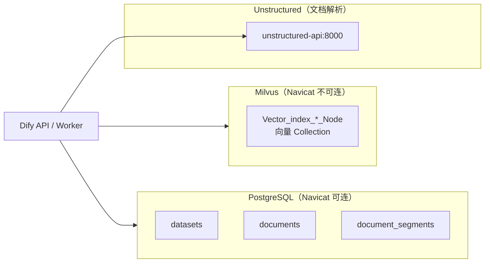

# Dify Docker 部署：数据库连接与操作指南

> 本文档汇总本地 Docker 部署 Dify（Milvus 向量库）时的 **数据库连接信息、Navicat 配置、架构说明与常用操作**。  
> 相关文档：[Milvus 迁移指南](./dify-banking-case-1.md)、[RAG 向量存储架构](./dify-rag-vector-storage-architecture.md)。

---

## 1. 架构：两套「数据库」各管什么

Dify RAG 存储是 **PostgreSQL 元数据 + Milvus 向量** 两层，不是单一 SQL 库。



| 存储 | 内容 | 客户端 |
|---|---|---|
| **PostgreSQL** | 知识库、文档、分段、账号、租户等 **元数据** | Navicat、psql、DBeaver |
| **Milvus** | Embedding 向量、BM25 稀疏向量、ANN 索引 | Attu、pymilvus、Milvus SDK |
| **Unstructured** | 文档解析 API（`.doc/.ppt/.msg` 等；PDF 建议二次开发接入） | HTTP `http://unstructured:8000` |
| **MinIO** | Milvus 向量段对象存储（一般无需直连） | MinIO Console |
| **etcd** | Milvus 集群元数据（一般无需直连） | etcdctl |

**结论**：用 **Navicat 连 PostgreSQL** 查业务元数据；查向量 Collection 请用 **Attu** 或 SDK，不要用 Navicat 连 Milvus。

---

## 2. Navicat 连接 PostgreSQL（Dify 元数据）

### 2.1 连接参数（当前本地部署默认值）

| 项 | 值 |
|---|---|
| 类型 | **PostgreSQL** |
| 主机 | `127.0.0.1` |
| 端口 | `5432` |
| 用户名 | `postgres` |
| 密码 | `difyai123456` |
| 数据库 | `dify` |

来源：`docker/.env` 中 `DB_USERNAME` / `DB_PASSWORD` / `DB_DATABASE`。

### 2.2 端口暴露（已配置）

默认 Compose **不** 把 PostgreSQL 映射到宿主机；已在 `docker/docker-compose.override.yaml` 增加：

```yaml
services:
  db_postgres:
    ports:
      - "5432:5432"
```

生效命令：

```bash
cd docker
docker compose up -d db_postgres
docker port docker-db_postgres-1 5432
# 期望输出：0.0.0.0:5432
```

### 2.3 端口冲突

若本机已有 PostgreSQL 占用 5432，将 override 改为：

```yaml
ports:
  - "5433:5432"
```

Navicat 端口填 **5433**。

### 2.4 常用表

| 表名 | 说明 |
|---|---|
| `datasets` | 知识库（名称、embedding 模型、`index_struct`） |
| `documents` | 文档 |
| `document_segments` | 文本分段（内容在 PG，向量在 Milvus） |
| `tenants` | 租户 / 工作空间 |
| `accounts` | 登录用户 |
| `tenant_account_joins` | 用户与租户关系 |

Collection 命名规则（Milvus 侧）：`Vector_index_{dataset_id}_Node`（`-` 替换为 `_`）。

---

## 3. Milvus 连接信息（非 Navicat）

### 3.1 连接参数（已验证可用）

| 项 | 值 |
|---|---|
| 协议 | gRPC over HTTP（非 SQL） |
| Milvus 版本 | `v2.6.3`（Standalone） |
| 认证 | **已开启**（`MILVUS_AUTHORIZATION_ENABLED=true`） |
| 用户名 | `root` |
| 密码 | `Milvus` |
| Token（可选） | `root:Milvus` |
| 数据库 | `default`（`MILVUS_DATABASE` 为空时） |

**按访问场景选择地址：**

| 场景 | 地址 / URI | 说明 |
|---|---|---|
| **Attu Web UI**（Attu 容器内） | `milvus-standalone:19530` | Attu 与 Milvus 同处 `docker_milvus` 网络 |
| **宿主机 SDK / 脚本** | `http://127.0.0.1:19530` 或 `http://localhost:19530` | pymilvus、curl 健康检查等 |
| **Dify API / Worker 容器** | `http://host.docker.internal:19530` | `docker/.env` 中 `MILVUS_URI` |
| **HTTP 健康检查** | `http://localhost:9091/healthz` | 无需认证 |

**Attu 连接页（http://localhost:8000/#/connect）填写：**

| 字段 | 值 |
|---|---|
| Milvus 地址 | `milvus-standalone:19530` |
| Milvus 数据库 | `default`（可留空） |
| 认证 | 勾选 |
| 用户名 | `root` |
| 密码 | `Milvus` |

Dify 容器内访问 URI（`docker/.env`，已验证）：

```env
VECTOR_STORE=milvus
MILVUS_URI=http://host.docker.internal:19530
MILVUS_USER=root
MILVUS_PASSWORD=Milvus
MILVUS_ENABLE_HYBRID_SEARCH=true
MILVUS_ANALYZER_PARAMS={"type":"chinese"}
```

健康检查：

```bash
curl -f http://localhost:9091/healthz
```

验证认证（宿主机 Python）：

```bash
python3 -c "
from pymilvus import connections, utility
connections.connect(uri='http://127.0.0.1:19530', user='root', password='Milvus')
print('collections:', utility.list_collections())
"
# 期望输出：collections: []  （尚无知识库时为 empty list）
```

### 3.2 认证说明

Milvus Standalone 默认开启认证（`common.security.authorizationEnabled=true`）。**所有客户端连接都必须携带 `root` / `Milvus`**，否则报错：

```text
Error: 16 UNAUTHENTICATED: missing authorization in header
```

处理方式：

1. Attu：连接页勾选「认证」，填写用户名 `root`、密码 `Milvus`（见 §3.1 表格）。
2. Dify：在 `docker/.env` 设置 `MILVUS_USER=root`、`MILVUS_PASSWORD=Milvus`，然后重启 `api`、`worker`：

   ```bash
   cd docker
   docker compose restart api worker
   ```

3. SDK / 脚本：连接时传入 `user` 与 `password`（见 §3.4），或使用 Token `root:Milvus`。

### 3.3 推荐可视化工具：Attu

Milvus 官方 Web 管理界面，替代 Navicat 查看 Collection、向量数量、索引：

| 项 | 值 |
|---|---|
| 项目 | <https://github.com/zilliztech/attu> |
| 访问地址 | <http://localhost:8000> |
| Attu 版本 | `v2.4.9` |
| 容器名 | `attu` |
| Docker 网络 | `docker_milvus`（与 `milvus-standalone` 同网） |
| Milvus 地址（Attu 内） | `milvus-standalone:19530` |
| 认证 | `root` / `Milvus` |

启动 Attu（需与 Milvus 在同一 Docker 网络 `docker_milvus`）：

```bash
docker run -d --name attu \
  --network docker_milvus \
  -p 8000:3000 \
  -e MILVUS_URL=milvus-standalone:19530 \
  -e MILVUS_USERNAME=root \
  -e MILVUS_PASSWORD=Milvus \
  -e MILVUS_TOKEN=root:Milvus \
  zilliz/attu:v2.4.9
```

若 Attu 已存在，先 `docker rm -f attu` 再执行上述命令。

### 3.4 Python 连接示例

```python
from pymilvus import connections, utility

connections.connect(
    uri="http://localhost:19530",
    user="root",
    password="Milvus",
)
print(utility.list_collections())
```

---

## 4. Milvus 栈其他组件（参考）

| 组件 | 容器名 | 端口（宿主机） | 账号/密码 |
|---|---|---|---|
| Milvus Standalone | `milvus-standalone` | 19530（gRPC）、9091（HTTP 健康） | `root` / `Milvus` |
| Attu（Web UI） | `attu` | 8000 | 连接 Milvus 时用 `root` / `Milvus` |
| etcd | `milvus-etcd` | 仅 Docker 内网 2379 | 无 |
| MinIO | `milvus-minio` | 仅 Docker 内网 9000 | `minioadmin` / `minioadmin` |

---

## 5. 环境变量速查（`docker/.env`）

### PostgreSQL

```env
DB_TYPE=postgresql
DB_USERNAME=postgres
DB_PASSWORD=difyai123456
DB_HOST=db_postgres
DB_PORT=5432
DB_DATABASE=dify
```

### Milvus

```env
VECTOR_STORE=milvus
MILVUS_URI=http://host.docker.internal:19530
MILVUS_USER=root
MILVUS_PASSWORD=Milvus
MILVUS_DATABASE=
MILVUS_ENABLE_HYBRID_SEARCH=true
MILVUS_ANALYZER_PARAMS={"type":"chinese"}
MILVUS_AUTHORIZATION_ENABLED=true
```

### 5.5 Unstructured 文档解析（ETL）

投研场景推荐启用 Unstructured，改善 Office 附件解析，并为 **PDF 表格/OCR** 提供统一底座（PDF 接入方式见 [dify-banking-case-1.md §2.4](./dify-banking-case-1.md#24-文档解析--etl-层unstructured)）。

**`docker/envs/core-services/shared.env`（或 `shared.env.example` 同步）：**

```env
ETL_TYPE=Unstructured
UNSTRUCTURED_API_URL=http://unstructured:8000
UNSTRUCTURED_API_KEY=
```

**`docker/.env` 追加 Compose Profile：**

```env
# 在现有 COMPOSE_PROFILES 末尾追加 unstructured（与 milvus 可并存）
COMPOSE_PROFILES=...,milvus,unstructured
```

**启动与注入 env（须同时重启 api/worker，否则索引任务读不到 ETL 配置）：**

```bash
cd docker

# 启动 Unstructured API 容器（profile: unstructured）
docker compose --profile unstructured up -d unstructured

# 重建 api / worker / worker_beat 使 shared.env 生效
docker compose --profile unstructured up -d api worker worker_beat

# 验证 worker 环境
docker exec docker-worker-1 env | grep -E 'ETL_TYPE|UNSTRUCTURED'

# 验证 API 可达（在 worker 网络内）
docker exec docker-worker-1 python -c \
  "import urllib.request; r=urllib.request.urlopen('http://unstructured:8000/healthcheck', timeout=5); print(r.read())"
# 期望：b'{"healthcheck":"OK"}' 或 HTTP 200
```

| 项 | 值 |
|---|---|
| 容器名（默认） | `docker-unstructured-1` |
| 镜像 | `downloads.unstructured.io/unstructured-io/unstructured-api:latest` |
| 容器内端口 | `8000` |
| Worker 访问地址 | `http://unstructured:8000` |
| 数据卷 | `docker/volumes/unstructured` → `/app/data` |
| Compose Profile | `unstructured` |

**格式路由说明（Dify 主线 v1.10+）：**

| 扩展名 | `ETL_TYPE=Unstructured` 时使用的 Extractor |
|---|---|
| `.pdf` | 内置 **`PdfExtractor`（pypdfium2）** — 非 Unstructured API |
| `.doc` | `UnstructuredWordExtractor` → Unstructured API |
| `.ppt` / `.pptx` | `UnstructuredPPTExtractor` / `UnstructuredPPTXExtractor` |
| `.msg` / `.eml` | `UnstructuredMsgExtractor` / `UnstructuredEmailExtractor` |
| `.docx` | 内置 `WordExtractor` |

源码：`api/core/rag/extractor/extract_processor.py`。若 PoC 样本以 PDF 为主，需按案例文档 §2.4 将 PDF 分支改为 `partition_via_api`。

**索引并发建议（避免 Embedding 429）：**

```env
CELERY_WORKER_AMOUNT=1
TENANT_ISOLATED_TASK_CONCURRENCY=1
```

大批量入库（如 32 份年报 PDF）时，通义等云端 Embedding 易触发 `Throttling.RateQuota`；宜 **逐个文档重试**，而非并行触发多份超大 PDF。

---

## 6. 常用运维命令

```bash
cd docker

# 查看数据库相关容器
docker compose ps db_postgres milvus-standalone milvus-etcd milvus-minio
docker ps --filter name=attu

# PostgreSQL 健康
docker exec docker-db_postgres-1 pg_isready -U postgres -d dify

# Milvus 健康
curl -f http://localhost:9091/healthz

# Milvus 认证连通性（Dify API 容器内）
docker exec docker-api-1 python3 -c "
from pymilvus import connections, utility
connections.connect(uri='http://host.docker.internal:19530', user='root', password='Milvus')
print('collections:', utility.list_collections())
"

# 进入 PostgreSQL 命令行（容器内）
docker exec -it docker-db_postgres-1 psql -U postgres -d dify
```

---

## 7. 常见问题

### Q1：Navicat 连不上 PostgreSQL

- 确认 `docker-compose.override.yaml` 已映射端口且 `docker compose up -d db_postgres` 已执行。
- 确认本机 5432 未被其他 PostgreSQL 占用。
- 密码与 `docker/.env` 中 `DB_PASSWORD` 一致。

### Q2：Navicat 能否连 Milvus？

**不能。** Milvus 使用 gRPC，Navicat 不支持。请用 Attu 或 pymilvus。

### Q3：PG 里能看到向量吗？

**不能。** 向量在 Milvus Collection 中；PG 的 `document_segments` 存文本与元数据，通过 `dataset_id` / `document_id` 与 Milvus 关联。

### Q4：`/install` 页面一直 loading

多为 nginx 缓存了旧 API 容器 IP，导致 `/console/api/*` 返回 502。处理：

```bash
docker compose restart nginx
```

已在 `docker/nginx/conf.d/default.conf.template` 为 API 路由配置动态 DNS，避免 API 重启后再现。

### Q5：新建知识库走哪个向量库？

`VECTOR_STORE=milvus` 生效后 **新建的 Dataset** 才写入 Milvus；PoC 时期 Weaviate 上的旧库不会自动迁移。

### Q6：Attu 报 `UNAUTHENTICATED: missing authorization in header`

Milvus 已开启认证，Attu 连接页必须勾选「认证」并填写 **`root` / `Milvus`**。若仍失败，重建 Attu 容器（见 §3.3 启动命令），确保环境变量 `MILVUS_USERNAME`、`MILVUS_PASSWORD`、`MILVUS_TOKEN=root:Milvus` 已注入。

### Q7：文档索引失败，`MILVUS_USER is required`

Worker 容器未注入 Milvus 认证 env。在 `docker/envs/core-services/shared.env` 设置 `MILVUS_USER=root`、`MILVUS_PASSWORD=Milvus`，然后 **重建** worker（`docker compose up -d api worker worker_beat --force-recreate`），勿仅 `restart`。

### Q8：文档索引失败，`Throttling.RateQuota`（429）

云端 Embedding（如通义 `multimodal-embedding-v1`）限流，常见于多份 **超长 PDF 并行索引**。处理：

1. `CELERY_WORKER_AMOUNT=1`，在 UI 中 **逐个重试** 失败文档；
2. 失败间隔 5–10 分钟，或提升百炼配额；
3. 与 Unstructured / Milvus 配置无关，勿误判为 ETL 故障。

### Q9：启用 Unstructured 后 PDF 仍走内置解析？

是。主线代码在 `ETL_TYPE=Unstructured` 下 **`.pdf` 仍用 `PdfExtractor`**。Unstructured 容器主要服务 `.doc/.ppt/.msg` 等；PDF 表格/OCR 优化需按 [dify-banking-case-1.md §2.4](./dify-banking-case-1.md#24-文档解析--etl-层unstructured) 二次开发接入。

---

## 8. 相关文件

| 文件 | 说明 |
|---|---|
| `docker/.env` | 数据库账号、Milvus URI、Compose Profiles（本地生效，git 忽略） |
| `docker/envs/core-services/shared.env` | `ETL_TYPE`、`UNSTRUCTURED_*`、`MILVUS_*` 等共享 env |
| `docker/docker-compose.yaml` | `unstructured` profile 服务定义 |
| `docker/docker-compose.override.yaml` | PostgreSQL 5432 端口映射 |
| `docker/nginx/conf.d/default.conf.template` | API 反向代理（动态 DNS） |
| `docker/pull-images-cn.sh` | 国内镜像预拉取（含 Milvus 华为云 SWR） |
| `api/configs/middleware/vdb/milvus_config.py` | Milvus 配置类源码 |
| `api/core/rag/extractor/extract_processor.py` | ETL 格式路由（含 PDF / Unstructured 分支） |

---

**一句话**：Navicat → **PostgreSQL `127.0.0.1:5432`** 查元数据；向量 → **Milvus `localhost:19530`**（认证 **`root` / `Milvus`**）用 Attu（<http://localhost:8000>）或 SDK；文档解析 → **`ETL_TYPE=Unstructured`** + **`unstructured` 容器**（配置见 §5.5）。
