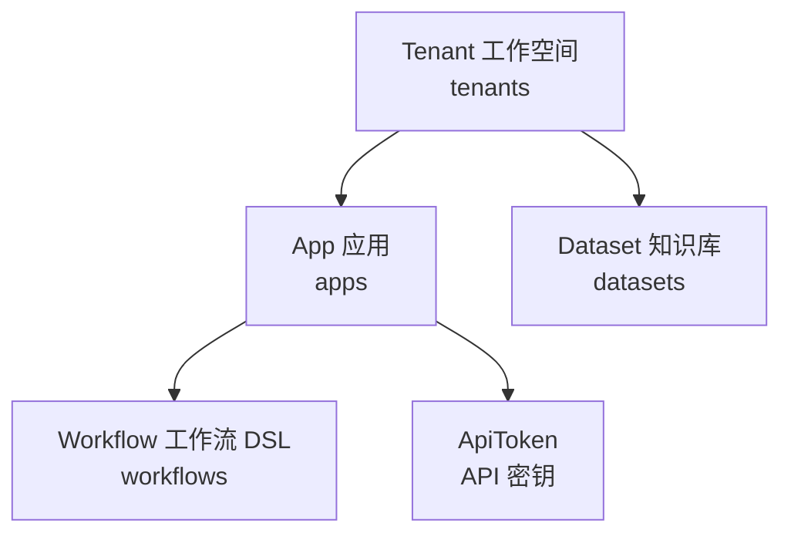
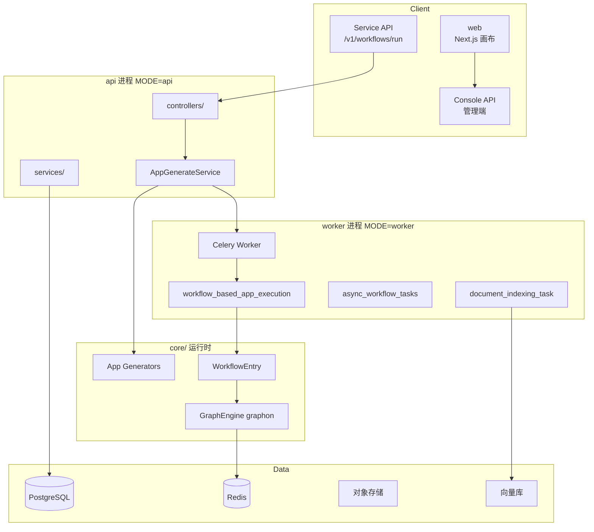
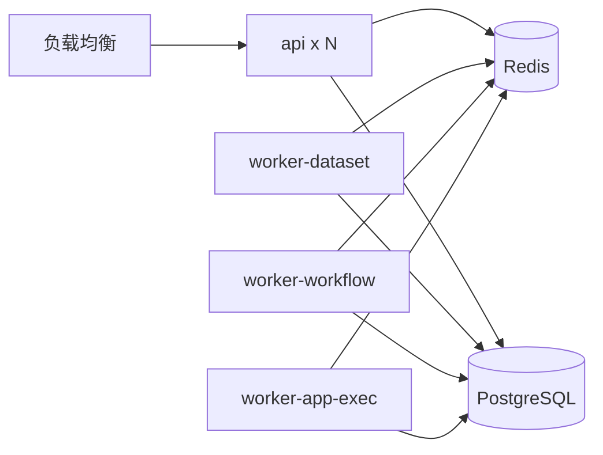
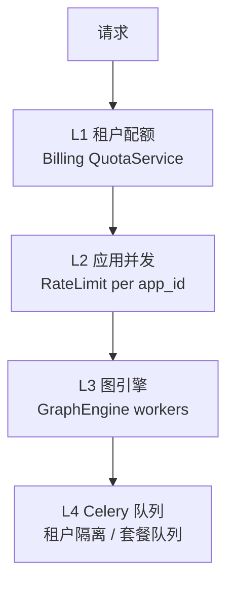

# Dify 大规模应用承载：架构、隔离、部署与限流

> 本文档基于 Dify 源码分析 **平台如何承载上千个应用的开发与运行**，给出框架分层、关键代码路径，并与 [BankGPT 多应用平台设计](./bankgpt-multi-app-platform.md) 对照。  
> 结论先行：**Dify 不为每个应用单独部署服务**；应用是数据库中的 `App` + `Workflow` 记录，由 **共享 API / Celery Worker 池 + GraphEngine** 按 `tenant_id` / `app_id` 隔离执行。

---

## 1. 核心模型：应用是什么

### 1.1 三层归属关系



| 实体 | 表 | 关键字段 | 含义 |
|------|-----|----------|------|
| **Tenant** | `tenants` | `id`, `plan`, `status` | 工作空间（多租户边界） |
| **App** | `apps` | `tenant_id`, `mode`, `workflow_id`, `max_active_requests` | 一个可发布的 AI 应用 |
| **Workflow** | `workflows` | `tenant_id`, `app_id`, `version`, `graph` (JSON) | 画布 DSL（节点+边） |
| **ApiToken** | `api_tokens` | `app_id`, `tenant_id`, `token` | 对外 API 鉴权 |

上千应用 = **上千行 `apps` 记录**，共享同一套 `api` / `worker` 进程，而非上千个容器。

### 1.2 App 模型（关键字段）

```396:428:api/models/model.py
class App(Base):
    __tablename__ = "apps"
    __table_args__ = (sa.PrimaryKeyConstraint("id", name="app_pkey"), sa.Index("app_tenant_id_idx", "tenant_id"))

    id: Mapped[str] = mapped_column(StringUUID, default=lambda: str(uuid4()))
    tenant_id: Mapped[str] = mapped_column(StringUUID)
    name: Mapped[str] = mapped_column(String(255))
    ...
    mode: Mapped[AppMode] = mapped_column(EnumText(AppMode, length=255))
    ...
    workflow_id = mapped_column(StringUUID, nullable=True)
    ...
    enable_api: Mapped[bool] = mapped_column(sa.Boolean)
    api_rpm: Mapped[int] = mapped_column(sa.Integer, server_default=sa.text("0"))
    api_rph: Mapped[int] = mapped_column(sa.Integer, server_default=sa.text("0"))
    ...
    max_active_requests: Mapped[int | None]
```

**应用模式（`AppMode`）** 决定运行时走哪条 Generator 链路：`workflow`、`advanced-chat`、`agent-chat`、`chat`、`completion`、`agent` 等。

### 1.3 Workflow：逻辑载体

工作流图以 **JSON 字符串** 存于 `workflows.graph`，运行时反序列化为 `graph_dict`：

```168:220:api/models/workflow.py
class Workflow(Base):  # bug
    """
    Workflow, for `Workflow App` and `Chat App workflow mode`.
    ...
    - graph (text) Workflow canvas configuration (JSON)
        The entire canvas configuration JSON, including Node, Edge, and other configurations
    """
    __tablename__ = "workflows"
    __table_args__ = (
        sa.PrimaryKeyConstraint("id", name="workflow_pkey"),
        sa.Index("workflow_version_idx", "tenant_id", "app_id", "version"),
    )
    ...
    tenant_id: Mapped[str] = mapped_column(StringUUID, nullable=False)
    app_id: Mapped[str] = mapped_column(StringUUID, nullable=False)
    version: Mapped[str] = mapped_column(String(255), nullable=False)
    graph: Mapped[str] = mapped_column(LongText)
```

每个 App 通常有 **draft** 版本 + 若干 **发布版本**（`version != "draft"`）。

---

## 2. 平台分层架构



| 层级 | 目录 | 职责 |
|------|------|------|
| **接入** | `api/controllers/` | Console / Service API / Web / Trigger |
| **服务** | `api/services/` | 应用 CRUD、生成、工作流、配额 |
| **运行时** | `api/core/app/` | 各模式 AppGenerator |
| **引擎** | `api/core/workflow/` | WorkflowEntry、节点工厂、变量池 |
| **图执行** | graphon `GraphEngine` | 并行节点、Worker 池、Layer |
| **异步** | `api/tasks/` | Celery 任务 |
| **前端** | `web/` | 画布、应用管理 |

---

## 3. 应用开发：如何「生产」上千应用

### 3.1 开发方式

| 方式 | 入口 | 产出 |
|------|------|------|
| **可视化画布** | Web UI | `workflows.graph` JSON 写入 DB |
| **DSL 导入导出** | `AppDslService` | YAML/JSON 包迁移应用 |
| **API 创建** | Console API | `AppService.create_app` |
| **模板 / 复制** | 应用市场、`InstalledApp` | 跨租户安装 |

应用列表按 **租户** 分页查询，带 `tenant_id` 过滤：

```109:117:api/services/app_service.py
    def get_paginate_apps(self, user_id: str, tenant_id: str, params: AppListParams) -> Pagination | None:
        ...
        filters = [App.tenant_id == tenant_id, App.is_universal == False]
```

### 3.2 发布流程

1. 编辑 **draft** workflow（`version = "draft"`）
2. `WorkflowService.publish_workflow()` 校验图结构、凭证、触发器数量等
3. 生成新版本 workflow 记录，更新 `app.workflow_id` 指向已发布版
4. 开启 `enable_api` 后可通过 ApiToken 对外服务

### 3.3 为何能 scale 到上千应用

| 因素 | 说明 |
|------|------|
| **元数据轻量** | 每应用主要是 JSON DSL + 配置行，无独立进程 |
| **共享引擎** | 所有应用共用同一套节点实现（`graphon` BuiltinNodeTypes） |
| **按租户索引** | `app_tenant_id_idx`、`workflow_version_idx` 加速查询 |
| **懒加载图** | 请求到达时从 DB 读 `graph`，构建 `Graph` 对象后执行 |
| **插件扩展** | 新能力通过 Plugin Daemon 安装，不必改应用部署单元 |

---

## 4. 应用运行：请求链路

### 4.1 统一入口 `AppGenerateService.generate`

所有应用调用（调试、Service API、Web）汇聚到：

```88:120:api/services/app_generate_service.py
    @classmethod
    @trace_span(AppGenerateHandler)
    def generate(
        cls,
        app_model: App,
        user: Account | EndUser,
        args: Mapping[str, Any],
        invoke_from: InvokeFrom,
        streaming: bool = True,
        root_node_id: str | None = None,
    ):
        ...
        if dify_config.BILLING_ENABLED:
            try:
                quota_charge = QuotaService.reserve(QuotaType.WORKFLOW, app_model.tenant_id)
            except QuotaExceededError:
                raise InvokeRateLimitError(...)

        # app level rate limiter
        max_active_request = cls._get_max_active_requests(app_model)
        rate_limit = RateLimit(app_model.id, max_active_request)
        request_id = RateLimit.gen_request_key()
        try:
            request_id = rate_limit.enter(request_id)
```

按 `app_model.mode` 分发到不同 Generator（Completion / Chat / Workflow / Agent 等）。

### 4.2 工作流类应用执行路径

**流式 Advanced Chat / Workflow**（高并发场景）：

1. API 进程：`rate_limit.enter()` 占位
2. 投递 Celery 任务 `workflow_based_app_execution_task`（队列 `workflow_based_app_execution`）
3. Worker 内 `WorkflowAppRunner.run()` → `WorkflowEntry.run()`
4. SSE / Redis Stream 回传事件

```274:283:api/tasks/app_generate/workflow_execute_task.py
@shared_task(queue=WORKFLOW_BASED_APP_EXECUTION_QUEUE)
def workflow_based_app_execution_task(
    payload: str,
) -> Generator[Mapping[str, Any] | str, None, None] | Mapping[str, Any] | None:
    exec_params = AppExecutionParams.model_validate_json(payload)
    ...
    runner = _AppRunner(db.engine, exec_params=exec_params)
    return runner.run()
```

`AppExecutionParams` 序列化时携带 `app_id`、`workflow_id`、`tenant_id`，保证 Worker 侧租户上下文完整。

### 4.3 GraphEngine 执行

```155:232:api/core/workflow/workflow_entry.py
class WorkflowEntry:
    def __init__(self, ...):
        ...
        self.graph_engine = GraphEngine(
            workflow_id=workflow_id,
            graph=graph,
            graph_runtime_state=graph_runtime_state,
            ...
            config=GraphEngineConfig(
                min_workers=dify_config.GRAPH_ENGINE_MIN_WORKERS,
                max_workers=dify_config.GRAPH_ENGINE_MAX_WORKERS,
                scale_up_threshold=dify_config.GRAPH_ENGINE_SCALE_UP_THRESHOLD,
                scale_down_idle_time=dify_config.GRAPH_ENGINE_SCALE_DOWN_IDLE_TIME,
            ),
            ...
        )
        ...
        limits_layer = ExecutionLimitsLayer(
            max_steps=dify_config.WORKFLOW_MAX_EXECUTION_STEPS, max_time=dify_config.WORKFLOW_MAX_EXECUTION_TIME
        )
        self.graph_engine.layer(limits_layer)
        self.graph_engine.layer(LLMQuotaLayer(tenant_id=tenant_id))
```

默认限制（`api/configs/feature/__init__.py`）：

| 配置 | 默认值 | 含义 |
|------|--------|------|
| `WORKFLOW_MAX_EXECUTION_STEPS` | 500 | 单次运行最大步数 |
| `WORKFLOW_MAX_EXECUTION_TIME` | 1200s | 单次最长执行时间 |
| `GRAPH_ENGINE_MIN_WORKERS` | 3 | 图引擎最小 Worker |
| `GRAPH_ENGINE_MAX_WORKERS` | 10 | 图引擎最大 Worker |
| `WORKFLOW_CALL_MAX_DEPTH` | 5 | 嵌套工作流调用深度 |

### 4.4 异步触发工作流（Webhook / Schedule / Plugin Trigger）

`AsyncWorkflowService.trigger_workflow_async` **非阻塞**入队：

```52:80:api/services/async_workflow_service.py
    def trigger_workflow_async(...):
        """
        Universal entry point for async workflow execution - THIS METHOD WILL NOT BLOCK
        ...
        Queue-based: Routes to different queues based on subscription tier
        """
```

按租户订阅计划选择队列（`QueueDispatcherManager`）：

```72:111:api/services/workflow/queue_dispatcher.py
class QueueDispatcherManager:
  PLAN_DISPATCHER_MAP = {
      "professional": ProfessionalQueueDispatcher,  # workflow_professional
      "team": TeamQueueDispatcher,                  # workflow_team
      "sandbox": SandboxQueueDispatcher,            # workflow_sandbox
  }
  def get_dispatcher(cls, tenant_id: str) -> BaseQueueDispatcher:
      ...
```

---

## 5. 应用间隔离

### 5.1 隔离维度

| 维度 | 机制 | 关键代码/存储 |
|------|------|---------------|
| **租户** | 所有核心表带 `tenant_id` | `App.tenant_id`, `Workflow.tenant_id` |
| **应用** | `app_id` 外键 + ApiToken 绑定 | `validate_app_token` |
| **API 鉴权** | Token → App → Tenant | `controllers/service_api/wraps.py` |
| **并发槽位** | 按 `app.id` 的 Redis 计数 | `RateLimit(client_id=app_model.id)` |
| **工作流运行** | `workflow_runs` 记录 `app_id`, `tenant_id` | 持久化层 |
| **知识库** | `datasets.tenant_id` | RAG 检索 scoped |
| **文件存储** | 存储路径含 tenant | `extensions/ext_storage` |
| **凭证** | 工作流环境变量加密 | `workflow.environment_variables` |
| **插件** | Plugin Daemon 按 tenant 安装 | `core/plugin/` |
| **重型任务** | 租户隔离队列 | `TenantIsolatedTaskQueue` |

### 5.2 租户隔离队列（RAG / 索引）

文档索引等 **租户级串行/限并发** 任务使用 Redis 列表队列：

```25:36:api/core/rag/pipeline/queue.py
class TenantIsolatedTaskQueue:
    """
    Simple queue for tenant isolated tasks, used for rag related tenant tasks isolation.
  ...
    def __init__(self, tenant_id: str, unique_key: str):
        self._queue = f"tenant_self_{unique_key}_task_queue:{tenant_id}"
        self._task_key = f"tenant_{unique_key}_task:{tenant_id}"
```

配置项 `TENANT_ISOLATED_TASK_CONCURRENCY`（默认 **1**）控制每租户同时执行的任务数。

索引任务按 **计费套餐** 路由到不同 Celery 队列（`DocumentTaskProxyBase._dispatch`）：

- Sandbox → 普通队列 + 租户隔离  
- 付费 → 优先队列 + 租户隔离  
- 自托管 → 优先队列、无隔离  

### 5.3 Service API 鉴权链

```56:80:api/controllers/service_api/wraps.py
def validate_app_token(...):
    def decorated_view(...):
        api_token = validate_and_get_api_token("app")
        app_model = db.session.get(App, api_token.app_id)
        ...
        if not app_model.enable_api:
            raise Forbidden("The app's API service has been disabled.")
        tenant = db.session.get(Tenant, app_model.tenant_id)
        ...
        kwargs["app_model"] = app_model
```

每个 API Key **绑定单一 App**，天然隔离应用边界。

### 5.4 应用间不隔离的部分（需注意）

| 共享资源 | 说明 |
|----------|------|
| **API / Worker 进程** | 所有应用共用，故障可能相互影响 |
| **GraphEngine Worker 池** | 单进程内多应用图执行共享线程池 |
| **LLM 提供商配额** | 租户级模型配置，多应用共享同一 Provider 密钥 |
| **Celery 队列** | 同队列任务竞争 Worker 并发 |

---

## 6. 部署架构

### 6.1 Docker Compose 典型拓扑

| 服务 | 镜像 | MODE / 角色 |
|------|------|-------------|
| **api** | `dify-api` | `MODE=api`，Gunicorn 处理 HTTP |
| **worker** | `dify-api` | `MODE=worker`，Celery 消费队列 |
| **worker_beat** | `dify-api` | 定时任务 |
| **web** | `dify-web` | 前端 |
| **db** | PostgreSQL / MySQL | 元数据 + 运行记录 |
| **redis** | Redis | 缓存、限流、队列、SSE |
| **sandbox** | 沙箱 | 代码节点执行 |
| **plugin_daemon** | 插件守护 | 插件隔离进程 |
| **nginx** | 反向代理 | 可选 |

Worker 启动时注册 **多队列**（社区版 excerpt）：

```34:41:api/docker/entrypoint.sh
  if [[ -z "${CELERY_QUEUES}" ]]; then
    ...
      DEFAULT_QUEUES="api_token,dataset,...,workflow,schedule_poller,...,workflow_based_app_execution"
```

可通过 `CELERY_WORKER_QUEUES` 拆分专职 Worker（如仅 `workflow_based_app_execution`）。

### 6.2 水平扩展方式

| 组件 | 扩展手段 |
|------|----------|
| **api** | 增加 `api` 副本 + 负载均衡 |
| **worker** | 增加 `worker` 副本；`CELERY_AUTO_SCALE` / `CELERY_WORKER_CONCURRENCY` |
| **web** | 静态前端多副本 |
| **db** | 读副本、连接池调优 |
| **redis** | 集群 / 分片 |

**不需要**按应用数扩展容器；按 **QPS、队列深度、LLM 延迟** 扩展。

### 6.3 进程角色分离（生产建议）



- `CELERY_WORKER_QUEUES=workflow_based_app_execution` — 专职对话/工作流执行  
- `CELERY_WORKER_QUEUES=dataset,pipeline` — 专职知识库索引  
- `CELERY_WORKER_QUEUES=workflow` — 异步触发工作流  

---

## 7. 限流与并发控制

### 7.1 四层控制



### 7.2 L1：租户级配额（Cloud）

```109:113:api/services/app_generate_service.py
        if dify_config.BILLING_ENABLED:
            try:
                quota_charge = QuotaService.reserve(QuotaType.WORKFLOW, app_model.tenant_id)
            except QuotaExceededError:
                raise InvokeRateLimitError(...)
```

按租户预留工作流执行配额，失败则拒绝。

### 7.3 L2：应用级并发（核心）

`RateLimit` 以 **`app_id` 为 client_id**，Redis Hash 记录进行中的请求：

```15:88:api/core/app/features/rate_limiting/rate_limit.py
class RateLimit:
    _MAX_ACTIVE_REQUESTS_KEY = "dify:rate_limit:{}:max_active_requests"
    _ACTIVE_REQUESTS_KEY = "dify:rate_limit:{}:active_requests"
    _REQUEST_MAX_ALIVE_TIME = 10 * 60  # 10 minutes
    ...
    def enter(self, request_id: str | None = None) -> str:
        ...
        active_requests_count = redis_client.hlen(self.active_requests_key)
        if active_requests_count >= self.max_active_requests:
            raise AppInvokeQuotaExceededError(...)
        redis_client.hset(self.active_requests_key, request_id, str(time.time()))
```

上限计算（应用配置 ∩ 全局配置，取更小非零值）：

```282:301:api/services/app_generate_service.py
    def _get_max_active_requests(app: App) -> int:
        app_limit = app.max_active_requests or dify_config.APP_DEFAULT_ACTIVE_REQUESTS
        config_limit = dify_config.APP_MAX_ACTIVE_REQUESTS
        limits = [limit for limit in [app_limit, config_limit] if limit > 0]
        return min(limits) if limits else 0
```

| 配置 | 默认 | 含义 |
|------|------|------|
| `App.max_active_requests` | `NULL` | 单应用并发上限（0=用默认） |
| `APP_DEFAULT_ACTIVE_REQUESTS` | **0** | 默认并发（0=不限） |
| `APP_MAX_ACTIVE_REQUESTS` | **0** | 全局硬顶（0=不限） |

`api_rpm` / `api_rph` 字段存在于 App 模型，用于 **API 速率配置**（可在应用设置中调整）；知识库等有独立的 `KnowledgeRateLimit`（`service_api/wraps.py` 中 ZSET 滑动窗口）。

### 7.4 L3：GraphEngine 进程内并发

单 Worker 进程内，`GraphEngine` 动态扩缩 Worker 线程（默认 3–10），控制 **单工作流图** 的并行节点执行，与 **应用数量** 无直接对应关系。

### 7.5 L4：Celery 队列与租户隔离

| 场景 | 队列 | 隔离 |
|------|------|------|
| 流式工作流执行 | `workflow_based_app_execution` | 共享队列，靠 L2 限流 |
| 异步触发工作流 | `workflow_professional` / `workflow_team` / `workflow_sandbox` | 按套餐分队列 |
| 文档索引 | `dataset` / `priority_dataset` | `TenantIsolatedTaskQueue` |
| RAG Pipeline | `pipeline` / `priority_pipeline` | 租户隔离 |

`TENANT_ISOLATED_TASK_CONCURRENCY` 默认 **1**：同一租户索引任务串行 dequeue，防止单租户占满 Worker。

### 7.6 其他限流点

| 位置 | 机制 |
|------|------|
| Human Input 表单 | `RateLimiter`（IP 级） |
| 标注导入 | `annotation_import_concurrency_limit` |
| LLM 调用 | `LLMQuotaLayer(tenant_id)` 在图引擎层 |
| 工作流画布 | `MAX_TREE_DEPTH=50` 等前端/发布校验 |

---

## 8. 上千应用场景：瓶颈与实践

### 8.1 主要瓶颈（非应用数量本身）

| 瓶颈 | 原因 |
|------|------|
| **PostgreSQL 写入** | `workflow_runs`、`workflow_node_executions` 高增长 |
| **Redis** | 限流 Key、SSE Stream、Celery Broker |
| **Celery Worker 并发** | 长运行工作流占满 gevent worker |
| **LLM 延迟/配额** | 所有应用共享 Provider TPM |
| **向量库** | 知识库检索 QPS |

### 8.2 运维建议

1. **拆分 Worker 队列**，避免索引任务饿死对话  
2. **配置 `max_active_requests`**，防止单应用占满并发  
3. **开启 OTel / Logstore**，按 `app_id` 监控 p99  
4. **DB 分区 / 归档** `workflow_node_executions` 历史数据  
5. **Redis 高可用**，限流与 Broker 依赖 Redis  
6. **api 与 worker 独立 HPA**，按 CPU 与队列深度  

### 8.3 容量粗算示例

假设 **1000 个注册应用**，**200 个活跃**，峰值 **300 并发 Run**：

| 组件 | 粗算 |
|------|------|
| api | 4–8 副本 |
| worker (app execution) | `300 / worker_concurrency` 副本 |
| PostgreSQL | 关注 node_execution 表大小 |
| Redis | 每活跃 Run 若干 Key |

应用 **注册数量** 对内存几乎无感；**并发 Run 数** 决定算力。

---

## 9. 与 BankGPT 多应用模型对照

| 维度 | Dify | BankGPT（设计文档） |
|------|------|---------------------|
| 应用定义 | DB `App` + JSON DSL | Manifest + Python Graph |
| 运行时 | 共享 api/worker + GraphEngine | 共享 graph-worker |
| 逻辑存储 | `workflows.graph` | Git + Registry |
| 隔离 | `tenant_id` + `app_id` + RateLimit | 六维隔离 + 配额 |
| 限流 | RateLimit(app_id) + 租户配额 + 队列 | 四层限流模型 |
| 扩展方式 | 插件、Fork | LangChain Tool、Layer |
| 适用 | 低代码上千应用 | 金融深度定制上千应用 |

两者 **多应用哲学一致**：共享运行时 + 元数据隔离；差异在 **逻辑表达（DSL vs 代码）** 与 **垂直能力深度**。

---

## 10. 关键代码索引

| 主题 | 路径 |
|------|------|
| App 模型 | `api/models/model.py` |
| Workflow 模型 | `api/models/workflow.py` |
| Tenant 模型 | `api/models/account.py` |
| 应用生成入口 | `api/services/app_generate_service.py` |
| 应用并发限流 | `api/core/app/features/rate_limiting/rate_limit.py` |
| 工作流执行入口 | `api/core/workflow/workflow_entry.py` |
| 工作流 App 运行器 | `api/core/app/apps/workflow/app_runner.py` |
| Celery 工作流任务 | `api/tasks/app_generate/workflow_execute_task.py` |
| 异步触发 | `api/services/async_workflow_service.py` |
| 套餐队列分发 | `api/services/workflow/queue_dispatcher.py` |
| 租户任务队列 | `api/core/rag/pipeline/queue.py` |
| Service API 鉴权 | `api/controllers/service_api/wraps.py` |
| Worker 启动/队列 | `api/docker/entrypoint.sh` |
| 功能配置上限 | `api/configs/feature/__init__.py` |
| Docker 编排 | `docker/docker-compose.yaml` |
| 二次开发扩展点 | [dify-secondary-development.md](./dify-secondary-development.md) |
| BankGPT 对照 | [bankgpt-multi-app-platform.md](./bankgpt-multi-app-platform.md) |

---

## 11. 总结

| 问题 | Dify 的做法 |
|------|-------------|
| **如何承载上千应用？** | 应用是 DB 记录；共享 api + worker + GraphEngine；按请求加载 DSL |
| **如何开发？** | Web 画布 / DSL 导入；发布生成 workflow 版本 |
| **如何隔离？** | `tenant_id` 贯穿；`app_id` 限流与鉴权；租户队列隔离重型任务 |
| **如何部署？** | Docker：api、worker、web、db、redis、sandbox、plugin；水平扩 worker/api |
| **限流并发？** | 租户配额 → 应用 `RateLimit` → GraphEngine → Celery 队列分层 |

**一句话**：Dify 用 **「多租户 SaaS + 共享 Celery/GraphEngine 运行时」** 承载大规模应用；扩展算力靠 **Worker 副本与队列拆分**，而非 per-app 部署。
