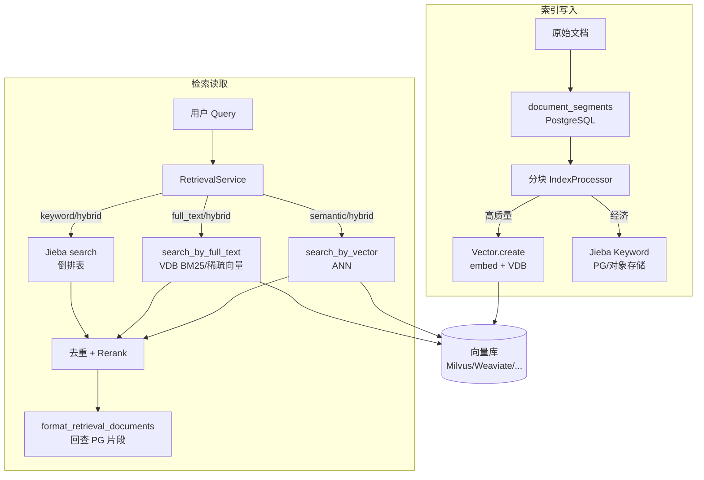
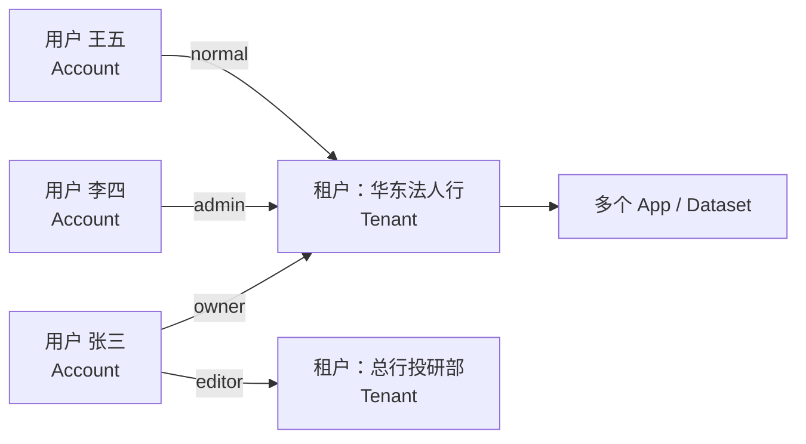
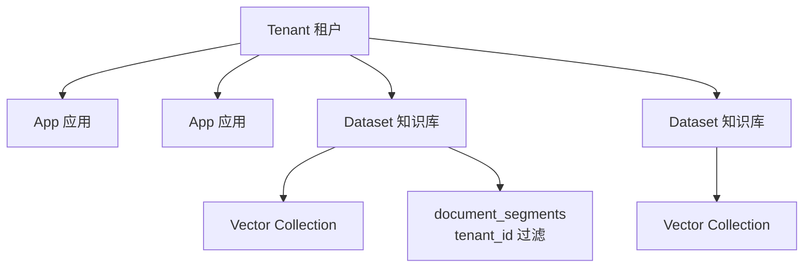
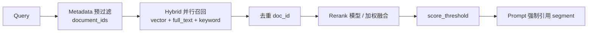

# Dify RAG 向量存储架构：缺陷分析、分类嵌入与检索可靠性

> 基于 Dify 源码梳理 RAG 向量存储的真实架构，说明平台边界、规模化风险与生产级可靠性方案。  
> 相关文档：[银行业务面试案例](./dify-banking-interview-cases.md)、[多应用承载](./dify-multi-app-platform.md)、[二次开发扩展](./dify-secondary-development.md)。

---

## 1. 架构总览

Dify 的 RAG 存储是 **「PostgreSQL 元数据 + 向量库 ANN + 可选 Jieba 关键词表」** 的三层结构，而非单一向量引擎。



### 1.1 核心组件与源码锚点

| 组件 | 职责 | 源码位置 |
|------|------|----------|
| **Dataset** | 知识库单元；绑定 embedding 模型、索引模式 | `api/models/dataset.py` |
| **Vector** | 向量读写门面；懒加载 Embedding | `api/core/rag/datasource/vdb/vector_factory.py` |
| **BaseVector** | 各 VDB 适配（create/search/delete） | `api/core/rag/datasource/vdb/vector_base.py` |
| **Keyword (Jieba)** | 经济模式 / 混合检索关键词 | `api/core/rag/datasource/keyword/jieba/jieba.py` |
| **RetrievalService** | 检索编排、并行、去重、Rerank | `api/core/rag/datasource/retrieval_service.py` |
| **CacheEmbedding** | Embedding 结果缓存到 PG | `api/core/rag/embedding/cached_embedding.py` |
| **DataPostProcessor** | Rerank 模型 / 加权融合 | `api/core/rag/data_post_processor/data_post_processor.py` |

### 1.2 存储粒度：一知识库 = 一向量 Collection

每个 Dataset 在向量库中对应 **独立 Collection**，命名规则：

```446:448:api/models/dataset.py
    def gen_collection_name_by_id(dataset_id: str) -> str:
        normalized_dataset_id = dataset_id.replace("-", "_")
        return f"{dify_config.VECTOR_INDEX_NAME_PREFIX}_{normalized_dataset_id}_Node"
```

默认前缀 `Vector_index`（`VECTOR_INDEX_NAME_PREFIX`）。Collection 创建时写入 `dataset.index_struct`，**向量库类型在知识库创建时锁定**，后续全局 `VECTOR_STORE` 变更不影响已有库。

向量片段 metadata 固定字段包括：`doc_id`、`dataset_id`、`document_id`、`doc_hash`、`doc_type`、`is_summary`、`original_chunk_id` 等（见 `Vector.__init__` attributes 列表）。

### 1.3 租户与多租户（概念与 Dify 落地）

后文多次出现 **租户（Tenant）**、**多租户（Multi-tenancy）**；先厘清含义，再对照 Dify 与 RAG 的关系。

#### 1.3.1 租户是什么意思？

**租户** = 平台上 **资源与权限的归属边界**，通常对应一个 **独立组织单元**（公司、法人、事业部、付费客户等）。

可以把它理解成 **「一套独立的工作空间」**：

- 有自己的成员（账号）、应用、知识库、模型凭证
- 默认 **看不到** 其他租户的数据
- 共享同一套 Dify 部署（同一套 API / 数据库 / 向量库集群），但数据 **逻辑隔离**

在 Dify 源码中，租户是 `tenants` 表中的一条记录：

```240:252:api/models/account.py
class Tenant(TypeBase):
    __tablename__ = "tenants"
    ...
    id: Mapped[str] = mapped_column(...)
    name: Mapped[str] = mapped_column(String(255))
    plan: Mapped[str] = mapped_column(String(255), server_default=sa.text("'basic'"), default="basic")
    status: Mapped[TenantStatus] = mapped_column(...)
```

用户（`Account`）通过 `tenant_account_joins` 加入租户，并携带角色（owner / admin / normal 等）。

#### 1.3.2 常见误解：一个租户 ≠ 一个登录用户

**不是。** Dify 里 **租户（Tenant）** 和 **登录用户（Account）** 是 **多对多** 关系，不是 1:1。

| 概念 | 英文/表名 | 是什么 |
|------|-----------|--------|
| **登录用户** | `Account` / `accounts` | 用邮箱注册、登录控制台的人 |
| **租户 / 工作空间** | `Tenant` / `tenants` | 资源归属单位；UI 里常叫 **Workspace** |
| **成员关系** | `TenantAccountJoin` | 某用户在某租户里的角色（owner/admin/editor/…） |

关系示意：



- **一个租户 → 多个用户**：华东法人行租户下有 50 名员工，共享同一套应用和知识库。
- **一个用户 → 多个租户**：张三既是华东行的 owner，又被邀请为总行投研部的 editor；登录后 **切换当前工作空间**（`Account.current_tenant`）决定操作哪个租户的资源。

注册时的默认行为容易让人误以为「一人一户」：首次注册若用户尚无任何工作空间，系统会 **自动创建一个** 名为 `{用户名}'s Workspace` 的租户，并设为 owner（`TenantService.create_owner_tenant_if_not_exist`）。这只是 **初始化默认工作空间**，并不限制用户只能拥有一个租户——后续仍可 **被邀请加入其他租户**，或 **再创建新工作空间**（受 License / `is_allow_create_workspace` 控制）。

登录会话中的有效租户由 **`current_tenant_id`** 决定；API 层通过 `@with_current_tenant_id` 注入，所有知识库、文档操作都校验 `document.tenant_id == current_tenant_id`：

```118:154:api/models/account.py
    role: TenantAccountRole | None = field(default=None, init=False)
    _current_tenant: "Tenant | None" = field(default=None, init=False)

    @property
    def current_tenant(self):
        return self._current_tenant
    ...
    @property
    def current_tenant_id(self) -> str | None:
        return self._current_tenant.id if self._current_tenant else None
```

**对照表（避免面试/架构表述错误）**

| 说法 | 对错 | 正确表述 |
|------|------|----------|
| 一个登录用户 = 一个租户 | ❌ | 用户与租户是多对多；用户有 **当前选中的** 一个租户 |
| 注册 Dify = 新建一个租户 | ⚠️ 部分对 | 首次注册会 **默认创建** 一个个人工作空间，不等于永远只有这一个 |
| 租户 = 团队/组织工作空间 | ✅ | 私有化里常映射为法人、子公司、部门 |
| 租户 = 知识库 | ❌ | 一个租户下有 **多个** Dataset |
| API 调用方的 tenant | 视场景 | Service API 走 `App.tenant_id`（应用归属），与「谁在控制台登录」无关 |

**银行场景再举例**

```text
用户：科技员 张三（一个 Account）
├── 当前工作空间：华东法人行（Tenant A）→ 管理小微贷 App、上传制度库
└── 可切换到：总行投研部（Tenant C）→ 只读检索研报（被邀请为 editor）

华东法人行（Tenant A）成员：张三、李四、王五… 共 50 人
→ 50 个 Account，1 个 Tenant，共用 Tenant A 下的 App 与 Dataset
```

#### 1.3.3 登录用户在租户内的角色（TenantAccountRole）

登录用户 **本身没有全局固定角色**；角色是 **「在某个租户里担任什么职务」**，存在 `tenant_account_joins.role` 字段。切换工作空间后，`Account.current_role` **会随租户变化**。

```19:24:api/models/account.py
class TenantAccountRole(enum.StrEnum):
    OWNER = "owner"
    ADMIN = "admin"
    EDITOR = "editor"
    NORMAL = "normal"
    DATASET_OPERATOR = "dataset_operator"
```

##### 五种角色与控制台能力（对齐 UI 文案）

| 角色 | 代码值 | 控制台名称 | 典型能力 |
|------|--------|------------|----------|
| **所有者** | `owner` | Owner | 工作空间最高权限；可转移所有权；可管理成员、模型凭证、插件、计费等 |
| **管理员** | `admin` | Admin | 与 Owner 同属 **特权角色**（`is_admin_or_owner`）；可建应用、管理团队设置、配置 API Key / 工具 / Endpoint |
| **编辑者** | `editor` | Editor | 可 **创建与编辑应用**（`has_edit_permission`）；可编辑知识库（`is_dataset_editor`） |
| **普通成员** | `normal` | Normal | **仅可使用** 已发布应用，**不能** 搭建应用；知识库可见性受 Dataset 权限约束 |
| **知识库管理员** | `dataset_operator` | Knowledge Admin | **只管知识库**：上传文档、索引、维护 Dataset；**不能** 搭建应用；只能访问 **被授权** 的知识库 |

源码中的权限分组（便于理解校验逻辑）：

| 属性 / 方法 | 包含角色 | 含义 |
|-------------|----------|------|
| `is_admin_or_owner` | owner, admin | 团队级管理（成员、凭证、部分系统配置） |
| `has_edit_permission` | owner, admin, editor | 应用/工作流 **编辑** 权限 |
| `is_dataset_editor` | owner, admin, editor, dataset_operator | 知识库 **写入/索引** 权限 |
| `is_dataset_operator` | 仅 dataset_operator | 专职知识库运营身份 |

```171:227:api/models/account.py
    @property
    def current_role(self):
        return self.role
    ...
    @property
    def is_admin_or_owner(self):
        return TenantAccountRole.is_privileged_role(self.role)
    ...
    @property
    def has_edit_permission(self):
        return TenantAccountRole.is_editing_role(self.role)
    ...
    @property
    def is_dataset_editor(self):
        return TenantAccountRole.is_dataset_edit_role(self.role)
```

##### 第二层：知识库（Dataset）级权限

租户角色之外，每个知识库还有 **可见范围**（`Dataset.permission`），与成员角色 **叠加** 生效：

| Dataset 权限 | 枚举值 | 谁能访问 |
|--------------|--------|----------|
| 仅自己 | `only_me` | 创建者本人；Owner 除外需是创建者 |
| 全部团队成员 | `all_team_members` | 租户内所有成员（按角色决定能否编辑） |
| 部分成员 | `partial_members` | 创建者 + `dataset_permissions` 表中显式授权的用户 |

`dataset_operator` 特殊规则：列表 **只展示** `dataset_permissions` 里授权给他的知识库，适合 **合规专员只管制度库、不能碰信贷 App** 的场景。

##### 账号状态 vs 租户角色（勿混淆）

| 概念 | 字段 | 说明 |
|------|------|------|
| **账号状态** | `Account.status` | `active` / `banned` / `closed` 等——能否登录 |
| **租户角色** | `TenantAccountJoin.role` | 在某工作空间内能做什么 |

##### 银行场景角色分配示例

```text
租户：华东法人行
├── 张三  owner      科技负责人，管成员、模型 Key、全库
├── 李四  admin       运维，配 Milvus、Celery、插件
├── 王五  editor      业务分析师，搭建小微贷工作流 + 维护产品 FAQ 库
├── 赵六  dataset_operator  合规专员，仅维护「制度库」（partial 授权）
└── 钱七  normal      客户经理，只用已发布的小微贷助手，不能进 Studio
```

同一 **赵六** 若在总行投研部租户里是 `editor`，切换工作空间后 `current_role` 变为 editor——**角色随租户上下文切换，不是用户终身标签**。

##### 与 RAG / 本文档的关系

| 操作 | 通常需要的角色 |
|------|----------------|
| 上传文档、触发索引 | `is_dataset_editor`（owner/admin/editor/dataset_operator）+ Dataset 权限 |
| 配置混合检索 / Rerank | editor 及以上 + 对该 Dataset 有写权限 |
| 应用内检索（已发布 App） | 终端用户走 App API，**不经过** 控制台角色；控制台 normal 仅影响 Studio |
| Service API 调知识库 | API Key 绑定 `App.tenant_id`，与登录用户角色无关 |

#### 1.3.4 多租户是什么意思？

**多租户** = **一套 Dify 实例同时服务多个租户**，各租户 **共享基础设施、隔离业务数据**。

| 对比项 | 单租户 | 多租户 |
|--------|--------|--------|
| 部署 | 一家组织独占一套 Dify | 银行/集团/ SaaS 多家组织共用一套 |
| 数据 | 无需 `tenant_id` 隔离 | 核心表带 `tenant_id`，查询必须过滤 |
| 成本 | 高（每家一套） | 低（共享 PG、Redis、Milvus、Worker） |
| 风险 | 隔离简单 | 需防越权、资源争抢、 noisy neighbor |

Dify 是 **多租户 SaaS / 私有化平台** 设计：应用、知识库、文档、片段、标签、凭证等表 **普遍含 `tenant_id` 字段**。

#### 1.3.5 举例说明

**例 1：银行集团（最常见私有化场景）**

```text
一套 Dify 集群（总行统一部署）
├── 租户 A：华东法人行（tenant_id = uuid-a）
│   ├── 应用：小微贷助手、制度问答
│   ├── 知识库：华东信贷制度库、华东产品手册
│   └── 成员：华东行 50 名业务/科技人员
├── 租户 B：华南法人行（tenant_id = uuid-b）
│   ├── 应用：对公尽调 Copilot
│   └── 知识库：华南合规制度库（与 A 物理隔离）
└── 租户 C：总行投研部（tenant_id = uuid-c）
    └── 知识库：全行研报库（仅 C 可见）
```

- **租户** = 一个法人或一个事业部的「工作空间」
- **多租户** = 三套工作空间跑在同一套 Dify 上，共用 Milvus 集群和 Celery Worker
- 华东行用户 **不能** 检索华南行的制度库（靠 `tenant_id` + RBAC）

**例 2：央企 AI 中台**

```text
一套 Dify
├── 租户：集团总部
├── 租户：子公司甲（能源）
├── 租户：子公司乙（金融）
└── 租户：子公司丙（物流）
```

每个子公司是一个租户；子公司内部再建多个 **应用（App）** 和 **知识库（Dataset）**。

**例 3：Dify 云服务（SaaS）**

```text
一套 langgenius/dify 云
├── 租户：创业公司 X（免费版 plan=basic）
├── 租户：企业 Y（团队版）
└── 租户：企业 Z（专业版）
```

每个付费客户是一个租户；**多租户** 使 Dify 云用一套基础设施承载成千上万客户。

**例 4：与「知识库 / Dataset」的区别（易混淆）**

| 概念 | 粒度 | 类比 |
|------|------|------|
| **租户 Tenant** | 组织级 | 整栋办公大楼 |
| **应用 App** | 产品/场景级 | 大楼里的一间办公室（对话机器人、工作流） |
| **知识库 Dataset** | 数据域级 | 办公室里的一个文件柜（投研库、制度库） |
| **文档 Document** | 文件级 | 文件柜里的一本书 |
| **片段 Segment** | 检索级 | 书里的一个章节/段落 |

一个租户下有 **多个 App、多个 Dataset**；RAG 检索发生在 **Dataset** 内，但 Dataset **从属于** 某个 Tenant。

#### 1.3.6 Dify 多租户在 RAG 链路上的体现



| RAG 环节 | 租户如何参与 | 源码/机制 |
|----------|--------------|-----------|
| 知识库归属 | 每个 `Dataset.tenant_id` | `api/models/dataset.py` |
| 文档/片段 | `documents.tenant_id`、`document_segments.tenant_id` | 查询带租户条件 |
| Embedding 加载 | 按 `dataset.tenant_id` 取租户凭证调模型 | `_LazyEmbeddings._ensure()` |
| 索引任务隔离 | 租户级 Redis 队列，防单租户占满 | `TenantIsolatedTaskQueue` |
| API 调用 | Token → `App.tenant_id` → 仅能访问本租户资源 | `validate_app_token` |
| 向量 Collection | **按 Dataset 拆分**，非按 Tenant 一个库 | §1.2 |

要点：

1. **多租户隔离主要在 PostgreSQL + 应用层 RBAC**；向量库 Collection 按 **Dataset** 命名，metadata 含 `dataset_id`，但 **不替代** 租户权限校验。
2. 一个租户可有 **几十~上千个 Dataset** → 对应 **几十~上千个 Collection**（见 §3.1 多 Collection 膨胀）。
3. 金融等保场景常要求 **「租户 = 法人」**；更敏感时一法人 **独立 Dify 实例**（物理隔离），而非仅逻辑多租户。

#### 1.3.7 多租户下的 RAG 实践建议

| 场景 | 建议 |
|------|------|
| 总分行 / 多法人 | **一法人一 Tenant**；制度库、凭证不跨租户 |
| 同一法人多业务线 | 同一 Tenant 内 **按业务线拆 Dataset** |
| 防越权 | 应用层 `tenant_id` 校验 + 金融场景可选 PostgreSQL RLS（自建） |
| 防资源争抢 | `TenantIsolatedTaskQueue` + 索引/对话 Worker 队列拆分 |
| 向量规模 | Tenant 不能合并向量索引；大租户仍须 **Dataset 级** 控 Collection 大小 |

---

## 2. 索引模式：两种「嵌入分类」维度

Dify 没有单独的「向量分类器」模块；**分类嵌入**通过 **知识库划分 + 索引配置 + 元数据过滤** 组合实现。

### 2.1 维度一：索引技术（IndexTechniqueType）

| 模式 | 枚举值 | 向量 | 关键词 | 适用 |
|------|--------|------|--------|------|
| **高质量** | `high_quality` | ✅ 写入 VDB | 高质量模式下默认不写 Jieba | 语义检索、混合检索 |
| **经济** | `economy` | ❌ 无向量 | ✅ 仅 Jieba 倒排 | 低成本、小库、偏关键词 |

```131:143:api/core/rag/index_processor/processor/paragraph_index_processor.py
        if dataset.indexing_technique == IndexTechniqueType.HIGH_QUALITY:
            vector = Vector(dataset)
            vector.create(documents)
            ...
            with_keywords = False
        if with_keywords:
            keyword = Keyword(dataset)
            ...
            keyword.add_texts(documents)
```

**要点**：同一 Dataset 内 **不会** 混用「部分片段有向量、部分没有」；经济模式完全没有向量嵌入。

### 2.2 维度二：索引结构（IndexStructureType）

| 结构 | 枚举值 | 说明 |
|------|--------|------|
| 通用分段 | `text_model` | 固定/自定义 chunk，单向量 |
| 问答对 | `qa_model` | Q/A 成对索引 |
| 父子分段 | `hierarchical_model` | Parent 段落 + Child 子块；检索命中子块后聚合到父段 |

父子结构适合 **长文档 + 精细定位**；Summary Index（摘要向量）仅在 `high_quality` 下启用，用于长段落的粗召回再映射回原文（`SummaryIndexService`）。

### 2.3 维度三：Embedding 模型（Dataset 级绑定）

每个 Dataset 绑定 **唯一** Embedding 模型（`embedding_model_provider` + `embedding_model`）。向量由 `_LazyEmbeddings` 按租户加载：

```64:73:api/core/rag/datasource/vdb/vector_factory.py
            embedding_model = model_manager.get_model_instance(
                tenant_id=self._dataset.tenant_id,
                provider=self._dataset.embedding_model_provider,
                model_type=ModelType.TEXT_EMBEDDING,
                model=self._dataset.embedding_model,
            )
            self._real = CacheEmbedding(embedding_model)
```

**结论**：

- **不同 Embedding 模型 → 必须拆成不同 Dataset**（向量空间不兼容，无法同 Collection 混存）。
- **不同业务域 / 密级 / 语种** → 推荐 **按 Dataset 拆分**，而非在一个库里靠 metadata 做细粒度路由（见 §3.2 元数据过滤局限）。

### 2.4 业务分类嵌入实践（推荐映射）

| 业务分类需求 | Dify 落地方式 | 说明 |
|--------------|---------------|------|
| 业务线（投研/合规/对公） | **一业务线一 Dataset** | 独立 Collection，独立召回与权限 |
| 文档密级（公开/内部/机密） | **按密级拆 Dataset** + RBAC | 避免向量侧 filter 不足导致越权 |
| 文档类型（制度/研报/FAQ） | Dataset 拆分 **或** `doc_metadata` + 检索前过滤 | 见 §4.2 |
| 版本/时效（生效/废止） | 文档级 `doc_metadata` + Metadata Filtering | 检索前缩小 `document_ids_filter` |
| 长文 vs 短文 | 父子索引 `hierarchical_model` | Child 精搜 + Parent 上下文 |
| 多语言 | **按语言拆 Dataset + 对应 Embedding** | 中文建议 Milvus `MILVUS_ANALYZER_PARAMS={"type":"chinese"}` |

```env
# docker/envs/core-services/shared.env.example
MILVUS_ENABLE_HYBRID_SEARCH=True
MILVUS_ANALYZER_PARAMS={"type":"chinese"}
```

---

## 3. 向量存储架构缺陷与边界

以下是从源码与生产实践归纳的 **平台级局限**，面试或架构评审时应主动说明。

### 3.1 多 Collection 膨胀，无租户级统一向量空间

- **现象**：1000 个知识库 ≈ 1000 个 VDB Collection，Milvus/Weaviate 集群元数据与加载成本上升。
- **根因**：`gen_collection_name_by_id` 按 **Dataset** 隔离，**不支持** 跨库统一 ANN 索引；与 **Tenant（租户）** 是不同维度——一个租户下可有大量 Dataset（见 §1.3）。
- **影响**：跨业务联合检索需应用层 **多 Dataset 并行 retrieve + Rerank**（`multiple_retrieve`），延迟与成本随库数量线性增长。

### 3.2 向量库类型与 Schema 创建时锁定

- `dataset.index_struct_dict["type"]` 优先于全局 `VECTOR_STORE`。
- 切换 Milvus→Weaviate 等 **不能原地迁移**，需重建索引。
- Milvus 混合检索（BM25 稀疏向量）依赖 `MILVUS_ENABLE_HYBRID_SEARCH` 且 **Collection 创建时** 决定是否含 `sparse_vector` 字段；事后开启需 **删库重建**（见 `milvus_vector.py` 日志提示）。

### 3.3 元数据过滤能力偏弱（向量侧）

检索时向量库 filter 主要是 **`document_id` 列表**（由 PG 元数据预筛得到），而非任意 JSON 字段表达式：

```261:265:api/providers/vdb/vdb-milvus/src/dify_vdb_milvus/milvus_vector.py
        document_ids_filter = kwargs.get("document_ids_filter")
        filter = ""
        if document_ids_filter:
            document_ids = ", ".join(f'"{id}"' for id in document_ids_filter)
            filter = f'metadata["document_id"] in [{document_ids}]'
```

复杂条件（部门、版本、标签）在 **`DatasetRetrieval.get_metadata_filter_condition`** 中先查 PostgreSQL 得到 document id，再传给 VDB。**文档量大且 filter 选择性差时，filter 列表过长或预查 PG 变慢**。

### 3.4 双存储与 Embedding 缓存压力

| 数据 | 存储位置 | 规模化风险 |
|------|----------|------------|
| 片段正文 | `document_segments`（PG） | 表膨胀、慢查询 |
| 向量 | VDB Collection | ANN 参数需调优 |
| Embedding 缓存 | `embeddings` 表（PG） | 百万 chunk 重复文本 hash 仍占空间 |
| Jieba 倒排 | `dataset_keyword_table`（PG/对象存储） | 大库倒排表读写锁（Redis lock 600s） |

`CacheEmbedding` 对每个 chunk 文本 hash 查 PG，miss 再调模型 API——**索引与检索都加重 PG 负担**。

### 3.5 关键词检索与向量检索架构割裂

- **向量/全文**：在 VDB 内完成（ANN / BM25 稀疏向量）。
- **关键词（Jieba）**：独立倒排表 + 回查 `document_segments`，**不经过 VDB**。

混合检索 `HYBRID_SEARCH` 并行三路后融合；加权 Rerank（`WeightRerankRunner`）对候选集做内存 BM25 + 重新 embed query 算 cosine——**候选集规模受 top_k 限制**，不是全库扫描，但 **超大规模倒排表在 PG 侧仍可能成为瓶颈**。

### 3.6 全文检索能力因 VDB 后端而异

| 后端 | 全文/混合 | 备注 |
|------|-----------|------|
| Milvus | 需 ≥2.5 + `MILVUS_ENABLE_HYBRID_SEARCH` | 创建 Collection 时生成 sparse BM25 |
| Weaviate | 原生 BM25 | 默认 PoC 常用 |
| pgvector / Qdrant 等 | 实现各异 | 部分 `search_by_full_text` 为空实现或能力有限 |

未启用全文能力时，`full_text_index_search` **返回空列表**，混合检索退化为「向量 + Jieba 加权」。

### 3.7 Embedding 模型变更 = 全量重建

Dataset 绑定的 Embedding 模型变更后，**历史向量与新 query 向量空间不一致**，平台无在线 re-embed 迁移向导，需重新索引文档。

### 3.8 近似最近邻（ANN）固有误差

Milvus 默认 HNSW（`M=8, efConstruction=64`），**召回非 100%**；Dify UI 层对 `efSearch` 等高级参数暴露有限，千万级向量需运维在 VDB 侧单独调参。

### 3.9 经济模式规模化天花板明显

`economy` 无向量，仅靠 Jieba + PG 倒排，**语义能力弱**；百万级片段下关键词表维护与 `search()` 回表查询性能下降，不适合金融主检索链路。

---

## 4. 业务量大时，检索会不会变成「全文搜索」？

**结论：正常配置下不会**对全库做 PostgreSQL 逐行扫描；但 **误解「全文检索」** 容易导致性能与精度问题。

### 4.1 四种检索路径的实际复杂度

| 方法 | 枚举 | 实际执行 | 复杂度（N=库内片段数） |
|------|------|----------|------------------------|
| 语义检索 | `semantic_search` | VDB ANN（HNSW 等） | O(log N) ~ O(N^0.5) 近似 |
| 全文检索 | `full_text_search` | VDB 倒排/BM25 稀疏向量 ANN | 倒排索引，非 PG 全表扫 |
| 关键词检索 | `keyword_search` | Jieba 倒排 → PG 取 segment | O(命中 posting 数)，与 query 词相关 |
| 混合检索 | `hybrid_search` | 上述 **并行** top_k → 去重 → Rerank | 约 2~3 × top_k 候选 |

检索编排见 `_retrieve`：混合模式对 semantic + full_text 并行提交线程池，再 `_deduplicate_documents` + `DataPostProcessor.invoke`（`retrieval_service.py`）。

### 4.2 何时会出现「类全库扫描」行为？

| 场景 | 原因 | 表现 |
|------|------|------|
| Metadata 预筛失效 | LLM/规则 metadata filter 返回大量 document_id | VDB filter `in [...]` 过长或退化为宽召回 |
| top_k 过大 + 无 Rerank | 单次拉取过多候选 | 延迟上升、噪声增多 |
| 经济模式大库 | Jieba 倒排 posting 巨大 | 关键词路径变慢 |
| PG 回表 | `format_retrieval_documents` 批量查 segment | 与 **命中数** 成正比，非 N |
| Embedding 缓存 miss 风暴 | 大量新 chunk 同时索引 | PG + Embedding API 压力 |
| 错误选型 | PoC 用单机 Weaviate/Chroma 扛百万向量 | ANN 质量与延迟劣化（非逻辑上的全表扫） |

### 4.3 混合检索中的分数语义（可靠性陷阱）

混合检索时，**向量检索阶段强制 `score_threshold=0.0`**，避免 embedding 分数与 Rerank 融合分数不可比而误杀（#35233）：

```340:342:api/core/rag/datasource/retrieval_service.py
                embedding_score_threshold = (
                    0.0 if retrieval_method == RetrievalMethod.HYBRID_SEARCH else score_threshold
                )
```

阈值应 **在 Rerank 之后** 由 `DataPostProcessor` 或 `_filter_documents_by_vector_score_threshold` 应用；生产环境需 **离线标定** 阈值，而非直接复用语义检索阈值。

---

## 5. 如何确保搜索可靠性

可靠性 = **召回（Recall）+ 精度（Precision）+ 稳定延迟（P99）+ 可审计**。按 Dify 能力分层实施。

### 5.1 检索链路可靠性（平台内）



| 手段 | 配置/实现 | 作用 |
|------|-----------|------|
| **混合检索** | `RetrievalMethod.HYBRID_SEARCH` | 弥补纯向量对数字、文号、专有名词弱 |
| **Rerank 模型** | `reranking_enable` + bge-reranker 等 | 精排 top 候选，提升 Precision |
| **加权融合** | `RerankMode.WEIGHTED_SCORE` | 向量/关键词权重可配，无 Rerank 模型时备选 |
| **Metadata 过滤** | 自动/手动 metadata_filter | 废止制度、错业务线不出库 |
| **document_ids_filter** | 检索前缩小范围 | 降低噪声与 filter 压力 |
| **score_threshold** | 混合检索在 Rerank 后设置 | 控制低质量片段 |
| **父子索引** | `hierarchical_model` | 长文定位 + 父段上下文 |
| **Summary Index** | 高质量 + 摘要向量 | 长段粗召回 |
| **去重** | `_deduplicate_documents` | 混合多路 hit 同一 chunk 合并最高分 |

### 5.2 索引与数据可靠性

| 手段 | 说明 |
|------|------|
| **统一 Embedding** | 同一 Dataset 禁止混用模型；变更即全量 re-index |
| **合理分块** | `max_tokens` 500–800、15–20% overlap；金融长文用父子结构 |
| **文档元数据规范** | `doc_metadata`：`version`、`effective_date`、`business_line`、`is_valid` |
| **增量索引** | 按文档更新触发 re-index，避免全库重建窗口 |
| **VDB 选型** | 百万级+ 用 Milvus 集群；开启 hybrid + 中文 analyzer |
| **Collection 分片** | 业务上拆 Dataset，控制单 Collection ≤ 50万~100万向量（经验值） |

### 5.3 架构层可靠性（平台外增强）

| 手段 | 说明 |
|------|------|
| **查询改写** | 工作流 LLM 节点扩展 query（HyDE / 多 query）后再检索 |
| **多 Dataset 路由** | Router Agent 选库，避免跨库噪声 |
| **离线评测** | Recall@K、MRR、幻觉率；标注集回归 |
| **检索审计** | 持久化 query、hit segment_id、score（合规场景） |
| **PG 冷热分离** | `document_segments`、embeddings 表归档，保证检索回表 P99 |
| **队列隔离** | 索引 Worker 与对话 Worker 分离，避免索引抢占导致检索超时 |

### 5.4 推荐生产配置（金融 / 大规模）

```yaml
# 知识库
indexing_technique: high_quality
index_structure: hierarchical_model   # 长文档可选
retrieval:
  search_method: hybrid_search
  top_k: 10                           # 召回略大
  reranking_enable: true
  reranking_mode: reranking_model
  score_threshold_enabled: true
  score_threshold: 0.5                # 需离线标定

# 基础设施
VECTOR_STORE: milvus
MILVUS_ENABLE_HYBRID_SEARCH: true
MILVUS_ANALYZER_PARAMS: '{"type":"chinese"}'
CELERY_WORKER_QUEUES: dataset,priority_dataset   # 索引专用
```

### 5.5 可靠性验收指标（建议）

| 指标 | 目标（参考） | 测量方式 |
|------|--------------|----------|
| Recall@5 | ≥ 85%（领域标注集） | 离线评测脚本 |
| Precision@5 | ≥ 80% | 人工/LLM judge |
| P99 检索延迟 | < 500ms（不含 LLM） | APM / Langfuse |
| 带引用回答率 | ≥ 95% | Prompt 强制 citation |
| 幻觉/错引投诉率 | < 5% | 工单 + 抽检 |

---

## 6. 缺陷 → 对策速查

| 缺陷 | 根因 | 推荐对策 |
|------|------|----------|
| 多库联合检索慢 | 每 Dataset 独立 Collection | Router 选库 + 并行 retrieve + 统一 Rerank |
| 数字/文号召回差 | 纯向量 | hybrid + Milvus BM25 + Rerank |
| 废止内容被引用 | 向量不懂时效 | doc_metadata + metadata filter |
| 百万向量延迟高 | 单 Collection 过大 | 按业务线拆 Dataset / Milvus 分片 |
| 升级 VDB 困难 | index_struct 锁定 | 新建库迁移 + 双写验证 |
| Embedding 变更 | 向量空间不一致 | 计划窗口全量 re-index |
| PG 压力大 | 片段+embedding 缓存 | 归档、索引优化、独立 PG |
| 经济模式语义差 | 无向量 | 生产改用 high_quality |
| 混合阈值误杀 | 分数空间不一致 | Rerank 后再设 threshold |
| 关键词路径慢 | Jieba 倒排在 PG | 缩库、改 hybrid 降低 keyword 权重 |

---

## 7. 源码索引

| 主题 | 路径 |
|------|------|
| Collection 命名 | `api/models/dataset.py` → `gen_collection_name_by_id` |
| 向量工厂 | `api/core/rag/datasource/vdb/vector_factory.py` |
| Milvus 混合全文 | `api/providers/vdb/vdb-milvus/src/dify_vdb_milvus/milvus_vector.py` |
| 检索方法枚举 | `api/core/rag/retrieval/retrieval_methods.py` |
| 检索编排 | `api/core/rag/datasource/retrieval_service.py` |
| 加权 Rerank | `api/core/rag/rerank/weight_rerank.py` |
| Jieba 关键词 | `api/core/rag/datasource/keyword/jieba/jieba.py` |
| Embedding 缓存 | `api/core/rag/embedding/cached_embedding.py` |
| 索引处理器 | `api/core/rag/index_processor/processor/paragraph_index_processor.py` |
| Milvus 配置 | `api/configs/middleware/vdb/milvus_config.py` |
| 全局 VDB 配置 | `api/configs/middleware/__init__.py` → `VectorStoreConfig` |

---

## 8. 总结

| 问题 | 结论 |
|------|------|
| **租户/多租户** | **Tenant** = 组织级工作空间；用户与租户多对多；**角色**（owner/admin/editor/normal/dataset_operator）是 **租户内** 职务，随 `current_tenant` 切换（§1.3） |
| **架构缺陷** | 一库一 Collection、Embedding/PG 双存储、元数据过滤偏文档级、关键词与向量割裂、VDB 能力不一致、ANN 近似误差 |
| **分类嵌入** | 按 **Dataset（业务/密级/模型）** 拆分 + **索引结构（通用/父子/QA）** + **doc_metadata 过滤**；非单 Collection 内向量聚类 |
| **大库是否全文扫** | **否**——向量/全文走 VDB 索引；风险在 metadata 预筛过宽、top_k 过大、Jieba/PG 回表与 embedding 缓存 |
| **搜索可靠性** | **Hybrid + Rerank + Metadata + 合理分块 + 离线评测 + 架构层查询改写与审计** |

**一句话**：Dify RAG 的向量层是 **「Dataset 级隔离的 ANN 索引 + PG 片段回表」**；规模化与可靠性不取决于换一个更大的 LLM，而取决于 **知识库如何分类、VDB 如何选型、混合检索与 Rerank 是否配齐，以及是否接受 Dataset 粒度带来的运维成本**。
