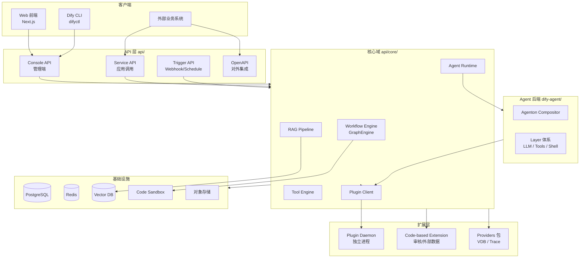

# Dify 二次开发指南：架构与扩展能力

> 本文档面向需要在 Dify 基础上做定制开发的团队，先说明 **整体架构与扩展机制**，再按功能域给出 **可扩展方向与开发示例**，并补充 **金融行业最常见二开案例与落地方案**。  
> 扩展方式从「侵入性最低」到「侵入性最高」大致为：**插件 → 平台内配置 → Provider 包 → API/代码扩展 → Fork 改源码**。  
> 金融场景深度案例见：[银行业务面试案例](./dify-banking-interview-cases.md)、[BankGPT 功能扩展](./bankgpt-extension-and-multi-agent.md)。

---

## 1. 总体架构

Dify 采用前后端分离 + 插件守护进程的多层架构。二次开发时，首先要明确改动落在哪一层。



### 1.1 代码仓库结构

| 目录 | 职责 | 二次开发相关 |
|------|------|--------------|
| `api/` | Flask 后端、工作流引擎、RAG、插件客户端 | Service 层、Controller、Core 节点、Provider 包 |
| `web/` | Next.js 管理端与工作流画布 | 页面、组件、工作流节点 UI |
| `dify-agent/` | Agent 运行时（Agenton + Layer） | 自定义 Agent Layer、Shell 集成 |
| `api/providers/` | 可选 Provider 工作区包 | VDB、Trace 等后端适配 |
| `docker/` | 部署与编排 | 环境变量、服务拓扑 |
| `cli/` | difyctl 命令行工具 | 自动化运维命令 |

### 1.2 扩展方式对比

| 方式 | 侵入性 | 升级友好 | 适用场景 |
|------|--------|----------|----------|
| **官方插件（Plugin）** | 低 | 高 | 新模型、工具、触发器、数据源、Agent 策略 |
| **平台内工具配置** | 低 | 高 | 自定义 API 工具、工作流工具、MCP 工具 |
| **API-based Extension** | 低 | 高 | 审核、外部数据查询（HTTP 回调） |
| **Code-based Extension** | 中 | 中 | 内置审核器、外部数据工具（Python 模块） |
| **Provider 包** | 中 | 中 | 新向量库、新 Trace 后端 |
| **Service API 集成** | 低 | 高 | 外部系统调用 Dify 能力 |
| **Fork 改源码** | 高 | 低 | 新工作流节点、UI 大改、企业定制 |

---

## 2. 扩展机制详解

### 2.1 插件系统（推荐首选）

插件通过 **Plugin Daemon** 独立运行，API 通过 HTTP 调用插件。插件声明在 `manifest.yaml` 中注册能力。

**插件类别（`PluginCategory`）**：

| 类别 | 能力 | 典型用途 |
|------|------|----------|
| `tool` | 工具提供商 | 搜索、CRM、数据库、内部 API |
| `model` | 模型提供商 | 私有 LLM、Embedding、Rerank、TTS |
| `agent-strategy` | Agent 策略 | 自定义 ReAct / Plan-Execute 等推理策略 |
| `datasource` | 数据源 | RAG Pipeline 在线文档、Drive 同步 |
| `trigger` | 触发器 | 第三方事件驱动工作流 |
| `extension` | 通用扩展 | Endpoint 暴露、平台级能力 |
| Endpoint | HTTP 端点 | 插件对外提供 Webhook/API |

**反向调用（Backwards Invocation）**：插件可回调 Dify 核心能力，无需重复实现：

| 模块 | 路径 | 可调用能力 |
|------|------|------------|
| App | `backwards_invocation/app.py` | 触发 Chat / Workflow / Agent 应用 |
| Model | `backwards_invocation/model.py` | 调用已配置模型 |
| Tool | `backwards_invocation/tool.py` | 调用已安装工具 |
| Node | `backwards_invocation/node.py` | 调用参数提取、问题分类等工作流节点 |

**插件权限（`PluginResourceRequirements`）**：可声明 memory、network、storage、node 等权限边界。

参考：`api/core/plugin/entities/plugin.py`

---

### 2.2 工具生态（无需写插件）

除插件工具外，Dify 内置三种工具扩展路径：

| 类型 | 实现 | 说明 |
|------|------|------|
| **Custom API Tool** | UI 或 API 配置 OpenAPI | 对接任意 REST 服务 |
| **Workflow as Tool** | 将工作流发布为工具 | 组合能力复用 |
| **MCP Tool** | 连接 MCP Server | 接入 MCP 生态工具 |

实现入口：

- `api/core/tools/custom_tool/` — API 工具
- `api/core/tools/workflow_as_tool/` — 工作流工具
- `api/core/mcp/` — MCP 客户端

---

### 2.3 Code-based Extension（源码级内置扩展）

通过目录扫描自动注册，模块位于 `api/core/moderation/`、`api/core/external_data_tool/` 等。

**扩展模块（`ExtensionModule`）**：

| 模块 | 基类 | 用途 |
|------|------|------|
| `MODERATION` | `Moderation` | 输入/输出内容审核 |
| `EXTERNAL_DATA_TOOL` | `ExternalDataTool` | 聊天应用外部数据注入 |

每个扩展需包含：

- `{name}/{name}.py` — 实现类
- `{name}/schema.json` — 配置表单 Schema
- 可选 `__builtin__` — 标记内置扩展及排序

扫描逻辑：`api/core/extension/extensible.py` → `Extensible.scan_extensions()`

---

### 2.4 API-based Extension（HTTP 回调）

租户在控制台配置 HTTP 端点，Dify 在运行时回调。扩展点（`APIBasedExtensionPoint`）：

| 扩展点 | 说明 |
|--------|------|
| `app.external_data_tool.query` | 外部数据查询 |
| `app.moderation.input` | 输入审核 |
| `app.moderation.output` | 输出审核 |
| `ping` | 连通性测试 |

适合：**已有 HTTP 微服务、不便部署插件** 的场景。

参考：`api/models/api_based_extension.py`

---

### 2.5 Provider 包（工作区内可选包）

位于 `api/providers/`，通过 uv workspace 按需引入。

#### 向量数据库 Provider（VDB）

- 契约：`AbstractVectorFactory` + `BaseVector`
- 注册：`pyproject.toml` 中 `dify.vector_backends` entry point
- 文档：`api/providers/vdb/README.md`

#### Trace Provider

- 契约：`BaseTraceInstance` + `BaseTracingConfig`
- 注册：在 `ops_trace_manager.py` 的 `OpsTraceProviderConfigMap` 中显式注册
- 文档：`api/providers/trace/README.md`

构建时可 `--no-group vdb-all` 排除默认 Provider，按需 `--group vdb-<name>` 启用。

---

### 2.6 Agent 后端扩展（dify-agent）

Dify Agent 基于 **Agenton Compositor + Layer** 架构。可扩展 Layer 类型：

| Layer | type id | 职责 |
|-------|---------|------|
| Plugin LLM | `dify.plugin.llm` | 插件模型调用 |
| Plugin Tools | `dify.plugin.tools` | 插件工具暴露给模型 |
| Execution Context | `dify.execution_context` | 租户/用户/运行上下文 |
| Shell | `dify.shell` | Shell 任务控制 |
| Ask Human | `dify.ask_human` | 人工介入 |
| Structured Output | 内置 | 结构化输出 |

自定义 Layer 需实现 Agenton `Layer` 协议，并在 `compositor_factory.py` 的允许列表中注册。

参考：`dify-agent/docs/dify-agent/user-manual/`

---

### 2.7 Fork 级扩展（改源码）

当插件与 Provider 无法满足需求时，直接修改对应层：

| 层级 | 典型扩展 |
|------|----------|
| **工作流节点** | `api/core/workflow/nodes/` + `web/app/components/workflow/nodes/` |
| **Controller** | `api/controllers/console/`、`api/controllers/service_api/` |
| **Service** | `api/services/` |
| **Celery 任务** | `api/tasks/` |
| **前端页面** | `web/app/` |
| **Flask 扩展** | `api/extensions/` |
| **CLI 命令** | `cli/src/commands/` |
| **企业版能力** | `api/enterprise/`、`api/services/enterprise/` |

工作流节点运行时由 **graphon** 引擎驱动，新增节点需同时实现后端 Node 类与前端 Panel/Node 组件。

---

## 3. 可扩展功能目录

按业务域汇总 Dify 支持的二次开发方向：

### 3.1 模型与推理

- [ ] 新 LLM / Embedding / Rerank / TTS / STT 提供商 → **Model 插件**
- [ ] 私有部署模型网关对接 → **Model 插件** 或 **OpenAI-Compatible 配置**
- [ ] 自定义 Agent 推理策略 → **Agent Strategy 插件**
- [ ] Agent v2 运行时 Layer → **dify-agent Layer 扩展**

### 3.2 工具与集成

- [ ] 对接内部 REST API → **Custom API Tool**
- [ ] 复用已有工作流 → **Workflow as Tool**
- [ ] 接入 MCP 生态 → **MCP Tool Provider**
- [ ] 复杂工具逻辑（多步、有状态） → **Tool 插件**
- [ ] 插件内调用 Dify 应用 → **Backwards Invocation (App)**

### 3.3 工作流与自动化

- [ ] 第三方事件触发 → **Trigger 插件** 或 Webhook 触发器
- [ ] 定时任务 → 内置 Schedule Trigger
- [ ] 新节点类型（如审批、ERP 写入） → **Fork 工作流节点**
- [ ] 工作流对外 API → **Service API** / **OpenAPI**

### 3.4 RAG 与知识库

- [ ] 新向量数据库 → **VDB Provider 包**
- [ ] 新文档解析器 → Fork `api/core/rag/extractor/`
- [ ] 在线文档同步（Notion、Drive 等） → **Datasource 插件**
- [ ] 自定义分块 / 索引策略 → Fork RAG Pipeline 或 `api/services/dataset_service.py`

### 3.5 安全与合规

- [ ] 内容审核（关键词、第三方 API） → **Code-based / API-based Moderation**
- [ ] 敏感信息过滤 → Moderation 扩展
- [ ] 外部权限校验 → **External Data Tool** 或 Service API 中间层

### 3.6 可观测性

- [ ] 接入自建 APM / 日志平台 → **Trace Provider 包**
- [ ] OpenTelemetry → 内置 `ext_otel` 配置
- [ ] 企业级遥测 → `api/enterprise/telemetry/`

### 3.7 平台与 UI

- [ ] 自定义管理页面 → Fork `web/app/`
- [ ] 命令面板扩展 → `web/app/components/goto-anything/actions/`
- [ ] 品牌定制 / 白标 → 环境变量 + 前端主题
- [ ] 自动化运维 → **CLI 新命令**（`cli/src/commands/`）

### 3.8 企业能力

- [ ] 工作空间同步、权限策略 → `api/services/enterprise/`
- [ ] 插件管控策略 → `PluginManagerService`
- [ ] 跨环境应用迁移 → `app-migration-wizard`（已有 CLI）

> **金融行业落地**：制度 RAG、核心 API、合规审核、渠道接入、SSO 等 12 个常见案例见 **§7**。

---

## 4. 开发示例

### 示例 1：Tool 插件 — 对接内部工单系统

**目标**：让 Agent / 工作流能调用公司工单 API 创建工单。

**步骤**：

1. 使用 [Dify Plugin SDK](https://github.com/langgenius/dify-plugin-sdks) 创建 Tool 插件项目
2. 在 `manifest.yaml` 中声明 `category: tool`
3. 实现工具 Provider：定义参数 Schema、`invoke()` 调用内部 API
4. 打包为 `.difypkg`，在控制台 **插件 → 本地安装** 或发布到插件市场
5. 在工作流 **Tool 节点** 或 **Agent 工具列表** 中选择该工具

**插件内反向调用 Dify 应用（可选）**：

```python
# 插件侧伪代码：创建工单后触发 Dify 工作流通知
from dify_plugin import BackwardsInvocation

result = BackwardsInvocation.invoke_app(
    app_id="xxx",
    inputs={"ticket_id": "T-001", "status": "created"},
    user_id="system",
)
```

---

### 示例 2：Custom API Tool — 零代码对接 REST

**目标**：工作流调用已有的「天气查询」HTTP 接口。

**步骤**：

1. 控制台 → **工具 → 创建自定义工具**
2. 导入 OpenAPI Schema 或手动填写 URL、Method、参数
3. 配置鉴权（API Key / Bearer）
4. 在工作流 **HTTP Request 节点** 或 **Tool 节点** 中使用

**适用**：接口稳定、逻辑简单、无需复杂状态管理。

---

### 示例 3：Workflow as Tool — 能力复用

**目标**：将「用户意图分类 + 知识检索 + 回复生成」封装为工具，供多个 Agent 调用。

**步骤**：

1. 创建并发布工作流 App
2. 控制台 → **工具 → 创建工作流工具**
3. 选择已发布工作流，配置输入/输出参数映射
4. 在其他 Agent 应用的 Tool 列表中启用

**代码位置**：`api/core/tools/workflow_as_tool/tool.py`

---

### 示例 4：Model 插件 — 接入私有 vLLM

**目标**：对接内网 vLLM 部署的 Llama 模型。

**步骤**：

1. 创建 Model 插件，`category: model`
2. 实现 LLM Provider：配置 `invoke()`、`get_models()`、Token 计数
3. 若兼容 OpenAI API，可简化实现为 OpenAI-compatible 适配层
4. 安装插件后，在 **设置 → 模型提供商** 中配置 Base URL 与 API Key

**权限声明**（manifest 片段）：

```yaml
resource:
  permission:
    model:
      enabled: true
      llm: true
```

---

### 示例 5：Trigger 插件 — 企业 IM 事件触发工作流

**目标**：Slack / 飞书消息到达时自动运行 Dify 工作流。

**步骤**：

1. 创建 Trigger 插件，实现事件订阅与 Webhook 验签
2. 在插件中解析事件 payload，映射为工作流输入变量
3. 调用 Dify Trigger API 或 Backwards Invocation 启动工作流
4. 用户在工作流画布添加 **Plugin Trigger 节点** 并绑定该触发器

**限制参考**：Sandbox 套餐每工作流最多 2 个触发器；插件触发器每工作流最多 5 个。

---

### 示例 6：Code-based Moderation — 敏感词过滤

**目标**：对所有 Chat 应用输入做自定义敏感词拦截。

**步骤**：

1. 在 `api/core/moderation/` 下新建目录 `my_keywords/`
2. 实现 `MyKeywordsModeration(Moderation)` 子类
3. 提供 `schema.json` 配置词库路径
4. 添加 `__builtin__` 文件标记为内置扩展
5. 重启 API，控制台 **审核** 设置中选择该扩展

**参考实现**：`api/core/moderation/keywords/keywords.py`

---

### 示例 7：VDB Provider — 接入新向量库

**目标**：支持公司自研向量存储。

**步骤**：

1. 在 `api/providers/vdb/vdb-mybackend/` 创建 workspace 包
2. 实现 `MyBackendFactory(AbstractVectorFactory)` 与 `MyBackendVector(BaseVector)`
3. 在 `pyproject.toml` 注册 entry point：

```toml
[project.entry-points."dify.vector_backends"]
mybackend = "dify_vdb_mybackend.factory:MyBackendFactory"
```

4. 在 `VectorType` 枚举中添加 `MYBACKEND = "mybackend"`
5. `uv sync --group vdb-mybackend`，重建 API 镜像

**文档**：`api/providers/vdb/README.md`

---

### 示例 8：Trace Provider — 接入自建可观测平台

**目标**：将工作流 Trace 发送到内部 ELK / 自研系统。

**步骤**：

1. 在 `api/providers/trace/trace-mybackend/` 创建包
2. 实现 `MyBackendConfig(BaseTracingConfig)` 与 `MyBackendTrace(BaseTraceInstance)`
3. 在 `TracingProviderEnum` 添加成员
4. 在 `OpsTraceProviderConfigMap` 注册 config / trace 类映射
5. 应用 **追踪设置** 中选择新 Provider

**文档**：`api/providers/trace/README.md`

---

### 示例 9：Fork 工作流节点 — 新增「发送邮件」节点

**目标**：在工作流画布中增加专用邮件节点（平台尚未提供）。

**步骤**：

**后端**：

1. 在 `api/core/workflow/nodes/` 下创建 `email/` 目录
2. 定义 `EmailNodeData`（entities.py）与 `EmailNode`（node.py）
3. 在 graphon 节点注册表中注册节点类型
4. 实现 `run()`：调用 SMTP 或邮件服务 API

**前端**：

1. 在 `web/app/components/workflow/nodes/email/` 创建节点 UI
2. 注册到 `BlockEnum` 与节点面板
3. 实现配置 Panel、变量引用、校验逻辑

**适用**：插件 Tool 节点可覆盖的场景，优先用 Tool 而非 Fork 节点。

---

### 示例 10：Service API 集成 — 外部系统调用 Dify

**目标**：业务系统通过 API 触发工作流并获取结果。

**步骤**：

1. 在 Dify 创建 Workflow App，发布并获取 **API Key**
2. 外部系统调用：

```bash
curl -X POST 'https://your-dify/api/v1/workflows/run' \
  -H 'Authorization: Bearer app-xxx' \
  -H 'Content-Type: application/json' \
  -d '{
    "inputs": {"query": "hello"},
    "response_mode": "blocking",
    "user": "user-001"
  }'
```

3. 流式场景使用 `response_mode: streaming`
4. 复杂编排可封装为 **difyctl** 命令或 CI 脚本

**文档**：[Dify API 文档](https://docs.dify.ai/guides/application-publishing/developing-with-apis)

---

### 示例 11：dify-agent 自定义 Layer

**目标**：在 Agent v2 运行时注入自定义 Prompt 预处理 Layer。

**步骤**：

1. 在 `dify-agent/src/dify_agent/layers/` 下实现新 Layer，继承 Agenton `Layer`
2. 定义 `{TYPE_ID}LayerConfig` Pydantic 模型
3. 在 `compositor_factory.py` 的允许 Provider 列表中注册 type id
4. API 侧在构建 `RunComposition` 时插入该 Layer spec

**参考**：`dify-agent/docs/dify-agent/user-manual/prompt-layer/index.md`

---

### 示例 12：CLI 扩展 — 批量导出应用

**目标**：为运维团队添加 `difyctl export apps` 命令。

**步骤**（遵循 `cli/ARD.md` 脚手架）：

1. 创建 `cli/src/commands/export/apps/`
2. `index.ts` — 继承 `DifyCommand`，声明 flags
3. `run.ts` — 纯函数，调用 `src/api/` 客户端
4. 运行 `pnpm tree:gen` 更新命令注册表

**参考**：`cli/ARD.md`、`cli/src/commands/AGENTS.md`

---

## 5. 选型决策树

```
需要扩展 Dify？
│
├─ 能否通过 HTTP/OpenAPI 对接？
│   ├─ 是 → Custom API Tool / Service API 集成
│   └─ 否 ↓
│
├─ 是否是标准能力（模型/工具/触发器/数据源）？
│   ├─ 是 → 官方 Plugin（首选）
│   └─ 否 ↓
│
├─ 是否是向量库 / Trace 后端？
│   ├─ 是 → api/providers/ Provider 包
│   └─ 否 ↓
│
├─ 是否是审核 / 外部数据注入？
│   ├─ 有 HTTP 服务 → API-based Extension
│   └─ 需深度定制 → Code-based Extension
│
├─ 是否是 Agent 运行时行为？
│   └─ dify-agent Layer 扩展
│
└─ 是否需要新 UI / 新工作流节点 / 企业策略？
    └─ Fork api/ + web/ 源码
```

---

## 6. 开发建议

1. **优先插件，避免 Fork**：插件与主版本解耦，升级成本最低。
2. **工具复用优先于新节点**：多数「调用外部系统」场景用 Tool 插件或 API Tool 即可。
3. **前后端节点成对开发**：Fork 工作流节点时，后端 graphon 节点与前端画布组件必须同步。
4. **关注权限与沙箱**：插件声明 `resource.permission`；代码节点受 Sandbox 网络/依赖限制。
5. **Provider 包独立测试**：VDB / Trace Provider 在 `providers/<type>/<backend>/tests/` 下维护单测。
6. **跨环境迁移**：定制应用使用 `app-migration-wizard` 导出，见 `docs/cross-env-app-migration/README.md`。

---

## 7. 金融行业常见二开案例（方案与实践）

银行、证券、保险团队在 Dify 上最常做的二开，**80% 可用插件 + 平台配置完成**，仅权限、审计、渠道深度集成时才 Fork。下表按 **出现频率** 排序，每案给出 **推荐路径 + 落地步骤 + 合规要点**。

| # | 业务场景 | 推荐扩展方式 | 侵入性 | 典型交付周期 |
|---|----------|--------------|--------|--------------|
| 1 | 制度/产品知识库问答 | 平台配置 + RAG 元数据 | 低 | 1～2 周 |
| 2 | 对接核心/ESB/征信 API | Tool 插件 / Custom API Tool | 低 | 2～3 周 |
| 3 | 输入输出合规审核 | API-based / Code-based Moderation | 低～中 | 1～2 周 |
| 4 | 客户经理助手（客户 360） | External Data Tool | 低 | 2 周 |
| 5 | 私有/金融云大模型接入 | Model 插件 | 低 | 1～2 周 |
| 6 | 企微/飞书/手机银行渠道 | Trigger 插件 + Service API | 低～中 | 2～4 周 |
| 7 | 全链路审计留痕 | Trace Provider + 日志归档 | 中 | 2～3 周 |
| 8 | 机构/网点数据隔离 | RAG metadata + Fork RLS（可选） | 中～高 | 3～6 周 |
| 9 | 反洗钱/名单筛查 | Tool 插件 + 工作流编排 | 低 | 2 周 |
| 10 | 理财/投顾免责声明 | 工作流固定节点 + Moderation | 低 | 1 周 |
| 11 | 信贷材料 nightly 批处理 | Schedule Trigger + 队列隔离 | 低～中 | 2 周 |
| 12 | 统一 SSO / 机构 RBAC | Fork Controller + 中间件 | 高 | 4～8 周 |

---

### 案例 1：制度库 / 产品手册智能问答（RAG）

**场景**：柜员、客户经理查询《信贷管理办法》《理财产品说明书》等，要求 **按条线/产品类型隔离**，答案可溯源。

**推荐**：**零 Fork** — 知识库 + 工作流 + 元数据过滤。

**方案**：

```text
用户提问 → [可选：LLM 意图分类] → 知识检索节点（多 dataset_ids）
         → metadata 过滤（branch / product_line / doc_kind）
         → LLM 生成 + 引用片段 → [输出 Moderation]
```

**步骤**：

1. **拆库**：按文档类型建多个 Dataset（如 `policy_credit`、`policy_aml`、`product_wm`），ETL 写入时打 metadata（`doc_kind`、`effective_date`、`region`）。
2. **工作流**：知识检索节点绑定多个 `dataset_ids`，`retrieval_mode: multiple`；开启 **元数据过滤**（手动规则或 LLM 从 query 提取过滤条件）。
3. **模型**：内网 Model 插件或 OpenAI-Compatible 指向金融云网关。
4. **发布**：Chat App 或嵌入手机银行 H5（Service API `response_mode: streaming`）。

**合规要点**：回答必须带 **引用来源**（Dify 内置 citation）；制度类禁止模型「自由发挥」，Prompt 写死「仅依据检索片段回答，无片段则回复无法确认」。

**参考**：[银行业务案例 §1.1 RAG](./dify-banking-interview-cases.md)、`api/core/workflow/nodes/knowledge_retrieval/`。

---

### 案例 2：对接核心银行 / ESB 查询（余额、流水、利率）

**场景**：Agent 或工作流需查 **账户余额、最近流水、挂牌利率**，数据在核心或 ESB，**禁止 LLM 直连数据库**。

**推荐**：**Tool 插件**（复杂鉴权、多步）或 **Custom API Tool**（OpenAPI 已稳定）。

| 条件 | 选型 |
|------|------|
| ESB 已有 OpenAPI、逻辑简单 | Custom API Tool |
| 需 OAuth2/国密签名/多环境路由 | Tool 插件 |
| 查询后要触发 Dify 另一工作流（如异常告警） | Tool 插件 + Backwards Invocation |

**方案（Tool 插件）**：

```text
工作流 Tool 节点 / Agent 工具列表
  → 插件 invoke(customer_id, account_last4, query_type)
  → 银行 API 网关（mTLS + 行内 Token）
  → ESB → 核心/总账
  → 结构化 JSON 回传（禁止自然语言中间层篡改数值）
```

**步骤**：

1. 在 `manifest.yaml` 声明 `category: tool`，`resource.permission.network: true`。
2. 工具参数 Schema 仅暴露 **脱敏字段**（客户号哈希、账号后四位），禁止传入完整卡号。
3. 插件内调用网关 REST；超时 3～5s，失败返回标准错误码。
4. 工作流 **LLM 节点** 只负责「解释结果」，数值以 Tool 返回 JSON 为准（Prompt：`不得修改 tool 返回的数字`）。

**合规要点**：生产环境 **Sandbox 代码节点不要直连核心**；查询类一律走 Tool/API。敏感字段日志脱敏。

**参考**：`api/core/tools/custom_tool/`、示例 1/2（本文 §4）。

---

### 案例 3：金融内容合规审核（输入/输出双向）

**场景**：拦截 **违禁荐股、承诺收益、泄露客户 PII、不当对比** 等，对接行内合规引擎或词库。

**推荐**：**API-based Moderation**（已有合规微服务）或 **Code-based Moderation**（内置词库 + 正则）。

**方案**：

```text
Chat / Workflow 运行
  → Input Moderation（app.moderation.input）
  → LLM / RAG
  → Output Moderation（app.moderation.output）
  → 返回用户
```

**步骤（API-based）**：

1. 部署行内合规 HTTP 服务（输入文本 + 输出文本 + 场景码 `scene=wm_chat`）。
2. 控制台 **扩展 → API-based Extension** 注册端点，扩展点选 `app.moderation.input` / `output`。
3. App **审核设置** 绑定该扩展；命中规则时 `action=blocked` 或 `overridden`（替换为合规话术）。

**步骤（Code-based，轻量）**：

1. 在 `api/core/moderation/bank_compliance/` 实现 `BankComplianceModeration(Moderation)`。
2. 加载行内词库 + 卡号/身份证正则；参考 `api/core/moderation/keywords/keywords.py`。
3. 重启 API，控制台启用。

**合规要点**：理财、投顾类 App **必须** 开输出审核；审核失败要有 **审计日志**（谁、何时、哪条规则）。

**参考**：`api/core/moderation/`、`APIBasedExtensionPoint`（§2.4）。

---

### 案例 4：客户经理助手 — 客户 360 上下文注入

**场景**：Chat 应用需在进入 LLM 前，按 **登录柜员 + 当前客户** 拉取 CRM 摘要（等级、持有产品、最近接触记录），注入 Prompt。

**推荐**：**External Data Tool**（Chat 应用专用扩展点）。

**方案**：

```text
用户消息 → External Data Tool.query(inputs, query)
         → 行内 CRM API（inputs 含 customer_id，来自 SSO 映射）
         → 返回 Markdown/JSON 摘要
         → 拼入 system / context → LLM
```

**步骤**：

1. 控制台配置 **API-based Extension**（扩展点 `app.external_data_tool.query`），或 Code-based `ExternalDataTool`。
2. Chat App → **外部数据工具** 启用，映射 `customer_id` 等变量（由 Service API 的 `inputs` 传入，**勿让用户自行填客户号**）。
3. Prompt 模板：`## 客户摘要\n{{external_data}}\n## 用户问题\n{{query}}`。

**合规要点**：`customer_id` 必须由 **渠道网关鉴权后注入**，不能来自用户自由文本；CRM 返回字段按柜员 **数据权限** 裁剪。

**参考**：`api/core/external_data_tool/`、`api/models/api_based_extension.py`。

---

### 案例 5：接入私有 / 金融云大模型（信创、等保）

**场景**：模型部署在内网 vLLM、华为昇腾、或 **金融云 MaaS**，需统一网关、Token 计量、模型路由。

**推荐**：**Model 插件**（首选）；兼容 OpenAI API 时可简化适配。

**步骤**：

1. `category: model`，实现 LLM +（可选）Embedding + Rerank。
2. `manifest` 声明 `resource.permission.model.llm: true`。
3. 控制台配置 Base URL、API Key（或 mTLS 证书挂载到 Plugin Daemon）。
4. 工作流 **LLM 节点 / 知识检索 Rerank** 选择该提供商。

**金融特化**：

- 同一插件内按 **model name** 路由：`qwen-72b-instruct`（复杂推理）、`qwen-7b`（意图分类），控成本。
- 与行内 **模型审计平台** 对接：在插件 `invoke()` 内异步上报 prompt hash（不含明文）。

**参考**：示例 4（§4）、`api/core/plugin/entities/plugin.py`。

---

### 案例 6：企微 / 飞书 / 手机银行渠道接入

**场景**：行员在企微问制度；客户在 App 内嵌对话窗口，消息来自 **行方 IM 或 App Server**。

**推荐**：**Service API**（渠道已有后端）+ 可选 **Trigger 插件**（IM 主动推送事件）。

**方案 A — 渠道后端调 Dify（最常见）**：

```text
企微/App Server（已鉴权）
  → POST /v1/chat-messages 或 /v1/workflows/run
  → Header: Authorization: Bearer app-xxx
  → Body: user=employee_id, inputs={...}
  → streaming SSE 回传 → 渠道渲染
```

**方案 B — IM 事件驱动工作流**：

1. Trigger 插件订阅企微/飞书 Webhook，验签后解析消息。
2. 映射为工作流 `inputs`，调用 Trigger API 启动 Run。
3. 工作流末尾 **HTTP 节点** 回发 IM 消息。

**合规要点**：`user` 字段用 **工号/客户号哈希**，便于审计；App Key 按渠道分应用， **一渠道一 App**，防串租户。

**参考**：示例 10（§4）、`api/controllers/service_api/`。

---

### 案例 7：全链路审计留痕（监管检查）

**场景**：监管要求保留 **谁、何时、问了什么、检索了哪些文档、模型版本、Tool 调用**，保留 ≥5 年。

**推荐**：**Trace Provider 包** + 日志冷归档（Fork 或企业版 Logstore）。

**方案**：

```text
Workflow Run
  → OpsTrace（节点级 span）
  → Trace Provider → 行内 ELK / SLS / 自研审计库
  → 定期归档 object storage（脱敏后）
```

**步骤**：

1. 在 `api/providers/trace/trace-bank/` 实现 `BaseTraceInstance`，上报：`tenant_id`、`app_id`、`user_id`、`node_id`、`latency`、`status`。
2. **禁止** 在 Trace 中写完整 PII；query 可存 hash 或截断。
3. PG 热表 `workflow_node_executions` 按 [银行业务案例 §2](./dify-banking-interview-cases.md) 做 **分区 + 冷归档**。

**合规要点**：Trace 与业务日志 **分开索引**；Tool 调用参数中的账号类字段脱敏。

**参考**：示例 8（§4）、`api/providers/trace/README.md`。

---

### 案例 8：机构 / 网点 / 条线数据隔离

**场景**：同一套 Dify，**北京分行柜员不能看到上海分行制度**；投行与零售产品库隔离。

**推荐（分层）**：

| 层级 | 手段 |
|------|------|
| 应用层 | 不同 App / 不同 Dataset，按条线发布 |
| 检索层 | Document metadata `branch_code` + 知识检索 **元数据过滤** |
| 数据库层（强隔离） | Fork：PostgreSQL **RLS** 或分 tenant 实例 |

**方案（中侵入 — metadata，推荐先做）**：

1. ETL 写入文档时打 `branch_code`、`biz_line`。
2. Service API 由网关注入 `inputs.branch_code`（来自 SSO）。
3. 工作流 **知识检索节点** 配置 metadata 过滤：`branch_code = {{#inputs.branch_code#}}`。
4. 多库场景：意图分类后路由不同 `dataset_ids`（见 [案例 §1.1 拆库](./dify-banking-interview-cases.md)）。

**方案（高侵入 — RLS）**：Fork `api/services/dataset_service.py` + PG RLS 策略，按 `tenant_id` + `org_id` 过滤。**仅多法人、强监管** 时采用。

---

### 案例 9：反洗钱 / 黑名单 / 制裁名单筛查

**场景**：对公开户、大额转账前，Agent 需 **同步调用 AML 名单**，命中则终止流程并转人工。

**推荐**：**Tool 插件** + 工作流 **条件分支**（无需 Fork 节点）。

**方案**：

```text
inputs（客户名、证件号哈希、国家）
  → Tool：aml_screening
  → 若 hit=true → 结束节点（固定话术）+ HTTP 通知合规岗
  → 若 hit=false → 继续 RAG / LLM 流程
```

**步骤**：

1. Tool 插件调用行内 AML 引擎（同步 API，超时 ≤3s）。
2. 工作流用 **IF/ELSE** 或 **问题分类** 判断 `tool_output.hit`。
3. 命中时 **禁止** 再调用 LLM 做「风险评估」，避免幻觉覆盖名单结果。

**合规要点**：名单结果以 **Tool 结构化返回** 为唯一依据；全程 Trace 留痕。

---

### 案例 10：理财 / 投顾回复 — 强制免责声明

**场景**：智能投顾助手每条回复必须带 **「理财非存款，风险自担…」** 等固定声明，且禁止承诺收益。

**推荐**：**工作流模板** + **Output Moderation**（双保险）。

**方案**：

```text
RAG + LLM 生成
  → 模板节点 / Jinja2：{{ answer }}\n\n---\n{{ disclaimer }}
  → Output Moderation：检测「保本」「 guaranteed 」等
  → 返回
```

**步骤**：

1. 工作流末尾 **Template Transform** 或 LLM 后接 **Code 节点**（简单拼接；复杂合规用 Template 即可，少依赖 Sandbox）。
2. Output Moderation 绑定案例 3 的合规扩展。
3. Chat App **开场白** 与 **免责声明** 在应用配置中写死。

**合规要点**：免责声明 **不可由 LLM 改写**；用模板拼接而非 Prompt 要求模型「记得加」。

---

### 案例 11：信贷文档 nightly 批处理（调度 + 队列）

**场景**：每晚 OCR 后的信贷材料批量入知识库、或批量跑「材料完整性检查」工作流。

**推荐**：**Schedule Trigger** + **Celery 队列物理隔离**（防拖垮对话）。

**方案**：

```text
Schedule Trigger（02:00）
  → Workflow：读 object storage 新文件列表
  → 循环 / 批处理节点
  → 写入 Dataset API 或调用索引任务
```

**步骤**：

1. 工作流添加 **Schedule Trigger**，cron `0 2 * * *`。
2. 部署层：`CELERY_WORKER_QUEUES=dataset` 独立 Worker 池，与 `workflow` 队列分开（见 [银行业务案例 §2.0 Celery](./dify-banking-interview-cases.md)）。
3. 批量 Run 用 **Service API** + 外部调度（Airflow）亦可，便于与行内批处理平台统一监控。

**合规要点**：批处理文件路径 **不要** 经 Sandbox 出网；走内网 Storage + Worker。

---

### 案例 12：统一 SSO / 机构 RBAC（高侵入）

**场景**：行内统一身份（OAuth2/OIDC/SAML），Console 登录与 **数据权限** 对接 IAM；多机构管理员只能管本机构 App。

**推荐**：**Fork** `api/controllers/console/` + `api/services/` + 可选 `web/` 登录页。

**方案**：

```text
用户 → 行内 IdP（OIDC）
     → Dify 自定义 OAuth 回调（Fork auth）
     → JWT / Session 映射 tenant_id + org_id + roles
     → 控制台 API 中间件校验角色
     → Dataset/App 列表按 org 过滤（Service 层）
```

**步骤**：

1. Fork 登录流：参考 Flask 扩展 `api/extensions/` 增加 OAuth blueprint。
2. `Account` / `TenantAccountJoin` 映射行内 **工号 ↔ Dify 账号**（同步任务或 JIT Provisioning）。
3. 前端 Fork `web/app/signin` 跳转 IdP。
4. 强需求时启用 **企业版** 能力或自研 `api/services/enterprise/` 策略。

**合规要点**：Session 超时、双因素与行内 IAM 策略一致；**禁止** 多套账号体系长期并存。

**何时不做 Fork**：仅 **C 端 H5 对话** 可只用 Service API + 渠道网关鉴权，Console 仍用 Dify 本地账号。

---

### 7.1 金融二开选型速查

```text
要查行内数据？        → Tool 插件 / Custom API（禁止 Sandbox 直连核心）
要注入客户上下文？    → External Data Tool
要挡违规话术？        → Moderation（API 或 Code）
要接私有模型？        → Model 插件
要接 IM/App 渠道？    → Service API ± Trigger 插件
要制度问答 + 隔离？    → 多 Dataset + metadata 过滤（先做这个，再考虑 RLS）
要审计？              → Trace Provider + PG/日志归档
要 SSO/机构权限？     → Fork auth（最后手段）
```

**与 BankGPT 的边界**：Dify 二开适合 **PoC、部门级助手、可配置工作流**；核心信贷审批、强 HITL、LangGraph 长状态机见 [BankGPT 迁移 rationale](./dify-vs-bankgpt-migration.md) — 可 **混合部署**：Dify 做知识/渠道，BankGPT 做核心编排。

---

## 8. 参考链接

| 资源 | 路径 / 链接 |
|------|-------------|
| 插件实体定义 | `api/core/plugin/entities/plugin.py` |
| 反向调用 | `api/core/plugin/backwards_invocation/` |
| 代码扩展扫描 | `api/core/extension/extensible.py` |
| VDB Provider 开发 | `api/providers/vdb/README.md` |
| Trace Provider 开发 | `api/providers/trace/README.md` |
| Agent Layer 手册 | `dify-agent/docs/dify-agent/user-manual/` |
| CLI 架构参考 | `cli/ARD.md` |
| 跨环境迁移 | `docs/cross-env-app-migration/README.md` |
| 与 LangChain 对比 | `docs/zh-CN/dify-vs-langchain-disadvantages.md` |
| 银行业务面试案例 | `docs/zh-CN/dify-banking-interview-cases.md` |
| BankGPT 功能扩展 | `docs/zh-CN/bankgpt-extension-and-multi-agent.md` |
| Dify→BankGPT 迁移 | `docs/zh-CN/dify-vs-bankgpt-migration.md` |
| 官方插件 SDK | https://github.com/langgenius/dify-plugin-sdks |
| 官方文档 | https://docs.dify.ai |
