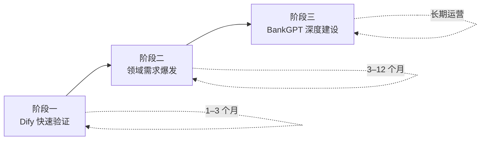
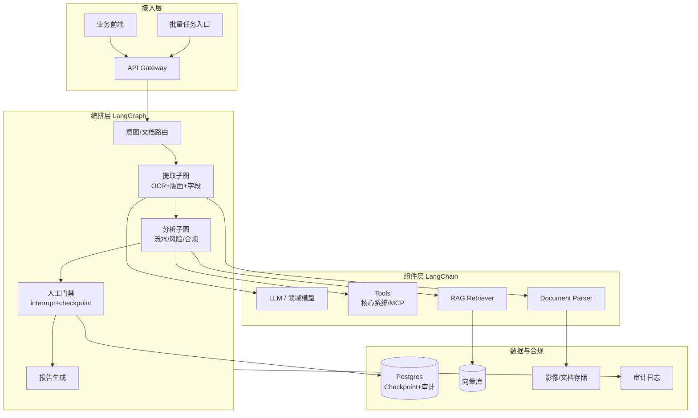

# 从 Dify 到 BankGPT：选型演进与迁移 rationale

> 本文档说明 **为何团队常以 Dify 起步，却在金融业务深化后迁移到基于 LangChain / LangGraph 的 BankGPT 架构**，并梳理 Dify 在该路径上的劣势。  
> 文中 **BankGPT** 指面向银行/企业财务场景的垂直 AI 平台（对账单、发票、收据提取与分析、信贷审核、合规审计等），技术底座为 **LangChain（组件与集成）+ LangGraph（有状态 Agent 编排）**，而非泛指 Dify 通用 LLMOps 平台。

---

## 1. 演进路径总览

许多金融/财务 AI 项目会经历典型的三阶段：



| 阶段 | 典型目标 | 主力工具 | 关键产出 |
|------|----------|----------|----------|
| **一：验证** | 证明「AI + 财务文档」可行 | Dify | Demo、内部试点、简单问答/RAG |
| **二：深化** | 准确率、批量、合规、审计 | Dify + 大量绕路/插件 | 暴露平台天花板 |
| **三：生产** | 可审计、可扩展、领域可控 | BankGPT（LangChain/LangGraph） | 核心金融业务系统 |

**核心结论**：Dify 适合 **从 0 到 1 的通用 LLM 应用验证**；当业务进入 **金融垂直领域的 1 到 N（精度、合规、批量、可审计编排）** 时，基于 LangChain/LangGraph 自建的 BankGPT 架构往往更合适。

---

## 2. 三者定位对比

| 维度 | Dify | LangChain / LangGraph | BankGPT（LangChain 栈） |
|------|------|----------------------|-------------------------|
| **本质** | 通用 LLM 应用平台（低代码 + BaaS） | 代码优先的 AI 开发框架 | **金融领域垂直平台**（框架之上） |
| **核心能力** | 工作流画布、RAG、Agent、模型管理 | Chain、Tool、StateGraph、Checkpoint | 对账单/发票/收据解析、信贷分析、合规审计流 |
| **逻辑表达** | 可视化 DSL + 受限代码节点 | 任意 Python 代码 | 领域 StateGraph + 金融专用 Tool/Model |
| **目标用户** | 产品、运营、全栈混合团队 | 工程师、算法、合规科技 | 银行、会计所、企业财务、信贷团队 |
| **合规叙事** | 通用数据保护 + 自托管 | 由应用自行实现 | 银行级加密、RBAC、审计轨迹、HITL 门禁 |

Dify 与 BankGPT **不是同类产品**：Dify 是「造应用的平台」；BankGPT 是「财务 AI 的业务系统」。LangChain/LangGraph 是 BankGPT 的 **工程底座**，提供 Dify 难以替代的编排深度。

---

## 3. 为什么一开始选 Dify？

在 POC 和早期试点阶段，选 Dify 往往 **合理且高效**：

### 3.1 极速验证业务假设

- **可视化工作流**：产品/业务人员可直接拖拽「上传文档 → 提取 → LLM 总结 → 回复」
- **内置 RAG**：知识库、文档分段、检索链路开箱即用，无需先写向量库代码
- **多模型接入**：控制台配置 OpenAI / 国产大模型，快速对比效果
- **自带运维面**：对话日志、标注、权限、API 发布，减少自研平台成本

### 3.2 降低跨职能协作门槛

- 财务/信贷业务专家可在画布上调整 Prompt 和分支，无需等工程排期
- 运营可自行维护知识库与 FAQ，适合 **「智能客服 + 制度问答」** 类场景

### 3.3 自托管与数据可控

- Docker 一键部署，数据留在内网，满足金融机构 **初步** 的数据驻留要求
- 比从零搭建 LangChain 工程 **上线速度快一个数量级**

### 3.4 典型早期场景（Dify 表现良好）

| 场景 | 说明 |
|------|------|
| 财务制度 / 产品 FAQ 问答 | RAG + Chatflow 即可 |
| 单份文档摘要与字段抽取试点 | LLM 节点 + 简单 Prompt |
| 内部 Copilot | Agent + 少量工具 |
| 向管理层演示 AI 能力 | 画布直观、迭代快 |

**小结**：阶段一的核心诉求是 **「快」和「看得见」**，Dify 的优势正好对齐。

---

## 4. 为什么后期要切到 BankGPT（LangChain / LangGraph）？

当试点进入 **生产级财务处理**，常见触发迁移的因素如下。

### 4.1 领域精度：通用平台 vs 财务专用模型

BankGPT 类产品的核心是 **面向财务文档优化的模型与管线**（对账单版式、发票多模板、收据商户识别等），并支持 **用户纠正反馈闭环** 持续提升精度。

Dify 的劣势：

- 文档解析依赖通用 RAG 分段 + 通用 LLM Prompt，对 **复杂版式、低质量扫描、多银行模板** 准确率不足
- 难以嵌入 **自训练 / 微调** 的版面分析、表格还原、字段级置信度模型
- `code` 节点在 Sandbox 中运行，不便挂载重型 CV/NLP 推理服务

LangChain/LangGraph 栈可 **原生调用** 自研模型服务、OCR 引擎、规则校验层，按节点组合成可审计的提取 DAG。

### 4.2 批量处理与吞吐

金融机构常需 **一次处理成千上万份** 对账单/发票（贷后批量核验、月末关账、审计抽样）。

Dify 的劣势：

- 工作流为 **交互式单次运行** 设计，批量需外层脚本循环调 API
- `WORKFLOW_MAX_EXECUTION_STEPS`（默认 500）、执行时长、变量大小（200 KB）等 **平台硬限制** 易在批处理中触顶
- Celery 队列与 GraphEngine Worker 调优需深入 Dify 内部，不如自建流水线直观

BankGPT 可用 LangGraph **批处理子图** + 任务队列（Kafka/Celery/自研），按文档分片、失败重试、进度追踪，贴合财务 ETL 范式。

### 4.3 合规、审计与可解释性

金融场景要求：**谁在何时对哪份文档做了什么决策、依据是什么、可否人工复核**。

Dify 的劣势：

- 工作流逻辑存于 **平台 DSL**，审计人员难以像读代码一样追溯完整决策链
- Human Input 节点需 **画布预定义**，难以按监管规则 **动态** 插入审批门禁
- Trace 依赖外部集成（Langfuse 等），粒度与金融审计字段不易完全对齐

LangGraph 的优势：

- **显式 StateGraph**：每个节点输入/输出状态可序列化、版本化、入库
- **`interrupt()` + Checkpoint（Postgres 等）**：信贷审批、异常交易复核可暂停数日后再恢复，状态不丢失
- **确定性 DAG**：满足「可复现、可回放」的监管叙事（参见金融多 Agent 研究管线实践）

### 4.4 复杂多 Agent 编排

信贷分析典型链路：**Supervisor 路由 → 基本面 Agent → 流水分析 Agent → 风险 Agent → 合规 Agent → 人工门禁 → 报告生成**。

Dify 的劣势：

- Agent 工具数（默认 ≤10）、迭代次数（≤99）等平台上限
- 多 Agent 协商、子图嵌套、动态路由在画布上 **表达笨重**
- Agent Soul 部分能力（memory、knowledge、human）在 Agent Backend 中仍为 reserved 状态，生产可用性受限

LangGraph 提供 **Supervisor-Worker、层级子图、条件边循环**，与金融研究/风控编排模式天然匹配。

### 4.5 与核心系统集成深度

BankGPT 需对接：**核心银行系统、信贷系统、总账、反洗钱、影像平台、会计软件（SAP/用友等）**。

Dify 的劣势：

- 深度集成往往依赖 **HTTP 工具节点 / 插件**，协议适配层分散在平台配置中
- 事务一致性、幂等、补偿、与现有 Java/.NET 核心系统的 **同构部署** 困难
- 金融级 RBAC（按机构、条线、文档密级）需 Fork 权限模块或二次开发

自研 BankGPT 可将集成层作为 **一等公民** 的 Python 服务，与 LangChain Tool、LangGraph 节点同仓管理、同 CI/CD。

### 4.6 工程化与长期维护

| 诉求 | Dify | BankGPT（LangChain 栈） |
|------|------|-------------------------|
| 逻辑版本管理 | DSL + 平台内历史 | Git 管理的 `.py` |
| 单元测试 / 回归 | 弱，偏 E2E | pytest + 黄金样本集 |
| 字段级准确率评测 | 需自建 | 与提取管线同仓的评测集 |
| 团队技能栈 | 平台 + 少量 API | Python 工程 + 金融域知识 |
| 升级 Dify 版本 | 可能与 Fork/插件冲突 | 框架升级自主可控 |

当团队已有 **成熟工程体系 + 合规科技团队** 时，继续堆 Dify 定制化的 **边际成本会超过迁移成本**。

---

## 5. Dify 相对 BankGPT 的劣势汇总

以下按 **金融业务权重** 排序：

| # | 劣势领域 | Dify 的问题 | BankGPT（LangGraph）的应对 |
|---|----------|-------------|---------------------------|
| 1 | **领域精度** | 通用 RAG/LLM，难承载财务专用模型与反馈学习 | 领域模型 + 结构化输出 + 人工纠正闭环 |
| 2 | **批量规模** | 交互式工作流 + 执行步数/时长限制 | 批处理图、分片、队列化流水线 |
| 3 | **合规审计** | DSL 黑盒、审计轨迹难对齐监管字段 | 显式状态图、Checkpoint、可回放 |
| 4 | **人工门禁** | 画布静态 HITL | `interrupt()` 动态暂停/恢复 |
| 5 | **多 Agent** | 工具/迭代上限，编排表达力不足 | Supervisor 子图、层级 Agent |
| 6 | **核心系统集成** | HTTP/插件拼装，与同构后端割裂 | Tool/Service 同仓、深度适配 |
| 7 | **文档版式** | 通用分段，弱表格/印章/多页逻辑 | 专用解析节点 + CV 管线 |
| 8 | **性能成本** | 全栈 Dify 组件重 | 按需精简服务 |
| 9 | **供应商锁定** | 工作流 DSL 绑定平台 | 代码资产可移植 |
| 10 | **安全密级** | 通用多租户 RBAC | 金融级分级授权可深度定制 |

更通用的 Dify vs LangChain 技术劣势（节点深度 50、Sandbox 限制等）见：[dify-vs-langchain-disadvantages.md](./dify-vs-langchain-disadvantages.md)。

---

## 6. 迁移决策：何时该切？

### 6.1 建议继续留在 Dify 的信号

- 仍以 **FAQ、制度问答、轻量 Copilot** 为主，无批量文档生产
- 团队无专职 AI 工程，依赖运营配置即可满足需求
- 监管要求为 **一般数据保护**，无字段级审计回放硬性要求
- 试点预算有限，尚未到 **生产 SLA** 阶段

### 6.2 建议启动 BankGPT 迁移的信号

- 单文档试点 OK，但 **批量准确率 / 人工复核率** 不达标
- 监管或内审要求 **完整决策链路与审批留痕**
- 需对接 **3 个以上核心系统**，且有时序与事务要求
- 工作流已大量依赖 `code` 节点、插件、HTTP 绕路， **画布难以维护**
- 计划引入 **自训练模型** 或替代通用 LLM 做主力提取
- 信贷/风控需要 **多 Agent + 长时运行 + 人工复核** 混合编排

### 6.3 决策矩阵

```
                    业务复杂度
                        高
                         │
         ┌───────────────┼───────────────┐
         │   BankGPT     │   BankGPT     │
         │  (LangGraph)  │  + 保留 Dify  │
         │    主系统     │   作运营层   │
  合规   ├───────────────┼───────────────┤
  要求   │     Dify      │   评估迁移    │
   低    │   继续够用    │   时间表      │
         └───────────────┼───────────────┘
                        低
```

**混合架构（常见落地形态）**：

- **BankGPT**：文档提取、信贷分析、批处理、合规编排（LangGraph 核心）
- **Dify**：对外问答、内部知识库 Copilot、运营可配置的轻量场景
- 二者通过 **API / 消息队列** 联通，Dify Tool 节点可回调 BankGPT 服务

---

## 7. 典型迁移路径

### 7.1 阶段规划

| 步骤 | 动作 | 周期参考 |
|------|------|----------|
| 1 | 梳理 Dify 工作流，标注 **保留 / 迁移 / 废弃** | 1–2 周 |
| 2 | 从 Dify 导出 DSL / 迁移包，提取 Prompt、知识库、评测样本 | 1 周 |
| 3 | 用 LangGraph 重建 **核心提取/审批子图**（先覆盖 20% 高频文档） | 4–8 周 |
| 4 | 建立 **黄金样本集** 与字段级准确率回归测试 | 并行 |
| 5 | 对接核心系统，替换 Dify HTTP 工具链 | 4–6 周 |
| 6 | 灰度切流，Dify 只保留问答类应用 | 2–4 周 |

### 7.2 能力映射

| Dify 能力 | BankGPT（LangChain/LangGraph）替代 |
|-----------|-----------------------------------|
| 工作流画布 | `StateGraph` + 节点函数 |
| Knowledge Retrieval | LangChain Retriever + 自研向量库 |
| LLM 节点 | `ChatModel` + structured output |
| Code 节点 | 普通 Python 节点（无 Sandbox 限制） |
| Human Input | `interrupt()` + Checkpoint |
| Agent + Tools | LangGraph ReAct / Supervisor 多 Agent |
| 插件工具 | `@tool` + MCP Server |
| 对话日志 | LangSmith / 自研审计库 |
| API 发布 | FastAPI / 现有网关 |

### 7.3 资产迁移注意点

- Dify **Prompt 与变量语法**（如 `{{#node.var#}}`）需人工改写为代码中的状态字段
- 知识库可导出后 **重新索引** 到目标向量库，校验召回率
- 对话标注数据可转为 **微调 / 评测集**，是迁移的高价值资产
- 使用 `app-migration-wizard` 导出应用依赖，见 [cross-env-app-migration](../cross-env-app-migration/README.md)

---

## 8. BankGPT 参考架构（LangChain / LangGraph）

以下为自研 BankGPT 的常见分层，供迁移目标对齐：



**关键设计原则**：

1. **提取与分析解耦**：提取子图输出结构化 JSON，分析子图只消费 schema 化数据  
2. **状态一等公民**：`FinancialAgentState` 含文档 ID、字段置信度、审批状态等  
3. **默认可审计**：每个节点写入审计表，而非事后从日志反推  
4. **批量与交互共用子图**：同一 LangGraph，不同入口（单条 API vs 批任务）

---

## 9. 成本与风险（诚实评估）

### 9.1 迁移成本

- **人力**：需 AI 工程 + 金融域 + 后端，通常 3–6 人月起（视范围）
- **时间**：核心链路重建往往 **不少于 3 个月**，与 Dify 已积累的逻辑复杂度正相关
- **双轨运行**：灰度期 Dify 与 BankGPT 并行，运维成本短期上升

### 9.2 不迁移的风险

- 在 Dify 上持续堆插件和 `code` 节点 → **技术债指数增长**
- 批量与合规需求被平台天花板压制 → **业务方对 AI 失去信心**
- 关键逻辑锁在 DSL → **人员流动后难以维护**

### 9.3 迁移风险

- 自研系统需自建 **SLA、监控、权限、升级** 体系
- LangChain/LangGraph 生态迭代快，需 **锁定版本 + 回归测试**
- 团队需从「配平台」转向「写系统」， **组织能力建设** 是隐性成本

---

## 10. 总结

| 问题 | 答案 |
|------|------|
| **为什么先用 Dify？** | 快、低代码、RAG/Agent 开箱即用，适合验证「AI + 财务」方向 |
| **为什么后来切 BankGPT？** | 领域精度、批量、合规审计、多 Agent、核心系统集成等生产诉求超出通用平台边界 |
| **为什么底座是 LangChain/LangGraph？** | 代码级编排、显式状态、Checkpoint/HITL、可测试、可与金融工程体系融合 |
| **Dify 的核心劣势是什么？** | 通用平台抽象、执行硬限制、DSL 锁定、财务垂直能力需大量绕路 |
| **是否一定要完全抛弃 Dify？** | 否；常见做法是 **BankGPT 承载核心生产链路，Dify 保留轻量问答与运营场景** |

**一句话**：Dify 是优秀的 **AI 应用孵化器**；BankGPT（LangChain/LangGraph）是面向 **金融生产的专用引擎**。从 Dify 迁出不是否定初期选型，而是业务从「演示可行」走向「监管可接受、规模可扩展」时的自然演进。

---

## 11. 相关文档

| 文档 | 说明 |
|------|------|
| [bankgpt-multi-app-platform.md](./bankgpt-multi-app-platform.md) | 上千应用承载、隔离、部署与限流并发 |
| [bankgpt-extension-and-multi-agent.md](./bankgpt-extension-and-multi-agent.md) | BankGPT 功能扩展、复杂 Agent 与多 Agent 应用开发 |
| [bankgpt-personas-app-onboarding.md](./bankgpt-personas-app-onboarding.md) | Personas 等多 Agent 自定义应用入驻示例 |
| [dify-vs-langchain-disadvantages.md](./dify-vs-langchain-disadvantages.md) | Dify 相对 LangChain 的通用技术劣势 |
| [dify-secondary-development.md](./dify-secondary-development.md) | Dify 二次开发与扩展能力 |
| [cross-env-app-migration](../cross-env-app-migration/README.md) | Dify 应用导出与迁移 |
| [LangGraph 官方文档](https://langchain-ai.github.io/langgraph/) | 有状态 Agent 编排 |
| [BankGPT 产品站](https://bankgpt.io/zh-CN) | 财务文档 AI 平台（垂直能力参考） |
